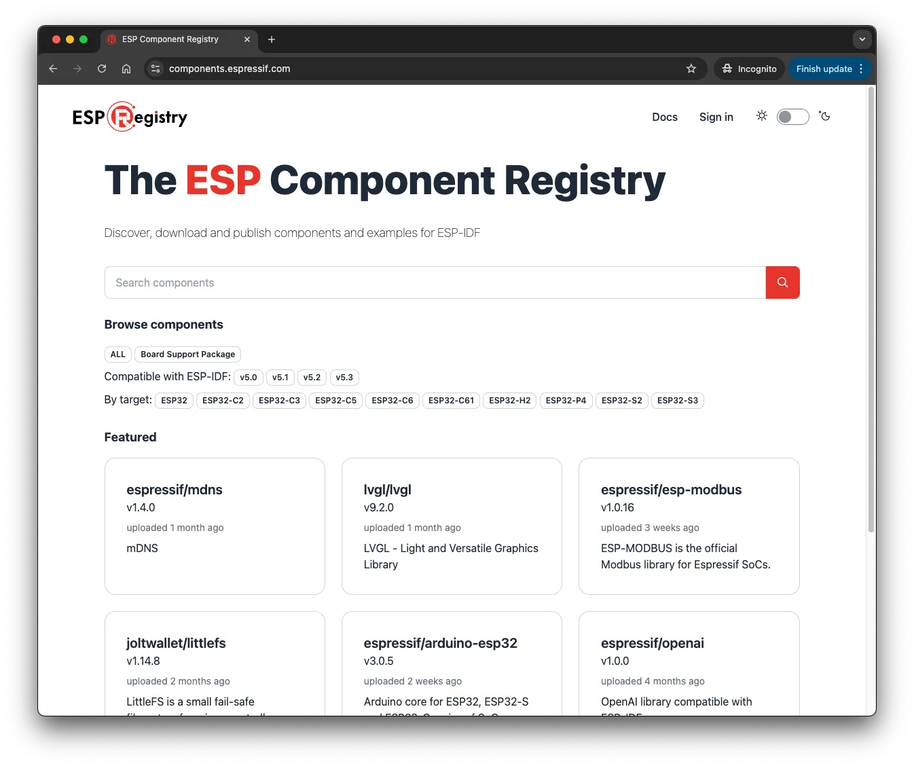

When starting a new project, we often reuse existing code, for example from libraries and drivers. This not only saves time but also makes your project easier to maintain.

In this article, we will explore what the [ESP Component Registry](https://components.espressif.com) is and the key concepts of components, making it easy to understand not only how to use components but also how to contribute.

## Concept

The architecture of [ESP-IDF](https://idf.espressif.com) is modular, making it easier to understand and maintain. Such modules are called *components*, as opposed to *libraries*, because they are self-contained and can also communicates with other components. Components are used on top of the ESP-IDF core.

There are three concepts that we need to introduce in order to understand the complete solution: component, component manager, and component registry. Let's go through them one by one.


### 1. Component

As mentioned above, a component is a self-contained piece of code that offers new functionality and can be added to an application. In most cases, components are used in multiple applications, making it easy to reuse code, improve the efficiency, and reduce development complexity.

For example, let's imagine there is an application called `my-application` in which we want to use a specific sensor that will collect temperature and humidity from the environment. Instead of adding all the logic behind the communication protocol, data collection, conversions, etc. to the application code, you can add a component i.e `sensor-component`, that has this logic already implemented in code. The important part is that this code has been reviewed and tested multiple times by other developers.

The component can be either created directly in the application, inside a specific folder named `components`, or it can be created in a separated component project and then added as a dependency to the application. Both solutions work but the recommended way is to create a new component project and add it as a dependency.

### 2. Component Manager

Single components can quickly go out of hand if not managed properly. The component manager does just that -- it is a CLI tool that allows you to add existing components to your project and create new components.

With the component manager you can:

- Add a component as a dependency to your application .
- Create new components structure.
- Downloads the dependencies automatically when running CMake.

After adding a component as a dependency to your project and running the build process, the component manager will download the component to your project in a folder named `managed_components`. All the dependencies will be downloaded directly from the ESP Component Registry repository and will be stored inside this folder.

### 3. Component Registry

<figure style="width: 70%; margin: 0 auto; text-align: center;">
    
    <figcaption>ESP Component Registry Logo</figcaption>
</figure>

Now we have lots of components that can be managed in a project. But to make these components accessible to everyone, there should be some kind of central repository. This role is played by the [ESP Component Registry](https://components.espressif.com/). It helps maintain ESP-IDF components for users to easily find, install, use examples of, and eventually create and upload their own components.

<figure style="width: 90%; margin: 0 auto; text-align: center;">
    
    <figcaption>ESP Component Registry Landing Page</figcaption>
</figure>

Currently, the Registry has **500+ components**, developed by Espressif, partners, and the community.

Some examples of existing components:

- [led_strip](https://components.espressif.com/components/espressif/led_strip/): Driver designed for the addressable LEDs like WS2812.
- [ds18b20](https://components.espressif.com/components/espressif/ds18b20/): Driver for the DS18B20 temperature sensor using the 1-Wire protocol.
- [arduino-esp32](https://components.espressif.com/components/espressif/arduino-esp32): Component for the Arduino core for the ESP32 to be used inside the ESP-IDF.
- [esp_insights](https://components.espressif.com/components/espressif/esp_insights/versions/1.2.2): Remote diagnostics solution that allows users to remotely monitor the health of ESP devices in the field.

To get started with the ESP Component Registry, just search for a component and add it to your project. If you want to publish your component to the Registry, you will also need a GitHub account.

<figure style="width: 100%; margin: 0 auto; text-align: center;">
    
    <figcaption>Component Page</figcaption>
</figure>

The process for publishing a component will be described in another article.

#### Adding components from ESP Component Registry

For adding a component as a dependency to your project, you can use:

```bash
idf.py add-dependency "espressif/led_strip^3.0.0"
```

or you can create a new project from the example:

```bash
idf.py create-project-from-example "espressif/led_strip^3.0.0:led_strip_rmt_ws2812"
```

After running the command, you will need to build the application to download the components to the `managed_components` folder.


If the component is not added to your project after running build command, you can try to run the `reconfigure` command and build again:

```bash
idf.py reconfigure
```

## Advantages of using components

Components are widely used in the ESP-IDF and many other applications based on the ESP-IDF.

The main advantages of using components are:

- **Code reuse**: You can reuse code among different applications by sharing the component.
- **Modularity**: The component reduce the application complexity.

- **Flexibility**: Each component can be configured using individual Kconfig.
- **Test**: Each component can be tested individually.

Using your own components or components developed by Espressif, other companies, or the community, can speed up your development and it will be easy to maintain the application that uses the components.

One example we can use is dealing with a bug in a specific component that has been fixed in the latest version. You can run a command that will update the component to the latest version automatically.

## Advantages of writing your own components

At this very moment, there might be a developer somewhere in the world searching for a driver, library, or anything that could help them develop their project. If you have what they are looking for but you haven't shared it anywhere, they will have to reinvent the wheel and write it themselves. Next time you can end up in the same situation.

You can write many different types of components for your projects, including:

- Drivers
- Libraries
- Protocols
- Encoders/Decoders
- Parsers
- Features
- Utilities
- Tools
- Frameworks
- HAL
- Board Support Packages

Besides that, making components can also help you with other projects that might use the same components, and keeping them in the Registry can save your time looking where the component was stored and how you manage the version, download, etc.

The main objective for the ESP Component Registry is to keep a single platform for components, where developers across the world can search and use the shared components, however, the way the components are managed by the Component Manager, makes the use of components very easy for any developer. The components are managed in a way that you can specify them as dependencies for your project and the build system will download the components from the Registry automatically during the first build.

You can find more components examples to inspire you at the [ESP-BSP](https://github.com/espressif/esp-bsp/tree/master/components) and the [esp-iot-solution](https://github.com/espressif/esp-iot-solution) repository.

## Conclusion

Using components in your project not only saves development time but also results in project modularity, which allows testing components individually. The ESP Component Registry can be a resource for parts you do not need to develop yourself.

Developing your own components can help other developers and companies looking for similar solutions.

## Reference

- [ESP Component Registry](https://components.espressif.com/)
- [ESP Component Registry Documentation](https://docs.espressif.com/projects/idf-component-manager/en/latest/)
- [ESP-BSP](https://github.com/espressif/esp-bsp/tree/master/components)
- [esp-iot-solution](https://github.com/espressif/esp-iot-solution)
