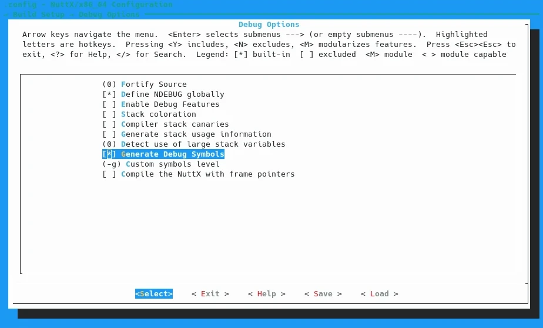
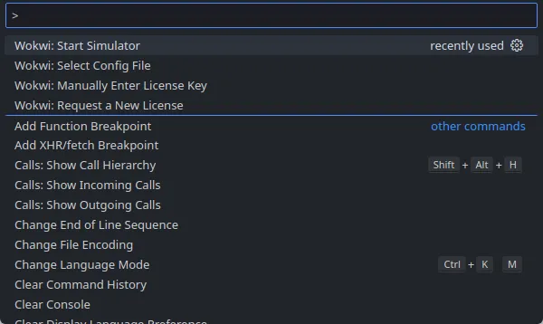
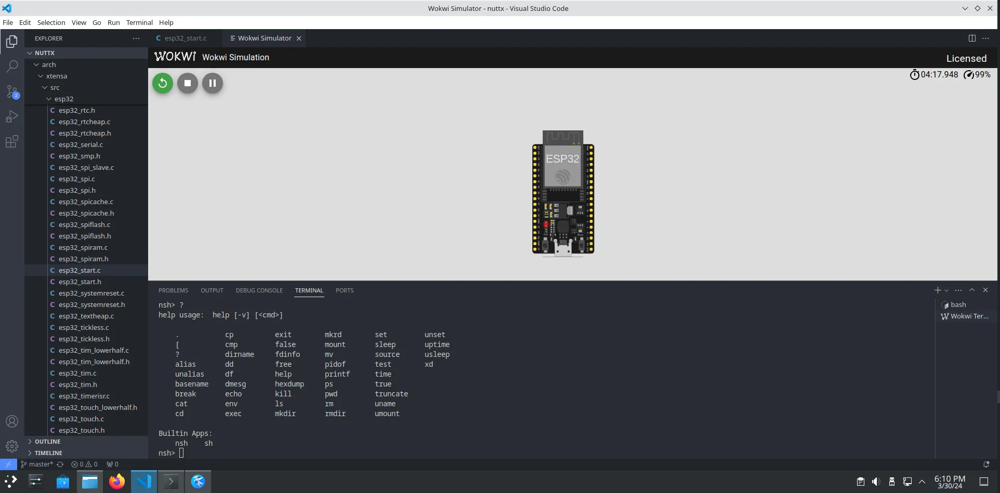
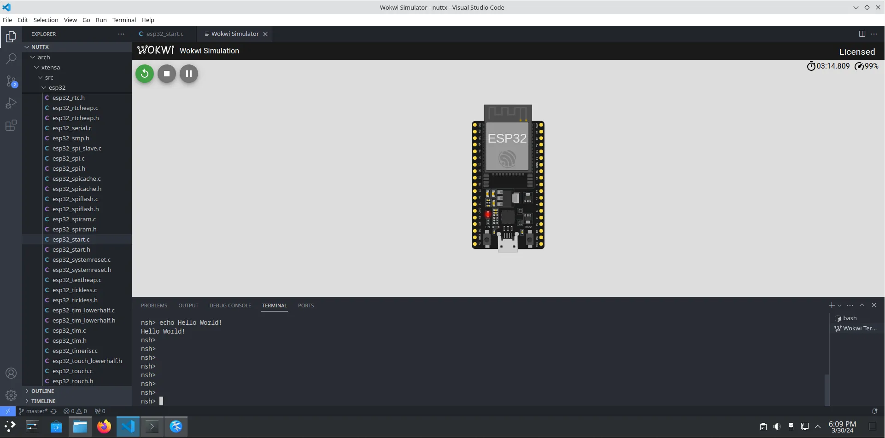
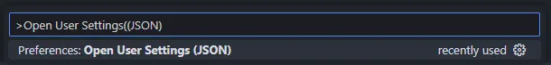

In this article, we will examine how the NuttX real-time operating system (RTOS) can be used on the Wokwi simulator, what adjustments need to be made on the NuttX side for this and what advantages the Wokwi simulator offers.


**Note!**

Note: Reviewing this article together with <cite>[NuttX on an emulated ESP32 using QEMU](https://medium.com/@lucassvaz/nuttx-on-an-emulated-esp32-using-qemu-8d8d93d24c63)</cite> article will help the user to distinguish between the two solutions and to determine the most suitable solution for the needs. Additionally, it is recommended to have knowledge of project compilation through the NuttX official documentation and <cite>[Getting Started with NuttX and ESP32](https://developer.espressif.com/blog/nuttx-getting-started/)</cite> article. NuttX project build documentation is available [at this link](https://nuttx.apache.org/docs/latest/).


## What is Wokwi?

<cite>[Wokwi is an online Electronics simulator. You can use it to simulate Arduino, ESP32, STM32, and many other popular boards, parts and sensors.][2]</cite>

## What are the Advantages of Wokwi?

  - It provides the opportunity to start the project regardless of the delivery time of the parts required for the project.

  - There is no way to destroy virtual hardware. For that reason cash loss due to connection error is prevented and it provides the opportunity to undo the transaction after a step goes wrong.

  - Provides convenience in getting help and feedback through the link to the project.

  - Helps distinguish hardware and software based problems. This way, you can focus on the code side.

  - It allows the use of any number of hardware regardless of the project budget.

<cite>[Source][3]</cite>

Note: Of course, there will be differences between the simulation and the field. For this reason, the project running in simulation should not be taken to the field without testing.


## Supported devices

Here is the list of supported devices, separated by the core architecture.

| SoC      | Core   | Support Stage |
|----------|--------|---------------|
| ESP32    | Xtensa | Release       |
| ESP32-S2 | Xtensa | Release       |
| ESP32-S3 | Xtensa | Release       |
| ESP32-C3 | RISC-V | Release       |
| ESP32-C6 | RISC-V | Release       |
| ESP32-H2 | RISC-V | Beta          |
| ESP32-P4 | RISC-V | Alpha         |


<cite>[Source][4]</cite>. Apart from these, you can use [this link](https://docs.wokwi.com/getting-started/supported-hardware) for supported sensors and more.

## Alternatives and Differences

Among others, the most widely-known alternative to Wokwi is QEMU. **QEMU** stands out with faster operation if special optimizations are used. **Wokwi** offers more platform support, ease of installation, and simulation features with external parts.

## Simulating NuttX on Wokwi

### Creating a NuttX System Image

  - You can create the development environment for Xtensa-based (ESP32, ESP32-S2, ESP32-S3) microcontrollers using [this link](https://nuttx.apache.org/docs/latest/platforms/xtensa/index.html).
  - You can create the development environment for RISC-V based (ESP32-C3, ESP32-C6, ESP32-H2) microcontrollers using [this link](https://nuttx.apache.org/docs/latest/platforms/risc-v/index.html).

Wokwi does not support compiling NuttX projects internally like ESP-IDF or Zephyr. Therefore, it is necessary to compile locally and continue the simulation part via Wokwi. In other words, we will simulate the NuttX output compiled in our own development environment via Wokwi.

In this article, we will use the nsh application for the ESP32 microcontroller as an example. If there is a previously selected configuration, use the following commands to reset the project and to select the configuration needed for the nsh application on the ESP32.

```bash
make distclean
./tool/configure.sh esp32-devkitc:nsh
```

With these commands, we have selected the necessary card and configuration. To perform debugging, we need to run `make menuconfig` to open the `Build System` menu, select `Debug Options`, and activate the `Generate Debug Symbols` option. We can use the following command for the relevant setting:

```bash
make menuconfig
```

The result will look something like this:




After configuration and setup, we can use the following command to compile:

```bash
make
```

We should see the following output:

```text
LD: nuttx
CP: nuttx.hex
CP: nuttx.bin
```

After the compilation process is successfully completed, we need the `nuttx` file for the simulation.

### Simulating NuttX Application in Wokwi

To use Wokwi with Visual Studio Code, you must first download the [`Wokwi for VS Code` ](https://marketplace.visualstudio.com/items?itemName=wokwi.wokwi-vscode) plug-in and enter the license key. You can get more detailed information about it [here](https://docs.wokwi.com/vscode/getting-started).

Wokwi basically works on two files - `wokwi.toml` and `diagram.json`:

- **wokwi.toml:** <cite>[A configuration file that tells Wokwi how to run your project.][5]</cite> Information such as 'elf' and 'firmware' file paths of the application are saved in this file.

- **diagram.json:** <cite>[A diagram file that describes the circuit.][5]</cite> Information such as the microcontroller to be added to the circuit, peripheral units such as the sensor to be connected to the microcontroller, their locations, color and interconnection of the parts in the circuit are recorded in this file. You can use [this link](https://docs.wokwi.com/diagram-format) for detailed information.

For details about Wokwi configuration files, see [here](https://docs.wokwi.com/vscode/project-config).

If we go back to the Simulation section after these definitions, we need to do two things:

- Add the `nuttx` file path to the `wokwi.toml` file
- Add the circuit diagram in the `diagram.json` file to use in simulation

The file contents we need in this example project will be as follows:

**wokwi.toml**
```toml
[wokwi]
version = 1
firmware = 'nuttx'
elf = 'nuttx'
```

**diagram.json**
```json
{
  "version": 1,
  "author": "Anonymous maker",
  "editor": "wokwi",
  "parts": [
    { "type": "board-esp32-devkit-c-v4", "id": "esp", "top": 0, "left": 0, "attrs": {} } }
  ],
  "connections": [
    [ "esp:TX", "$serialMonitor:RX", "", [] ],
    [ "esp:RX", "$serialMonitor:TX", "", [] ]
  ],
  "dependencies": {}
}
```

After creating the necessary files, we can start the simulation by pressing `F1` and selecting the `Wokwi: Start Simulator` option:



After that, Wokwi will be up and running and you can start using NuttX.





*Note: `nsh` may not appear at first startup. You can switch by pressing the `Enter` key.*

## Debugging with Wokwi

Wokwi comes with built-in debugging support. <cite>For this process, first the [cpp tools plug-in](https://marketplace.visualstudio.com/items?itemName=ms-vscode.cpptools) in the VSCode editor must be installed. [Source][6]</cite>


Afterwards, in the `wokwi.toml` file, we need to add the following line to the `[wokwi]` section:

```toml
gdbServerPort=3333
```

As a result of the process, the `wokwi.toml` file will look like this for this example:

```toml
[wokwi]
version = 1
firmware = 'nuttx'
elf = 'nuttx'
gdbServerPort=3333
```

Also you need to create a launch configuration file for Visual Studio Code. You can create the file at `.vscode/launch.json` path or you can use `Open user settings (JSON)` option with pressing `F1` key.



Here's a template you can use:

```json
{
  "version": "0.2.0",
  "configurations": [
    {
      "name": "Wokwi GDB",
      "type": "cppdbg",
      "request": "launch",
      "program": "${workspaceFolder}/nuttx/nuttx",
      "cwd": "${workspaceFolder}",
      "MIMode": "gdb",
      "miDebuggerPath": "/debugger/path/xtensa-esp32-elf-gdb",
      "miDebuggerServerAddress": "localhost:3333"
    }
  ]
}
```

After that, press `F1` and select `Wokwi: Start Simulator and Wait for Debugger` to start the simulator. Wokwi will then go into standby mode to allow the debugger to connect. In a separate terminal tab you can run GDB with `xtensa-esp32-elf-gdb` or similar commands for Xtensa devices or `riscv-none-elf-gdb` for RISC-V devices. After running the debugger, you can start to debug with Wokwi using the `F5` key in simulator.

For more detailed information about the debugging, you can visit [this link](https://docs.wokwi.com/guides/debugger).

Of course, our hope is that you will not need this process :)

## Conclusion

In this article, we have seen the features of Wokwi and how it can be used with NuttX. Of course, all the features of Wokwi are not limited to these. You can use [this link](https://docs.wokwi.com/?utm_source=wokwi) to get more detailed information and examples about Wokwi.

## Resources
- [NuttX Documentation](https://nuttx.apache.org/docs/)
- [NuttX GitHub](https://github.com/apache/nuttx)
- [NuttX channel on Youtube](https://www.youtube.com/nuttxchannel)
- [NuttX Developer Mailing List](https://nuttx.apache.org/community/#mailing-list)
- [Wokwi Website](https://wokwi.com/)
- [Wokwi Documentation](https://docs.wokwi.com/?utm_source=wokwi)

[1]: https://medium.com/@lucassvaz/nuttx-on-an-emulated-esp32-using-qemu-8d8d93d24c63
[2]: https://docs.wokwi.com/?utm_source=wokwi
[3]: https://docs.wokwi.com/?utm_source=wokwi#why-wokwi
[4]: https://docs.wokwi.com/getting-started/supported-hardware
[5]: https://docs.wokwi.com/vscode/project-config
[6]: https://docs.wokwi.com/vscode/debugging
[7]: https://developer.espressif.com/blog/nuttx-getting-started/
