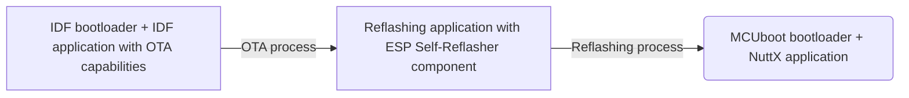

Migration in Embedded Systems is always a significant subject and it may not only feature on an ongoing production decision, but also as a factor that can contribute to design choices at project time. Hardware or firmware wise, any change of that kind is risky, so it requires good planning, controled testing and careful execution.

On the firmware area, there are a variety of reasons that may motivate choosing a flexible platform for a project or actually migrating from a production running RTOS (Real Time Operating System) to another one, they may range from technical to strategic purposes.

Relatively, changing an RTOS may not be as straight forward as a firmware update. One of the concerns that needs to be addressed beforehand is the bootloader compatibility.

Besides initializing the system, the bootloader may be responsible for handling safe and secure firmware updates. However, it typically cannot update itself, either by design or due to device restrictions, such as flash bootloader region protection. Also in most of the scenarios, the device is not physically accessible, thus a direct serial flashing is not practical.

This tutorial demonstrates how ESP Self-Reflasher component can be used to migrate an IDF-bootloader-based application (OTA capable) to a MCUboot-based-bootloader application. The ESP Self-Reflasher component is used on an middle step application for enabling the device to "reflash" its own firmware.

---
**Note**
The MCUboot compatible application used in this guide is a NuttX RTOS application, but could be other like a Zephyr RTOS application, for instance.

---

The overall process described in this guide can be illustrated as:



## ESP Self Reflasher component

The [ESP Self-Reflasher](https://components.espressif.com/components/espressif/esp-self-reflasher/versions/1.0.0) is an ESP-IDF component that allows the device to be "reflashed" with new firmware. This is achieved through one of the following ways of operation: downloading the reflashing image or embedding the reflashing image. The component has examples for each that will be used on this guide.

## Environment pre requisites

Besides ESP-IDF ([Get started guide here](https://docs.espressif.com/projects/esp-idf/en/stable/esp32/get-started/index.html)), the following are required:

- ESP Self-Reflasher: clone it to `<IDF_DIR>/components` with Git:

```bash
cd <IDF_DIR>/components
git clone https://github.com/espressif/esp-self-reflasher.git
```

- NuttX: in order to build the application that will be migrated to, set the NuttX workspace. [Get started guide here](https://developer.espressif.com/blog/nuttx-getting-started/).

- MCUboot: in the case of building the bootloader standalone, follow the instructions [here](https://docs.mcuboot.com/readme-espressif.html).

## Step-by-step Guide

### Building the reflashing images (MCUboot and NuttX application)

With the NuttX workspace ready, prepare the NSH (NuttShell) configuration with MCUboot compatibility, which is available under the `mcuboot_nsh` defconfig. This is the build that will be used as the *final target* of the reflashing process.

```bash
cd <NUTTX_DIR>
./tools/configure.sh esp32-devkitc:mcuboot_nsh
```

---
**Note**

It is also possible to manually configure other NuttX applications for building it with MCUboot compatibility. Enter the menuconfig:

```bash
make menuconfig
```

Enter the menu `System Type -> Bootloader and Image Configuration` and enable the `Enable MCUboot-bootable format` option.

---

Ensure that the organization of image slots in flash is properly configured. It can be checked on the menu `System Type -> SPI Flash Configuration` from menuconfig. For this example using ESP32, the following is considered (note that the Bootloader offset may differ among other Espressif chip families):

| REGION                           | OFFSET    | SIZE     |
| -------------------------------- | --------- | -------- |
| Bootloader                       | 0x001000  | 0x00F000 |
| Application primary slot         | 0x010000  | 0x100000 |
| Application secondary slot       | 0x110000  | 0x100000 |
| Scratch                          | 0x210000  | 0x040000 |


---
**Note**

If MCUboot is being build separately from NuttX build, be sure that the configuration for flash organization matches on both.

---

Save and exit the menuconfig.

Build the MCUboot bootloader:

```bash
make -j bootloader
```

Now build the NuttX application:

```bash
make ESPTOOL_BINDIR=./ -s -j
```

### Building the Reflashing application

#### Example 1: Download the Target Reflashing Image

ESP Self-Reflasher component provides the example `boot_swap_download_example`, this can be used as start point for the Reflashing application.

```bash
cd <IDF_DIR>/components/esp-self-reflasher/examples/boot_swap_download_example/
```

First, copy the *final target images* (NuttX and MCUboot binaries) to the directory that will be served for HTTP download.

```bash
cp <NUTTX_DIR>/nuttx.bin <IDF_DIR>/components/esp-self-reflasher/examples/boot_swap_download_example/example_bin_dir/app_upd.bin
cp <NUTTX_DIR>/mcuboot-esp32.bin <IDF_DIR>/components/esp-self-reflasher/examples/boot_swap_download_example/example_bin_dir/mcuboot-esp32.bin
```

Configure the example:

```bash
idf.py menuconfig
```

Enter menu `Example Configuration -> Bootloader reflash configuration` and set the `Bootloader bin url endpoint` with the host IP, port and the bootloader binary name (e.g. `http://192.168.0.100:8070/mcuboot-esp32.bin`):

```
http://<HOST_IP>:<HOST_PORT>/mcuboot-esp32.bin
```

Also configure the `Bootloader region address` (the Bootloader offset mentioned above) and the `Bootloader region size`.

Then configure the similar parameters on the `Example Configuration -> Application reflash configuration` menu, set the `Application upgrade url endpoint` (e.g. `http://192.168.0.100:8070/app_upd.bin`):

```
http://<HOST_IP>:<HOST_PORT>/app_upd.bin
```

Set the `Application region address` and `Application region size`. Note that if the `boot_swap_download_example` is flashed standalone directly as is, these must match the image Secondary Slot from the target MCUboot image organization as the example expects MCUboot to do the swapping to the Primary Slot later, otherwise, if the example is OTA upgraded which this tutorial walk through, these configs must match Primary Slot. It will depend on where the reflashing application is running from (Factory partition or OTA partition), as it should not overwrite itself on the process.

Configure the preferred network connection settings on the menu `Example Connection Configuration`, such as Wi-Fi SSID and Password.

Save and exit the menuconfig.

Build the example:

```bash
idf.py build
```

#### Example 2: Embedded the Target Reflashing Image

Alternatively, ESP Self-Reflasher component can be used without network connection and download step, however as using this way the "bootloader + target reflashing image" will be embedded on the Reflashing Application, it must not exceed the total size that the first OTA supports.

If the constraint is not a problem, `boot_swap_embedded_example` can be used as start point for the Reflashing application. Note that for this guide, the size of the OTA partitions on the partition table may be changed (see next section).

```bash
cd <IDF_DIR>/components/esp-self-reflasher/examples/boot_swap_embedded_example/
```

In this example, the MCUboot bootloader and target reflashing image needs to be merged in one binary as it goes embedded to the application.

```bash
esptool.py -c esp32 merge_bin --output <IDF_DIR>/components/esp-self-reflasher/examples/boot_swap_embedded_example/example_bin_dir/app_upd.merged.bin 0x0000 <NUTTX_DIR>/mcuboot-esp32.bin 0xF000 <NUTTX_DIR>/nuttx.bin
```

**Note** that in ESP32 case, the offsets on the merge step are shifted minus 0x1000 because of its bootloader offset 0x1000.

Configure the example:

```bash
idf.py menuconfig
```

Enter menu `Example Configuration` and set the directory where the merged binary is placed and its name. Set the `Destination address`, that for this example will be the Bootloader offset, and the `Destination region size`, that must be the image slot size from the target flash organization plus the bootloader region size.

Save and exit the menuconfig.

Build the example:

```bash
idf.py build
```

### Building and flashing the IDF application

The IDF's `simple_ota_example` will be used as the hypothetical IDF application that will OTA to the Reflashing application. The steps are basically the same as described on its [documentation](https://github.com/espressif/esp-idf/tree/v5.1.4/examples/system/ota), with few changes.

```bash
cd <IDF_DIR>/examples/system/ota/simple_ota_example/
```

Set the target chip:

```bash
idf.py set-target esp32
```

Set the configurations for the example:

```bash
idf.py menuconfig
```

In the `Example Configuration` menu, set the `firmware upgrade url endpoint` with the host IP, port and the Reflasher application binary name (e.g. `http://192.168.0.100:8070/boot_swap_download.bin`):

```
http://<HOST_IP>:<HOST_PORT>/<reflashing_application_name>.bin
```

In the `Example Connection Configuration` menu, again set the preferred network connection settings, such as Wi-Fi SSID and Password.

Only for illustration purposes, this guide is using simple HTTP requests, so enable the `Allow HTTP for OTA` option in the `Component config -> ESP HTTPS OTA`.

---
If the `boot_swap_embedded_example` was used, define a custom partition table in `Partition table` menu. Create the `partitions.csv` file with the following content:

```
# Name,     Type, SubType,     Offset,          Size, Flags
nvs,        data, nvs,               ,        0x4000,
otadata,    data, ota,               ,        0x2000,
phy_init,   data, phy,               ,        0x1000,
factory,    app,  factory,    0x10000,      0x180000,
ota_0,      app,  ota_0,             ,      0x180000,
```

---

Save and exit the menuconfig.

Copy the Reflashing application binary that was build in the previous section to the directory where the HTTP server will run:

```bash
cp <IDF_DIR>/components/esp-self-reflasher/examples/boot_swap_<MODE>_example/build/boot_swap_<MODE>_example.bin <HTTP_SERVER_DIR>
```

Open a new bash and start the HTTP server for the OTA application. Here is a suggestion for creating the HTTP server using Python:

```bash
cd <HTTP_SERVER_DIR>
sudo python -m http.server -b <HOST_IP> <HOST_PORT>
# e.g. sudo python -m http.server -b 192.168.0.100 8070
```

---
If the `boot_swap_download_example` was used, copy the target reflashing images to the <HTTP_SERVER_DIR> or open another bash and start the HTTP server from where the reflashing images will be downloaded (watch for the <PORT> that cannot be the same):

```bash
cd <IDF_DIR>/components/esp-self-reflasher/examples/boot_swap_download_example/example_bin_dir/
sudo python -m http.server -b <HOST_IP> <HOST_PORT>
# e.g. sudo python -m http.server -b 192.168.0.100 8071
```

---

Finally build and flash the OTA application:

```bash
idf.py -p <SERIAL_PORT> flash monitor
# e.g. idf.py -p /dev/ttyUSB0 flash monitor
```

## Conclusion

The ESP Self-Reflasher component may help on the process of migrating an ESP32-xx device from an IDF-based application to other MCUboot-compatible platform, however it is strongly recommended to observe the already enabled constraints of a device beforehand and also to plan carefully as it uses risky flash operations.
