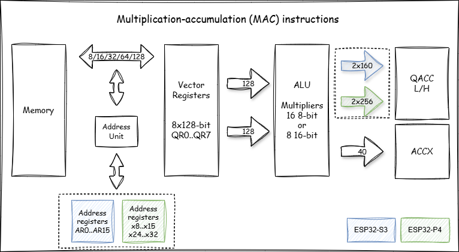
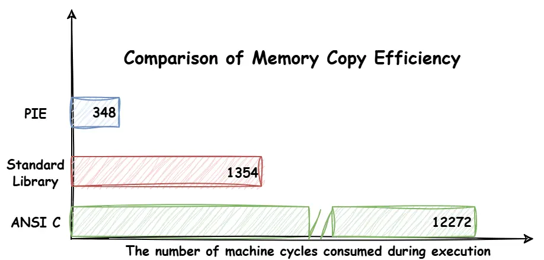
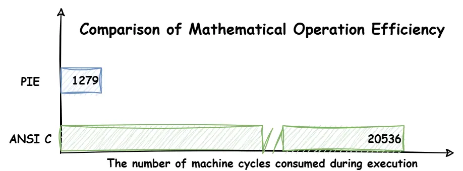
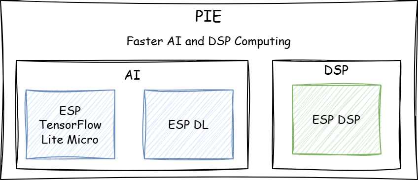

The recent breakthroughs in artificial intelligence technology in such fields as image recognition, speech recognition, and natural language processing have opened up more possibilities for embedded system applications. When attempting to deploy AI model inference on embedded devices such as the ESP32-P4, we always strive to minimize inference time as much as possible to meet real-time requirements. 

PIE (Processor Instruction Extensions), as a set of new extended instructions introduced in ESP32-S3/ESP32-P4, is designed to enhance the efficiency of **specific AI and DSP (Digital Signal Processing) algorithms**. Based on the SIMD (Single Instruction Multiple Data) concept, it supports vector operations in 8-bit, 16-bit, and 32-bit formats, significantly enhancing computational efficiency. Furthermore, for such operations as multiplication, shifting, and accumulation, PIE enables simultaneous data movement during computation, which further boosts the execution efficiency of individual instructions.

To understand the PIE, this article will analyze and test it from the perspectives of the instruction architecture, basic instruction format, and its applications.

## PIE Differences: ESP32-S3 vs. ESP32-P4

You can use PIE on both the ESP32-S3 and ESP32-P4. Although the differences in applying the PIE on these two chips are minimal, you still need to pay attention to the distinctions between them:

* Instruction **Architecture Differences**: The PIE of the ESP32-S3 are designed based on the TIE (Tensilica Instruction Extension), while the ESP32-P4 supports the standard ``RV32IMAFCZc`` extension and includes a custom ``Xhwlp`` (hardware loop) extension to improve the efficiency of executing for-loops in hardware.
* Internal **Structure Differences**: Taking multiplication-accumulation (MAC) as an example, the ESP32-S3 has two 160-bit accumulators, while the ESP32-P4 has two 256-bit accumulators.
* Instruction **Format Differences**: The PIE of ESP32-S3 and ESP32-P4 are largely similar. However, it is important to note that ESP32-S3 instructions start with ``ee``, while ESP32-P4 instructions start with ``esp``. Additionally, some instructions may differ in functionality or usage; for detailed information, please refer to the respective technical reference manual.


<figure style="width: 90%; margin: 0 auto; text-align: center;">
    
    <figcaption>Multiplication-accumulation (MAC) instructions</figcaption>
</figure>

The diagram above shows the data path of the multiplier-accumulator within the PIE, with differences between ESP32-S3 and ESP32-P4 highlighted using the dashed boxes. Blue represents ESP32-S3, and green represents ESP32-P4. A more detailed explanation for the blocks in the diagram from left to right:

- **Memory:** It is used to store and quickly access data.
- **Address Unit:** Most of the instructions in PIE allow loading or storing data from/to 128-bit Q registers in parallel in one cycle. Additionally, The Address unit provides functionality to manipulate address registers in parallel, which saves the time to update address registers.
- **Vector Registers:** It contains eight 128-bit wide vector registers (QR). Each register can be represented as an array of 16 8-bit data elements, an array of 8 16-bit data elements, or an array of 4 32-bit data elements.
- **ALU:** It performs arithmetic operations such as addition, subtraction, and bitwise operations like AND, OR, shift, etc. The input for ALU operations comes from QR registers. 
- **QACC Accumulator Register:** It is used for saving 16 8-bit MAC results or 8 16-bit MAC results. For the ESP32-S3, QACC consists of two parts: a 160-bit QACC_H and a 160-bit QACC_L. Meanwhile, for the ESP32-P4, the sizes of QACC_H and QACC_L are 256-bit each. It is possible to load data from memory to QACC or reset the initial value to 0.
- **ACCX Accumulator Register:** Some operations require accumulating the result of all multipliers to one value. In this case, the ACCX accumulator should be used. ACCX is a 40-bit accumulator register. The result of the accumulators could be shifted and stored in the memory as an 8-bit or 16-bit value.

If you're unfamiliar with the PIE architecture mentioned above, don't worry. This article will demonstrate the application and performance acceleration of PIE from a practical perspective in an intuitive manner.

## Basic Instruction Formats and Applications

If your work often involves AI model inference or signal processing, you are likely to frequently encounter operations such as memory copying and vector computations. Take memory copy and vector addition as examples, you can utilize the PIE instruction through `inline assembly` or `.s files`. It is important to note that most instructions in PIE can load or store data from the 128-bit Q register within a single cycle; therefore, data should be **128-bit aligned**.

### Memory Copy Acceleration

In memory copy scenarios, the eight 128-bit Q registers in PIE can be used to read and store data, achieving memory copy acceleration. The PIE format of the ESP32-P4 is as follows:

```asm
esp.vld.128.ip qu,rs1,imm  # Load 128-bit data from memory

; This instruction loads 128-bit data from memory to the register qu,  
; with the pointer incremented by an immediate.  
; imm starts at -2048, ends at 2032, and steps by 16.
```

```asm
esp.vst.128.ip qu,rs1,imm  # Store 128-bit data to memory

; This instruction stores the 128 bits in the register qu to memory,  
; with the pointer incremented by an immediate.  
; imm starts at -2048, ends at 2032, and steps in increments of 16
```

Next, based on the above instructions, write the code for memory copying in the form of a ``.s file``.

```asm
    .data
    .align 16

    .text
    .align 4

    .global memcpy_pie
    .type   memcpy_pie, @function
memcpy_pie:
    # a0: store_ptr 
    # a1: load_ptr
    # a2: length(bytes)

    li x28,0
    Loop:
        esp.vld.128.ip q0, a1, 16
        esp.vld.128.ip q1, a1, 16
        esp.vld.128.ip q2, a1, 16
        esp.vld.128.ip q3, a1, 16
        esp.vld.128.ip q4, a1, 16
        esp.vld.128.ip q5, a1, 16
        esp.vld.128.ip q6, a1, 16
        esp.vld.128.ip q7, a1, 16

        esp.vst.128.ip q0, a0, 16
        esp.vst.128.ip q1, a0, 16
        esp.vst.128.ip q2, a0, 16
        esp.vst.128.ip q3, a0, 16
        esp.vst.128.ip q4, a0, 16
        esp.vst.128.ip q5, a0, 16
        esp.vst.128.ip q6, a0, 16
        esp.vst.128.ip q7, a0, 16

        addi x28, x28, 128
        bge x28, a2, exit
        j Loop
    exit:
        ret
```

In the above assembly file, the original data is stored in registers q0 to q7, respectively, and written back to the designated memory block.

<figure style="width: 90%; margin: 0 auto; text-align: center;">
    
    <figcaption>Comparison of Memory Copy Efficiency</figcaption>
</figure>

A comparison experiment of `memcpy` is conducted on the ESP32-P4 in this article. The ESP32-P4 is configured to run at 360 MHz, with a 128 KB L2 cache size and 64 Bytes L2 cache line size. The test results show that, over 100 repeated rounds of copying 2040 bytes, the PIE version is **74.3%** faster than the standard library and **97.2%** faster than the ANSI C version with single-byte copying.

Further insights might be gained from exploring the reasons why the standard `memcpy` is more efficient than single-byte copying based on ANSI C, and why the PIE version of memory copying is the fastest.

[Newlib-esp32](https://github.com/espressif/newlib-esp32) includes the implementation of `memcpy` for various platforms. Taking the RISC-V-based ESP32-P4 as an example, compared to single-byte copying, the optimized `memcpy` improves data copying efficiency by using **memory alignment and large block transfers**. At the same time, the PIE further accelerates the memory copying speed by using **eight 128-bit registers to load and store data**.

```c
void *
__inhibit_loop_to_libcall
memcpy(void *__restrict aa, const void *__restrict bb, size_t n)
{
  #define BODY(a, b, t) { \
    t tt = *b; \
    a++, b++; \
    *(a - 1) = tt; \
  }

  char *a = (char *)aa;
  const char *b = (const char *)bb;
  char *end = a + n;
  uintptr_t msk = sizeof (long) - 1;
  if (unlikely ((((uintptr_t)a & msk) != ((uintptr_t)b & msk))
	       || n < sizeof (long)))
    {
small:
      if (__builtin_expect (a < end, 1))
	while (a < end)
	  BODY (a, b, char);
      return aa;
    }

  if (unlikely (((uintptr_t)a & msk) != 0))
    while ((uintptr_t)a & msk)
      BODY (a, b, char);

  long *la = (long *)a;
  const long *lb = (const long *)b;
  long *lend = (long *)((uintptr_t)end & ~msk);

  if (unlikely (lend - la > 8))
    {
      while (lend - la > 8)
	{
	  long b0 = *lb++;
	  long b1 = *lb++;
	  long b2 = *lb++;
	  long b3 = *lb++;
	  long b4 = *lb++;
	  long b5 = *lb++;
	  long b6 = *lb++;
	  long b7 = *lb++;
	  long b8 = *lb++;
	  *la++ = b0;
	  *la++ = b1;
	  *la++ = b2;
	  *la++ = b3;
	  *la++ = b4;
	  *la++ = b5;
	  *la++ = b6;
	  *la++ = b7;
	  *la++ = b8;
	}
    }

  while (la < lend)
    BODY (la, lb, long);

  a = (char *)la;
  b = (const char *)lb;
  if (unlikely (a < end))
    goto small;
  return aa;
}
```

### Mathematical Operations Acceleration

Taking vector addition of type ``int16_t`` as an example, compared to memory copy, it adds an additional ``addition instruction``. The instruction format on the ESP32-P4 is as follows:

```asm
esp.vadd.s16 qv, qx, qy 

; This instruction performs a vector signed addition
; on 16-bit data in the two registers qx and qy.
; Then, the 8 results obtained from the calculation are saturated,
; and the saturated results are written to the register qv.
```

Next, PIE will be written using `inline assembly`.

```c
void add_ansic(int16_t *x, int16_t *y, int16_t *z, int n)
{
    for (int i = 0; i < n; i++)
    {
        z[i] = x[i] + y[i];
    }
}

void add_pie(int16_t *x, int16_t *y, int16_t *z, int n)
{
    asm volatile(
        " addi sp, sp, -32 \n"
        " sw x31, 28(sp) \n"
        " sw x30, 24(sp) \n"
        " sw x29, 20(sp) \n"
        " sw x28, 16(sp) \n"
        " sw x27, 12(sp) \n"
        " mv x31, %0 \n"
        " mv x30, %1 \n"
        " mv x29, %2 \n"
        " mv x28, %3 \n"
        "li x27, 0 \n"
        "loop:\n"
        " beq x27, x28, exit \n"
        " esp.vld.128.ip q0, x31, 16 \n"
        " esp.vld.128.ip q1, x31, 16 \n"
        " esp.vld.128.ip q2, x31, 16 \n"
        " esp.vld.128.ip q3, x31, 16 \n"
        " esp.vld.128.ip q4, x30, 16 \n"
        " esp.vld.128.ip q5, x30, 16 \n"
        " esp.vld.128.ip q6, x30, 16 \n"
        " esp.vld.128.ip q7, x30, 16 \n"

        " esp.vadd.s16 q0, q0, q4 \n"
        " esp.vadd.s16 q1, q1, q5 \n"
        " esp.vadd.s16 q2, q2, q6 \n"
        " esp.vadd.s16 q3, q3, q7 \n"

        " esp.vst.128.ip q0, x29, 16 \n"
        " esp.vst.128.ip q1, x29, 16 \n"
        " esp.vst.128.ip q2, x29, 16 \n"
        " esp.vst.128.ip q3, x29, 16 \n"

        " addi x27, x27, 32 \n"
        " j loop \n"
        "exit:\n"
        " lw x31, 28(sp) \n"
        " lw x30, 24(sp) \n"
        " lw x29, 20(sp) \n"
        " lw x28, 16(sp) \n"
        " lw x27, 12(sp) \n"
        " addi sp, sp, 32 \n"
        :: "r" (x), "r" (y) , "r" (z), "r" (n)    
    );
}
```

<figure style="width: 90%; margin: 0 auto; text-align: center;">
    
    <figcaption>Comparison of Mathematical Operation Efficiency</figcaption>
</figure>

Subsequently, under the same conditions as the memory copy experiment, 100 rounds of ``int16_t`` vector addition have been conducted, with each vector having a length of 2048. The test results show that the PIE version was **93.8%** faster compared to the ANSI C version.

Overall, this article introduces two application scenarios of PIE and two implementation methods. PIE also includes other commands, which you can test by referring to the process described above.

## Add PIE-based components to the project

If you prefer not to write PIE instructions but still want to accelerate AI inference or signal processing, you can try using components with integrated PIE instructions to simplify the development process. As of now, the following Espressif's official components can be easily integrated into your existing projects to accelerate AI and DSP performance:

* [esp-tflite-micro](https://github.com/espressif/esp-tflite-micro): the [esp-nn](https://github.com/espressif/esp-nn) component within esp-tflite-micro uses PIE to optimize certain basic AI operators, which can further accelerate model inference time.
* [esp-dl](https://github.com/espressif/esp-dl): esp-dl provides a lightweight and efficient neural network inference framework specifically designed for ESP series chips, efficiently implementing common AI operators such as Conv2D, Pool2D, Gemm, Add, and Mul.
* [esp-dsp](https://github.com/espressif/esp-dsp): esp-dsp uses assembly optimization for mathematical operations such as matrix multiplication, dot product, and FFT, and also provides an ANSI-C implementation.

<figure style="width: 90%; margin: 0 auto; text-align: center;">
    
    <figcaption>AI and DSP Components Containing PIE</figcaption>
</figure>

## Summary

To summarize, some key advantages of PIE are:

* 128-bit vector operations, e.g., multiplication, addition, subtraction, accumulation, shifting, and comparison.
* Integration of data transfer into arithmetic instructions.
* Support for non-aligned 128-bit vector data.
* Configurable rounding and saturation modes.

With the help of PIE instructions or related components, you can attempt to accelerate the computation process in your existing projects.

Please do try and share your experiences!
