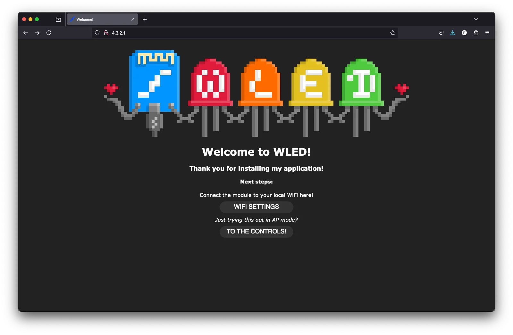
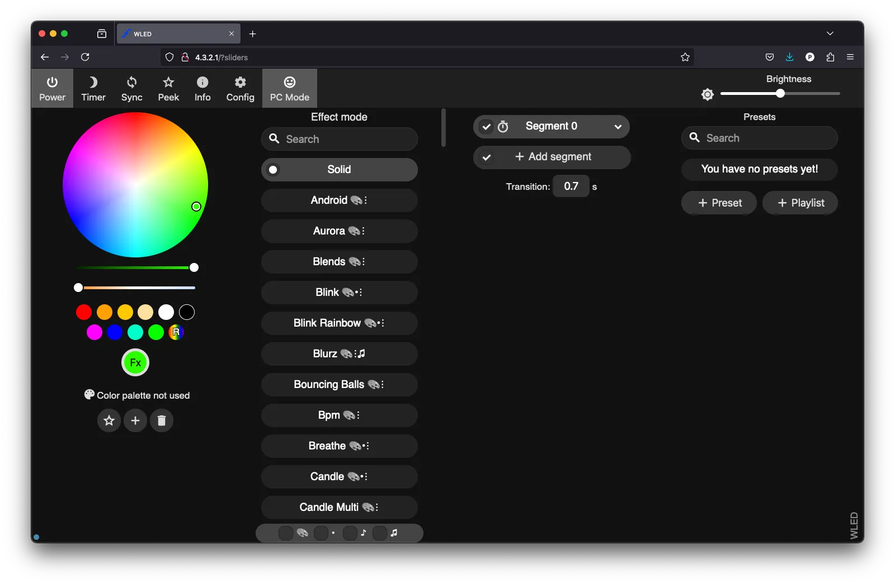
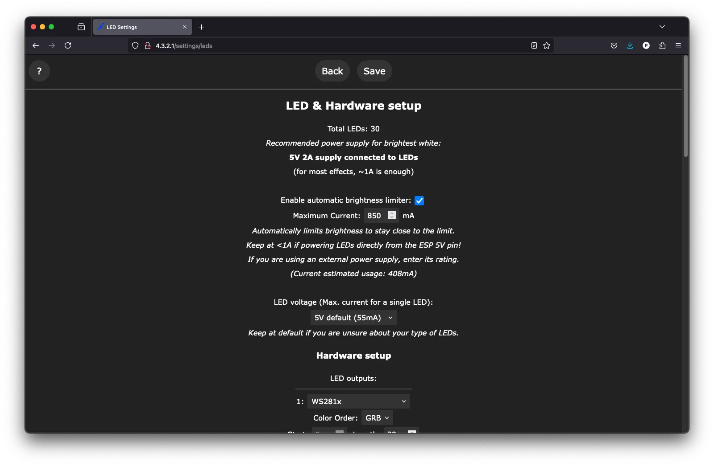
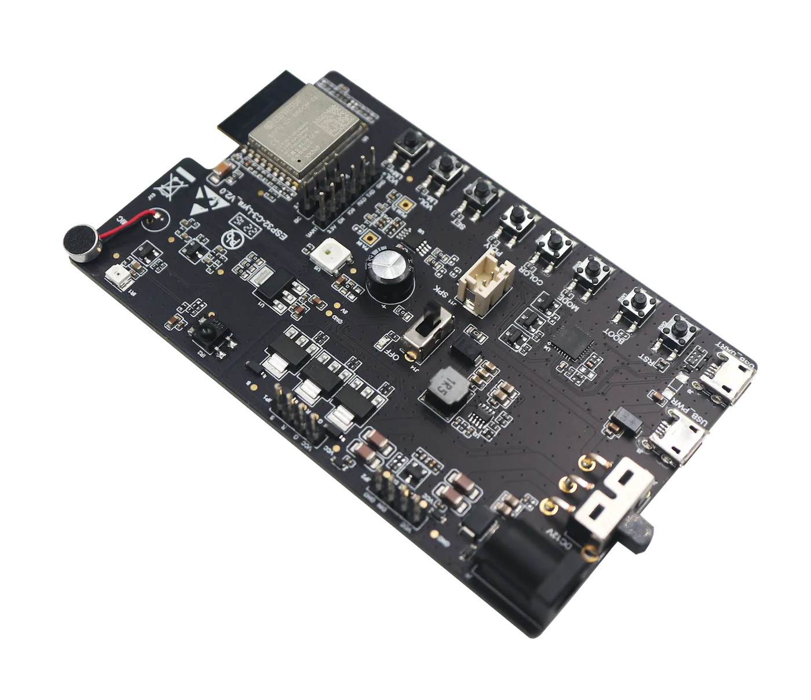
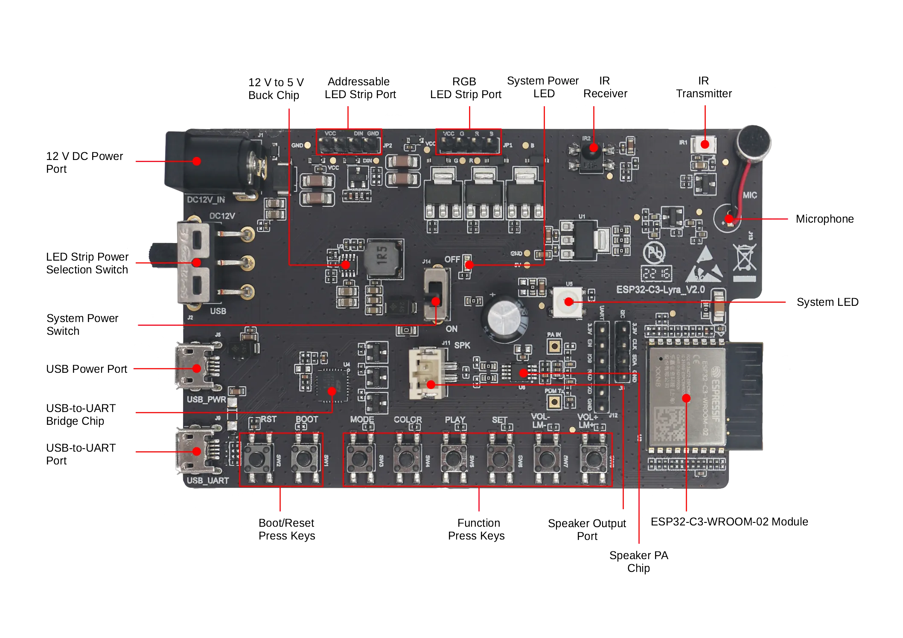

The holidays are coming and the lights are now everywhere!

Making amazing lighting installations could sound very complex, requiring a lot of expensive hardware and software, however, thanks to the community and some ESP32 or ESP8266, this is not that complex and you can do it yourself.

Today we will talk about a community project, created by [Christian Schwinne a.k.a Aircoookie](https://github.com/Aircoookie), called [WELD](https://kno.wled.ge/).

## WLED

WLED is an open-source solution for the ESP32 and ESP8266 to control addressable LEDs. It implements a web server to control the LED segments, creating a unique experience. It supports many outstanding features that allow you to create different light effects and advanced configurations, including various control interfaces, firmware upgrades OTA, scheduling, and much more.


The WLED is only compatible with addressable LEDs, including RGBW, but the non-addressable LEDs are not supported.


For the full list of features, please visit the [WLED documentation page](https://kno.wled.ge/features/effects/).

## How to use

The WLED can be used in many different ways, from a single LED strip (1D) to a LED matrix (2D). This allows you to create effects on both 1D or 2D, with custom color palette, effects (currently 117 different), multiple segments, and macros.

To get started with WLED you will need one of the supported ESP32s, a power supply and the LED strip.

Currently, the WLED only supports the following Espressif SoCs:

- ESP8266
- ESP32
- ESP32-S2
- ESP32-S3
- ESP32-C3

The easiest way to get started is by flashing the WLED firmware using the online flashing tool, the [WLED web installer](https://install.wled.me/). This tool is only compatible with Chrome and Edge (desktop versions), and the only thing you will need is a USB cable connected to the ESP board.

Flashing the firmware will only require a few minutes and no previous installation is required. After flashing, you can connect to the WLED device via Wi-Fi AP SSID called `WLED-AP` with the password `wled1234`, and then you will be able to open the web interface on the IP `4.3.2.1` or `wled.me`.

Once you have access to the WLED web interface, you will need to configure the Wi-Fi (if you want to control it via your local network), the LED strip settings, and create the effects presets and playlist.

### The web interface

The web interface is very intuitive and easy to use. You can use the web interface to do almost all the configuration required to get the WLED working with your LED stip.

### Mobile application

To get easy access to all WLED installed in your local network, you can install the mobile application, available for iOS and Android.

- [Android](https://play.google.com/store/apps/details?id=ca.cgagnier.wlednativeandroid)
- [iOS](https://apps.apple.com/us/app/wled-native/id6446207239)

### Next steps

The WLED website provides an outstanding [getting started guide](https://kno.wled.ge/basics/getting-started/) that will show you everything you need to know about the project and how to start your own WLED application. You can also find an extensive list of [tutorials](https://kno.wled.ge/basics/tutorials/) from the very active community.

To explore more options, interfaces, integration and more, take a deep look into the [WLED site](https://kno.wled.ge)!

### Hardware

If you want to test the WLED with one of Espressif boards, try with the [ESP32-C3-Lyra V2.0](https://docs.espressif.com/projects/esp-adf/en/latest/design-guide/dev-boards/user-guide-esp32-c3-lyra.html). The ESP32-C3-Lyra supports the addressable and RGB LED strips.

#### Board description

> ESP32-C3-Lyra is an ESP32-C3-based audio development board produced by Espressif for controlling light with audio. The board has control over the microphone, speaker, and LED strip, perfectly matching customers’ product development needs for ultra-low-cost and high-performance audio broadcasters and rhythm light strips.

## Conclusion

WLED is one of the most popular community projects based on the Arduino core that uses the ESP32 and the ESP8266 and it's actively maintained by the community. The project offers very intuitive documentation, making it easy for everyone to use the project without the need of creating the build environment or dealing with complex setup.

Thanks to all the project contributors for giving such an amazing solution for controlling LEDs.

## References

- [WLED official site](https://kno.wled.ge)
- [The project on GitHub](https://github.com/Aircoookie/WLED)
- [Top 5 Mistakes with WLED](https://kno.wled.ge/basics/top5_mistakes/)
