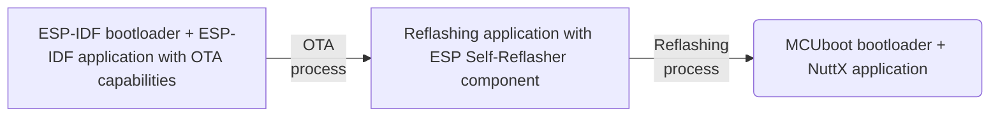

Migration is a word that carries a weighty importance in many contexts. It means relocation, resettling or, in case of the tech area, it could mean upgrade or replacement.

A variety of reasons may motivate the big decision of migrating an entire piece of hardware or software from a production running system. They may range from technical to strategic purposes, frequently:

- Update deprecated part of the system;
- Better performance;
- Scalability;
- Specific desirable features;
- Licensing restrictions;
- Cost reductions;
- Industry standards compliance;
- Better support from vendor or community;
- Security;

Also it is not uncommon to migrate to another platform out of necessity driven by constraints or issues that appear after implementation, thus choosing a flexible platform is often a good consideration when designing a solution.

In Embedded Systems, migration is quite an important subject that may emerge as a result of an ongoing production decision, or serve as a factor contributing to design choices at the project stage. Hardware-wise or firmware-wise, any change of that kind is risky, so it requires good planning, controlled testing, and careful execution.

On the firmware area, the same reasons motivate choosing a flexible platform for a project or actually migrating from a production running RTOS (Real Time Operating System) to another one.

Relatively, changing an RTOS may not be as straight forward as a firmware update. One of the concerns that needs to be addressed beforehand is the bootloader compatibility.

Besides initializing the system, the bootloader may be responsible for handling safe and secure firmware updates. However, it typically cannot update itself, either by design (usually due to security and safety reasons) or due to device restrictions, such as flash bootloader region protection. Also in most of the scenarios, the device is not physically accessible, thus a direct serial flashing is not practical.

Support for Espressif chips on platforms other than [**ESP-IDF**](https://idf.espressif.com/), like [**NuttX RTOS**](https://nuttx.apache.org/) and [**Zephyr RTOS**](https://zephyrproject.org/) keeps improving. It brings more interesting options to the table, such as offering a more flexible platform that provides more design choices or offering more flexibility in firmware migration.

However there is no standard support for **ESP-IDF** bootloader on the mentioned RTOS, so in the case of an eventual migration from **ESP-IDF** to one of them, the bootloader would need to be replaced with [**MCUboot**](https://docs.mcuboot.com/) bootloader, for example, that is one of the options available for booting either **NuttX RTOS** or **Zephyr RTOS** on Espressif chips.

**MCUboot** bootloader is an open source secure bootloader that handles fault-tolerant updates and image verification for authenticity and integrity. **MCUboot** was designed to provide good coverage of bootloader capabilities so it could be attractive to be ported to and used with more platforms.

However, as said before, migration is driven by variable reasons according to each project, thus it is not the goal of this article to discuss or compare each platform.

This tutorial aims to demonstrate how **ESP Self-Reflasher** component can be used to migrate an ESP-IDF-bootloader-based application (OTA capable) to an MCUboot-based-bootloader application in case of an eventual need. The **ESP Self-Reflasher** component is used as a middle step application for enabling the device to "reflash" its own firmware.


The MCUboot-compatible application in this guide is a **NuttX RTOS** application but could also be a **Zephyr RTOS** application.


The overall process described in this guide can be illustrated as:



## ESP Self-Reflasher component

The [**ESP Self-Reflasher**](https://components.espressif.com/components/espressif/esp-self-reflasher) is an **ESP-IDF** component that allows the device to be "reflashed" with new firmware. This is achieved through one of the following ways of operation:

- Downloading the reflashing image
- Embedding the reflashing image

The component has examples for each way of operation. Both will be used in this guide.

## Environment prerequisites

Besides **ESP-IDF** (see [ESP-IDF Getting Started](https://docs.espressif.com/projects/esp-idf/en/stable/esp32/get-started/index.html)), the following is required:

- **ESP Self-Reflasher**: clone it to `<IDF_DIR>/components` using Git:

  ```bash
  cd <IDF_DIR>/components
  git clone https://github.com/espressif/esp-self-reflasher.git
  ```

- **NuttX**: in order to build the application that will be migrated to, set the **NuttX** workspace. See [NuttX Getting Started](https://developer.espressif.com/blog/nuttx-getting-started/).

- **MCUboot**: in the case of building the bootloader standalone, follow the instructions [here](https://docs.mcuboot.com/readme-espressif.html).

## Step-by-step guide

### Build the reflashing images (MCUboot and NuttX application)

1. With the **NuttX** workspace ready, prepare the NSH (NuttShell) configuration with **MCUboot** compatibility, which is available under the `mcuboot_nsh` defconfig (premade application configuration for a board, more information [here](https://nuttx.apache.org/docs/latest/quickstart/configuring.html)). This is the build that will be used as the *final target* of the reflashing process.

    ```bash
    cd <NUTTX_DIR>
    ./tools/configure.sh esp32-devkitc:mcuboot_nsh
    ```

    You can also manually configure other **NuttX** applications to be built with **MCUboot** compatibility:

    - In your **NuttX** workspace, enter the menuconfig:
      ```bash
      make menuconfig
      ```
    - In the menu `System Type -> Bootloader and Image Configuration`, enable the option `Enable MCUboot-bootable format`

2. Ensure that the flash image map (organization of image slots in flash) is properly configured in menuconfig -> `System Type -> SPI Flash Configuration` from menuconfig. For this example using the ESP32, the following flash image map is considered (note that the Bootloader offset may differ among other Espressif chip families):

    | REGION                           | OFFSET    | SIZE     |
    | -------------------------------- | --------- | -------- |
    | Bootloader                       | 0x001000  | 0x00F000 |
    | Application primary slot         | 0x010000  | 0x100000 |
    | Application secondary slot       | 0x110000  | 0x100000 |
    | Scratch                          | 0x210000  | 0x040000 |

  
  If **MCUboot** is built separately from the **NuttX** build, make sure that both have a matching flash image map.
  

3. Navigate to the menuconfig `Exit` and, when prompted, save the current settings.

4. Build the **MCUboot** bootloader:

    ```bash
    make -j bootloader
    ```

5. Now build the **NuttX** application:

    ```bash
    make ESPTOOL_BINDIR=./ -s -j
    ```

### Build the reflashing application

#### Example 1: Download the target reflashing image

The **ESP Self-Reflasher** component provides the example `boot_swap_download_example`. This can be used as a starting point for the reflashing application.

1. Navigate to the example directory.

    ```bash
    cd <IDF_DIR>/components/esp-self-reflasher/examples/boot_swap_download_example/
    ```

2. First, copy the *final target images* (**NuttX** and **MCUboot** binaries) to the directory that will be served for HTTP download.

    ```bash
    cp <NUTTX_DIR>/nuttx.bin <IDF_DIR>/components/esp-self-reflasher/examples/boot_swap_download_example/example_bin_dir/app_upd.bin
    cp <NUTTX_DIR>/mcuboot-esp32.bin <IDF_DIR>/components/esp-self-reflasher/examples/boot_swap_download_example/example_bin_dir/mcuboot-esp32.bin
    ```

3. Configure the example:

    ```bash
    idf.py menuconfig
    ```

4. Enter menu `Example Configuration -> Bootloader reflash configuration` and set the `Bootloader bin url endpoint` with the host IP, port and the bootloader binary name (e.g. `http://192.168.0.100:8070/mcuboot-esp32.bin`):

    ```text
    http://<HOST_IP>:<HOST_PORT>/mcuboot-esp32.bin
    ```

5. Then configure the similar parameters on the `Example Configuration -> Application reflash configuration` menu, set the `Application upgrade url endpoint` (e.g. `http://192.168.0.100:8070/app_upd.bin`):

    ```text
    http://<HOST_IP>:<HOST_PORT>/app_upd.bin
    ```

6. Also configure the `Bootloader region address` (the Bootloader offset mentioned above) and the `Bootloader region size`.

7. Set the `Application region address` and `Application region size`. Note that if the `boot_swap_download_example` is flashed standalone directly as is, these must match the image Secondary Slot from the target **MCUboot** image organization as the example expects **MCUboot** to do the swapping to the Primary Slot later, otherwise, if the example is OTA upgraded which this tutorial walk through, these configs must match Primary Slot. It will depend on where the reflashing application is running from (Factory partition or OTA partition), as it should not overwrite itself on the process.

8. Configure the preferred network connection settings on the menu `Example Connection Configuration`, such as Wi-Fi SSID and Password.

9. Navigate to the menuconfig `Exit` and, when prompted, save the current settings.

10. Build the example:

    ```bash
    idf.py build
    ```

#### Example 2: Embed the target reflashing image

Alternatively, **ESP Self-Reflasher** component can be used without network connection and download step, however as using this way the "bootloader + target reflashing image" will be embedded on the reflashing application, it must not exceed the total size that the first OTA supports.

If the constraint is not a problem, `boot_swap_embedded_example` can be used as start point for the reflashing application. Note that for this guide, the size of the OTA partitions on the partition table may be changed (see next section).

1. Navigate to the example directory.

    ```bash
    cd <IDF_DIR>/components/esp-self-reflasher/examples/boot_swap_embedded_example/
    ```

2. In this example, the **MCUboot** bootloader and target reflashing image needs to be merged in one binary as it goes embedded to the application.

    ```bash
    esptool.py -c esp32 merge_bin --output <IDF_DIR>/components/esp-self-reflasher/examples/boot_swap_embedded_example/example_bin_dir/app_upd.merged.bin 0x0000 <NUTTX_DIR>/mcuboot-esp32.bin 0xF000 <NUTTX_DIR>/nuttx.bin
    ```

    >**Note:**
    In ESP32 case, the offsets on the merge step are shifted minus 0x1000 because of its bootloader offset 0x1000.

3. Configure the example:

    ```bash
    idf.py menuconfig
    ```

4. Enter menu `Example Configuration` and set the directory where the merged binary is placed and its name. Set the `Destination address`, that for this example will be the Bootloader offset, and the `Destination region size`, that must be the image slot size from the target flash organization plus the bootloader region size.

5. Navigate to the menuconfig `Exit` and, when prompted, save the current settings.

6. Build the example:

    ```bash
    idf.py build
    ```

### Build and flash the ESP-IDF application

The **ESP-IDF**'s `simple_ota_example` will be used as the hypothetical **ESP-IDF** application that will OTA to the reflashing application. The steps are basically the same as described on its [documentation](https://github.com/espressif/esp-idf/tree/v5.1.4/examples/system/ota), with few changes.

1. Navigate to the example directory.

    ```bash
    cd <IDF_DIR>/examples/system/ota/simple_ota_example/
    ```

2. Set the target chip:

    ```bash
    idf.py set-target esp32
    ```

3. Set the configurations for the example:

    ```bash
    idf.py menuconfig
    ```

4. In the `Example Configuration` menu, set the `firmware upgrade url endpoint` with the host IP, port and the Reflasher application binary name (e.g. `http://192.168.0.100:8070/boot_swap_download.bin`):

    ```text
    http://<HOST_IP>:<HOST_PORT>/<reflashing_application_name>.bin
    ```

5. In the `Example Connection Configuration` menu, again set the preferred network connection settings, such as Wi-Fi SSID and Password.

6. Only for illustration purposes, this guide is using simple HTTP requests, so enable the `Allow HTTP for OTA` option in the `Component config -> ESP HTTPS OTA`.

    >**Note:**
    If the `boot_swap_embedded_example` was used, define a custom partition table in `Partition table` menu. Create the `partitions.csv` file with the following content:

    ```text
    # Name,     Type, SubType,     Offset,          Size, Flags
    nvs,        data, nvs,               ,        0x4000,
    otadata,    data, ota,               ,        0x2000,
    phy_init,   data, phy,               ,        0x1000,
    factory,    app,  factory,    0x10000,      0x180000,
    ota_0,      app,  ota_0,             ,      0x180000,
    ```

7. Navigate to the menuconfig `Exit` and, when prompted, save the current settings.

8. Copy the reflashing application binary that was build in the previous section to the directory where the HTTP server will run:

    ```bash
    cp <IDF_DIR>/components/esp-self-reflasher/examples/boot_swap_<MODE>_example/build/boot_swap_<MODE>_example.bin <HTTP_SERVER_DIR>
    ```

9. Open a new bash and start the HTTP server for the OTA application. Here is a suggestion for creating the HTTP server using Python:

    ```bash
    cd <HTTP_SERVER_DIR>
    sudo python -m http.server -b <HOST_IP> <HOST_PORT>
    # e.g. sudo python -m http.server -b 192.168.0.100 8070
    ```

    >**Note:**
    If the `boot_swap_download_example` was used, copy the target reflashing images to the <HTTP_SERVER_DIR> or open another bash and start the HTTP server from where the reflashing images will be downloaded (watch for the <PORT> that cannot be the same):

    ```bash
    cd <IDF_DIR>/components/esp-self-reflasher/examples/boot_swap_download_example/example_bin_dir/
    sudo python -m http.server -b <HOST_IP> <HOST_PORT>
    # e.g. sudo python -m http.server -b 192.168.0.100 8071
    ```

10. Finally build and flash the OTA application:

    ```bash
    idf.py -p <SERIAL_PORT> flash monitor
    # e.g. idf.py -p /dev/ttyUSB0 flash monitor
    ```

### Execution output

Now that everything is properly build and set, after flashing the OTA application the console output will be similar as the following (check the section related to the example you chose to build):

#### `boot_swap_download_example`

  >**Note:**
  Some Wifi and other common console log outputs are ommited.

<details>
  <summary>Click here to view</summary>

```text
I (29) boot: ESP-IDF v5.1.4 2nd stage bootloader
I (29) boot: compile time Jan 14 2025 01:06:52
I (29) boot: Multicore bootloader
I (34) boot: chip revision: v3.0
I (37) boot.esp32: SPI Speed      : 40MHz
I (42) boot.esp32: SPI Mode       : DIO
I (47) boot.esp32: SPI Flash Size : 4MB
I (51) boot: Enabling RNG early entropy source...
I (57) boot: Partition Table:
I (60) boot: ## Label            Usage          Type ST Offset   Length
I (67) boot:  0 nvs              WiFi data        01 02 00009000 00004000
I (75) boot:  1 otadata          OTA data         01 00 0000d000 00002000
I (82) boot:  2 phy_init         RF data          01 01 0000f000 00001000
I (90) boot:  3 factory          factory app      00 00 00010000 00100000
I (97) boot:  4 ota_0            OTA app          00 10 00110000 00100000
I (105) boot:  5 ota_1            OTA app          00 11 00210000 00100000
I (112) boot: End of partition table
...

I (505) cpu_start: Application information:
I (510) cpu_start: Project name:     simple_ota
...

I (613) main_task: Calling app_main()
I (613) simple_ota_example: OTA example app_main start
...

I (863) example_connect: Start example_connect.
...

I (1053) example_connect: Connecting to Home...
I (1063) example_connect: Waiting for IP(s)
...

I (4863) example_connect: Got IPv6 event: Interface "example_netif_sta" address: fe80:0000:0000:0000:c6dd:57ff:fe5f:2b04, type: ESP_IP6_ADDR_IS_LINK_LOCAL
I (6763) esp_netif_handlers: example_netif_sta ip: 192.168.100.100, mask: 255.255.255.0, gw: 192.168.100.1
I (6763) example_connect: Got IPv4 event: Interface "example_netif_sta" address: 192.168.100.100
I (6773) example_common: Connected to example_netif_sta
I (6773) example_common: - IPv4 address: 192.168.100.100,
I (6783) example_common: - IPv6 address: fe80:0000:0000:0000:c6dd:57ff:fe5f:2b04, type: ESP_IP6_ADDR_IS_LINK_LOCAL
...

I (6793) simple_ota_example: Starting OTA example task
I (6803) simple_ota_example: Attempting to download update from http://192.168.100.101:8070/boot_swap_download.bin
I (6823) main_task: Returned from app_main()
I (6943) esp_https_ota: Starting OTA...
I (6943) esp_https_ota: Writing to partition subtype 16 at offset 0x110000
...

I (22823) simple_ota_example: OTA Succeed, Rebooting...
...

ets Jul 29 2019 12:21:46
rst:0xc (SW_CPU_RESET),boot:0x12 (SPI_FAST_FLASH_BOOT)
configsip: 0, SPIWP:0xee
clk_drv:0x00,q_drv:0x00,d_drv:0x00,cs0_drv:0x00,hd_drv:0x00,wp_drv:0x00
mode:DIO, clock div:2
load:0x3fff0030,len:7112
load:0x40078000,len:15624
load:0x40080400,len:4
load:0x40080404,len:3876
entry 0x4008064c
I (29) boot: ESP-IDF v5.1.4 2nd stage bootloader
I (29) boot: compile time Jan 14 2025 01:06:52
I (29) boot: Multicore bootloader
I (33) boot: chip revision: v3.0
I (37) boot.esp32: SPI Speed      : 40MHz
I (42) boot.esp32: SPI Mode       : DIO
I (46) boot.esp32: SPI Flash Size : 4MB
I (51) boot: Enabling RNG early entropy source...
I (56) boot: Partition Table:
I (60) boot: ## Label            Usage          Type ST Offset   Length
I (67) boot:  0 nvs              WiFi data        01 02 00009000 00004000
I (75) boot:  1 otadata          OTA data         01 00 0000d000 00002000
I (82) boot:  2 phy_init         RF data          01 01 0000f000 00001000
I (90) boot:  3 factory          factory app      00 00 00010000 00100000
I (97) boot:  4 ota_0            OTA app          00 10 00110000 00100000
I (105) boot:  5 ota_1            OTA app          00 11 00210000 00100000
I (112) boot: End of partition table
...

I (498) cpu_start: Application information:
I (502) cpu_start: Project name:     boot_swap_download
...

I (607) main_task: Calling app_main()
I (607) boot_swap_download_example: Self Reflasher example app_main start
I (627) example_connect: Start example_connect.
...

I (797) example_connect: Connecting to Home...
I (807) example_connect: Waiting for IP(s)
...

I (4627) example_connect: Got IPv6 event: Interface "example_netif_sta" address: fe80:0000:0000:0000:c6dd:57ff:fe5f:2b04, type: ESP_IP6_ADDR_IS_LINK_LOCAL
I (6497) esp_netif_handlers: example_netif_sta ip: 192.168.100.100, mask: 255.255.255.0, gw: 192.168.100.1
I (6497) example_connect: Got IPv4 event: Interface "example_netif_sta" address: 192.168.100.100
I (6507) example_common: Connected to example_netif_sta
I (6507) example_common: - IPv4 address: 192.168.100.100,
I (6517) example_common: - IPv6 address: fe80:0000:0000:0000:c6dd:57ff:fe5f:2b04, type: ESP_IP6_ADDR_IS_LINK_LOCAL
...

I (6527) boot_swap_download_example: Starting Self Reflasher example task
I (6537) self_reflasher: src_start 0x00210000 src_end 0x00310000 dest_start 0x00010000 dest_end 0x00110000
I (6787) main_task: Returned from app_main()
I (10497) self_reflasher: Partition erased successfully
I (15327) self_reflasher: Connection closed
I (15327) self_reflasher: Total downloaded binary length: 1048576 (0x100000)
I (15327) self_reflasher: File downloaded successfully
I (15337) self_reflasher: Starting copy 0x00100000 bytes from address 0x00210000 to address 0x00010000
I (19137) self_reflasher: Flash destination region erased successfully
I (21677) self_reflasher: Data copied from partition address 0x00210000 offset 0x00000000 to region: 0x00010000
I (21677) self_reflasher: Updating configuration for next download
I (21687) self_reflasher: Current selected partition for download placement will be erased
I (25617) self_reflasher: Partition erased successfully
I (25807) self_reflasher: Connection closed
I (25807) self_reflasher: Total downloaded binary length: 27376 (0x6af0)
I (25807) self_reflasher: File downloaded successfully
I (25817) self_reflasher: Starting copy 0x00006af0 bytes from address 0x00210000 to address 0x00001000
I (26417) self_reflasher: Flash destination region erased successfully
I (26527) self_reflasher: Data copied from partition address 0x00210000 offset 0x00000000 to region: 0x00001000
I (26527) boot_swap_download_example: MCUboot+Image overwritting succeed, Rebooting...
...

ets Jul 29 2019 12:21:46
rst:0xc (SW_CPU_RESET),boot:0x12 (SPI_FAST_FLASH_BOOT)
configsip: 0, SPIWP:0xee
clk_drv:0x00,q_drv:0x00,d_drv:0x00,cs0_drv:0x00,hd_drv:0x00,wp_drv:0x00
mode:DIO, clock div:2
load:0x3fff7c98,len:6176
load:0x40078000,len:13312
load:0x40090000,len:7804
entry 0x4007b3b0
[esp32] [INF] *** Booting MCUboot build v1.10.0-131-gb206b99b ***
[esp32] [INF] [boot] chip revision: v3.0
[esp32] [INF] [boot.esp32] SPI Speed      : 40MHz
[esp32] [INF] [boot.esp32] SPI Mode       : DIO
[esp32] [INF] [boot.esp32] SPI Flash Size : 4MB
[esp32] [INF] [boot] Enabling RNG early entropy source...
[esp32] [INF] Primary image: magic=good, swap_type=0x1, copy_done=0x3, image_ok=0x1
[esp32] [INF] Scratch: magic=unset, swap_type=0x1, copy_done=0x3, image_ok=0x3
[esp32] [INF] Boot source: primary slot
[esp32] [INF] Image index: 0, Swap type: none
[esp32] [INF] Disabling RNG early entropy source...
[esp32] [INF] br_image_off = 0x10000
[esp32] [INF] ih_hdr_size = 0x20
[esp32] [INF] Loading image 0 - slot 0 from flash, area id: 1
[esp32] [INF] DRAM segment: start=0x146dc, size=0x2e4, vaddr=0x3ffb1ee0
[esp32] [INF] IRAM segment: start=0x129f8, size=0x1ce4, vaddr=0x40080000
[esp32] [INF] start=0x400818ec
IROM segment aligned lma 0x00020000 vma 0x400d0000 len 0x011b18 (72472)
DROM segment aligned lma 0x00010000 vma 0x3f400000 len 0x0029b8 (10680)

NuttShell (NSH) NuttX-10.4.0
nsh>
```

</details>

#### `boot_swap_embedded_example`

  >**Note:**
  Some Wifi and other common console log outputs are ommited.

<details>
  <summary>Click here to view</summary>

```text
I (29) boot: ESP-IDF v5.1.4 2nd stage bootloader
I (29) boot: compile time Jan 14 2025 00:49:05
I (29) boot: Multicore bootloader
I (34) boot: chip revision: v3.0
I (37) boot.esp32: SPI Speed      : 40MHz
I (42) boot.esp32: SPI Mode       : DIO
I (47) boot.esp32: SPI Flash Size : 4MB
I (51) boot: Enabling RNG early entropy source...
I (57) boot: Partition Table:
I (60) boot: ## Label            Usage          Type ST Offset   Length
I (67) boot:  0 nvs              WiFi data        01 02 00009000 00004000
I (75) boot:  1 otadata          OTA data         01 00 0000d000 00002000
I (82) boot:  2 phy_init         RF data          01 01 0000f000 00001000
I (90) boot:  3 factory          factory app      00 00 00010000 00180000
I (97) boot:  4 ota_0            OTA app          00 10 00190000 00180000
I (105) boot: End of partition table
...

I (606) simple_ota_example: OTA example app_main start
...

I (866) example_connect: Start example_connect.
...

I (1046) example_connect: Connecting to Home...
I (1046) example_connect: Waiting for IP(s)
...

I (4866) example_connect: Got IPv6 event: Interface "example_netif_sta" address: fe80:0000:0000:0000:c6dd:57ff:fe5f:2b04, type: ESP_IP6_ADDR_IS_LINK_LOCAL
I (6736) esp_netif_handlers: example_netif_sta ip: 192.168.100.100, mask: 255.255.255.0, gw: 192.168.100.1
I (6736) example_connect: Got IPv4 event: Interface "example_netif_sta" address: 192.168.100.100
I (6746) example_common: Connected to example_netif_sta
I (6746) example_common: - IPv4 address: 192.168.100.100,
I (6756) example_common: - IPv6 address: fe80:0000:0000:0000:c6dd:57ff:fe5f:2b04, type: ESP_IP6_ADDR_IS_LINK_LOCAL
...

I (6766) simple_ota_example: Starting OTA example task
I (6776) simple_ota_example: Attempting to download update from http://192.168.100.101:8070/boot_swap_embedded.bin
I (6796) main_task: Returned from app_main()
I (6886) esp_https_ota: Starting OTA...
I (6896) esp_https_ota: Writing to partition subtype 16 at offset 0x190000
I (26356) esp_image: segment 0: paddr=00190020 vaddr=3f400020 size=1174b8h (1143992) map
I (26696) esp_image: segment 1: paddr=002a74e0 vaddr=3ffb0000 size=036e8h ( 14056)
I (26706) esp_image: segment 2: paddr=002aabd0 vaddr=40080000 size=05448h ( 21576)
I (26706) esp_image: segment 3: paddr=002b0020 vaddr=400d0020 size=12ab0h ( 76464) map
I (26736) esp_image: segment 4: paddr=002c2ad8 vaddr=40085448 size=0805ch ( 32860)
I (26756) esp_image: segment 0: paddr=00190020 vaddr=3f400020 size=1174b8h (1143992) map
I (27096) esp_image: segment 1: paddr=002a74e0 vaddr=3ffb0000 size=036e8h ( 14056)
I (27106) esp_image: segment 2: paddr=002aabd0 vaddr=40080000 size=05448h ( 21576)
I (27116) esp_image: segment 3: paddr=002b0020 vaddr=400d0020 size=12ab0h ( 76464) map
I (27136) esp_image: segment 4: paddr=002c2ad8 vaddr=40085448 size=0805ch ( 32860)
I (27196) simple_ota_example: OTA Succeed, Rebooting...
...

ets Jul 29 2019 12:21:46
rst:0xc (SW_CPU_RESET),boot:0x12 (SPI_FAST_FLASH_BOOT)
configsip: 0, SPIWP:0xee
clk_drv:0x00,q_drv:0x00,d_drv:0x00,cs0_drv:0x00,hd_drv:0x00,wp_drv:0x00
mode:DIO, clock div:2
load:0x3fff0030,len:7112
load:0x40078000,len:15624
load:0x40080400,len:4
load:0x40080404,len:3876
entry 0x4008064c
I (29) boot: ESP-IDF v5.1.4 2nd stage bootloader
I (29) boot: compile time Jan 14 2025 00:49:05
I (29) boot: Multicore bootloader
I (33) boot: chip revision: v3.0
I (37) boot.esp32: SPI Speed      : 40MHz
I (42) boot.esp32: SPI Mode       : DIO
I (46) boot.esp32: SPI Flash Size : 4MB
I (51) boot: Enabling RNG early entropy source...
I (56) boot: Partition Table:
I (60) boot: ## Label            Usage          Type ST Offset   Length
I (67) boot:  0 nvs              WiFi data        01 02 00009000 00004000
I (75) boot:  1 otadata          OTA data         01 00 0000d000 00002000
I (82) boot:  2 phy_init         RF data          01 01 0000f000 00001000
I (90) boot:  3 factory          factory app      00 00 00010000 00180000
I (97) boot:  4 ota_0            OTA app          00 10 00190000 00180000
I (105) boot: End of partition table
...

I (625) cpu_start: Application information:
I (629) cpu_start: Project name:     boot_swap_embedded
...

I (734) boot_swap_embedded_example: Boot swap embedded bin example start
I (744) self_reflasher: Starting copy 0x0010f000 bytes from address 0x001941bc to address 0x00001000
I (12934) self_reflasher: Data copied from address 0x001941bc to region: 0x00001000
I (12934) boot_swap_embedded_example: Overwritting succeed, Rebooting...
ets Jul 29 2019 12:21:46
rst:0xc (SW_CPU_RESET),boot:0x12 (SPI_FAST_FLASH_BOOT)
configsip: 0, SPIWP:0xee
clk_drv:0x00,q_drv:0x00,d_drv:0x00,cs0_drv:0x00,hd_drv:0x00,wp_drv:0x00
mode:DIO, clock div:2
load:0x3fff7c98,len:6176
load:0x40078000,len:13312
load:0x40090000,len:7804
entry 0x4007b3b0
[esp32] [INF] *** Booting MCUboot build v1.10.0-131-gb206b99b ***
[esp32] [INF] [boot] chip revision: v3.0
[esp32] [INF] [boot.esp32] SPI Speed      : 40MHz
[esp32] [INF] [boot.esp32] SPI Mode       : DIO
[esp32] [INF] [boot.esp32] SPI Flash Size : 4MB
[esp32] [INF] [boot] Enabling RNG early entropy source...
[esp32] [INF] Primary image: magic=good, swap_type=0x1, copy_done=0x3, image_ok=0x1
[esp32] [INF] Scratch: magic=unset, swap_type=0x1, copy_done=0x3, image_ok=0x3
[esp32] [INF] Boot source: primary slot
[esp32] [INF] Image index: 0, Swap type: none
[esp32] [INF] Disabling RNG early entropy source...
[esp32] [INF] br_image_off = 0x10000
[esp32] [INF] ih_hdr_size = 0x20
[esp32] [INF] Loading image 0 - slot 0 from flash, area id: 1
[esp32] [INF] DRAM segment: start=0x146dc, size=0x2e4, vaddr=0x3ffb1ee0
[esp32] [INF] IRAM segment: start=0x129f8, size=0x1ce4, vaddr=0x40080000
[esp32] [INF] start=0x400818ec
IROM segment aligned lma 0x00020000 vma 0x400d0000 len 0x011b18 (72472)
DROM segment aligned lma 0x00010000 vma 0x3f400000 len 0x0029b8 (10680)

NuttShell (NSH) NuttX-10.4.0
nsh>
```

</details>

## Conclusion

This article demonstrated how to configure and build the **ESP Self-Reflasher** examples and walked through their use, starting from an **ESP-IDF** OTA application, updating to one of the examples, replacing **ESP-IDF**'s bootloader and application with **MCUboot** bootloader and **NuttX** application respectively and finally reaching the **NuttX** application execution.

The **ESP Self-Reflasher** component may help on the process of migrating an ESP32-xx device from an **ESP-IDF** application to other **MCUboot** compatible platform, however it is strongly recommended to observe the already enabled constraints of a device beforehand and also to plan carefully as it uses risky flash operations.
