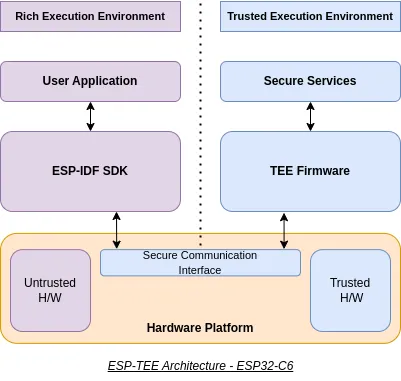

We are thrilled to announce the availability of the **ESP-TEE (Trusted Execution Environment)** framework for the **ESP32-C6**! Designed to enhance security on Espressif's SoCs, ESP-TEE enables a protected execution environment to safeguard sensitive information and operations.

<figure style="width: 80%; margin: 0 auto; text-align: center;">
    
    <figcaption>The ESP-TEE (Espressif Trusted Execution Environment) Framework</figcaption>
</figure>

## The Importance of the ESP-TEE

Security is paramount in the IoT landscape, where billions of devices exchange sensitive information daily. The ESP-TEE framework empowers developers by offering:

- **Hardware-Enforced Isolation**: The TEE ensures a secure environment where sensitive computations and data remain protected from the rest of the system (REE).
- **Feature-Rich Security**: ESP-TEE provides a comprehensive set of security features, including secure storage, secure OTA updates and attestation.
- **Compliance with Security Certifications**: The framework helps products meet the latest IoT security standards, fostering trust and reliability.
- **Added Flexibility**: Developers can separate trusted and untrusted components, improving maintainability and scalability of their solutions.

## Architecture

<figure style="width: 80%; margin: 0 auto; text-align: center;">
    
</figure>

The system resources are divided into two domains:

- The **Trusted Execution Environment (TEE)** - forms the secure sub-system and runs in Machine mode
- The **Rich Execution Environment (REE)** - contains the user application on top of ESP-IDF (including FreeRTOS) and runs in User mode

Volume 2 of the RISC-V ISA specification, or “The Privileged Spec”, defines offered privilege levels. ESP32-C6 SoC supports 2 privilege levels: **Machine (M)** and **User (U)**. Machine (M) mode being the most privileged and User (U) mode being the least.

Machine Mode hosting TEE firmware provides secure execution environment for sensitive operations. REE application runs in the untrusted domain and interacts with the TEE firmware through the Secure Communication Interface. Hardware enforced isolation is achieved using the **RISC-V architecture** primitives and the security peripherals in ESP32-C6.

## Why isolation matters

Isolation is a cornerstone of modern IoT security. By isolating sensitive operations and data in a trusted execution environment, ESP-TEE ensures that even if the main application is compromised, critical assets remain protected. This approach aligns with the latest **IoT security certifications** and compliance standards, making ESP-TEE an ideal choice for developing robust and secure IoT applications.

## ESP-TEE in action

Imagine a smart home controller managing a variety of devices—from lighting to security cameras. The controller uses cryptographic keys to authenticate devices and encrypt communications, ensuring that only authorized components participate in the ecosystem.

With ESP-TEE on ESP32-C6:

- The secure storage in TEE protects cryptographic operations and sensitive keys from unauthorized access.
- Computations involving sensitive keys are performed in TEE and the services are exposed to the REE through secure interface.
- Hardware isolation ensures that even if an untrusted component is compromised, critical data (e.g., cryptographic keys) remains safe.
- Compliance with IoT security standards strengthens user confidence in the system's reliability.
<!-- TODO[Link to an article once written]
Owner: Mahavir Jain
Note: Write an article about certifications in IoT and link to it from here
Context: Developer Portal's GitLab MR `24#note_1921355`
Tags: ESP-TEE
-->

The result? A smart home controller that complies with stringent security certifications required in IoT, building trust with end users.

## Get Started Today

1. **Learn More**: Visit the [ESP-TEE Documentation](https://docs.espressif.com/projects/esp-idf/en/latest/esp32c6/security/tee/index.html) to explore the framework's features and implementation details.
2. **Explore Examples**: Find practical use cases and sample projects in the [ESP-TEE Examples](https://github.com/espressif/esp-idf/tree/cc9fb5bd/examples/security/tee).

## Roadmap

- The framework would officially be part of ESP-IDF v5.5 release for ESP32-C6 target.
- We plan to enable more RISC-V based Espressif SoCs with the ESP-TEE framework in the future.

---

Secure your IoT applications today with ESP-TEE framework and build solutions that stand out in security, compliance, and user trust!
