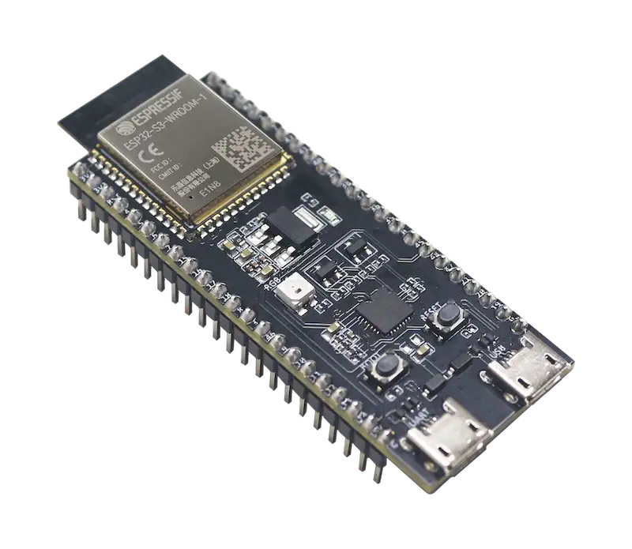

# Running Python on ESP32-S3 with NuttX

Yes, you heard it right: Apache NuttX now supports the Python interpreter on ESP32-S3!

NuttX is a platform that can run applications built with programming languages other than traditional C. C++, Zig, Rust, Lua, BASIC, MicroPython, and, now, **Python**.

## Why?

According to the [IEEE Spectrum’s 11th annual rankings](https://spectrum.ieee.org/top-programming-languages-2024), Python leads as the most utilized programming language among IEEE members, with adoption rates **over twice as high** as the second-ranked language. The [2024 Stack Overflow Developer Survey](https://survey.stackoverflow.co/2024/technology/#1-programming-scripting-and-markup-languages) reinforces this trend, reporting that Python was employed by **over 51% of developers** in the past year, cementing its position as the top-ranked language outside web-specific domains.

By integrating Python with NuttX, developers--including makers and those outside traditional embedded programming--gain access to a familiar ecosystem for building **embedded applications**, supported by Python’s vast library ecosystem and open-source tools. NuttX further complements this by offering a POSIX-compliant interface, enabling seamless porting of Python projects (which rely on POSIX APIs) and allowing Python applications to interact with hardware through socket interfaces and character drivers.

In essence, Python on NuttX creates a unified framework for hardware interaction. Developers can leverage Python scripts to directly access buses, peripherals, and other NuttX-supported hardware components.

Critics may argue that Python was never intended for resource-constrained devices (typical in NuttX RTOS environments) and, instead, advocate for alternative embedded tools. However, recent advancements--particularly Python’s optimizations for WebAssembly--have significantly reduced its memory footprint and system demands. These improvements make Python increasingly viable even for low-resource environments.

You can find more information on how (and why!) Python was ported to NuttX in this article: [Apache NuttX: Porting Python to NuttX](https://tmedicci.github.io/articles/2025/01/08/python_on_nuttx.html). Now, let's try Python on ESP32-S3!

## Building Python for ESP32-S3 on NuttX

### Hardware Requirements

A ESP32-S3 board with at least 16MiB of flash and an external PSRAM of 8MiB or more is required to run Python.

Check the [ESP Product Selector](https://products.espressif.com/) to find suitable modules providing the required flash size and memory. The example below uses the [*ESP32-S3-DevKitC-1 v1.1*](https://docs.espressif.com/projects/esp-dev-kits/en/latest/esp32s3/esp32-s3-devkitc-1/user_guide.html) board that integrates the `ESP32-S3-WROOM-2-N32R8V` module:



### Software Requirements

For those new to NuttX, we recommend reviewing the guide [Getting Started with NuttX and ESP32](../../../nuttx-getting-started) to configure your development environment for building NuttX applications.

### Compiling and Flashing

Clean any previous configuration and set the `defconfig` to enable the configurations required for building Python on ESP32-S3:

```
make -j distclean && ./tools/configure.sh esp32s3-devkit:python
```

To build and flash NuttX, run:

```
make flash ESPTOOL_BINDIR=./ ESPTOOL_PORT=/dev/ttyUSB0 -s -j$(nproc)
```

Now you can grab a coffee :coffee: (*Yes, we are building Python libraries and modules. It will take a while to build and flash*).

After compilation and flashing finish, open the serial terminal instance to interface with NuttX's *NuttShell* (NSH).

## Running Python on ESP32-S3

After successful building and flashing, run the following command to open the *NuttShell*:

```
minicom -D /dev/ttyUSB0
```

Type `help` to check the available applications on NuttX:

```
nsh> help
help usage:  help [-v] [<cmd>]

    .           cmp         fdinfo      ls          pwd         truncate
    [           dirname     free        lsmod       readlink    uname
    ?           dd          help        mkdir       rm          umount
    alias       df          hexdump     mkfifo      rmdir       unset
    unalias     dmesg       ifconfig    mkrd        rmmod       uptime
    arp         echo        ifdown      mount       set         usleep
    basename    env         ifup        mv          sleep       watch
    break       exec        insmod      nslookup    source      wget
    cat         exit        kill        pidof       test        xd
    cd          expr        pkill       printf      time        wait
    cp          false       ln          ps          true

Builtin Apps:
    nsh       ping      renew     wapi      ws2812
    ostest    python    sh        wget
```

As you can see, `python` is one of the built-in applications that can run on *NuttShell*:

```
nsh> python
Python 3.13.0 (main, Feb 17 2025, 16:20:05) [GCC 12.2.0] on nuttx
Type "help", "copyright", "credits" or "license" for more information.
>>>
```

Here we are! ESP32-S3 is running the Python interpreter as an application on NuttX :rocket:

Well, let's quit Python interpreter and experiment with Python on NuttX!

```
>>> quit()
```

### Creating a Python Script

NuttX provides a POSIX-compatible interface that can be used by Python scripts directly. Python's built-in functions like [`open`](https://docs.python.org/3/library/functions.html#open) and [`write`](https://docs.python.org/3/library/io.html#io.TextIOBase.write) can be used to open and write to a character driver directly. Also, information about the active tasks and other system information are available through the `PROCFS` filesystem mounted at `/proc/`, which can be read directly with Python's [`read`](https://docs.python.org/3/library/io.html#io.TextIOBase.read) function, for instance.

Considering that the [ESP32-S3-DevKitC-1](https://nuttx.apache.org/docs/latest/platforms/xtensa/esp32s3/boards/esp32s3-devkit/index.html#board-leds) board features a WS2812 LED (addressable RGB LED), a simple Python script could be used to monitor the CPU usage and provide an indication of the CPU load in a scale that goes from green to red when CPU usage varies from 0% to 100%.

After some prompts on *DeepSeek* (or *ChatGPT*, grab your favorite LLM!), the following script was generated:


import sys
import struct
import select

def get_cpu_load():
    try:
        with open('/proc/cpuload', 'r') as f:
            content = f.read().strip()
            # Extract numeric value and remove percentage sign
            percent_str = content.replace('%', '').strip()
            load_percent = float(percent_str)
            normalized_load = load_percent / 100.0
            return max(0.0, min(normalized_load, 1.0))
    except IOError as e:
        print(f"Error reading /proc/cpuload: {e}")
        sys.exit(1)
    except ValueError:
        print(f"Invalid data in /proc/cpuload: '{content}'")
        sys.exit(1)

def main():
    try:
        while True:
            load = get_cpu_load()

            # Calculate RGB values with proper rounding
            r = int(load * 255 + 0.5)
            g = int((1 - load) * 255 + 0.5)
            b = 0

            # Pack as BGR0 (4 bytes) for the LED
            data = struct.pack('4B', b, g, r, 0)

            # Write to device
            try:
                with open('/dev/leds0', 'wb') as f:
                    f.write(data)
            except IOError as e:
                print(f"Error writing to device: {e}")
                sys.exit(1)

            # Wait 100ms using select (instead of time.sleep)
            select.select([], [], [], 0.1)

    except KeyboardInterrupt:
        print("\nExiting...")
        sys.exit(0)

if __name__ == '__main__':
    main()


It reads CPU usage from `/proc/cpuload`, transforms it to a scale that goes from green to red, and, then, sends it to the registered character driver of the RGB LED.

Save this file on your host computer with the name `cpumon.py`, for instance.

How should we run this script on the board?

### Transfering the Python Script

We could create a ROMFS partition containing this script and then run it on NuttX. However, the **embedded application** concept is somehow related to the ability to run it without needing to reflash a device. So, can we send it through the Wi-Fi network to the board?

*Yes, we can!*

Connect the board to your Wi-Fi network:

```
nsh> wapi psk wlan0 <password> 3
nsh> wapi essid wlan0 <ssid> 1
nsh> renew wlan0
```

On the host computer, create a simple HTTP server with Python in the folder that contains the Python script to be sent:

```
python -m http.server 8080
```

Now, check if the script is available through the network by accessing the host computer's IP address (if possible, test it on a different machine). For instance, try to open in the web browser with `http://<host_computer_ip>:8080/cpumon.py`.

Once everything is set on the host side, download the Python script to the board:

```
nsh> wget /tmp/cpumon.py http://<host_computer_ip>:8080/cpumon.py
```

And, then, check if it was successfully downloaded:

```
nsh> cat /tmp/cpumon.py
import sys
import struct
import select

def get_cpu_load():
.
.
.
```

### Running the Python Script

Finally, run the Python script in the background:

```
nsh> python /tmp/cpumon.py &
python [12:100]
```

In a few seconds, the LED will show the CPU load average while the Python script is running in the background. To test it properly, create one or more instances of the `cpuload` app that increases CPU usage:

```
nsh> cpuload &
cpuload [13:253]
nsh> cpuload &
```

With 3 (three) instances of `cpuload`, the LED should be *reddish* as CPU load usage reaches nearly 90%:

```
nsh> python /tmp/cpumon.py &
python [12:100]
nsh> cpuload &
cpuload [13:253]
nsh> cpuload &
cpuload [14:253]
nsh> cpuload &
cpuload [15:253]
nsh> ps
  PID GROUP CPU PRI POLICY   TYPE    NPX STATE    EVENT     SIGMASK            STACK    CPU COMMAND
    0     0   0   0 FIFO     Kthread   - Assigned           0000000000000000 0003008  6.4% CPU0 IDLE
    1     0   1   0 FIFO     Kthread   - Assigned           0000000000000000 0003008  8.5% CPU1 IDLE
    2     0 --- 100 RR       Kthread   - Waiting  Semaphore 0000000000000000 0001928  0.0% lpwork 0x3fcaa2c4 0x3fcaa24
    3     3   1 100 RR       Task      - Running            0000000000000000 0002976  0.0% nsh_main
    4     0 --- 255 RR       Kthread   - Waiting  Semaphore 0000000000000000 0000656  0.0% spiflash_op 0x3fcd0d4c
    5     0 --- 255 RR       Kthread   - Waiting  Semaphore 0000000000000000 0000656  0.0% spiflash_op 0x3fcd0d4c
    6     0 --- 223 RR       Kthread   - Waiting  Semaphore 0000000000000000 0001944  0.0% rt_timer
    7     0 --- 253 RR       Kthread   - Waiting  MQ empty  0000000000000000 0006576  0.0% wifi
   12    12   0 100 RR       Task      - Assigned           0000000000000000 0307088 12.0% python /tmp/cpumon.py
   13    13   1 253 RR       Task      - Running            0000000000000000 0001968 26.9% cpuload
   14    14 --- 253 RR       Task      - Waiting  Signal    0000000000000000 0001960 25.1% cpuload
   15    15 --- 253 RR       Task      - Waiting  Signal    0000000000000000 0001960 22.3% cpuload
nsh> cat /proc/cpuload
 89.3%
```

The following video shows this demo: the RGB LED goes from green to red when the CPU load average goes from 0% to 100%.





## Conclusion

Running the Python interpreter on NuttX is possible mainly due to its POSIX-compatible interface. In addition to that, NuttX exposes the drivers for each board's peripherals as block or character drivers. Then, accessing the drivers is as easy as reading and writing to a file (and using the `ioctl` interface), just like any other Unix-based system.

With that in mind, building applications on Python that access boards' peripherals is just *straightforward*: relatively complex applications can be built in Python in minutes and, then, run on NuttX without the need of reflashing the device or compiling anything externally. That's why we call them *embedded applications*: those applications are developed and tested externally--on a host PC, for instance--and, once validated, they can be transferred and run on NuttX without the need of knowing the *inner* details of the NuttX RTOS because it offers a well-known interface and well-known programming language.

*Stay tuned for more updates about Python on NuttX!*

## Useful Links

- [NuttX Documentation: Python](https://nuttx.apache.org/docs/latest/applications/interpreters/python/index.html)
- [Apache NuttX: Porting Python to NuttX](https://tmedicci.github.io/articles/2025/01/08/python_on_nuttx.html)
- [NuttX GitHub](https://github.com/apache/nuttx)
- [NuttX channel on Youtube](https://www.youtube.com/nuttxchannel)
- [Developer Mailing List](https://nuttx.apache.org/community/#mailing-list)
