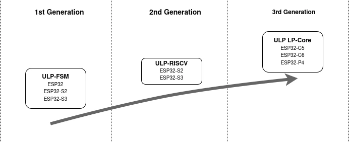

Imagine this scenario: you have finished programming your application, designed your PCB with a battery circuit, and you are finally ready to set it free by disconnecting the umbilical cord --- the USB cable. But to your great disappointment, you find too soon that your small LiPo battery drains in a matter of hours.

If you plan to run your application on a battery, it is of utmost importance to know how to design your hardware and software so that the application does not gobble up the power like a vacuum cleaner. Even something as simple as polling a GPIO can have a drastic impact on power consumption. Doing it the easiest way vs. using the chip's low-power features can result in an average difference of 22 mA vs. 22 µA. In other words, with your 350 mAh LiPo battery, it is the difference between it lasting 16 hours vs. 2 years.

In this article, we'll introduce one of the features that Espressif chips provide to achieve low-power consumption: the Ultra-Low-Power coprocessor (ULP), a processor separate from the main CPU. In a nutshell, if we run parts of our application on the ULP while the rest of the system sleeps, we can achieve much lower power consumption.

This article will focus on the latest iteration of the ULP --- the LP-Core --- available on the ESP32-C6 and a range of other new chips. For building the application, we will use ESP-IDF v5.4.

## Low-power on Espressif chips

Reducing power consumption of an application running on a microcontroller is mainly achieved through two general methods:

* Clock gating and/or power gating parts of the chip, effectively turning off parts of the chip that you don't need.
* Frequency scaling, reducing the clock frequency of the chip to lower power consumption.

All Espressif chips support both methods but with varying degrees of flexibility. Newer chips, such as the ESP32-C6, have an even more powerful Power Management Unit (PMU), allowing for much finer control over which parts of the chip can be clock-gated or powered down.

In ESP-IDF, these two power-saving methods are exposed to users through **sleep modes** and **power management**:
* [Sleep modes](https://docs.espressif.com/projects/esp-idf/en/v5.4/esp32c6/api-reference/system/sleep_modes.html): Allows for powering down parts of the chip, mainly through two different modes:
    * **Deep Sleep**: Everything except a few low-power peripherals (e.g., the LP timer responsible for waking up the chip) is powered down and the state is lost. After waking up, the chip will boot up and configure the system again, similar to a power-on reset.
    * **Light Sleep**: Most peripherals are powered down, but memory remains powered on, allowing the system to keep its state and continue executing from where it left off.
* [Power Management](https://docs.espressif.com/projects/esp-idf/en/v5.4/esp32c6/api-reference/system/power_management.html): A high-level power management interface for the main high-performance CPU that can handle both automatic frequency scaling and entering light sleep when the chip is idle.

What the ULP brings to the table in a low-power context is the ability to run even while the system is in deep sleep. This allows us to execute code and perform simple operations while keeping most of the system powered down.

## ULP

The ULP is a coprocessor that operates independently from the main CPU. Its main advantage is that it is powered and clocked by a power domain controlled seperately from the rest of the system. This allows it to continue operating even while the rest of the system is in deep sleep. For more information about power domains on the ESP32-C6, see the [ESP32-C6 TRM](https://www.espressif.com/sites/default/files/documentation/esp32-c6_technical_reference_manual_en.pdf#lowpowm) &rarr; _Low-Power Management_.

This enables us to offload certain tasks to the ULP, such as sensor readings, while waking up the main CPU only when it is necessary for some more complex task.

Imagine this scenario: you're designing a smart plant-watering IoT device that measures soil humidity and waters the plant when needed. For a simple task like this, you could use the ULP to further reduce power consumption. While the rest of the system is powered down and sleeping, the ULP can periodically wake up, take measurements, as well as trigger watering action if necessary. Only when it is strictly necessary will the ULP wake up the main CPU and the rest of the system to perform actions that it cannot do --- for example, to update the cloud with the latest device status over Wi-Fi.

To summarize what the ULP is suitable for:

*  :white_check_mark: Save power by performing simple tasks while the rest of the system sleeps
*  :x: Help you achieve lower power-consumption during Wi-Fi or Bluetooth connections
*  :white_check_mark: Assist main CPU by offloading simpler tasks

### Three generations of ULP coprocessor

As Espressif chips have evolved, so has the ULP. This article mainly focuses on the latest iteration of the ULP at the time of writing --- the ESP32-C6's LP-Core. Some of the older chips had previous iterations. All in all, the ULP iterations are as follows:



* **ULP-FSM** (ESP32, ESP32-S2, ESP32-S3) -- a simple state machine
  * Programmed using an assembly-like language
  * Able to perform simple tasks
  * Can access a limited part of the chip's memory, the low power memory.
* **ULP-RISC-V** (ESP32-S2, ESP32-S3) -- a RISC-V based CPU
  * Programmed using standard C
  * More powerful and much more approachable than the ULP-FSM
* **LP-Core** (ESP32-C6, ESP32-C5, ESP32-P4): -- even more powerful RISC-V based CPU
  * Programmed using standard C
  * Has an interrupt controller that conforms to the RISC-V standard
  * Now able to access all of the chip's memory and peripherals when the whole system is powered on;
  * Has additional low-power peripherals, including UART, SPI and JTAG debugging


As we focus on the ESP32-C6's ULP LP-Core in this article, let's review its specifications:

* 32-bit RISC-V IMAC (Integer, Multiplication, Atomic, Compressed Instructions) CPU
* 20 MHz clock frequency
* Access to 16 KB of low-power memory (LP-RAM), memory which can stay powered on during sleep
* Access to low-power peripherals: LP IO, LP-I2C, LP-UART, and LP timer while the system is in deep sleep
* Access to all of the chip's memory and peripherals when the whole system is in active mode. Enabling using the LP-Core as a generic co-processor instead of only as a low-power feature.
* JTAG debugging interface

## How to use the LP-Core

Now we know what the LP-Core is, its features, and what it can and cannot do. But how do we go about using it? How do we compile and load an application for it?

The standard way of using the LP-Core is to compile a separate application for it. This means that writing code for the LP-Core follows a slightly different workflow compared to your regular IDF apps. Luckily, ESP-IDF already integrates building LP-Core apps into its build system and provides APIs to load, run, and interact with the LP-Core to simplify this process for you!

In the following section, we will try this workflow and create your first ULP app. To understand how to structure and build a ULP app, we will:

1. Create an empty app that does nothing and build it.
2. Learn how to use the APIs provided by ESP-IDF to load and run the ULP app.
3. See how our main CPU application can interact with the ULP application and exchange information.
4. Put the main system into deep sleep and show how the ULP can wake up the main CPU.

### Building your LP-Core app


All the following code and API are based on ESP-IDF v5.4.


The files and code required for this step should look like [this](https://github.com/ESP-Marius/my_ulp_app/tree/9932761de4a425cc64f54e11334ecdf2347c34bd).

Our `main/` directory contains a folder for our LP-Core app. It is called `ulp_app/` in this case.

To be able to build an LP-Core app, we also need some scaffolding files:

1. Every C application needs an entry point: the empty `main()` function in `ulp_app/ulp_main.c` is the entry point for our LP-Core app.
2. In the project's main `CMakeLists.txt`, we've added the CMake functions needed to build the LP-Core app:

    ```cmake
    idf_component_register(SRCS "my_ulp_app.c"
                        INCLUDE_DIRS "."
                        PRIV_REQUIRES ulp)

    # LP-Core support additions to component CMakeLists.txt.
    set(ulp_app_name "ulp_hello_world")

    # Specify all C and Assembly source files.
    set(ulp_sources "ulp_app/ulp_main.c")

    # List all the component source files which include automatically generated LP-Core export file, ${ulp_app_name}.h:
    set(ulp_exp_dep_srcs "my_ulp_app.c")

    # Call function to build LP-Core binary and embed in project using the argument provided above
    ulp_embed_binary(${ulp_app_name} "${ulp_sources}" "${ulp_exp_dep_srcs}")

    ```

With these scaffolding in place, we can set up the target with `idf.py set-target esp32c6` and configure the necessary LP-Core related configs in `menuconfig`:

* **To enable building and using the LP-Core**, [`CONFIG_ULP_COPROC_ENABLED`](https://docs.espressif.com/projects/esp-idf/en/v5.4/esp32c6/api-reference/kconfig.html#config-ulp-coproc-enabled)
* **To configure the amount of LP memory to reserve for the LP-Core app**, set [`CONFIG_ULP_COPROC_RESERVE_MEM`](https://docs.espressif.com/projects/esp-idf/en/v5.4/esp32c6/api-reference/kconfig.html#config-ulp-coproc-reserve-mem). For our small application in this article the default value is sufficient, but when creating more complex apps this value might have to be increased.

Now you should have everything necessary to build our LP-Core app. Building it can be done the same way you normally build your IDF projects, e.g., with:

```bash
idf.py build
```

If the build was successful, you should now have an LP-Core app built as a separate binary in:

```bash
build/esp-idf/main/ulp_hello_world
```

It is already possible to flash the application now, but the LP-Core would not run our main function as we still need to initialize and run the LP-Core.

### Running your LP-Core app

Now that we have built the LP-Core binary, let's take a look at how to run it. The state of the project for this step will look like [this](https://github.com/ESP-Marius/my_ulp_app/tree/e6f956f13ded914b67b5cdb706f3c7dcf78a22a4).

In `my_ulp_app.c`'s main function we have added the following changes:

```c
#include "ulp_lp_core.h"

extern const uint8_t ulp_hello_world_bin_start[] asm("_binary_ulp_hello_world_bin_start");
extern const uint8_t ulp_hello_world_bin_end[]   asm("_binary_ulp_hello_world_bin_end");

void app_main(void)
{
    ulp_lp_core_cfg_t cfg = {
        .wakeup_source = ULP_LP_CORE_WAKEUP_SOURCE_LP_TIMER,
        .lp_timer_sleep_duration_us = 1000000,
    };

    ESP_ERROR_CHECK(ulp_lp_core_load_binary(ulp_hello_world_bin_start, (ulp_hello_world_bin_end - ulp_hello_world_bin_start)));
    ESP_ERROR_CHECK(ulp_lp_core_run(&cfg));

    printf("LP core loaded with firmware and running successfully\n");
}
```

To explain a bit more what is happening:

`extern const uint8_t ulp_hello_world_bin_start[]` and `.._end[]` import the addresses to where the LP-Core binary is placed in flash. The LP-Core binary was automatically included into the app binary when we built our app.

[`ulp_lp_core_load_binary()`](https://docs.espressif.com/projects/esp-idf/en/v5.4/esp32c6/api-reference/system/ulp-lp-core.html#_CPPv423ulp_lp_core_load_binaryPK7uint8_t6size_t) copies the LP-Core binary from flash into LP-RAM, which is the memory area we have reserved for the LP-Core.

[`ulp_lp_core_run()`](https://docs.espressif.com/projects/esp-idf/en/v5.4/esp32c6/api-reference/system/ulp-lp-core.html#_CPPv415ulp_lp_core_runP17ulp_lp_core_cfg_t) then finally configures the LP-Core according to our config parameters. The [`wakeup_source`](https://docs.espressif.com/projects/esp-idf/en/v5.4/esp32c6/api-reference/system/ulp-lp-core.html#_CPPv4N17ulp_lp_core_cfg_t13wakeup_sourceE) is what will trigger the LP-Core to start running, in this case we choose the LP timer, which will make the LP-Core app be re-ran periodically. This is a common use-case when we want to monitor something with the LP-Core, but we don't want it to be active all the time in order to further reduce power consumption. For more information about other wake-up sources, see [ulp-lp-core-program-flow](https://docs.espressif.com/projects/esp-idf/en/v5.4/esp32c6/api-reference/system/ulp-lp-core.html#ulp-lp-core-program-flow).

The LP-Core now has everything it needs to run, if you selected a wake-up source which has an immediate effect (e.g. `ULP_LP_CORE_WAKEUP_SOURCE_HP_CPU`) then the LP-Core will already be running. In our example we choose the `LP_Timer` with a sleep duration of 1 second, so the first run of the LP-Core app will occur one second after calling [`ulp_lp_core_run()`](https://docs.espressif.com/projects/esp-idf/en/v5.4/esp32c6/api-reference/system/ulp-lp-core.html#_CPPv415ulp_lp_core_runP17ulp_lp_core_cfg_t).


### Interacting with the LP-Core

We now have an app running on the LP-Core, but since the app is just an empty `main()`, it doesn't do anything and we haven't seen any proof that it is actually running.

If you want to see how the code look like at this stage you can find it [here](https://github.com/ESP-Marius/my_ulp_app/tree/e276668cae9a7cb186d333545e52ce2aa070926d).
Let's expand our LP-Core app to increment a variable every time it runs.

In `ulp_app/ulp_main.c`, we have updated with a counter variable that will be incremented for every run:

```c
int my_counter = 0;

int main (void)
{
    my_counter++;
}
```

Note that an LP-Core app's data and bss sections, i.e. global and static variables, are only initialized when you do [`ulp_lp_core_load_binary()`](https://docs.espressif.com/projects/esp-idf/en/v5.4/esp32c6/api-reference/system/ulp-lp-core.html#_CPPv423ulp_lp_core_load_binaryPK7uint8_t6size_t), so here `my_counter` will keep its value between every call to `main()`. The life-cycle of an LP-Core app is a bit different from your regular apps. A typical LP-Core app will boot up, perform some measurements or actions, before returning from `main()` and shutting down, waiting for the next wake-up to restart it.

Even though letting the LP-Core shut itself down is optimal from a power consumption point of view, it is of course also possible for users to never return from `main()`, keeping the LP-Core running indefinitely.

#### Observing the result

Now we will keep incrementing `my_counter` once every 1 second (the wake-up interval we configured), but how do we monitor the results? The HP CPU is also able to access the LP memory the LP-Core runs from, so it is just a matter of getting the address of the variable. To simplify this ESP-IDF will automatically generate a header file, `ulp_app_name.h` which exports all of the global symbols in the LP-Core app.

In `my_ulp_app.c`, we've added some code to continuously print the value of the counter to the console.

```c
while(1) {
    printf("ulp counter: %lu\n", ulp_my_counter);
    vTaskDelay(300 / portTICK_PERIOD_MS);
}
```

We have also included the autogenerated `ulp_hello_world.h` to gain access to the exported variable from the LP-Core app.

```c
#include "ulp_hello_world.h"
```

Rebuild and flash your software and voila:




We finally have the proof that the LP-Core is running independently and doing what we expect it to do!

### Putting the system to sleep

We've been talking about how to reduce power consumption, but until now all we have done is just add one more module, the LP-Core, which runs in parallel with everything else on the chip, consuming even more power!

The last missing part of the puzzle is putting the rest of the system to sleep while the LP-Core works. Most applications will eventually want to wake up the main processor to perform tasks which the LP-Core isn't suited for, so we'll also add the LP-Core as a wake-up source for the HP-CPU.

The final version of our application will now be [this](https://github.com/ESP-Marius/my_ulp_app/tree/e8f5b847c1ec95cabedf03d211e272d6c17556f2).

In `my_ulp_app.c`, we have replaced the printing of the counter variable with code to put the system into deep sleep:

```
/* Enable the LP-Core to wakeup the rest of the system */
ESP_ERROR_CHECK(esp_sleep_enable_ulp_wakeup());

// Go into to deep sleep
esp_deep_sleep_start()
```

We have also added a check and a print for the case when the wake-up is caused by the LP-Core as the first action after entering `main()`:

```c
if (esp_sleep_get_wakeup_cause() == ESP_SLEEP_WAKEUP_ULP) {
    printf("Wake-up cause was: ESP_SLEEP_WAKEUP_ULP\n");
}
```

And as a final step, we've modified our LP-Core code in `ulp_app/ulp_main.c` to include waking up the HP-CPU:

```
if (my_counter >= 5) {
    ulp_lp_core_wakeup_main_processor();
}
```

Since we configured the LP timer to wake up the LP-Core with a period of 1 sec, then this condition means that we will wake up the main processor on the 5th iteration, i.e., after 5 seconds.

If you now rebuild and re-flash your project, you'll see that the HP-CPU resets once every 5 second with the reset reason `rst:0x5 (SLEEP_WAKEUP)`.



### Measuring power consumption

By connecting any device that can measure power consumption, we can get a better idea of what is happening when our code is running.



We can see two spikes in the measured power consumption, separated by approximately 5 seconds of low power consumption. These two spikes are when the HP-CPU is active, as expected our LP-Core application wakes it up every 5 seconds.



Zooming in on one of the high-activity sections, we can see the power consumption for the ESP32-C6 when booting up, running the ROM bootloader, followed by the secondary bootloader before finally booting our application and going into deep sleep. Without any optimization for start-up time, the whole process takes about 200 ms. Optimizing for start-up time is often important in low-power applications as any time spent booting is time not spent sleeping. For more information on how to do this, see:

* [ESP-IDF start-up time example](https://github.com/espressif/esp-idf/tree/master/examples/system/startup_time)
* [ESP-Techpedia: Startup Time Optimization](https://docs.espressif.com/projects/esp-techpedia/en/latest/esp-friends/advanced-development/performance/reduce-boot-time.html)

If we look at the period of low power consumption when the HP-CPU is sleeping we see the following:


There are spikes of activity every one second, which is the wake-up interval for our LP-Core. During these short wake-ups the whole system is consuming approximately 20 µA. Between the wake-ups, both the LP-Core itself, HP-CPU, and almost all of the system is powered down, and we achieve the lowest possible power consumption: 10 µA.

## Wrapping up

Now you should know the basics of what the LP-Core can do as well as how to get started programming it.

Stay tuned at the developer portal for more ULP related content!

## Additional resources

* [ESP-IDF LP-Core Documentation](https://docs.espressif.com/projects/esp-idf/en/v5.4/esp32c6/api-reference/system/ulp-lp-core.html)
* [LP-Core examples](https://github.com/espressif/esp-idf/tree/release/v5.4/examples/system/ulp/lp_core)
* [How to measure power consumption for Espressif modules](https://docs.espressif.com/projects/esp-idf/en/v5.4/esp32c6/api-guides/current-consumption-measurement-modules.html)
