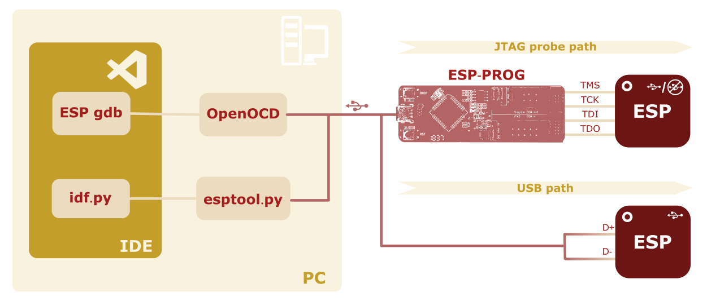

## Introduction

Debugging is a critical part of the development process, especially when working with embedded systems. It allows developers to identify and fix errors, ensuring that the firmware interacts correctly with the peripherals and the external hardware. While there are several ways to debug code, the most powerful method is to use a _debugger_, which provides real-time insights into how the code runs on the hardware.

Many developers start with basic debugging, often using `printf` statements to track program flow and check variable values. While helpful, this method has major limits. Printf-based debugging forces you to change the code and recompile it each time you test something new. In contrast, debuggers let you step through code, inspect memory, and set breakpoints without touching the source.

In this guide, we'll walk through the steps necessary to set up debugging for Espressif devices using [Visual Studio Code](https://code.visualstudio.com/) (VS Code) and the [ESP-IDF Extension](https://docs.espressif.com/projects/vscode-esp-idf-extension/en/latest/). The ESP-IDF Extension manages the whole toolchain, but knowing the tools it uses, like `openOCD` and `gdb`, gives you more control and helps you fix problems that may arise along the way.

This guide will show you the two available hardware paths to debug Espressif devices (JTAG pins and USB pins) and the interacting tools which make debugging possible. 

This article has two parts.
In this first part, we will explain the debugging process, describe the tools, set up the hardware, and start the `openOCD` server. 
In the second part, we will run `gdb` and explore its options for debugging the code.

In the rest of the article, we’ll use “Espressif device" to refer to both the modules and SoCs, since the steps below apply to both.

__Prerequisites__

Before you begin, make sure you have the following:

- An Espressif development board based on one of the following series: **ESP32-C3**, **ESP32-C6**, or **ESP32-S3**

- Either an _expendable_ USB cable (that supports data transfer) or the [**ESP-PROG**](https://docs.espressif.com/projects/esp-iot-solution/en/latest/hw-reference/ESP-Prog_guide.html#introduction-to-the-esp-prog-board) debug probe

- Visual Studio Code (VS Code)  
  _If not installed, follow the [installation instructions](https://code.visualstudio.com/docs/setup/windows)_

- ESP-IDF Extension for VS Code  
  _If not installed, follow the [setup instructions](https://github.com/espressif/vscode-esp-idf-extension?tab=readme-ov-file#esp-idf-extension-for-vs-code)_

 - Ability to use ESP-IDF extension for VS Code to build, flash, and monitor a simple example project, such as `blink` or `hello_world`   
  _If you're unsure, check [Create an ESP-IDF Project](https://docs.espressif.com/projects/vscode-esp-idf-extension/en/latest/startproject.html#create-an-esp-idf-project)_


## Debugging process

The debugging process requires several tools working together. You interact with the IDE, which manages the compiler, the debugger and the flasher (software) tool. The flasher tool communicates to a (hardware) programmer which can upload the firmware to the flash memory of the microcontroller and manage JTAG interactions. 


With USB enabled devices, the programmer/debugger is built into the SoC (but remains external to the workstation). 


You can find an overview of the debugging process in Fig. 1.

<!--  -->


We will use VSCode IDE with `ESP-IDF Extension`, which manages the following tools for both flashing and debugging:

* __Compiling and flashing__: The extension uses [`idf.py`](https://docs.espressif.com/projects/esp-idf/en/latest/esp32/api-guides/tools/idf-py.html#idf-frontend-idf-py), which is a CLI front-end tool which takes care of the compilation ([CMake/ninja](https://docs.espressif.com/projects/esp-idf/en/stable/esp32/api-guides/build-system.html#using-the-build-system)) and the flashing ([esptool.py](https://github.com/espressif/esptool?tab=readme-ov-file#esptoolpy)) processes. 
* __Debugging__: The extension connects seamlessly with `esp-gdb` which derives from the venerable [GNU Debugger](https://en.wikipedia.org/wiki/GNU_Debugger) (gdb). The `esp-gdb` interfaces with a forked version of `openOCD` called [`openocd-esp32`](https://github.com/espressif/openocd-esp32) which supports newly released SoC series sooner than the original `openOCD`. We will use the terms `openocd-esp32` and `openOCD` interchangeably. The same goes for `esp-gdb` and `gdb`.  


With older ESP-IDF plugin versions, you needed to install openOCD separately. Now it comes directly with ESP-IDF plugin. 


__Testing openOCD availability__

Let's check if your version of VS Code extension comes with `openOCD` installed. 


Most commands in VSCode are executed through the _Command Palette_, which you can open by pressing `CTRL+SHIFT+P` (or `CMD+SHIFT+P` if you're on mac-os). In this guide, commands to enter in the _Command Palette_ are marked with the symbol __`>`__ . 


* Lauch VS Code.
* Open a new Terminal.    
  &gt; `ESP-IDF: Open ESP-IDF-Terminal`
* In the terminal type 
  ```bash 
  openocd --version
  ``` 

You should read something like
```bash
Open On-Chip Debugger v0.12.0-esp32-20241016 (2024-10-16-14:27)
```

Now that we ensured we're using an updated IDE, let's set up the hardware. 

## Hardware for debugging

Espressif devices usually require separate hardware for flashing and debugging via JTAG. By default, you flash Espressif devices using the serial port (UART0) which does not support JTAG.
Note that most of Espressif development boards do __not__ include a JTAG probe. A notable exception is the [ESP32-WROVER-KIT](https://docs.espressif.com/projects/esp-dev-kits/en/latest/esp32/esp-wrover-kit/user_guide.html#functionality-overview). They only offer a USB-to-UART connection for flashing and monitoring.

To debug an development board—or any Espressif-based board—you have two options:

1. JTAG over JTAG pins (with a JTAG probe) -- briefly described below for completeness
2. JTAG over USB pins -- used in the rest of the article


All Espressif devices support the first option. The second option works only with USB-equipped devices, such as the ESP32-S3 or ESP32-C3. Although both options are shown, in the rest of the article, we will use the JTAG over USB pins option.

### JTAG over JTAG pins

To debug using the JTAG pins, you first need a JTAG probe. Espressif offers a probe called [ESP-PROG](https://docs.espressif.com/projects/esp-iot-solution/en/latest/hw-reference/ESP-Prog_guide.html), whose JTAG connector is shown in Fig.2. 

<!--  -->



To enable JTAG programming, connect the four pins `TMS`, `TCK`, `TDO`, `TDI` of the JTAG probe to the corresponding Espressif module pins. 

In the table below, you can find the pins for three common modules.

|JTAG|ESP-PROG|ESP32-C3-MINI-1|ESP32-S3-WROOM-1|ESP32-C6-WROOM-1
|---|---|---|---|---|
|__TMS__|ESP_TMS|GPIO 4|GPIO 42|GPIO 4|
|__TCK__|ESP_TCK|GPIO 6|GPIO 39|GPIO 6|
|__TDO__|ESP_TDO|GPIO 7|GPIO 40|GPIO 7|
|__TDI__|ESP_TDI|GPIO 5|GPIO 41|GPIO 5|

For other modules, consult the _Pin Description_ section of the datasheet and look for `MTMS`, `MTCK`, `MTDO`, `MTDI` pins. 

The JTAG peripheral is generally enabled by default and can be [disabled in production](https://docs.espressif.com/projects/esp-idf/en/latest/esp32s3/security/security.html#debug-interfaces) and for security reasons using the appropriate eFuses (`EFUSE_DISABLE_JTAG` or `EFUSE_HARD_DIS_JTAG` depending on the SoC series).

While the ESP-PROG works with most Espressif devices, it requires additional hardware and uses up to four pins. In newer cores, you have a second option via USB, as shown Debugging workflow illustration in Fig.1. 

### JTAG over USB

Most newer Espressif SoC series integrate the USB peripheral and it can be used for JTAG debugging. 
Take a thick usb cable (designed for both charging and data transmission) and strip it using a wire stripper or a pair of scissors. You should see the four wires inside, as shown in Fig.3.  

<!-- 
 -->



Now connect `GND` , `D+` and `D-` to the corresponding Espressif module pins. 
If you're using an development board you can connect `VCC` to the `+5V` of the pin (__not__ the `3v3` pin!).


USB supply pin is about 5V. To power your board with it, connect VCC to the input of an LDO regulator that outputs 3.3V for the Espressif module.


In the table below, you can find the pins for three common modules.

||ESP32-C3-MINI-1|ESP32-S3-WROOM-1|ESP32-C6-WROOM-1|
|---|---|---|---|
|__D+__|GPIO 19|GPIO 19|GPIO 13|
|__D-__|GPIO 18|GPIO 20|GPIO 12|

For other modules, consult the _Pin Description_ section of the datasheet and look for `USB_D+` and `USB_D-`. 

Now that the hardware is ready, we can move back to the IDE. We will use the JTAG over USB pin option. 

## OpenOCD connection

OpenOCD uses a server-client model to debug embedded systems. The OpenOCD server connects to the target hardware through a debug adapter (usually via JTAG). It exposes a _network interface_ that clients, such as `gdb` or `telnet`, can use to send commands or load code.

<!-- Now, we create a project and set the connection between `gdb` and `openOCD`. The steps below apply to every Espressif module and SoCs, but the specific detail is given for the ESP32-C3-Mini-1-N4 connected via USB pins.  -->

Next, we'll start the openOCD server and test the connection with the hardware. The steps below are for an ESP32-C3 board, but you can easily adjust them for your module. We will use the JTAG over USB pins option. If you're using the ESP-PROG, modify steps 2 and 3 accordingly.

1. Create a project from the `hello_world` example.   
  _If you're unsure, please check [the documentation](https://docs.espressif.com/projects/vscode-esp-idf-extension/en/latest/startproject.html#using-esp-idf-new-project)_
2. &gt; `ESP-IDF: Select Port to Use (COM, tty, usbserial)` - Choose the port you're connected to. You may find the SoC name and package next to the correct option (e.g. ESP32-C3 (QFN32) (revision v0.3))
3. &gt;`ESP-IDF: Set Espressif Device target` &rarr; `esp32c3` &rarr;`ESP32-C3 chip (via Built-in USB-JTAG)`   
    ("`esp32c3`" should now appear at the bottom left corner)
4. &gt;`ESP-IDF: Select OpenOCD Board Configuration`&rarr;`ESP32-C3 chip (via Built-in USB-JTAG)`
5. &gt;`ESP-IDF: OpenOCD Manager` &rarr; `Start OpenOCD`


The `Scan for kits` notification may appear. You can allow it to automatically set up the port and board, but be sure to check the result!


After completing the steps, you should see:
```bash
Open On-Chip Debugger v0.12.0-esp32-20241016 (2024-10-16-14:27)
Licensed under GNU GPL v2
For bug reports, read
	http://openocd.org/doc/doxygen/bugs.html
debug_level: 2

Info : only one transport option; autoselecting 'jtag'

Info : esp_usb_jtag: VID set to 0x303a and PID to 0x1001
Info : esp_usb_jtag: capabilities descriptor set to 0x2000

Info : Listening on port 6666 for tcl connections
Info : Listening on port 4444 for telnet connections

Info : esp_usb_jtag: serial (84:F7:03:42:8C:A8)

Info : esp_usb_jtag: Device found. Base speed 40000KHz, div range 1 to 255

[...]

Info : [esp32c3] Examination succeed
Info : [esp32c3] starting gdb server on 3333
Info : Listening on port 3333 for gdb connections
```

Congratulations, `openOCD` server is now waiting for a connection. In the second part, we'll start `gdb` and connect to it. 

### Troubleshooting 

Some issues may have logs that are hard for beginners to understand. Below are two common problems and how to fix them.

#### Address already in use

You could gets
```bash 
❌ Error: couldn't bind tcl to socket on port 6666: Address already in use
```
it means that `openOCD` is already running. To close it, you have to:

* Open an ESP-IDF terminal: `≫ESP-IDF: Open ESP-IDF Terminal` 
* Find the process number: `ps aux | grep openocd` (e.g. 13819)
* Kill the process: `kill <process-nr>` (e.g. `kill 13819`)

####  Could not find or open device

You could get
`Error: esp_usb_jtag: could not find or open device (ESP32-S3-DevKitC-1) (OCD-631) #219`

it may mean that the firmware inside the board does not expect the connection. 

You may need to 
* Build the project   
  &gt; `ESP-IDF: Build your project`.
* Flash the firmware   
  &gt; `ESP-IDF: Flash (UART) your project`.  

If you followed the steps above, the flashing is performed via the JTAG peripheral through the USB pins.

If it's still not working, connect your board via UART0 pins (which in an development board can be accessed using the development board USB port)
* Choose the right port   
  ≫ `ESP-IDF: Select Port to Use (COM, tty, usbserial)`
* Flash it again   
  &gt; `ESP-IDF: Flash (UART) your project`.  

## Conclusion

In this tutorial, you learned how to connect your Espressif module via JTAG and start the openOCD server. In part two, we'll launch `gdb` and explore the code using various commands.
