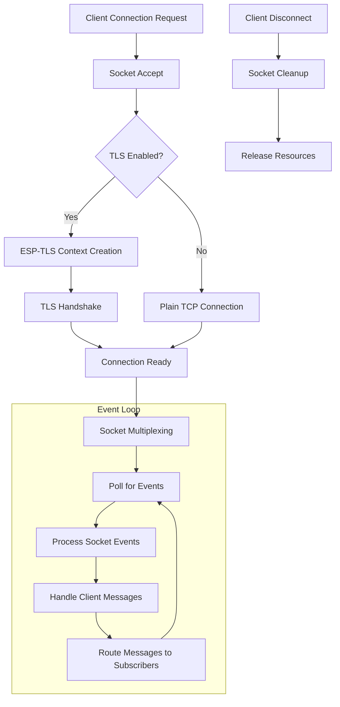

## Introduction
Traditionally, MQTT brokers run in the cloud or on powerful servers. But what if we could run them directly on IoT devices?

The lightweight implementation of the popular Eclipse Mosquitto&trade; broker makes this possible. Ported to ESP-IDF, this version brings MQTT broker functionality to edge devices and reduces the need for always-on external infrastructure.

Optimized for the limited resources of the ESP32, this port maintains the core features of Eclipse Mosquitto and benefits from its feature completeness, configurability, extensibility, and portability. Running this MQTT broker directly on the device reduces latency, enhances privacy by keeping data local, and allows for fully autonomous IoT networks -- even in the absence of internet connectivity.


### Key features
- Supports TLS transport (based on ESP-TLS)
- Supports plain TCP transport
- Single listener configuration (only one transport at a time)


## Use cases of running an MQTT broker on IoT devices
While it is possible to run an MQTT broker on IoT devices, what are the use cases and considerations? Let's explore three interesting scenarios where running the broker on an IoT device is particularly beneficial.

### Local broker for private IoT networks
One powerful use case is running a local Mosquitto broker on the ESP32 to serve local IoT devices within a private network segment:
- Create an independent home automation hub that works even when internet connectivity fails
- Integrate with platforms like ESP-Home, Home Assistant, or custom IoT devices
- Enhance privacy by keeping all data within the local network


### Testing on target
Another use-case is testing MQTT applications directly on the ESP32. By running both the client and broker on the same chip, developers can:
- Develop and test MQTT-based applications without external dependencies
- Simulate complex MQTT interactions in a controlled environment
- Debug communication issues in isolation before deploying to a production environment
- Create self-contained test fixtures for IoT product validation


### Bridged brokers over P2P networks
The [serverless MQTT example](https://github.com/espressif/esp-protocols/tree/master/components/mosquitto/examples/serverless_mqtt) demonstrates how two ESP32 devices running Mosquitto can create a synchronized broker system over peer-to-peer connections:
- Connect IoT devices across separate private networks without requiring cloud infrastructure
- Synchronize two local MQTT networks across the internet using secure peer-to-peer connections
- Create resilient IoT networks that can operate across geographical locations
- Enable MQTT communication between networks separated by NATs or firewalls


## Technical specifications
- **Memory Footprint**:
  - Program memory: ~60 kB
  - Stack size: Minimum 5 kB (recommended)
  - Heap usage: ~2 kB on startup, ~4 kB per connected client
- **Connectivity**: TCP or TLS transport
- **API**: Simple C API with broker configuration structure
- **Dependencies**:
  - ESP-IDF components: newlib, esp_timer, esp_tls (for secure TLS connections)
  - Managed components: sock_utils (for porting)


## Implementation details
The MQTT broker is implemented as a port of the original Mosquitto codebase. It follows a single-threaded, event-driven architecture that efficiently handles multiple connections through socket multiplexing. The core of this implementation consists of a number of key components covered below.

### Socket multiplexing
The broker uses an abstracted multiplexing layer that utilizes polling implementations with:
- **Mux Layer**: An abstraction layer (`mux.c`) that provides common interface functions for socket multiplexing
- **Poll Implementation**: Uses standard `poll()` mechanisms for handling multiple file descriptors

### Event loop
The main broker loop (`loop.c`) performs the following operations:
1. Processes incoming client connections
2. Handles socket read/write events
3. Manages client keepalive tracking
4. Processes message queues and subscriptions
5. Handles disconnections and cleanup

### ESP-IDF integration
The port includes a custom implementation (`net__esp_tls.c`) that integrates ESP-TLS for secure connections, which handles TLS context initialization and manages secure socket connections.
ESP-TLS is an internal component of ESP-IDF providing simplified and abstracted access to security related APIs, you can read more about it in the official [ESP-IDF documentation](https://docs.espressif.com/projects/esp-idf/en/stable/esp32/api-reference/protocols/esp_tls.html).

### Simplified message handling


## How to use the MQTT broker in your project
To use the ESP32 Mosquitto Port in your projects, you'll need to download the [mosquitto component](https://components.espressif.com/components/espressif/mosquitto) and initialize the broker with appropriate configuration settings. It is important to provide sufficient stack space for the running task.

### Start from an existing example
Use the below command to create a new project from the simple broker example
```
$ idf.py create-project-from-example "espressif/mosquitto:broker"
```

Configure the project with:
```
$ idf.py menuconfig
```

In the appeared configuration menu:

- Go to `Connection` and choose the preferred connection
- Go to `Example` and choose the example transport (TLS or plain TCP)
Then build and flash normally with:
```
$ idf.py build flash monitor
```

### Use the broker in your project
Add mosquitto component to your project dependency with:
```
$ idf.py add-dependency "espressif/mosquitto"
```

Configure the broker and start it in your application:

```c
struct mosq_broker_config config = {
    .host = "0.0.0.0",  // Listen on all interfaces
    .port = 1883,       // Standard MQTT port
    .tls_cfg = NULL     // No TLS in this example
};

// Start the broker (runs in the current task)
mosq_broker_run(&config);
```

## Future development
The ESP32 Mosquitto Port is designed to be expanded with additional features in future releases, supporting:
- Plugins and configuration files to extend broker functionality
- WebSocket and Websocket Secure transports

## License information

The ESP32 Mosquitto Port is licensed under the dual Eclipse Distribution License (EDL) and Eclipse Public License (EPL). These licenses ensure that the software remains free and open-source while providing clear terms for usage, modification, and distribution.

- **Eclipse Distribution License (EDL)**: A BSD-style license that allows for commercial use, modification, distribution, and private use with minimal restrictions.
- **Eclipse Public License (EPL)**: A copyleft license that requires any distributed modifications to also be licensed under the EPL.

For full license details, please refer to the LICENSE files included in the source code repository:
- [edl-v10](https://github.com/espressif/esp-protocols/blob/mosq-v2.0.20_2/components/mosquitto/edl-v10) - Eclipse Distribution License version 1.0
- [epl-v20](https://github.com/espressif/esp-protocols/blob/mosq-v2.0.20_2/components/mosquitto/epl-v20) - Eclipse Public License version 2.0

## Resources

- [Official Mosquitto documentation](https://mosquitto.org/)
- [ESP32 Mosquitto component](https://components.espressif.com/components/espressif/mosquitto)
- [ESP32 Mosquitto port development repository](https://github.com/espressif/esp-protocols/tree/master/components/mosquitto)
- [Brokerless MQTT example](https://github.com/espressif/esp-protocols/tree/master/components/mosquitto/examples/serverless_mqtt)

<div style="font-size: 0.8em; color: #888; margin-top: 2em;">
Eclipse, Eclipse Mosquitto, and the Eclipse Foundation logos are trademarks of Eclipse Foundation, Inc.
</div>
