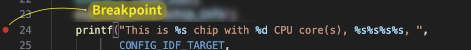
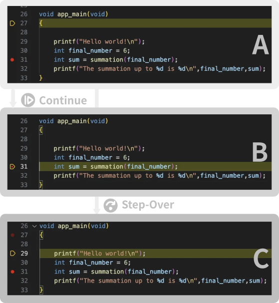
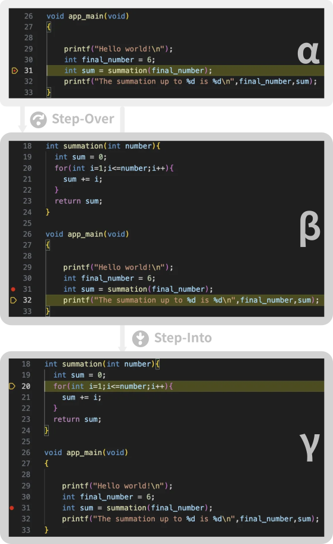

## Introduction

In the first part, we introduced the essential tools for firmware debugging and explained how to establish an `openOCD` connection with the Espressif device. 

In this second part, we'll launch a debugging session, step through the code using navigation commands, and inspect variables in real time. By the end of this tutorial, you'll have a solid understanding of what a debugger can do and why it's often the most effective tool for diagnosing and fixing malfunctioning firmware.

In this article, we will:
1. Get an overview of the debug window and available commands.
2. Learn the differences between key debugging navigation commands.
3. Explore the tools available for inspecting variables.

__Prerequisites__

This article is the second part of a series. For the setup, please refer to the [first part]().
<!-- 
Before you begin, make sure you have the following:

- Visual Studio Code (VS Code) installed  
  _Otherwise follow the [installation instructions](https://code.visualstudio.com/docs/setup/windows)_

- ESP-IDF Extension for VS Code  
  _If it’s not installed, follow the [setup instructions](https://github.com/espressif/vscode-esp-idf-extension?tab=readme-ov-file#esp-idf-extension-for-vs-code)_

- Ability to build, flash, and monitor a simple example project, such as `blink` or `hello_world`   
  _If you're unsure, check [the esp-idf guide](https://docs.espressif.com/projects/vscode-esp-idf-extension/en/latest/startproject.html#create-an-esp-idf-project)_

- An Espressif evaluation board based on one of the following series: **ESP32-C3**, **ESP32-C6**, or **ESP32-S3**

- A working openOCD connection with your target.  -->

## Debug window overview

A debugger gives you control over how a program runs, letting you pause execution, inspect variables, and step through code one instruction at a time. This level of control is what sets debugging apart from simply running the program normally.

### Breakpoint

One way to use this control is by stepping line by line through the code, watching how variables change and how the program flows. While this can be helpful, it quickly becomes impractical in larger programs. Instead, it's often more effective to let the program run freely until it reaches a specific point of interest. That’s where __breakpoints__ come in. A breakpoint pauses execution at a defined line, giving you the opportunity to examine the program's state and decide what to do next.


### Starting a debugging section

In this first debugging session, we'll set a breakpoint and reach it using the first navigation command: `Continue`.

* Open `hello_world_main.c` from the `hello_world` example project.  
  _If the project isn't open yet, refer to the [first part]() of this article._
* Click on line __24__ to set a breakpoint. A red dot will appear next to the line number (see Fig. 1).
* Press `F5` (or go to __Run → Start Debugging__). This starts the debugging session.  
  _If a dropdown menu appears instead, check that a `launch.json` file exists in the `.vscode` folder. You can find a basic `launch.json` [here](https://gist.github.com/FBEZ/90aacea6f32110b10e43391fdaf38a1e)._
* Hit `F5` again (`Continue`) to reach the breakpoint (see Fig.2).

<!--   -->





### Navigation commands explanation

In the debugging interface, the available commands are located in the top-right corner. They are:

Here's the polished version of your list:

- __`Continue`__: Runs the code until the next breakpoint is reached.
- __`Step Over`__: Executes the current instruction or the entire function, then moves to the next instruction at the same level.
- __`Step Into`__: Executes the current instruction (like `Step Over`), but if it's a function call, it enters the function and allows you to debug it line by line.
- __`Step Out`__: Executes the remaining code in the current function and exits to the calling function.
- __`Restart`__: Restarts the debugging session from the beginning.
- __`Disconnect`__: Disconnects from `openOCD`, effectively stopping the debugging session.


All the commands are self-explanatory, except for the subtle yet important difference between `Step Over` and `Step Into`.

In other words, `Step Into` allows you to enter a function call and debug it line by line, while `Step Over` executes the entire function without stepping into it, moving directly to the next line in the current function.

## Navigation commands

Now, let's put the navigation commands into action to see how they work in practice.

In the remainder of this section, we will:
1. Modify the `hello_world_main.c` example.
2. Start a new debugging session.
3. Explore the difference between `Continue` and `Step Over`.
4. Examine the difference between `Step Over` and `Step Into`.

### Modifying `hello_world_main.c`

Let's add a simple summation function before the main function `void app_main(void)`:
```c
// Function to calculate the summation of all integers from 1 to 'number'
int summation(int number){
  int sum = 0;
  for(int i=1;i<=number;i++){
    sum += i;
  }
  return sum;
}
```
And change the `void app_main(void)` content to

```c
void app_main(void)
{
    printf("Hello world!\n");
    int final_number = 6;
    int sum = summation(final_number);
    printf("The summation up to %d is %d\n",final_number,sum);
}
```

Your `hello_world_main.c` should now look like [this gist](https://gist.github.com/FBEZ/cb3e5f940c220fbd6bdd2c1e432898c1).

### Start a new debugging session

Now, let's start a new debugging session:
* Save the updated `hello_world_main.c` file.
* Set a breakpoint at the line `int final_number=6`.
* Press `F5` to begin the debugging session. Your screen should now resemble Scr.A, as shown in Fig.1. 

The debugger stops execution at the beginning of the `app_main` function and waits for commands. 


### `Continue` vs `Step Over`

Let's look at the difference between `Continue` and `Step Over` with the help of Fig. 3.

<!--   -->


1. `Continue` (`F5`) -- _Scr A &rarr; Scr B_   
   _Execution proceeds normally until it reaches the breakpoint we previously set._
2. `Step-Over` (`F10`) -- _Scr A &rarr; Scr C_   
   _The debugger executes the current line and then moves to the next line in the same function._


Before moving on, let's restart the debugging session. 

__Restarting the debugging session__

* Press &#x21E7;+`F5` to exit the debugging session.
* Press `F5` to enter a new debugging session   
   _We are in Scr A (Fig. 3) again_ 
* Press `F5` again to reach the breakpoint   
   _We're now in Scr. B (Fig. 1) which is the same as  Scr. &alpha; (Fig.4)_ 

### `Step Over` vs `Step Into`

Let's now look at the difference between `Step Over` and `Step Into` with the help of Fig. 4.

 <!--   -->


Since the current line in Scr. &alpha; involves a function call, it's the perfect case to highlight the difference between `Step Over` and `Step Into`.

* `Step-over` (`F10`) -- Scr. &alpha; &rarr; Scr. &beta;   
   _The function is executed, and the debugger moves to the next line in the current function._ 
* `Step-into` (`F11`) -- Scr. &alpha; &rarr; Scr. &gamma;    
  _The debugger steps __into__ the function, allowing you to inspect it line by line._

To continue inspecting the function, you can keep using the `Step Over` command. When you're ready to exit the function call, you have two options:

* __`Step Out`__ (⇧+`F11`) — Scr. &beta;   
  _Executes the remaining lines of the function and resumes at the line following the function call._

* __`Continue`__ (`F5`) — Scr. &alpha;  
  _Resumes execution until the next breakpoint is hit._

These navigation commands help you move through your code with precision. Next, let’s look at how to inspect variables during debugging.

## Inspecting variables

So far, we've navigated the code flow, but without inspecting variables, it's hard to grasp what's really happening.

In this section, we'll look into the inspecting variables tools with the help of Fig.5. 

 <!--   -->



Let's start a new debugging session and reach the line `sum += i`. 

__Restarting the debugging session__

* Press &#x21E7;+`F5` to exit the debugging session.
* Set a breakpoint at line `sum += i`
* Press `F5` to enter a new debugging session   
* Press `F5` again to reach the breakpoint 


As you know by now, we have a few options to get to the `sum +=1` line. The easiest one (followed above) is to set a breakpoint on the line and use `Continue`. 


### Available inspection tools

At this point of the code, three variables are defined : `number`, `i` and `sum`. The next step is to read their value. 

You can inspect the variable in three places:
1. In the _VARIABLES_ pane under _Local_ on the left (see Fig 5)
2. In the _DEBUG CONSOLE_, by typing the variable name and hitting `Enter` &#x23CE;
3. By adding them to the _WATCH_ pane

_VARIABLES_ displays all variables currently defined in the function scope, including local variables, global variables, and register values.

_DEBUG CONSOLE_ is the most convenient tool for quick inspections. Use it to evaluate expressions and examine memory.

_WATCH_ is useful for monitoring variables and expressions you want to track. Just click the + icon on the right side of the pane (see Fig. 5).

#### VARIABLES pane

When the breakpoint is first reached, _VARIABLES_  &rarr; _Local_ displays:
```bash
sum = 0
i = 1
```

Remember, the core hasn't executed the highlighted line yet—that's why `sum` is still 0.

Pressing `Continue` (`F5`) again results in what we expect to see:

```bash
sum=1
i=2
```

#### DEBUG console

Among the available methods to view variable values during execution, the _DEBUG CONSOLE_ --- highlighted at the bottom of Fig.5 - is the most flexible.

At any moment during the debugging session, you can write an expression in the _DEBUG CONSOLE_ which is evaluated when hitting `Enter` &#x23CE;. 

Type `(sum+1)*2` on the _DEBUG CONSOLE_ (next to the `>` sign, as shown in Fig. 5). As expected, you will get `4`.

#### WATCH pane

As a final step, let's explore the _WATCH_ tool. It allows you to enter full expressions, just like in the _DEBUG CONSOLE_. These expressions are saved and automatically evaluated in every debugging session, with their current values shown.

To see the _WATCH_ pane in action:
* Click `+` on the right side of _WATCH_ pane. A text input "Expression to watch" appears. 
* Type `sum*sum` inside of the text input
* Start a new session (&#x21E7;+`F5` followed by `F5`)
* Hit `F5` again to reach the breakpoint

In the _WATCH_ pane a `sum*sum= 0` appeared.

This field is updated according to the expression value. Press `F5` repeatedly to generate the sequence `0, 1, 9, 36, ...` which corresponds to the square of the sum. 


The calculation is performed in the IDE, not on the core. 


## Conclusion

In this second part, we explored the various functions of the debugger. We first examined different ways to navigate through the code and highlighted the differences between `Continue`, `Step-into`, and `Step-over`. Then, we focused on tools for inspecting variables, including the _DEBUG CONSOLE_, the _VARIABLES_ pane, and the _WATCH_ tool. With these tools at your disposal, you're now equipped to enhance your coding efficiency, identify issues more easily, and improve the overall quality of your code.
