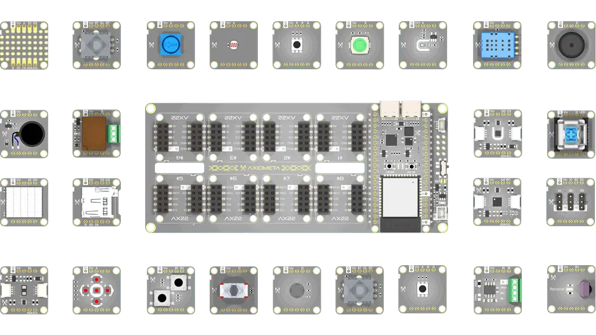
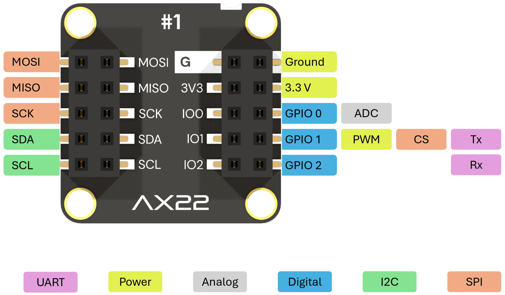
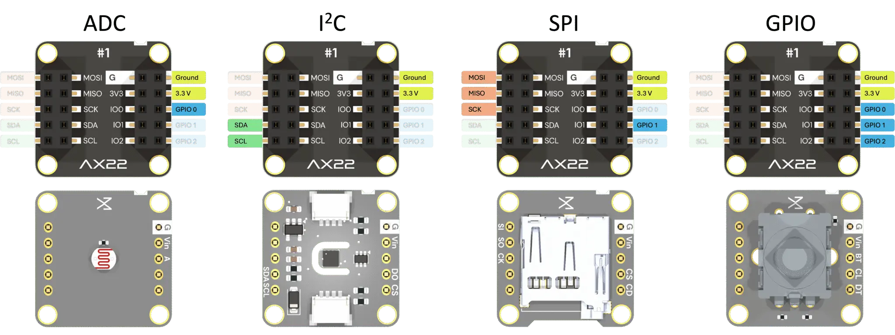
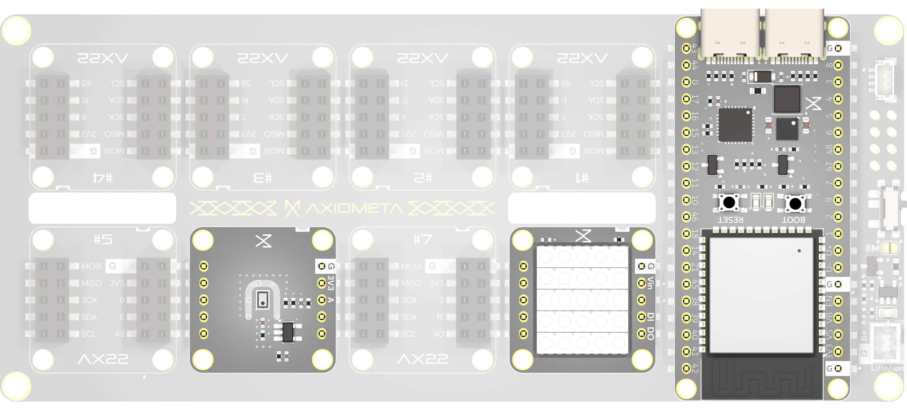

## Meet Genesis

**Genesis IoT Discovery Lab** is a hands-on modular kit powered by the **ESP32-S3-WROOM-1-N8R2**, designed for quick prototyping, real-world learning, and portable experimentation.

At its core: a sleek board with **eight universal AX22 ports**. Around it: a growing family of **50+ plug-and-play modules**—from sensors and displays to relays, motors, and NeoPixels. Just snap in a module and start coding. No jumper wires. No guesswork. No digging for pinouts.

It is all open hardware. All reusable. And it just works.

You can join the waiting list on the [Crowd Supply page](https://www.crowdsupply.com/axiometa/genesis).




---


## Quick rundown


You can join the waiting list on the [Crowd Supply page](https://www.crowdsupply.com/axiometa/genesis).

---

## One Port. Endless Possibilities.

Every **AX22 port** has a standard 10-pin layout with everything you need—**I²C, SPI, UART, ADC, 3× GPIOs**, power, and ground. That means **any module can go into any port**, no rewiring or reconfiguring required.



| Pin | Signal         | Function                             |
|-----|----------------|--------------------------------------|
| 1   | GND            | Ground                               |
| 2   | 3.3V           | Power                                |
| 3   | IO1            | GPIO / ADC                           |
| 4   | IO2 / UART TX  | GPIO / Chip Select / Serial TX       |
| 5   | IO3 / UART RX  | GPIO / Serial RX                     |
| 6   | MOSI           | SPI                                  |
| 7   | MISO           | SPI                                  |
| 8   | SCK            | SPI Clock                            |
| 9   | SDA            | I²C Data                             |
| 10  | SCL            | I²C Clock                            |

Modules snap in with the correct alignment every time. Whether you're writing Arduino sketches, building MicroPython projects, or working with ESP-IDF, AX22 ports remove the wiring hassle and let you focus on building fast.

You can join the waiting list on the [Crowd Supply page](https://www.crowdsupply.com/axiometa/genesis).

---

## Just Plug It In

Want to monitor temperature and humidity? Drop in a **DHT11** or **BME280** module. Need motion sensing? Snap in a **VL53L0CX**. Ready to light things up? Add a **NeoPixel matrix** or **relay driver**.



All modules speak a common language: plug into any port, call the matching helper (`genesis.dht11()`, `genesis.bme280()`, `genesis.relay()`, etc.), and start prototyping.

No breadboards. No errors. Just working hardware.

You can join the waiting list on the [Crowd Supply page](https://www.crowdsupply.com/axiometa/genesis).

---


## Some examples



---

## Case study

There are hundreds of projects and development cases you could go through but, for the sake of simplicity, lets take a simple example. A light that flashes/tracks the sounds of music.

For this we would need an LED and a Microphone.

It can be plugged into the matrix like this:




```cpp
#include <AX22-0009-MIC.h>
#include <AX22-0028-LED.h>

// The mic is on port 6, LED on port 8
MatrixMic mic(6); 
MatrixLED led(8);

void setup() {
  mic.begin();
  led.begin();
}

void loop() {
  int volume = mic.getVolume();     // e.g., returns 0–1023
  int brightness = map(volume, 0, 1023, 0, 255);
  led.setBrightness(brightness);   // Brightness reacts to sound
  delay(20);                       // Smooth reaction
}
```

And that's it, that's a working project.  

More examples can be viewed [here](https://axiometa.ai/genesis/).


---


## Why Genesis Feels Effortless

- ✅ **Standard ports** — no wiring confusion or pin mismatches.
- 🔄 **Hot-swappable** — swap modules live during lessons or demos.
- 🧠 **Cross-platform** — works with **Arduino, ESP-IDF, MicroPython, CircuitPython, MicroBlocks**.
- 🎒 **Classroom-friendly** — reliable, fast setup for repeatable labs.
- 🔋 **Portable** — run on USB or battery with built-in Li-Po charger and power switch.

---

## AX22 Integration

AX22 Ports are designed to be fully transferable—so you can integrate them into your own custom PCBs and still benefit from the shared ecosystem of modules.
This gives you the freedom to build your own hardware while maintaining compatibility with a growing library of plug-and-play components.

GENESIS isnt a system its a board that carries 8x AX22 Ports. Which means you could have other boards, with different MCUs and different port count (See disclaimer). In this first pilot run, GENESIS runs on a custom ESP32-S3 board, as its perfect for testing IoT, BT and a myriad of peripherals.

---


## Under the Hood

Below are the specs of the first pilot GENESIS  

| Feature        | Description |
|----------------|-------------|
| **Microcontroller** | ESP32-S3-WROOM-1-N8R2 (240 MHz dual-core LX7, 8MB Flash, 2MB PSRAM) |
| **Connectivity**    | Wi-Fi 802.11 b/g/n + Bluetooth 5 (LE + Mesh) |
| **Ports**           | 8 × AX22, STEMMA QT / Qwiic compatible |
| **Power Options**   | USB-C, Li-Ion/Li-Po battery support, on-board switch & protection |
| **Included Modules**| D-Pad, rotary encoder, MEMS mic, motor driver, 8×8 NeoPixel, OLED, VL53L0CX, relays, switches, potentiometer, and more |
| **License**         | CERN-OHL-S v2.0 — all schematics, layouts, and 3D models open-source |

---

## What You Get

- ✅ **Genesis mainboard** (ESP32-S3, USB-C, LiPo-ready)
- ✅ **8 × AX22 ports** — each with full protocol support
- ✅ **Snap-in modules** — sensors, switches, LEDs, displays, etc (Right now almost at 50).
- ✅ **Adapters** — STEMMA QT, breadboard breakout, 90° port adapter
- ✅ **Source files & code** — See below.  

Open the box, plug in a module, and start building. It takes less than a minute to get your first project running.

---

## Documentation

The entire project is built around openness and accessibility, which means we are taking the time to do it right. Every single module will have its own dedicated landing page like [this one](https://axiometa.ai/product/ax22-0004-potentiometer/) with KiCad project files, schematics, 3D models, and a clear usage guide.

We are still finalizing the full library, but everything will be fully documented and ready by launch.

---

## Who Is Genesis For?

| User | What Genesis Solves |
|------|----------------------|
| **Students & Educators** | Instant setup, clean repeatable labs, no wiring mistakes |
| **Makers & Hackers**     | Prototype faster and swap parts without rewiring |
| **Hardware Teams**       | Validate hardware flows before custom PCBs |
| **Creative Coders**      | Drive lights, sounds, motors without clutter |
| **Sim Enthusiasts**      | Build USB keypads, gauges, or lighting modules — fast |
| **Engineer**             | Build Custom AX22 Boards that snap into genesis for a quick IC test |

---

## Built for Community

Genesis is fully **open source**. No vendor lock-in. No license traps. Build your own AX22 modules, remix the hardware, or fork the code.

> Want to collaborate or give feedback? Join the [Discord](https://discord.com/invite/fFwpwemtvJ), star the repo on GitHub, or follow us on [Crowd Supply](https://www.crowdsupply.com/axiometa/genesis) for campaign news, early access, and beta invitations.

---

## Coming Soon on Crowd Supply

The launch is around the corner. Sign up to get:

- 🐣 Early-bird pricing  
- 🎁 Giveaway updates  
- 🧪 Beta tester slots  
- 📦 Shipping notifications  

[→ Follow Genesis on Crowd Supply](https://www.crowdsupply.com/axiometa/genesis)

---

## Disclaimer

Yes, at first glance this might look like “yet another hardware standard.” That was never the goal.

I was building my own microcontrollers and just needed a few peripherals. At some point, I realized it would be helpful if at least the ground pin was always in the same place—sounds obvious, but it was not during months of sleep deprivation.

So I started placing other pins consistently too. Three GPIOs were easy. Fitting UART, I2C, SPI, analog, and digital into 10 pins… took some trial and error.

After a few modules, I thought: might as well make a matching port to plug them straight into the MCU. Then I made an ESP32-S3 board with 8 of these ports. It worked.

I kept going—more modules, more sensors—and eventually, it became a whole ecosystem.

Not planned. Just happened organically.

---