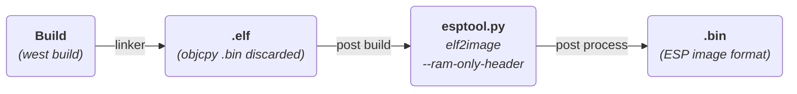
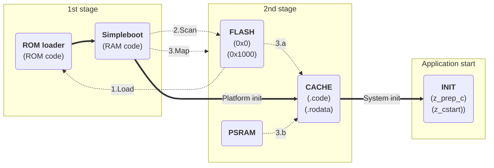

## Motivation

Building executables for embedded systems is often a time-consuming process. As the number of builds increases, the cumulative wait time can become significant. This applies not only to local desktop builds but also to CI environments, where high resource utilization may lead to increased costs.

The ESP32 series of microcontrollers traditionally relies on a 2nd stage bootloader. Due to the design of the ROM loader, using this bootloader is typically the only viable method to boot the SoC.

The ROM loader imposes the following requirements:
- Only ESP image format is supported
- SRAM only target addresses
- Limited size of the image

To satisfy these constraints, the 2nd stage bootloader is essential. Among other functions, it serves as a bridge to overcome the limitations imposed by the ROM loader.

However, the bootloader image often needs to be rebuilt and re-flashed, further increasing the overall build time.

To mitigate this and reduce the time required for both building and flashing, we can integrate essential features of the ESP32 bootloader directly into the application image. This integration must be carried out with careful consideration of the ROM loader’s requirements and limitations.

## Technical background

In our journey, the main obstacle we need to overcome is the ROM loader’s limitation to accept only RAM-loadable images.

Since the ESP image format consists of a list of memory segments interpreted by the ROM loader, we can construct a binary image that includes only the segments the ROM loader is capable of processing.

By adhering to these constraints, we can craft a simplified bootable image that embeds the minimal required bootloader functionality directly into the application itself, eliminating the need to recompile and reflash a separate bootloader component.

In the next section, we’ll walk through how to prepare such an image and modify the application accordingly.

Now its a good time to read [the ROM-loader chapter at related article](https://developer.espressif.com/blog/esp32-bootstrapping/#rom-loader).

## Image build

The image loadable by the ROM code is generated using the `esptool elf2image` command. To hide the non-RAM segments from the ROM loader view, we use the `--ram-only-header` argument.



To produce a compliant binary image named `zephyr.bin` from the input ELF file `zephyr.elf`, the following command can be used:

```shell
esptool.py elf2image --ram-only-header -o zephyr.bin zephyr.elf
```

This command creates an image where the exposed initial segments are SRAM-loadable and thus acceptable to the ROM loader. These are followed by additional segments intended for cache mapping, which cannot be processed during the initial boot phase.

Importantly, the image header only declares the number of RAM-loadable segments. As a result, the flash segments are effectively hidden from the ROM loader and must be handled later during runtime.

This means that a minimal bootstrap routine must be executed as part of the loaded application. Its responsibility is to remap or reinitialize the remaining segments—typically code or data located in flash—so that the system can transition from minimal execution to full application runtime.

As a rule of thumb, the image header will account for all SRAM segments. Any segments that cannot be loaded by the ROM loader will be placed after the declared number of segments, making them invisible to the ROM loader.


- The 1-byte checksum is placed after the last SRAM loadable segment, following by the rest of the segments.
- SHA256 digest is not implemented and it is disabled in the image header.


In the next section, we’ll explore how to implement this runtime remapping and integrate it into the startup sequence.

## Image runtime

First, the ROM loader identifies the image header and calculates a 1-byte checksum over the number of segments specified in the header. If the checksum matches, the ROM loader transfers control to the entry point address.

Once the clock and flash subsystems are initialized, it is time to handle the memory-mapped segments that were hidden from the ROM loader. This is done by parsing the image's segment headers and identifying their target virtual memory addresses (VMAs). As a result, the real number of image segments is calculated.

After collecting all the "invisible" segments, their load memory addresses (LMAs) must be corrected, as the `elf2image` tool may have reordered the segments in the binary. At this point, these segments are mapped into their correct memory locations, and the system can proceed with the standard initialization process.


- Image parsing identifies segments whose VMAs fall within the cache's address range
- The end of the segment is indicated by the `load_addr` field in the header having the value `0xFFFFFFFF`


Typically, there are exactly two such mapped segments: one in the IROM (instruction ROM) region and one in the DROM (data ROM) region, which are located in the CACHE address space.




## Using the Simple Boot in Zephyr

To create single image ESP32 builds in Zephyr, we simply build the code for the target board. The configuration option `CONFIG_ESP_SIMPLE_BOOT` is enabled by default.

```shell
west build -b <full/board/qualifier> <sample/code/path>
```

The configuration option that separates the single image (or simple boot image) from the bootloader supported image is selecting the bootloader. Adding the `CONFIG_BOOTLOADER_MCUBOOT=y` tells the build system to create the image that should be loaded by the MCUboot, to disable `CONFIG_ESP_SIMPLE_BOOT`.

## Conclusion

Single-image binaries reduce build and flash times, making them well-suited for testing and lightweight development workflows. However, this simplicity comes with certain limitations:

- Fixed boot address
- Supported for only one image format
- No support for OTA updates
- No flash encryption now (can be implemented in the future)

While this simplified boot approach is not suitable for all applications, it can effectively serve specific use cases—particularly during development, prototyping, or continuous integration scenarios where speed and simplicity are prioritized over advanced features.

## Additional readings

- [ESP32 bootstrapping article](https://developer.espressif.com/blog/esp32-bootstrapping/).
