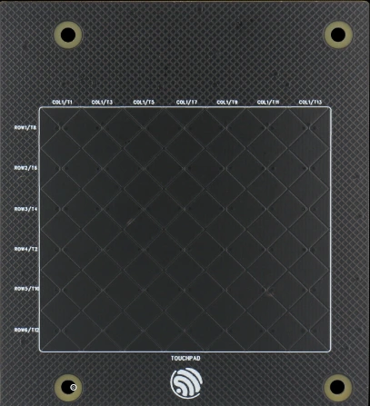
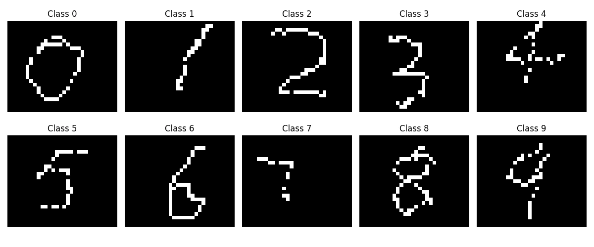
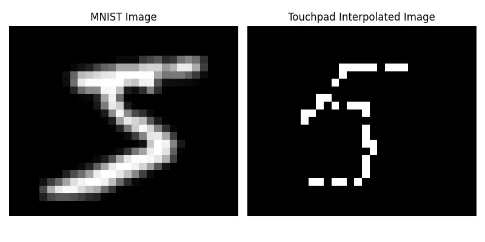
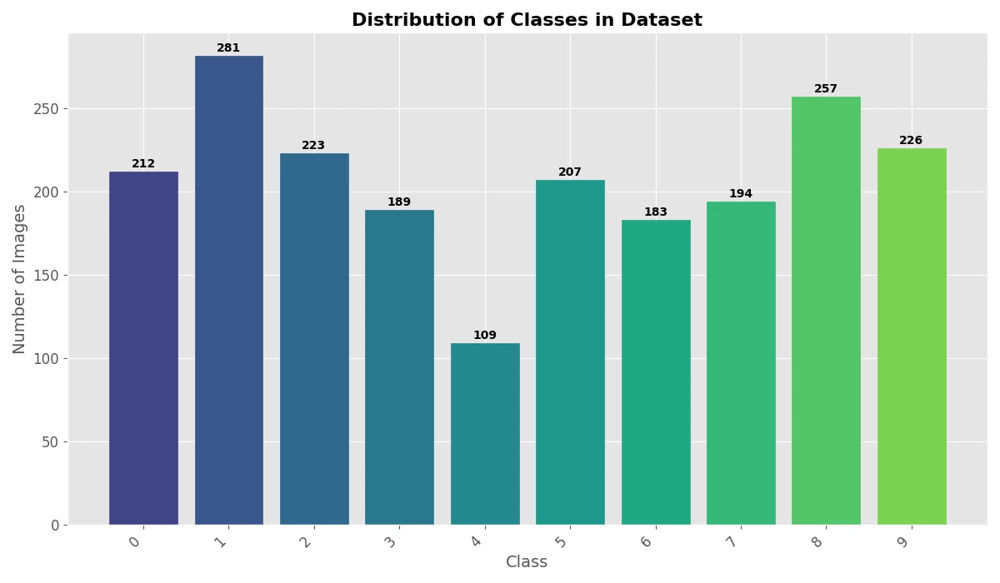
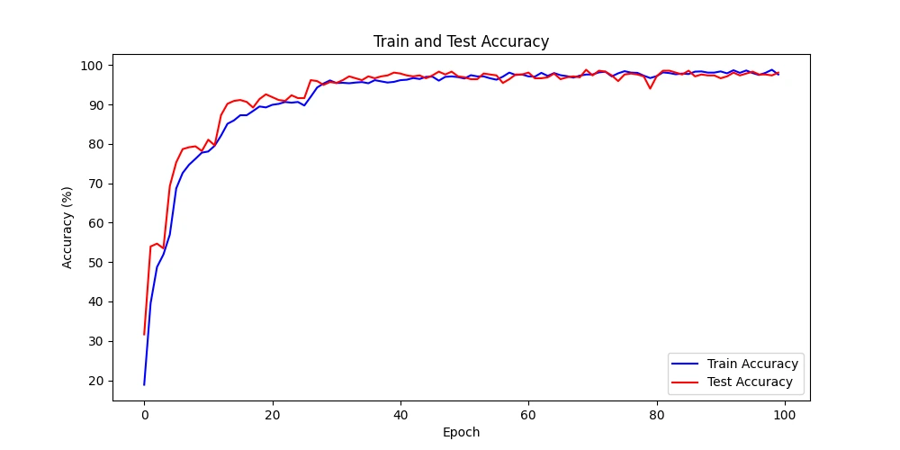

[ESP-DL](https://github.com/espressif/esp-dl) is a small and fast neural network inference framework designed for Espressif SoCs, such as the ESP32-S3/P4. It provides efficient model deployment solutions and helps developers quickly implement edge AI applications. Specifically, ESP-DL has the following advantages:

* **Efficient Operator Implementation**: ESP-DL efficiently implements common AI operators such as Conv, Gemm, Add, and Mul. [The list of supported operators](https://github.com/espressif/esp-dl/blob/master/operator_support_state.md).
* **Static Memory Planner**: The memory planner automatically allocates different layers to the optimal memory location based on the user-specified internal RAM size, ensuring efficient overall running speed while minimizing memory usage.
* **Dual Core Scheduling**: Automatic dual-core scheduling allows computationally intensive operators to fully utilize the dual-core computing power. Currently, Conv2D and DepthwiseConv2D support dual-core scheduling.
* **8bit LUT Activation**: All activation functions except for ReLU and PReLU are implemented using an 8-bit LUT (Look Up Table) method in ESP-DL to accelerate inference. You can use any activation function, and their computational complexity remains the same.

With the ESP-DL framework, you can quickly deploy deep learning models to ESP32 series chips, empowering end devices with intelligent perception and decision-making capabilities, enabling edge AI applications.

This article demonstrates how the advanced features of ESP-DL enable powerful edge AI applications despite the constraints of embedded systems. You will learn the complete workflow for implementing touchpad-based digit recognition on the ESP32-S3 and the ESP32-P4 using ESP-DL -- collecting and preprocessing touch data, designing a lightweight CNN model, training and evaluating the model in `PyTorch`, quantizing it for optimized edge deployment, and, eventually, implementing efficient C++ code for model loading, data preprocessing, and inference.

## Touch Data Collection and Preprocessing

### Touch Data Collection

To collect the data, the [ESP_Touch_Kit_Touchpad](https://dl.espressif.com/dl/schematics/SCH_ESP-Touch-Kit-Touchpad_V1.0_20210406.pdf) is used, featuring a 6×7 array of touch channels. When a finger touches the pad, it changes the capacitance value of the corresponding touch channel. By detecting the changes in capacitance values, the finger position is determined. If you wish to replicate this project, you can refer to the design requirements at the link above and create your own touchpad.

<figure style="width: 40%; margin: 0 auto; text-align: center;">
    
    <figcaption>ESP Touch Kit Touchpad</figcaption>
</figure>

Due to the limited resolution of the original 6x7 touchpad, anything drawn on it ends up looking the same. Therefore, a software interpolation algorithm was applied to interpolate the original 6x7 data to **30x25** in order to obtain more image details. Through the software interpolation algorithm, we collected a series of different digits as training inputs for the model.

<figure style="width: 80%; margin: 0 auto; text-align: center;">
    
    <figcaption>Interpolated Touch Dataset Based on Touchpad Drawing</figcaption>
</figure>

The publicly available [MNIST dataset](http://yann.lecun.com/exdb/mnist/) was not used because its binarized images preserve fine, continuous stroke details. In contrast, the interpolated data collected from the touchpad has simpler strokes, and sometimes non-continuous strokes. As a result, using MNIST for training and deployment would lead to poor recognition performance.

<figure style="width: 75%; margin: 0 auto; text-align: center;">
    
    <figcaption>Interpolated Touch Data vs. MNIST Data</figcaption>
</figure>

The Interpolated touch dataset contains ten categories from digit 0 to 9, with a total of 2,081 samples. Although this dataset is smaller than MNIST, it is sufficiently representative for the current digit recognition task. You can also expand the dataset size according to your actual needs to further improve the model's generalization capability. The sample distribution across different categories is as follows:

<figure style="width: 80%; margin: 0 auto; text-align: center;">
    
    <figcaption>Category Distribution in the interpolated touch dataset</figcaption>
</figure>

### Dataset Preparation

Before model training, the interpolated touch data is preprocessed using the `torchvision.transforms` module from `PyTorch`. First, the images are converted to single-channel grayscale images, and random affine transformations (rotation of ±10 degrees, translation of ±10%) are applied to enhance data diversity. Subsequently, the images are converted to tensor format and normalized with a mean of 0.5 and standard deviation of 0.5.

After data processing, the dataset is loaded using `ImageFolder`, a PyTorch utility that organizes images into labeled datasets based on folder names. It is then randomly split into training and test sets with an 8:2 ratio.

```python
import torch
import torch.nn as nn
import torch.optim as optim
from torch.utils.data import DataLoader, random_split
from torchvision import datasets, transforms

transform = transforms.Compose([
    transforms.Grayscale(num_output_channels=1),
    transforms.RandomAffine(degrees=10, translate=(0.1, 0.1)),
    transforms.ToTensor(),
    transforms.Normalize((0.5,), (0.5,)),
])

dataset = datasets.ImageFolder(root='./dataset', transform=transform)

train_size = int(0.8 * len(dataset))
test_size = len(dataset) - train_size
train_dataset, test_dataset = random_split(dataset, [train_size, test_size])

train_loader = DataLoader(dataset=train_dataset, batch_size=32, shuffle=True)
test_loader = DataLoader(dataset=test_dataset, batch_size=32, shuffle=False)
```

## Lightweight CNN Model Design

This solution uses a lightweight convolutional neural network model designed for this purpose. The model employs three convolutional layers for feature extraction, each followed by a ReLU activation function, and uses max pooling layers after the first two convolutional layers to reduce feature map dimensions. Finally, a fully connected layer maps the features to 10 digit categories. The specific structure is as follows:

```python
class Net(torch.nn.Module):
    def __init__(self):
        super(Net, self).__init__()
        self.model = torch.nn.Sequential(
            torch.nn.Conv2d(in_channels=1, out_channels=16, kernel_size=3, stride=1, padding=1),
            torch.nn.ReLU(),
            torch.nn.MaxPool2d(kernel_size=2, stride=2),

            torch.nn.Conv2d(in_channels=16, out_channels=32, kernel_size=3, stride=1, padding=1),
            torch.nn.ReLU(),
            torch.nn.MaxPool2d(kernel_size=2, stride=2),

            torch.nn.Conv2d(in_channels=32, out_channels=64, kernel_size=3, stride=1, padding=1),
            torch.nn.ReLU(),

            torch.nn.Flatten(),
            torch.nn.Linear(in_features=7 * 6 * 64, out_features=256),
            torch.nn.ReLU(),
            torch.nn.Dropout(p=0.5),
            torch.nn.Linear(in_features=256, out_features=10),
            torch.nn.Softmax(dim=1)
        )

    def forward(self, x):
        output = self.model(x)
        return output
```

It should be noted that the model structure provided here serves only as a reference example. In practical applications, you can design different network architectures according to specific requirements, such as:

- Adjusting the number of convolutional layers and channels
- Trying different activation functions (such as LeakyReLU, ELU, etc.)
- Using other types of pooling layers (such as average pooling)
- Adding batch normalization layers
- Adopting modern network structures like residual connections

## Model Training and Evaluation in PyTorch

### Training Parameter Configuration

During the model training process, the following parameter configuration is employed:

1. Loss Function: CrossEntropyLoss, suitable for multi-classification tasks
2. Optimizer: Adam optimizer with a learning rate of 0.001

```python
device = "cuda:0" if torch.cuda.is_available() else "cpu"
model = Net().to(device)
criterion = nn.CrossEntropyLoss()
optimizer = optim.Adam(model.parameters(), lr=0.001)
```

The above parameter configuration is not the only option. In practical applications, you should flexibly adjust hyperparameters such as `loss function`, `optimizer`, and `learning rate` according to specific task requirements to find the most suitable configuration for the current scenario, thereby achieving better model performance.

### Training Process

A phased training strategy is employed, dividing the training process into training and testing phases. During the training phase, the model calculates predictions through forward propagation, computes loss using the cross-entropy loss function, and updates model parameters through backpropagation. During the testing phase, the model evaluates performance on the test set and calculates accuracy. The training process continues for 100 epochs, with training and test set accuracies saved after each epoch for subsequent analysis. The specific implementation is as follows:

```python
def train_epoch(model, train_loader, criterion, optimizer, device):
    model.train()
    running_loss = 0.0
    correct = 0
    total = 0

    for inputs, labels in train_loader:
        inputs, labels = inputs.to(device), labels.to(device)

        optimizer.zero_grad()
        outputs = model(inputs)
        loss = criterion(outputs, labels)
        loss.backward()
        optimizer.step()

        running_loss += loss.item()
        _, predicted = torch.max(outputs.data, 1)
        total += labels.size(0)
        correct += (predicted == labels).sum().item()

    epoch_loss = running_loss / len(train_loader)
    epoch_acc = 100 * correct / total
    return epoch_loss, epoch_acc


def test_epoch(model, test_loader, criterion, device):
    model.eval()
    running_loss = 0.0
    correct = 0
    total = 0
    with torch.no_grad():
        for inputs, labels in test_loader:
            inputs, labels = inputs.to(device), labels.to(device)
            outputs = model(inputs)
            loss = criterion(outputs, labels)

            running_loss += loss.item()
            _, predicted = torch.max(outputs.data, 1)
            total += labels.size(0)
            correct += (predicted == labels).sum().item()

    epoch_loss = running_loss / len(test_loader)
    epoch_acc = 100 * correct / total
    return epoch_loss, epoch_acc

num_epochs = 100
train_acc_array = []
test_acc_array = []
for epoch in range(num_epochs):
    train_loss, train_acc = train_epoch(model, train_loader, criterion, optimizer, device)
    test_loss, test_acc = test_epoch(model, test_loader, criterion, device)

    print(f'Epoch [{epoch + 1}/{num_epochs}], '
        f'Train Loss: {train_loss:.4f}, Train Acc: {train_acc:.2f}%, '
        f'Test Loss: {test_loss:.4f}, Test Acc: {test_acc:.2f}%')
    train_acc_array.append(train_acc)
    test_acc_array.append(test_acc)

torch.save(model.state_dict(), './models/final_model.pth')
```

<figure style="width: 90%; margin: 0 auto; text-align: center;">
    
    <figcaption>Accuracy Curves During Training</figcaption>
</figure>

After training, the model is saved as `final_model.pth` for subsequent model deployment.

## Model Quantization and Conversion for Deployment

Model quantization is an important optimization technique for deploying deep learning models on edge devices, offering the following key advantages:

1. Reduced Model Size: By converting floating-point parameters to fixed-point parameters, it significantly reduces the model's storage space requirements.
2. Improved Inference Speed: Fixed-point operations are more efficient than floating-point operations, helping to accelerate model inference.

ESP-DL uses a proprietary `.espdl` format for model deployment, supporting both 8-bit and 16-bit quantization precision. The model quantization process requires the ESP-PPQ tool, which can be installed as follows:

```shell
pip uninstall ppq
pip install git+https://github.com/espressif/esp-ppq.git
```

ESP-PPQ provides two quantization interfaces: `espdl_quantize_onnx` and `espdl_quantize_torch`, supporting ONNX models and PyTorch models respectively. For other deep learning frameworks (such as TensorFlow, PaddlePaddle, etc.), models need to be converted to ONNX format before quantization.

Based on the [quantization reference script](https://github.com/espressif/esp-dl/blob/master/examples/tutorial/how_to_quantize_model/quantize_sin_model/quantize_onnx_model.py) provided by ESP-DL, a suitable quantization script can be built for the implementation:

```python
import torch
from PIL import Image
from ppq.api import espdl_quantize_torch
from torch.utils.data import Dataset
from torch.utils.data import random_split
from torchvision import transforms, datasets

DEVICE = "cpu"

class FeatureOnlyDataset(Dataset):
    def __init__(self, original_dataset):
        self.features = []
        for item in original_dataset:
            self.features.append(item[0])

    def __len__(self):
        return len(self.features)

    def __getitem__(self, idx):
        return self.features[idx]


def collate_fn2(batch):
    features = torch.stack(batch)
    return features.to(DEVICE)


if __name__ == '__main__':
    BATCH_SIZE = 32
    INPUT_SHAPE = [1, 25, 30]
    TARGET = "esp32s3"
    NUM_OF_BITS = 8
    ESPDL_MODEL_PATH = "./s3/touch_recognition.espdl"

    transform = transforms.Compose([
        transforms.Grayscale(num_output_channels=1),
        transforms.ToTensor(),
        transforms.Normalize((0.5,), (0.5,)),
    ])

    dataset = datasets.ImageFolder(root="../dataset/extra", transform=transform)
    train_size = int(0.8 * len(dataset))
    test_size = len(dataset) - train_size
    train_dataset, test_dataset = random_split(dataset, [train_size, test_size])

    image = Image.open("../dataset/extra/9/20250225_140331.png").convert('L')
    input_tensor = transform(image).unsqueeze(0)

    feature_only_test_data = FeatureOnlyDataset(test_dataset)

    testDataLoader = torch.utils.data.DataLoader(dataset=feature_only_test_data, batch_size=BATCH_SIZE, shuffle=False,
                                                collate_fn=collate_fn2)

    model = Net().to(DEVICE)
    model.load_state_dict(torch.load("./final_model.pth", map_location=DEVICE))
    model.eval()

    quant_ppq_graph = espdl_quantize_torch(
        model=model,
        espdl_export_file=ESPDL_MODEL_PATH,
        calib_dataloader=testDataLoader,
        calib_steps=8,
        input_shape=[1] + INPUT_SHAPE,
        inputs=[input_tensor],
        target=TARGET,
        num_of_bits=NUM_OF_BITS,
        device=DEVICE,
        error_report=True,
        skip_export=False,
        export_test_values=True,
        verbose=1,
        dispatching_override=None
    )
```

After executing the above script, three files will be exported:

- `*.espdl` -- model binary file
- `*.info` -- model text file
- `*.json` -- quantization information file

To avoid inconsistencies between the actual inference results and PC inference results, `input_tensor` is included for testing during the quantization process. After quantization, the test results can be checked in the `*.info` file to verify consistency with PC inference results.

```info
test outputs value:
%23, shape: [1, 10], exponents: [0],
value: array([4.78089300e-25, 1.05306175e-20, 3.62514101e-34, 9.60267995e-24,
        9.60267995e-24, 6.47023468e-26, 3.97544995e-31, 1.15482239e-17,
        3.87399781e-21, 1.00000000e+00, 0.00000000e+00, 0.00000000e+00],
       dtype=float32)
```

Additionally, if 8-bit quantization does not achieve satisfactory results for your model, ESP-DL provides various quantization schemes. You can refer to the documentation [How to quantize model](https://github.com/espressif/esp-dl/blob/master/docs/en/tutorials/how_to_quantize_model.rst#id2) to further reduce model performance loss.

## Edge Deployment and Inference on ESP32-S3/P4

You can load the model from `rodata`, `partition`, or `SD card`. For more details, please refer to [How to load & test & profile model](https://github.com/espressif/esp-dl/blob/master/docs/en/tutorials/how_to_load_test_profile_model.rst).

```c++
TouchDigitRecognition::TouchDigitRecognition(const char* model_name, size_t feature_size)
{
    m_model = new dl::Model(model_name, fbs::MODEL_LOCATION_IN_FLASH_PARTITION);
    m_model->minimize();
    m_preprocessor = new DataPreprocessor(m_model, feature_size);
    m_postprocessor = new DataPostprocessor(m_model);
    m_feature_size = feature_size;
    m_quant_buffer = (int8_t*)heap_caps_calloc(feature_size * sizeof(int8_t), 1, MALLOC_CAP_SPIRAM);
}
```

After loading the model, the interpolated touch data needs to be preprocessed to ensure the validity of the model input data. Preprocessing mainly includes data format conversion and quantization implemented as follows:

```c++
DataPreprocessor::DataPreprocessor(dl::Model* model, size_t feature_size)
    : m_model(model),
      m_feature_size(feature_size)
{
    auto inputs = m_model->get_inputs();
    if (!inputs.empty()) {
        dl::TensorBase* input_tensor = inputs.begin()->second;
        m_input_scale = 1.0f / DL_SCALE(input_tensor->exponent);
    }
}

void DataPreprocessor::process(const uint8_t* input_data, int8_t* quant_buffer)
{
    for (size_t i = 0; i < m_feature_size; i++) {
        int8_t value = (input_data[i] == 0 ? -1 : 1);
        quant_buffer[i] = dl::quantize<int8_t>((float)value, m_input_scale);
    }
}
```

After data preprocessing, the processed data needs to be fed into the model for inference. The entire inference process consists of three steps:

1. Data Encapsulation.
2. Model Execution.
3. Result Parsing.

Here is the complete inference implementation:

```c++
int TouchDigitRecognition::predict(const uint8_t* input_data)
{
    m_preprocessor->process(input_data, m_quant_buffer);

    std::map<std::string, dl::TensorBase*> inputs;
    auto model_inputs = m_model->get_inputs();

    for (auto &input_pair : model_inputs) {
        dl::TensorBase* tensor = new dl::TensorBase(
        {1, static_cast<int>(m_feature_size)},
        m_quant_buffer,
        input_pair.second->exponent,
        input_pair.second->dtype,
        false,
        MALLOC_CAP_SPIRAM
        );
        inputs.emplace(input_pair.first, tensor);
    }

    m_model->run(inputs);

    for (auto &input : inputs) {
        delete input.second;
    }

    return m_postprocessor->process();
}
```

Finally, the model output needs to be processed. Since the model output is processed through the Softmax layer, obtaining the probability distribution for each category, the final recognition result can be obtained by finding the index corresponding to the maximum probability value:

```c++
int DataPostprocessor::process()
{
    auto outputs = m_model->get_outputs();
    if (outputs.empty()) {
        return -1;
    }

    m_model_output = outputs.begin()->second;
    float *output_ptr = (float *)m_model_output->data;
    int size = m_model_output->get_size();
    auto max_iter = std::max_element(output_ptr, output_ptr + size);
    int max_index = std::distance(output_ptr, max_iter);
    ESP_LOGI(TAG, "Predict result: %d", max_index);
    return max_index;
}
```

## Summary

This article introduces a handwritten digit recognition application implemented using the ESP-DL framework, demonstrating how to deploy deep learning models on ESP32 series chips.

All the Python scripts for data processing, model training, quantization, as well as the C++ code for model inference and the pre-trained models mentioned in this article, are available in the esp-iot-solution GitHub repository: [touchpad_digit_recognition](https://github.com/espressif/esp-iot-solution/tree/master/examples/ai/esp_dl/touchpad_digit_recognition)

Feel free to try these examples, implement your own applications, and share your experience!
