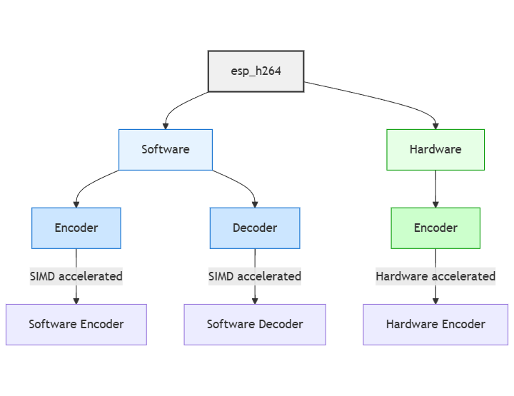
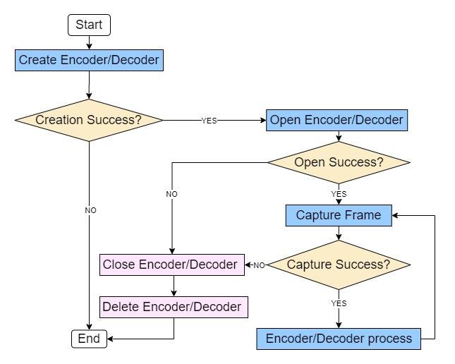

## Overview

### What is ESP H.264?

Espressif has recently launched the `esp_h264` component for ESP32 series microcontrollers, which through hardware acceleration, dynamic scheduling and lightweight algorithms, is able to balance the computing power and power consumption of video codec.



### Key Features

- **Hardware Acceleration**: Leverages ESP32-P4 for hardware encoding and high-speed decoding, with single-instruction, multiple-data ([SIMD](https://en.wikipedia.org/wiki/Single_instruction,_multiple_data)) acceleration on ESP32-S3 for enhanced efficiency
- **Memory Optimization**: Implements advanced algorithms to minimize memory usage, ensuring stable operation on resource-constrained devices
- **Dynamic Configuration**: Flexible parameter adjustment for real-time optimization of performance, resource allocation, and video quality
- **Advanced Encoding**: Supports Baseline profile, high-quality I/P frame generation, ROI encoding, and bitrate control
- **Efficient Decoding**: Software-based parsing of standard H.264 streams for smooth video playback

### Target Applications

`esp_h264` main applications are:
- Video surveillance systems
- Remote meetings and communication
- Mobile streaming applications
- IoT video processing

## CODEC specifications

### Encoding

| Platform     | Type     | Max Resolution | Max Performance       | Advanced Features                    |
|--------------|----------|----------------|-----------------------|--------------------------------------|
| **ESP32-S3** | Software | Any            | 320×240@11fps         | Basic encoding                       |
| **ESP32-P4** | Hardware | ≤1080P         | 1920×1080@30fps       | Dual encoding, ROI optimization, Motion vector output |

### Decoding

| Platform     | Type     | Max Resolution | Max Performance       |
|--------------|----------|----------------|-----------------------|
| **ESP32-S3** | Software | Any            | 320×240@19fps         |
| **ESP32-P4** | Software | Any            | 1280×720@10fps        |

## Getting Started

### Basic Workflow

The hardware encoding standardization process can be summarized into four core operations:



1. **Initialize**: Create encoder with configuration parameters
2. **Start**: Open the encoder for processing
3. **Process**: Execute frame-by-frame encoding in a loop
4. **Cleanup**: Release resources and destroy encoder object

### Quick Start Example

```c
// Hardware single-stream encoding configuration example
esp_h264_enc_cfg_hw_t cfg = {0};
cfg.gop = 30;
cfg.fps = 30;
cfg.res = {.width = 640, .height = 480};
cfg.rc = {
    .bitrate = (640 * 480 * 30) / 100,
    .qp_min = 26,
    .qp_max = 30
};
cfg.pic_type = ESP_H264_RAW_FMT_O_UYY_E_VYY;

// Initialize encoder
esp_h264_enc_t *enc = NULL;
esp_h264_enc_hw_new(&cfg, &enc);

// Allocate input/output buffers
esp_h264_enc_in_frame_t in_frame = {.raw_data.len = 640 * 480 * 1.5};
in_frame.raw_data.buffer = esp_h264_aligned_calloc(128, 1, 
                                                   in_frame.raw_data.len, 
                                                   &in_frame.raw_data.len, 
                                                   ESP_H264_MEM_INTERNAL);

// Start encoding
esp_h264_enc_open(enc);

// Encoding loop
while (capture_frame(in_frame.raw_data.buffer)) {
    esp_h264_enc_process(enc, &in_frame, &out_frame);
    send_packet(out_frame.raw_data.buffer);
}

// Resource release
esp_h264_enc_close(enc);
esp_h264_enc_del(enc);
esp_h264_free(in_frame.raw_data.buffer);
```

## API Reference

The following section provides a brief overview of the available functions.

These functions are thread-safe and can be called at any time during the encoder lifecycle.



### Encoding functions

| Function                    | Description                           | Platform Support        |
|----------------------------|---------------------------------------|--------------------------|
| `esp_h264_enc_sw_new`      | Create single-stream software encoder | ESP32-S3, ESP32-P4      |
| `esp_h264_enc_hw_new`      | Create single-stream hardware encoder | ESP32-P4 only           |
| `esp_h264_enc_dual_hw_new` | Create dual-stream hardware encoder   | ESP32-P4 only           |
| `esp_h264_enc_open`        | Start encoder                         | All platforms            |
| `esp_h264_enc_process`     | Execute encoding for a single frame and output compressed data | All platforms |
| `esp_h264_enc_close`       | Stop encoder                          | All platforms            |
| `esp_h264_enc_del`         | Release encoder resources             | All platforms            |

### Decoding functions

| Function                | Description                                      | Platform Support        |
|------------------------|--------------------------------------------------|--------------------------|
| `esp_h264_dec_sw_new`  | Create software decoder                          | ESP32-S3, ESP32-P4      |
| `esp_h264_dec_open`    | Start decoder                                    | All platforms            |
| `esp_h264_dec_process` | Execute decoding for a single frame and output raw data | All platforms    |
| `esp_h264_dec_close`   | Stop decoder                                     | All platforms            |
| `esp_h264_dec_del`     | Release decoder resources                        | All platforms            |

### Dynamic Parameter Control

| Function                       | Description                    | Typical Use Cases                |
|-------------------------------|--------------------------------|----------------------------------|
| `esp_h264_enc_get_resolution` | Get resolution information     | Display configuration            |
| `esp_h264_enc_get/set_fps`    | Dynamically adjust frame rate | Network bandwidth adaptation    |
| `esp_h264_enc_get/set_gop`    | Dynamically adjust GOP size   | Quality vs. bandwidth balance   |
| `esp_h264_enc_get/set_bitrate`| Dynamically adjust bitrate    | Network bandwidth adaptation    |

## Advanced Features

This section highlights advanced capabilities of the H.264 encoder that offer greater control and flexibility for specialized use cases. These features include region-based quality adjustments, motion vector extraction for video analysis, and dual-stream encoding support on the ESP32-P4.

### Region of Interest (ROI) Encoding

ROI encoding allows you to allocate more bits to important areas of the frame while reducing quality in less critical regions.

**ROI Configuration**

```c
// Set the center area for high-priority encoding
esp_h264_enc_roi_cfg_t roi_cfg = {
    .roi_mode = ESP_H264_ROI_MODE_DELTA_QP,
    .none_roi_delta_qp = 10  // Increase QP by 10 for non-ROI region
};
ESP_H264_CHECK(esp_h264_enc_hw_cfg_roi(param_hd, roi_cfg));

// Define the center 1/4 area as ROI
esp_h264_enc_roi_reg_t roi_reg = {
    .x = width / 4, .y = height / 4,
    .len_x = width / 2, .len_y = height / 2
};
ESP_H264_CHECK(esp_h264_enc_hw_set_roi_region(param_hd, roi_reg));
```

**ROI API Functions**

| Function                        | Description                    | Use Cases                        |
|--------------------------------|--------------------------------|----------------------------------|
| `esp_h264_enc_cfg_roi`         | Configure ROI parameters       | Key encoding for faces, license plates |
| `esp_h264_enc_get_roi_cfg_info`| Get current ROI configuration  | Status monitoring                |
| `esp_h264_enc_set_roi_region`  | Define ROI regions             | Specific area enhancement        |
| `esp_h264_enc_get_roi_region`  | Get ROI region information     | Configuration verification       |

### Motion Vector Extraction

Extract [motion vector](https://en.wikipedia.org/wiki/Motion_estimation) data for video analysis and post-processing applications.

**Motion Vector API Functions**

| Function                       | Description                     | Use Cases                        |
|-------------------------------|---------------------------------|----------------------------------|
| `esp_h264_enc_cfg_mv`         | Configure motion vector output  | Video analysis setup             |
| `esp_h264_enc_get_mv_cfg_info`| Get motion vector configuration | Configuration verification       |
| `esp_h264_enc_set_mv_pkt`     | Set motion vector packet buffer | Data collection                  |
| `esp_h264_enc_get_mv_data_len`| Get motion vector data length   | Buffer management                |

### Dual-Stream Encoding (ESP32-P4 Only)

ESP32-P4 supports simultaneous encoding of two independent video streams with different parameters.

```c
// Main stream 1080P storage, sub-stream 480P transmission
esp_h264_enc_cfg_dual_hw_t dual_cfg = {0};
dual_cfg.cfg0 = {.res = {1920, 1080}, .bitrate = 4000000};  // Main stream
dual_cfg.cfg1 = {.res = {640, 480}, .bitrate = 1000000};    // Sub-stream
ESP_H264_CHECK(esp_h264_enc_dual_hw_new(&dual_cfg, &enc));
```

## Application Scenarios & Best Practices

The following examples demonstrate how to apply advanced encoding features to meet specific use-case requirements. Each scenario outlines an optimal configuration strategy, showcasing how ROI, bitrate control, and motion vectors can be tailored for performance, privacy, or adaptability.

### 1. Video Surveillance

In video surveillance applications, it's critical to maintain high visual fidelity in regions that contain important details—such as faces, license plates, or motion-detected areas—while conserving bandwidth and storage elsewhere. ROI (Region of Interest) encoding allows the encoder to prioritize such regions by allocating more bits, thereby enhancing clarity where it matters most.

**Optimal Configuration:**

* **Enable ROI encoding** to enhance key visual areas.
* **GOP = 30** ensures a keyframe every second at 30 fps, balancing video seekability and compression.
* **QP range: \[20–35]** provides a controlled balance between compression efficiency and perceptual quality, especially in bandwidth-constrained environments.

```c
// Surveillance optimized configuration
esp_h264_enc_cfg_hw_t surveillance_cfg = {
    .gop = 30,
    .fps = 25,
    .res = {1280, 720},
    .rc = {
        .bitrate = 2000000,
        .qp_min = 20,
        .qp_max = 35
    }
};
```

**ROI Setup for Key Areas:**
To further refine quality, specific regions—such as the center of the frame or areas flagged by motion detection—can be configured for lower quantization parameters (QPs), resulting in better detail preservation.

* **Reduce QP** in key regions by up to **25%**, improving clarity for facial recognition or license plate reading.
* **Leverage motion vector data** to dynamically track and adapt ROI regions for intelligent, resource-efficient surveillance.

### 2. Privacy Protection

In scenarios where privacy is a concern—such as public-facing cameras or indoor monitoring—specific regions of the video may need to be intentionally blurred. This can be achieved by strategically increasing the quantization parameter (QP) in those regions, reducing detail without additional processing overhead.

**Implementation Strategy:**
- Increase QP by 25% in ROI areas to achieve blur effect
- Use fixed GOP to prevent mosaic area diffusion

```c
// Privacy protection ROI configuration
esp_h264_enc_roi_cfg_t privacy_cfg = {
    .roi_mode = ESP_H264_ROI_MODE_DELTA_QP,
    .none_roi_delta_qp = -5  // Better quality for non-sensitive areas
};

// Blur sensitive area
esp_h264_enc_roi_reg_t blur_region = {
    .x = sensitive_x, .y = sensitive_y,
    .len_x = sensitive_width, .len_y = sensitive_height,
    .qp = 15  // High QP for blur effect
};
```

### 3. Network Adaptive Streaming

For real-time video applications operating over variable or constrained networks, maintaining a stable and responsive stream is essential. By dynamically adjusting encoding parameters such as bitrate and frame rate based on current bandwidth conditions, the encoder can optimize video quality while minimizing buffering and transmission failures.

**Strategy:**
- Enable dynamic bitrate control (CBR/VBR)
- Adjust parameters based on network conditions

```c
// Network adaptation function
void adapt_to_network_conditions(esp_h264_enc_handle_t enc, uint32_t available_bandwidth) {
    esp_h264_enc_param_hw_handle_t param_hd;
    esp_h264_enc_hw_get_param_hd(enc, &param_hd);
    
    if (available_bandwidth < 1000000) {  // < 1 Mbps
        esp_h264_enc_set_bitrate(&param_hd->base, 800000);
        esp_h264_enc_set_fps(&param_hd->base, 15);
    } else if (available_bandwidth < 3000000) {  // < 3 Mbps
        esp_h264_enc_set_bitrate(&param_hd->base, 2000000);
        esp_h264_enc_set_fps(&param_hd->base, 25);
    } else {  // >= 3 Mbps
        esp_h264_enc_set_bitrate(&param_hd->base, 4000000);
        esp_h264_enc_set_fps(&param_hd->base, 30);
    }
}
```

## Resources and Support

### Development Resources

- **Sample Projects**: [ESP H.264 Sample Projects](https://github.com/espressif/esp-idf/tree/master/examples/peripherals/h264)
- **Component Registry**: [ESP H.264 Component](https://components.espressif.com/components/espressif/esp_h264/)
- **Release Notes**: [Latest updates and compatibility information](https://components.espressif.com/components/espressif/esp_h264/versions/1.1.2/changelog?language=en)

### Technical Support

- **Official Forum**: [Espressif Technical Support](https://docs.espressif.com/projects/esp-faq/en/latest/)
- **GitHub Issue Tracker**: [ESP-ADF Issues](https://github.com/espressif/esp-adf/issues)

## Conclusion

Espressif's lightweight H.264 codec component `esp_h264` is designed for efficient video processing on resource-constrained devices. This comprehensive guide analyzes its core advantages from four dimensions: technical features, API interfaces, application scenarios, and troubleshooting, thereby helping developers unlock the potential of embedded video codec.

Whether you're building a surveillance system, implementing video streaming, or developing innovative multimedia applications, ESP H.264 offers the tools and performance needed to succeed in resource-constrained environments.