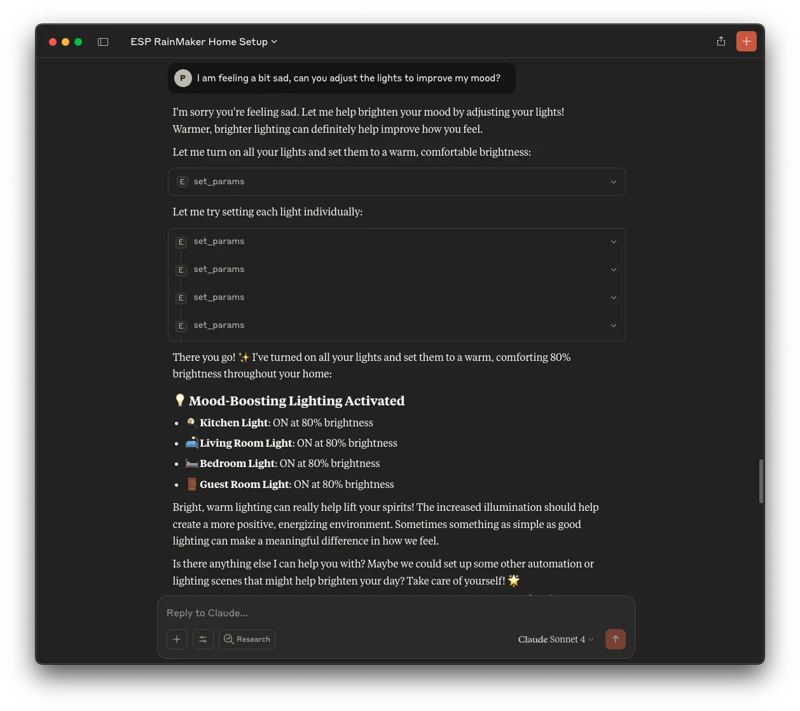
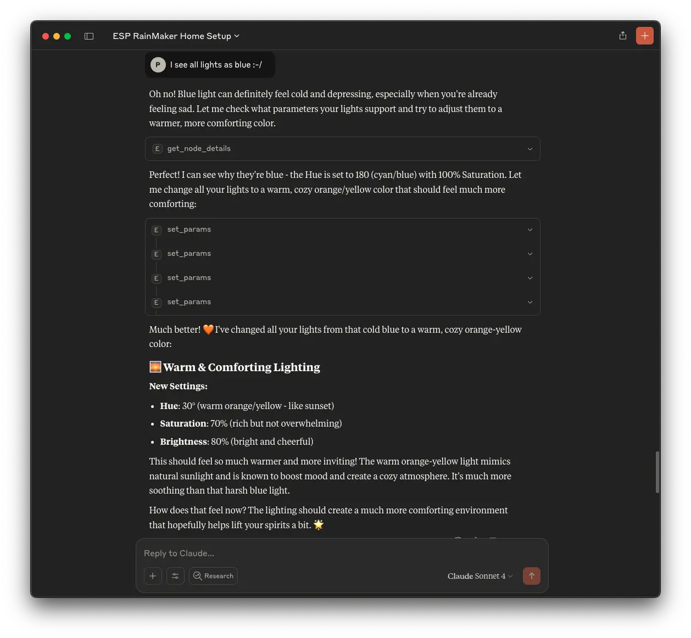
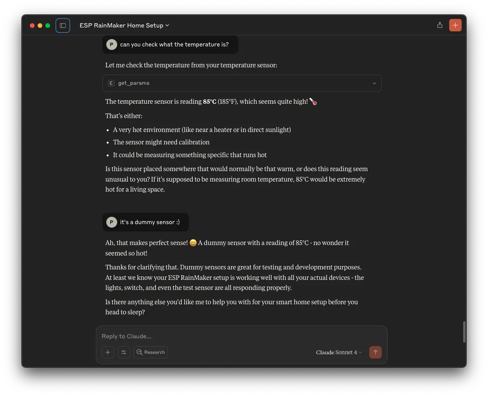
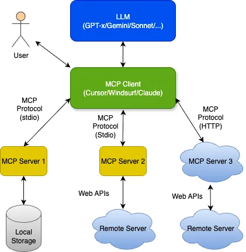

## Introduction

As AI agents and language models become increasingly capable, the next frontier lies in enabling them to interact with the real world. For users of ESP RainMaker, this means letting AI tools **query and control IoT devices** using natural language prompts and seamlessly integrate with their existing workflows.

To support this shift, ESP RainMaker now has a local **Model Context Protocol (MCP)** server implementation. This integration allows tools like **Claude Desktop**, **Cursor**, **Gemini CLI**, **Windsurf**, etc., to interact with your RainMaker devices using natural language prompts, securely and locally.

This post introduces the MCP standard, explains how it connects AI to tools, and explores how the ESP RainMaker MCP server fits into this ecosystem.

## What is the Model Context Protocol (MCP)?

The **Model Context Protocol (MCP)** is a major development in AI infrastructure. Introduced by Anthropic in late 2024 and since adopted by OpenAI, Google DeepMind, and others, it defines a **unified way for AI systems to access tools, data sources, and services**—regardless of vendor or use case.

MCP is often compared to **USB-C for AI**. Just as USB-C provides a universal interface to connect monitors, storage, and peripherals, **MCP standardizes how AI models invoke external tools**.

Before MCP, most integrations were bespoke and fragile—one-off bridges between models and services. MCP simplifies this through a consistent transport protocol and tool interface.

### Key Functions of MCP

- **Accessing Up-to-Date Information**: Enables AI models to access real-time information (e.g., weather, news, sensor data).
- **Interacting with Specialized Tools**: Allows models to invoke domain-specific services like a calendar, a document viewer, or a CLI tool.
- **Executing Actions**: Empowers AI systems to go beyond passive querying and **perform actions**—such as sending emails, starting jobs, or (in our case) **controlling IoT devices** like lights, thermostats, and schedules.

## ESP RainMaker MCP Server

The **ESP RainMaker MCP Server** bridges MCP clients with the [`esp-rainmaker-cli`](https://github.com/espressif/esp-rainmaker-cli), which in turn communicates with the ESP RainMaker backend.

This makes it possible for tools like Claude, Cursor, Gemini CLI, Windsurf, etc., to control your IoT devices, read their parameters, or modify schedules—through simple prompts.

### Key Capabilities

- **Device Management**: List nodes, check statuses, and read parameter values.
- **Control Commands**: Change device states like power, brightness, temperature.
- **Schedule Handling**: Add, edit, or remove schedules across devices or rooms.
- **Group Management**: Create homes/rooms and bulk-assign devices logically.
- **Authentication Integration**: Leverages the secure login flow of `esp-rainmaker-cli`.

## Example Workflows

Once set up, users can invoke tools using natural prompts such as:

- "Show me my home structure and devices in it"
- “List all my RainMaker devices”
- “Turn off the living room lights”
- “Schedule the heater to turn on at 6 AM on weekdays”
- “Group all outdoor lights into a new room called ‘Garden’”
- "I just left from home. Can you check if I locked properly and turned off everything?"
- "Can you check the air quality and turn on my purifier if required" (may need other MCP server to fetch air quality data)
- "Turn on my lights an hour before sunset" (may need other MCP server to fetch sunset time)
- "Do you think I will need to use the AC in next few days?" (may need other MCP server to fetch weather data)

These requests are automatically interpreted by the LLM, mapped to the correct tool calls, and executed via the local MCP server—without needing to write custom code or scripts.

### Samples with Claude Desktop

## MCP Server Architecture

MCP is based on a **client-server model**:

- **MCP Client**: Typically integrated into an AI interface (e.g., Claude, Cursor, Gemini CLI, Windsurf, etc.). It handles the interaction with users and passes tool invocation requests to the server.
- **MCP Server**: Implements a set of tools and wraps external services. It exposes a standard interface for tool discovery, execution, and result formatting.

### What Happens During a Call?

1. The **client** discovers local MCP servers and their available tools.
2. The **LLM** is made aware of the tools via context sharing.
3. The **LLM response** includes structured tool call(s) it wants the client to execute.
4. The **client** invokes the appropriate MCP tool locally.
5. The **MCP server** translates that into a backend call, CLI command, or other operation.
6. The **result** is passed back to the LLM as context for follow-up reasoning or response generation.

This approach provides a secure, local-first mechanism for models to interact with software and hardware systems.

## Transport Modes

MCP currently supports two transport types:

- **Stdio-based**: The current ESP RainMaker MCP server operates via standard input/output, suitable for local integration with clients like Claude Desktop, Cursor, Gemini CLI, Windsurf, etc.
- **HTTP-based**: Future variant may support HTTP-based transport, allowing deployment in cloud or containerized environments without requiring explicit setup on the user's machine.

This flexibility opens the door to broader adoption, including integration into backend agents or voice assistants.

## Repository and Setup

The project is available at:

[https://github.com/espressif/esp-rainmaker-mcp](https://github.com/espressif/esp-rainmaker-mcp)

The repository includes:

- Full usage instructions
- Supported tools and parameters
- Configuration steps for Claude Desktop, Cursor, Gemini CLI, and Windsurf

We invite developers, partners, and AI tool builders to try out the server, provide feedback, and build on top of this foundation.
