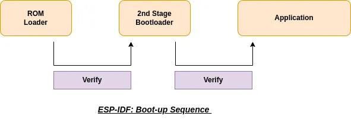
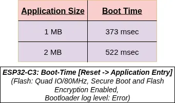
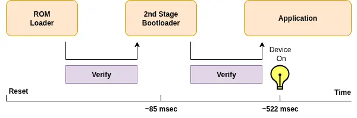
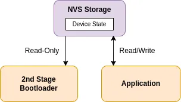
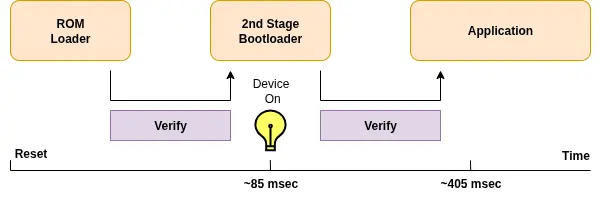

When developing IoT products, one of the key challenges is ensuring **fast and reliable device restoration** after reboots or power cycles. This is especially important in applications like lighting control, where devices are expected to resume operation immediately.

In this post, we examine the ESP-IDF boot-up flow and highlight strategies to **accelerate restoration** by restoring device state during **the bootloader stage** — before the application is even loaded.

---

## ESP-IDF Boot Flow: Overview

<figure style="width: 100%; margin: 0 auto; text-align: center;">
    
</figure>

The ESP-IDF boot process consists of multiple stages that ensure secure and reliable startup:

1. **First-Stage Bootloader (ROM Bootloader):**
   - Initializes basic components and loads the second-stage bootloader from flash (basic read mode).
   - Performs SHA-256 hash validation of the bootloader image. If Secure Boot is enabled, digital signature verification (e.g., RSA or ECDSA) is also done.

2. **Second-Stage Bootloader:**
   - Stored in flash and performs more advanced tasks like clock and peripheral initialization (e.g., flash quad mode).
   - Verifies the application image’s integrity using a SHA-256 hash and, if Secure Boot is enabled, cryptographic signature checks.

3. **Application Execution:**
   - Once verified, control is passed to the application image.

This flow ensures system integrity and protection, but adds latency — particularly as the size of the application image increases.

---

## Impact of Integrity Checks on Boot Time

Both the second-stage bootloader and the application image go through integrity validation. When Secure Boot is enabled, this includes digital signature verification using asymmetric cryptography.

<figure style="width: 65%; margin: 0 auto; text-align: center;">
    
    <figcaption>ESP32-C3: Boot Time to Application</figcaption>
</figure>

The most time-consuming factor during boot is reading and verifying artifacts from external SPI flash. Since the bootloader is relatively small, its verification completes quickly. However, verifying the application image can take a significant amount of time and scales with its size. While security features like Secure Boot and Flash Encryption add some overhead, the **application image size** has the greatest impact on the overall boot time.

Let's see how the default device restoration time looks like with 2MB application image size:

<figure style="width: 100%; margin: 0 auto; text-align: center;">
    
    <figcaption>Default Restoration Time</figcaption>
</figure>

ESP-IDF also provides configuration options to **skip application image integrity checks** - only for Secure Boot disabled cases. These options include:

- [`CONFIG_BOOTLOADER_SKIP_VALIDATE_ALWAYS`](https://docs.espressif.com/projects/esp-idf/en/stable/esp32/api-reference/kconfig-reference.html#config-bootloader-skip-validate-always)
- [`CONFIG_BOOTLOADER_SKIP_VALIDATE_ON_POWER_ON`](https://docs.espressif.com/projects/esp-idf/en/stable/esp32/api-reference/kconfig-reference.html#config-bootloader-skip-validate-on-power-on)

These options can reduce boot time by avoiding application integrity step. However, **this approach is not recommended** in most production use-cases, as it could **mask potential flash corruption** and lead to the execution of tampered or damaged firmware. For safety and reliability, it is advisable to keep all integrity checks enabled.

Another way to accelerate device restoration is by using the bootloader.

---

## Faster Restoration Using Bootloader

When it comes to IoT, speed isn’t just about performance — it's about perception. Imagine walking into a room, flipping a switch, and your smart lighting takes half a second too long to react. That lag, however minor, breaks the illusion of instant control.

To address this, the device restoration can be moved in the bootloader, rather than waiting for the application image to come up. This allows the device to respond immediately, without compromising security or reliability.

Bootloader restoration involves:

1. Device driver code to interact with peripherals
2. Reading device state from (encrypted) flash storage

### Device Drivers in Bootloader

ESP-IDF's HAL APIs (Non-OS based) allow interacting with peripherals like I2C, SPI, or RMT during the bootloader phase — for example, to restore LED brightness levels or update display state. Please note that HAL APIs are not intended to be stable across different ESP-IDF versions but provide a good initial reference.

However, since bootloader code is non-upgradeable, any driver code must be minimal, reliable, and well-tested.

Note: Recent targets like ESP32-C5 support safe bootloader updates, allowing you to modify the bootloader code for bug fixes or enhancements. However, this is not available on all ESP32 variants.

### Getting Device State from NVS

NVS (Non-Volatile Storage) is a logging based file-system component (in ESP-IDF) with consideration for flash wear levelling in its design and hence an ideal choice to store frequently changing device state data on the flash. ESP-IDF now supports a **lightweight, read-only NVS (Non-Volatile Storage)** implementation in the second-stage bootloader. This allows device state (such as configuration or previous runtime values) to be easily accessible during the bootloader stage.

<figure style="width: 65%; margin: 0 auto; text-align: center;">
    
    <figcaption>Bootloader: Lightweight Read-Only NVS</figcaption>
</figure>

This capability is made available via `bootloader_hooks`. ESP-IDF supports bootloader customization, as specified in the [Custom Bootloader](https://docs.espressif.com/projects/esp-idf/en/latest/api-guides/bootloader.html#custom-bootloader) guide. The [NVS bootloader example](https://github.com/espressif/esp-idf/tree/master/examples/storage/nvs/nvs_bootloader) provides a complete reference implementation.

### Support for Encrypted NVS

The bootloader can now read from **encrypted NVS partitions**. Targets with AES hardware acceleration use it to perform XTS-AES decryption. On devices without such hardware (e.g., ESP32-C2), decryption is handled via the mbedTLS implementation in ROM.

---

## Bootloader Size Considerations

When Secure Boot v2 is enabled, the total bootloader size limits for each target can be found in the [Bootloader Size](https://docs.espressif.com/projects/esp-idf/en/latest/api-guides/bootloader.html#bootloader-size) guide. The additional space used by the NVS read-only implementation (including decryption support) is optimized to stay under **5 KB**.

However, if you include additional device driver code, ensure the total size fits within the maximum bootloader size limit.

---

## Practical Example and Benchmark

We created a demo application to test and validate the bootloader NVS restoration method. You can find the source code here: 
👉 [Example: Faster Device State Restoration](https://github.com/Harshal5/esp-idf-faster-device-state-restoration-example)

The project simulates a lighting product where the last known state is restored during the bootloader stage.

| Feature                  | Baseline Approach      | Bootloader Optimization       |
|--------------------------|------------------------|-------------------------------|
| Restoration Time         | 405 ms                 | **< 90 ms**                   |
| Application Image Size   | 1.25 MB                | 1.25 MB                       |
| Secure Boot              | Enabled                | Enabled                       |
| Flash/NVS Encryption     | Enabled                | Enabled                       |

Let's see how the **optimized** device restoration time looks like per above application size:

<figure style="width: 100%; margin: 0 auto; text-align: center;">
    
    <figcaption>Optimized Restoration Time</figcaption>
</figure>

By restoring the device state before the application image is even verified, we reduce startup latency significantly. As application images grow larger, this optimization offers even more noticeable gains.

---

## Summary

To reduce device boot time:

- Some may consider reducing the image size or skipping certain checks, but this can compromise security or reliability.
- A more robust approach is to move device state restoration to the **bootloader**, enabling faster responsiveness while retaining all integrity and security checks.

This method provides the best of both worlds — **faster restoration** without sacrificing **security or reliability**.

---
