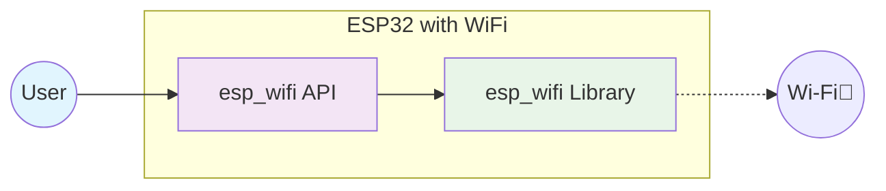
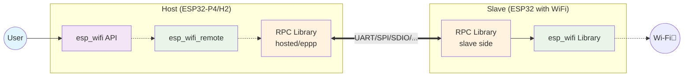
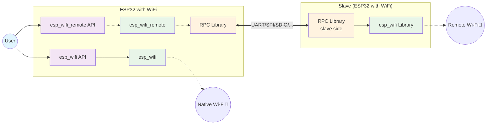

This blog post explores the esp-wifi-remote ecosystem, its components, architecture, and how it integrates with esp-hosted to provide seamless WiFi connectivity to previously WiFi-less devices.

## Introduction

The ESP-IDF's `esp_wifi` API is a mature and stable interface that has powered WiFi connectivity across generations of ESP32 chipsets. However, with the introduction of new ESP32 series chips that do not include native WiFi hardware—such as ESP32-P4 and ESP32-H2—developers may wonder: what WiFi API should they use on these devices? The answer is simple: by adding **esp-wifi-remote**, you can use exactly the same `esp_wifi` APIs on non-WiFi ESP chipsets as you would on traditional WiFi-enabled ones. This seamless compatibility allows developers to leverage their existing knowledge and codebase, extending WiFi functionality to a broader range of ESP devices with minimal changes.

## Understanding the WiFi Experience

To appreciate how esp-wifi-remote works, let's first look at the traditional WiFi experience, then see how esp-wifi-remote enables the same seamless experience with external WiFi hardware.

### 1. Traditional WiFi Experience

The standard approach where the ESP chip has native WiFi capabilities:

This is the conventional setup where applications directly interface with the WiFi hardware through the standard ESP-IDF WiFi APIs. The user experience is seamless—you call `esp_wifi_init()`, `esp_wifi_connect()`, and other familiar functions, and WiFi just works.

### 2. esp-wifi-remote: Same Experience, External Hardware

**esp-wifi-remote** is designed to provide exactly the same user experience as the traditional WiFi setup, but with external WiFi hardware. This works in two scenarios:

#### Scenario A: Non-WiFi Chipsets

For chipsets without native WiFi support (like ESP32-P4, ESP32-H2), esp-wifi-remote provides a transparent bridge to external WiFi hardware:

The magic here is that your application code remains identical to the traditional WiFi case. You still call `esp_wifi_init()`, `esp_wifi_connect()`, and all the familiar functions—esp-wifi-remote transparently redirects these calls through the RPC layer to a WiFi-capable slave device.

#### Scenario B: WiFi-Enabled Chipsets with Additional Interfaces

For chipsets that already have WiFi, esp-wifi-remote can add additional wireless interfaces, giving you both native and remote WiFi capabilities:

This scenario enables dual WiFi interfaces—one native and one remote—providing enhanced connectivity options for complex applications that need multiple wireless connections.

---
