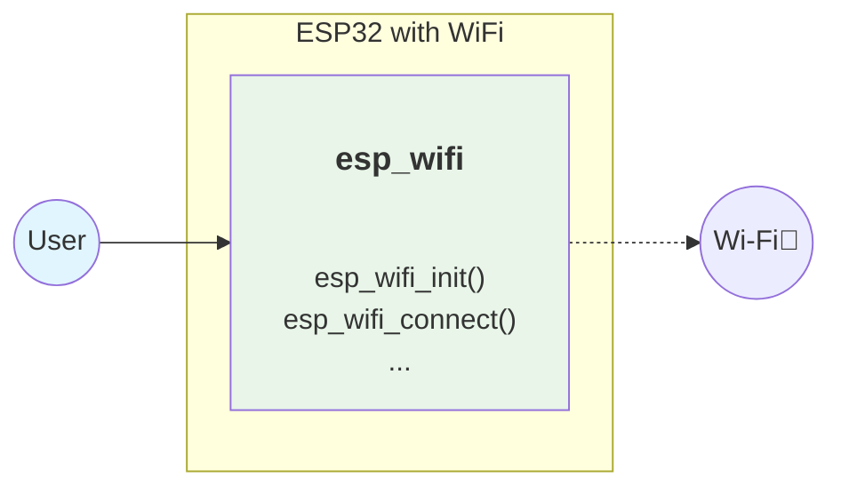
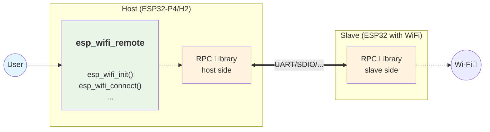
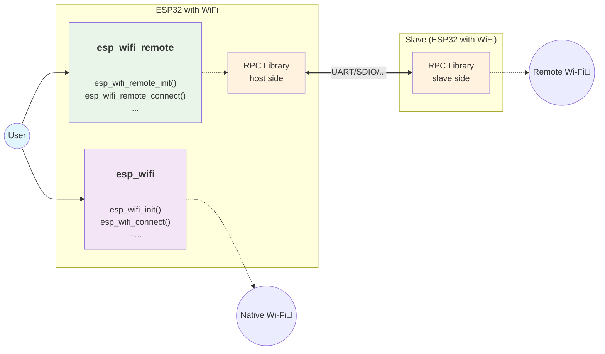
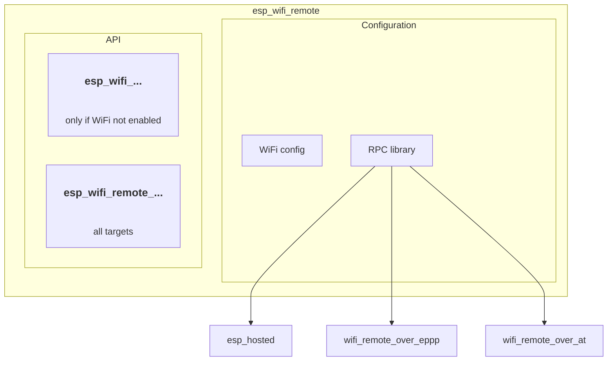

This blog post explores the esp-wifi-remote ecosystem, its components, architecture, and how it integrates with esp-hosted to provide seamless WiFi connectivity to previously WiFi-less devices.

## Introduction

The ESP-IDF's `esp_wifi` API is a mature and stable interface that has powered WiFi connectivity across generations of ESP32 chipsets. However, with the introduction of new ESP32 series chips that do not include native WiFi hardware—such as ESP32-P4 and ESP32-H2—developers may wonder: what WiFi API should they use on these devices? The answer is simple: by adding **esp-wifi-remote**, you can use exactly the same `esp_wifi` APIs on non-WiFi ESP chipsets as you would on traditional WiFi-enabled ones. This seamless compatibility allows developers to leverage their existing knowledge and codebase, extending WiFi functionality to a broader range of ESP devices with minimal changes.

## Understanding the WiFi Experience

Let's first look at the traditional WiFi experience to see how esp-wifi-remote enables the same seamless experience with external WiFi hardware.

### 1. Traditional WiFi Experience

The standard approach where the ESP chip has native WiFi capabilities:



This is the conventional setup where applications directly interface with the WiFi hardware through the standard ESP-IDF WiFi APIs. The user experience is seamless—you call `esp_wifi_init()`, `esp_wifi_connect()`, and other familiar functions, and WiFi just works.

### 2. esp-wifi-remote: Same Experience, External Hardware

**esp-wifi-remote** is designed to provide exactly the same user experience as the traditional WiFi setup, but with external WiFi hardware. This works in two scenarios:
* Non-WiFi Chipsets: The traditional usecase of providing WiFi functionality on ESP32-P4
* WiFi enabled Chipsets: It is possible to use esp-wifi-remote on ESP32 chips which already have WiFi
  - narrow usecase where multiple WiFi interfaces are needed (e.g. for bridging networks, filtering packets, ...)
  - testing: to bootstrap your experience with esp-wifi-remote, just plug to ESP32's and run [two-station](...) example

#### Scenario A: Non-WiFi Chipsets

For chipsets without native WiFi support (like ESP32-P4, ESP32-H2), esp-wifi-remote provides a transparent bridge to external WiFi hardware:



The magic here is that your application code remains identical to the traditional WiFi case. You still call `esp_wifi_init()`, `esp_wifi_connect()`, and all the familiar functions—esp-wifi-remote transparently redirects these calls through the RPC layer to a WiFi-capable slave device.

#### Scenario B: WiFi-Enabled Chipsets with Additional Interfaces

For chipsets that already have WiFi, esp-wifi-remote can add additional wireless interfaces, giving you both native and remote WiFi capabilities:



This scenario enables dual WiFi interfaces—one native and one remote—providing enhanced connectivity options for complex applications that need multiple wireless connections.

## Component breakdown

esp_wifi_remote is just a thin layer that translates esp_wifi API calls into the appropriate implementation, but it's important to understand these basic aspects:
* API
  - Remote WiFi calls: Set of esp_wifi API namespaced with `esp_wifi_remote` prefix
  - Standard WiFi calls: esp_wifi API directly translates to esp_wif_remote API for targets with no WiFi.
* Configuration: Standard WiFi library Kconfig options and selection of the RPC library



### WiFi configuration

You can configure the remote WiFi exactly the same way as the local WiFi, the Kconfig options are structured the same way and called exactly the same, but located under ESP WiFi Remote component instead.

**Important**

The names of Kconfig options are the same, but the identifiers are prefixed differently in order to differentiate between local and remote WiFi. If you're migrating your project from a WiFi enabled device and used specific configuration options, please make sure the remote config options are prefixed with `WIFI_RMT_` instead of `ESP_WIFI_`, for example:
```
CONFIG_ESP_WIFI_TX_BA_WIN -> CONFIG_WIFI_RMT_TX_BA_WIN
CONFIG_ESP_WIFI_AMPDU_RX_ENABLED -> CONFIG_WIFI_RMT_AMPDU_RX_ENABLED
...
```

**Important**

All WiFi remote configuration options are available, but some of them are not directly related to the **host side** configuration and since these are compile time options, wifi-remote cannot automatically reconfigure the **slave side** in runtime.
It is important to configure the options on the slave side manually and rebuild the slave application.
The RPC libraries could perform a consistency check but cannot reconfigure the slave project.

### Choice of esp-wifi-remote implementation component

The default and recommended option is to use `esp_hosted` as your RPC library.
You can also switch to `eppp` or `at` based implementation or implement your own RPC mechanism.

Here are the reasons you might prefer some other implementation than `esp_hosted`:
* Your application is not aiming for the best network throughput.
* Your slave (or host) device is not an ESP32 target and you want to use some standard protocol -> choose `EPPP` since it uses PPPoS protocol and works seamlessly with `pppd` on linux.
* You prefer encrypted RPC communication between host and slave device, especially when passing WiFi credentials.
* You might need some customization on the slave side

#### Comparison of PRC libraries

**Principle of operation**

Diagrams..

[esp-hosted]

[wifi_remote_over_eppp]

[wifi_remote_over_at]

**Performace**

## Other options

[ext-conn]
  - jack

[custom-implementation]
  - esp-modem + esp-at
  - eppp-link

## Conclusion

* Use esp-hosted
* Mind the WiFi slave configuration

## Read more

* [esp-hosted]
* [OTA]
* [slave-side-update]

---
