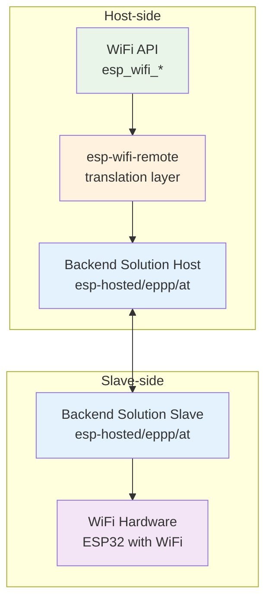

This blog post explores the esp-wifi-remote ecosystem, its components, architecture, and integration with esp-hosted to provide WiFi connectivity to previously WiFi-less devices.

## Introduction

The ESP-IDF's `esp_wifi` API powers WiFi connectivity across ESP32 chipsets. However, new ESP32 series chips like ESP32-P4 and ESP32-H2 lack native WiFi hardware. With **esp-wifi-remote**, you can use the same `esp_wifi` APIs on non-WiFi ESP chipsets as on WiFi-enabled ones. This compatibility lets developers leverage existing knowledge and codebase with minimal changes.

### Terminology

Before diving into the details, let's establish the key terminology used throughout this post:


**Backend Solution**: The communication layer that handles the transport of WiFi commands, events, and data between host and slave devices. Examples include esp-hosted, eppp, and AT-based implementations.

**Host-side**: The device running your application code (e.g., ESP32-P4, ESP32-H2, or ESP32 with WiFi).

**Slave-side**: The WiFi-capable device that provides the actual WiFi hardware and functionality.


## Understanding the WiFi Experience

Let's examine the traditional WiFi experience and how esp-wifi-remote enables the same experience with external WiFi hardware.



Let's look into these three use cases below:
- **1) Traditional WiFi Experience:** The standard approach where users call `esp_wifi_...()` API to control the local WiFi.
- **2A) esp-wifi-remote with non WiFi Chips:** The Same experience, users call `esp_wifi_...()` API to control the external hardware -- Remote Wifi.
- **2B) esp-wifi-remote with WiFi-capable Chips:** This scenario enables dual WiFi interfaces for applications that need multiple wireless connections.
  - Users call `esp_wifi_...()` API to control the local WiFi.
  - Users call `esp_wifi_remote_...()` API to control the remote WiFi.
  - This scenario is also useful for initial exploring of `esp-wifi-remote` functionality with just two "common" ESP32 chips -- For basic setup, you just need two evaluation boards connected with two wires and ground.

## Component breakdown

esp_wifi_remote is a thin layer that translates esp_wifi API calls into the appropriate implementation. Key aspects:
* API
  - Remote WiFi calls: Set of esp_wifi API namespaced with `esp_wifi_remote` prefix
  - Standard WiFi calls: esp_wifi API directly translates to esp_wifi_remote API for targets with no WiFi.
* Configuration: Standard WiFi library Kconfig options and selection of the backend solution

### WiFi configuration

You can configure remote WiFi the same way as local WiFi. Kconfig options are structured identically but located under ESP WiFi Remote component.

#### Local vs. Remote WiFi configuration

Kconfig option names are the same, but identifiers are prefixed differently to differentiate between local and remote WiFi.

> [!TIP] Adapt options from sdkconfig
> If you're migrating your project from a WiFi enabled device and used specific configuration options, please make sure the remote config options are prefixed with `WIFI_RMT_` instead of `ESP_WIFI_`, for example:

```
CONFIG_ESP_WIFI_TX_BA_WIN -> CONFIG_WIFI_RMT_TX_BA_WIN
CONFIG_ESP_WIFI_AMPDU_RX_ENABLED -> CONFIG_WIFI_RMT_AMPDU_RX_ENABLED
...
```

> [!IMPORTANT]
> All WiFi remote configuration options are available, but some of them are not directly related to the **host side** configuration and since these are compile time options, wifi-remote cannot automatically reconfigure the **slave side** in runtime.
> It is important to configure the options on the slave side manually and rebuild the slave application.

The backend solutions could perform a consistency check but cannot reconfigure the slave project.

### Choice of esp-wifi-remote implementation component

The default and recommended option is `esp_hosted` as your backend solution for most use-cases, providing the best performance, integration, maturity and support.

You can also switch to `eppp` or `at` based implementation or implement your own backend solution.
Here are the reasons you might prefer some other implementation than `esp_hosted`:
* Your application is not aiming for the best network throughput.
* Your slave (or host) device is not an ESP32 target and you want to use some standard protocol -> choose `EPPP` since it uses PPPoS protocol and works seamlessly with `pppd` on linux.
* You prefer encrypted communication between host and slave device, especially when passing WiFi credentials.
* You might need some customization on the slave side

### Internal implementation

The `esp-wifi` component interface depends on WiFi hardware capabilities. `esp-wifi-remote` follows these dependencies based on the slave WiFi hardware. Some wireless and system capability flags are replaced internally with `SOC_SLAVE` prefix. Host-side config options are prefixed with `WIFI_RMT` for use in `esp-wifi-remote` headers. See [WiFi remote](https://github.com/espressif/esp-wifi-remote/blob/main/components/esp_wifi_remote/README.md#dependencies-on-esp_wifi) documentation for details.

> [!Note]
> These options and flags are only related to the host side, as `esp-wifi-remote` is a host side layer. For slave side options, please refer to the actual backend solution implementation.

#### Comparison of backend solution components

This section compares backend solutions, focusing on how different methods marshall WiFi commands, events and data to the slave device.

**Principle of operation**


esp-hosted uses a plain text channel to send and receive WiFi API calls and events. It uses other plain text channels for data packets (WiFi station, soft-AP, BT/BLE). The TCP/IP stack runs only on the host side and esp-hosted passes Ethernet frames (802.3) from host to slave, where they are queue directly to the WiFi library.



`wifi_remote_over_eppp` creates a point to point link between host and slave device, so each side have their IP addresses. WiFi API calls and events are transmitted using SSL/TLS connection with mutual authentication. The data path uses plain text peer to peer connection by means of IP packets. Both host and slave device run TCP/IP stack. The slave device runs network address translation (NAT) to route the host IP packets to the WiFi network -- this is a limitation, since the host device is behind NAT, so invisible from the outside and the translation has a performance impact (to overcome this, you can enable Ethernet frames via custom channels, so the data are transmitted the same way as for `esp-hosted` method, using 802.3 frames).




`wifi_remote_over_at` uses `esp-at` project as the slave device, so the host side only run standard AT commands. It's implemented internally with `esp_modem` component that handles basic WiFi functionality. Note that not all configuration options provided by *esp-wifi-remote* are supported via AT commands, so this method is largely limited.




**Performance**

The best throughput is achieved with `esp_hosted` implementation.

| Backend Solution  | Maximum TCP throughput | More details |
|----------------|------------------------|---------------|
| esp_hosted_mcu | up to 50Mbps           | [esp-hosted](https://github.com/espressif/esp-hosted-mcu?tab=readme-ov-file#hosted-transports-table) |
| wifi_remote_over_eppp | up to 20Mbps      | [eppp-link](https://github.com/espressif/esp-protocols/blob/master/components/eppp_link/README.md#throughput) |
| wifi_remote_over_at | up to 2Mbps     | [esp-at](https://github.com/espressif/esp-at) |

## Other connectivity options

This blog post focuses on *esp-wifi-remote* solutions only. It doesn't discuss Bluetooth, BLE connectivity, `esp-extconn` component or other means of using Wi-Fi library on remote targets.

### esp-extconn

This solution doesn't fall into *esp-wifi-remote* category and needs a special target for the slave side (ESP8693), but provides the best throughput (up to 80Mbps). See [esp-extconn repository](https://github.com/espressif/esp-extconn/)

### Custom connectivity other options

You can also implement your own Wi-Fi connectivity using these components:

| component | Repository | Brief description |
|-----------|------------|-------------------|
| esp-modem | [esp-protocols](https://github.com/espressif/esp-protocols/blob/master/components/esp_modem) | AT command and PPP client |
| esp-at | [esp-at](https://github.com/espressif/esp-at) | serving AT commands on ESP32 |
| eppp-link | [esp-protocols](https://github.com/espressif/esp-protocols/blob/master/components/eppp_link) | PPP/TUN connectivity engine |


## Conclusion

**esp-wifi-remote** bridges the gap between WiFi-enabled and non-WiFi ESP32 chipsets, providing a seamless development experience that maintains API compatibility while extending WiFi functionality to previously WiFi-less devices. Through its transparent translation layer, developers can leverage their existing `esp_wifi` knowledge and codebase with minimal changes.

The below tips emerge from this exploration:

**1. Use esp-hosted as your backend solution** - Provides optimal performance (50Mbps), mature integration, and comprehensive support. Alternatives like `wifi_remote_over_eppp` (20Mbps) and `wifi_remote_over_at` (2Mbps) exist for specific scenarios.

**2. Mind the WiFi slave configuration** - esp-wifi-remote operates as a compile-time configuration system. Developers must manually configure slave-side WiFi options and rebuild the slave application. When migrating from WiFi-enabled devices, configuration options must be prefixed with `WIFI_RMT_` instead of `ESP_WIFI_`.

**3. Bootstrap your remote WiFi experience with WiFi chips** - To get started without the actual ESP32-P4, just connect your two ESP32 with two wires and run [the two station](https://github.com/espressif/esp-wifi-remote/tree/main/components/esp_wifi_remote/examples/two_stations) example.

Following these guidelines enables successful esp-wifi-remote implementation across diverse ESP32 hardware platforms.

## References

* [esp-wifi-remote repository](https://github.com/espressif/esp-wifi-remote)
* [esp-wifi-remote in component registry](https://components.espressif.com/components/espressif/esp_wifi_remote)
* [esp-hosted](https://github.com/espressif/esp-hosted-mcu)
* [esp-extconn](https://github.com/espressif/esp-extconn/)
* [ESP32-P4 connectivity options](https://developer.espressif.com/blog/wireless-connectivity-solutions-for-esp32-p4/)
