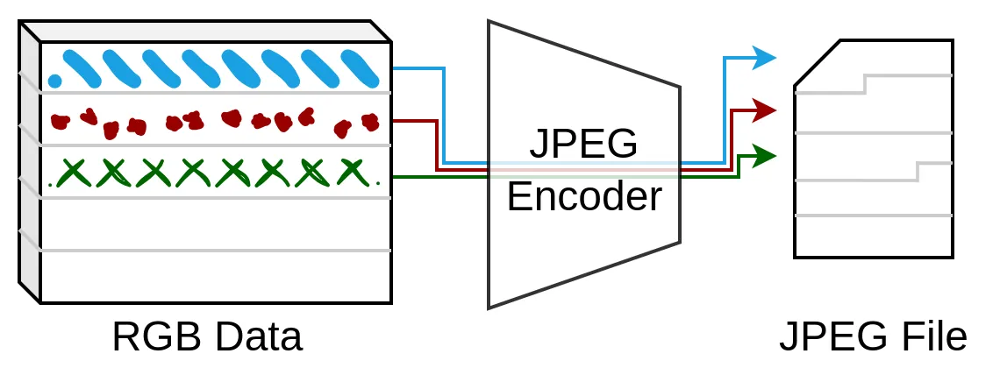
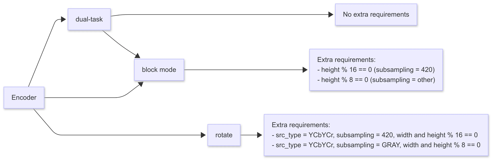
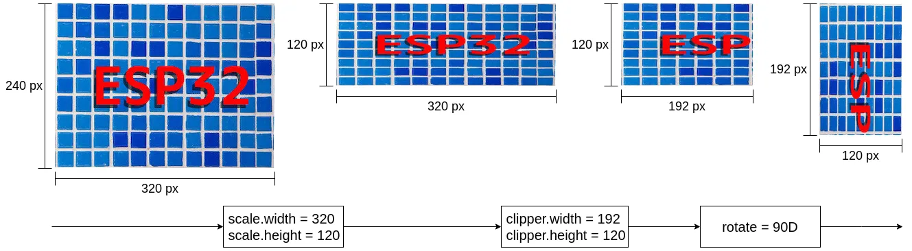
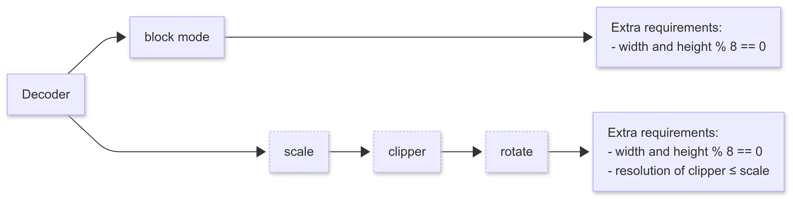

JPEG is a widely used image compression format, favored for its high compression ratio and good visual quality. However, running a JPEG encoder or decoder on resource-constrained embedded devices can be challenging, especially on chips without hardware JPEG support, as the encoding and decoding process often consumes significant CPU and memory resources.

To address this issue, Espressif has released the [ESP_NEW_JPEG](https://components.espressif.com/components/espressif/esp_new_jpeg) component, which features a highly optimized software codec and leverages SIMD instructions to enhance processing efficiency. This article provides a brief overview of the JPEG compression principles and explains how to use ESP_NEW_JPEG, along with important usage notes.

## General Knowledge of JPEG

In image processing, the camera typically captures and the display screen presents raw image data. Taking a common RGB888 color image as an example, each pixel contains information from three color channels: red, green, and blue, with each channel typically occupying one byte. For an image captured from a VGA camera (640×480 pixels), the total size is calculated as width × height × bytes per pixel = 640 × 480 × 3 = 921600 bytes, or roughly 900 KB. For embedded devices with limited memory, this amount of raw image data is quite large.

To solve the problem of storage and transmission efficiency, the Joint Photographic Experts Group (JPEG) introduced the JPEG standard, which defines how a codec compresses image data into a byte stream and restores it during decoding. JPEG typically achieves a compression ratio of 10:1, reducing the size of the same image to just a few tens of kilobytes. This significantly saves storage space and reduces the bandwidth required for transmission.

JPEG is widely used in various scenarios, including digital photography, network transmission, and screen image display. Here are two typical applications:

1. Compressing images captured by a camera into JPEG format for storage on an SD card or transmission over a network.
2. Decoding JPEG images into image data for screen display.

JPEG compression is a lossy compression technique that makes use of the human eye's insensitivity to color details and high-frequency information. It selectively discards parts of the image data to reduce file size without significantly affecting visual quality. Additionally, JPEG further reduces the file size using compression techniques such as entropy coding, ensuring good visual quality while significantly decreasing storage and transmission requirements.

The JPEG compression process can be summarized in the following steps:

1. **Color Space Conversion**: The image is converted from the RGB color space to the YCbCr color space, separating luminance (Y) and chrominance (Cb, Cr) components. Since the human eye is more sensitive to luminance, chrominance components can be compressed at a lower resolution in subsequent steps.
2. **Image Block Division**: The image is divided into small blocks, with each block processed independently to simplify calculations and improve compression efficiency.
3. **Discrete Cosine Transform (DCT)**: A discrete cosine transform is applied to each block, converting the image data from the spatial domain to the frequency domain. This transformation concentrates the image's energy into the lower-frequency components.
4. **Quantization**: The DCT coefficients are compressed based on a predefined quantization table. Smaller or higher-frequency coefficients are set to zero, making it easier to compress the data in the next steps.
5. **Entropy Coding**: The quantized coefficients are arranged and further compressed using entropy coding techniques such as Huffman coding, resulting in the final JPEG byte stream.

## Introduction to ESP_NEW_JPEG

[ESP_NEW_JPEG](https://components.espressif.com/components/espressif/esp_new_jpeg) is a lightweight JPEG codec library developed by Espressif. To enhance efficiency, the JPEG encoder and decoder have been deeply optimized to reduce memory usage and improve processing performance. On ESP32-S3 chips that support SIMD instructions, these instructions are utilized to further accelerate processing. In addition, features like rotate, clipper, and scale have been integrated, allowing them to be performed simultaneously during encoding or decoding, simplifying user operations. For chips with limited memory, a block mode is introduced, enabling multiple passes over portions of the image to reduce memory loading.

ESP_NEW_JPEG supports baseline profile JPEG encoding and decoding. Features such as rotate, clipper, scale, and block mode are only effective under specific configurations. The next two sections will provide detailed information on the functions and configuration requirements of the encoder and decoder.

### Functions of JPEG Encoder

Basic features supported by the encoder:

- Support encoding for any width and height
- Support pixel formats: RGB888, RGBA, YCbYCr, YCbY2YCrY2, and GRAY
  - When using the YCbY2YCrY2 format, only YUV420 and Gray subsampling are supported
- Support YUV444, YUV422, YUV420, and Gray subsampling
- Support quality settings in the range of 1-100

Extended features:

- Support 0°, 90°, 180°, and 270° clockwise rotation
- Support dual-task encoding
- Support block mode encoding

The dual-task encoder can be used on dual-core chips, taking full advantage of parallel encoding. The principle is that one core handles the main encoding task, while the other core is responsible for the entropy encoding part. In most cases, enabling dual-core encoding provides approximately a 1.5x performance boost. You can configure whether to enable dual-core encoding and adjust the core ID and priority for the entropy encoding task through menuconfig.

Block mode refers to encoding one image block at a time. After multiple passes, the entire image is encoded. In YUV420 subsampling, each block has a height of 16 rows and a width equal to the image width. For other subsampling, each block has a height of 8 rows and a width equal to the image width. Since block encoding processes smaller chunks of data at a time, the image buffer can be stored in DRAM, which improves encoding speed. The workflow for block encoding is shown in the diagram below:

<figure style="width: 90%; margin: 0 auto; text-align: center;">
    
    <figcaption>Block mode encoder processing workflow</figcaption>
</figure>

The configuration requirements for extended features are as follows:

<figure style="width: 90%; margin: 0 auto; text-align: center;">
    
    <figcaption>The configuration requirements of encoder</figcaption>
</figure>

- When dual-task encoding is enabled, the rotation feature is not supported
- Block mode encoding requires the image height to be an integer multiple of the block height
- When rotation is enabled, only the two parameter combinations listed in the image are supported

### Functions of JPEG Decoder

Basic Features Supported by the Decoder:

- Support decoding for any width and height
- Support both single-channel and three-channel decoding
- Support pixel format outputs: RGB888, RGB565 (big endian), RGB565 (little endian), CbYCrY

Extended Features:

- Support scale (with a maximum reduction ratio of 1/8)
- Support clipper (with the top-left corner as the origin)
- Support 0°, 90°, 180°, and 270° clockwise rotation
- Support block mode decoding

The processing flow for scale, clipper, and rotate is sequential, as shown in the diagram below. The decoded JPEG data stream is first scaled, then clipped, and finally rotated before being output.

<figure style="width: 90%; margin: 0 auto; text-align: center;">
    
    <figcaption>Sequential processing flow of scale, clipper, and rotate</figcaption>
</figure>

When using scale and clipper, you need to configure the corresponding parameters in `jpeg_resolution_t` struct defined in `esp_jpeg_dec.h`, and it supports processing only the width or height individually. For example, if you want to clip only the width while keeping the height unchanged, you can set `clipper.height = 0`. For the processing flow illustrated above, both the detailed configuration and the simplified configuration described below are supported.

```c
    // Detailed configuration
    jpeg_dec_config_t config = DEFAULT_JPEG_DEC_CONFIG();
    config.output_type = JPEG_PIXEL_FORMAT_RGB565_LE;
    config.scale.width = 320;
    config.scale.height = 120;
    config.clipper.width = 192;
    config.clipper.height = 120;
    config.rotate = JPEG_ROTATE_90D;

    // Simplified configuration
    jpeg_dec_config_t config = DEFAULT_JPEG_DEC_CONFIG();
    config.output_type = JPEG_PIXEL_FORMAT_RGB565_LE;
    config.scale.width = 0;  // keep width unchanged by setting to 0
    config.scale.height = 120;
    config.clipper.width = 192;
    config.clipper.height = 0;  // keep height unchanged by setting to 0
    config.rotate = JPEG_ROTATE_90D;
```

Block mode refers to decoding one image block at a time. After multiple passes, the entire image is decoded. In YUV420 subsampling, each block has a height of 16 rows and a width equal to the image width. For other subsampling, each block has a height of 8 rows and a width equal to the image width. Since block decoding processes smaller chunks of data at a time, it is more suitable for chips without PSRAM. Additionally, placing the output image buffer in DRAM can also help improve decoding speed. Block decoding can be viewed as the reverse process of block mode encoding.

The configuration requirements for extended features are as follows:

<figure style="width: 90%; margin: 0 auto; text-align: center;">
    
    <figcaption>The configuration requirements of decoder</figcaption>
</figure>

- When block decoding is enabled, other extended features cannot be used
- The width and height in the configuration parameters for scale, clipper, and rotate must each be a multiple of 8
- When both scale and clipper are enabled, the clipped size must be smaller than the scaled size

## How to Use ESP_NEW_JPEG

The [ESP_NEW_JPEG](https://components.espressif.com/components/espressif/esp_new_jpeg) repository is hosted on [GitHub](https://github.com/espressif/esp-adf-libs/tree/master/esp_new_jpeg). You can add ESP_NEW_JPEG to your project by entering the following command in your project directory:

```bash
idf.py add-dependency "espressif/esp_new_jpeg"
```

The `test_app` folder under the `esp_new_jpeg` folder contains a runnable test project, which demonstrates the relevant API call flow. Before using ESP_NEW_JPEG, it is recommended to debug this test project to get familiar with the API usage. This section will further introduce the use cases within the `test_app`.

### Usage of JPEG Encoder

The reference code for encoding can be found in the `esp_new_jpeg/test_app/main/test_encoder.c` file. The typical encoding flow can be referenced from the `esp_jpeg_encode_one_picture` function. The execution sequence of this function is as follows:

1. Call `jpeg_enc_open` to create an encoder handle based on the configuration parameters.
2. Use `jpeg_enc_process` to encode the image data into JPEG.
3. Finally, call `jpeg_enc_close` to close the handle and release resources.

Block mode is suitable for chips with limited memory resources. The function `esp_jpeg_encode_one_picture_block` demonstrates the usage of block mode. The simplified code is as follows:

```c
jpeg_error_t esp_jpeg_encode_one_picture_block()
{
    // Configure encoder
    jpeg_enc_config_t jpeg_enc_cfg = DEFAULT_JPEG_ENC_CONFIG();
    int image_size = width * height * byte_per_pixel;

    // Initialize encoder
    jpeg_enc_handle_t jpeg_enc = NULL;
    jpeg_enc_open(&jpeg_enc_cfg, &jpeg_enc);

    // Get block_size and calculate process times
    int block_size = jpeg_enc_get_block_size(jpeg_enc);
    num_times = image_size / block_size;

    // Allocate input buffer to store a block of input image
    uint8_t *inbuf = (uint8_t *)jpeg_calloc_align(block_size, 16);
    // Allocate output buffer to store whole jpeg data
    uint8_t *outbuf = (uint8_t *)calloc(1, outbuf_size);

    // Encoding loop
    for (size_t j = 0; j < num_times; j++) {
        /* User logic: Prepare data for encoding */

        // Encode a block of image
        ret = jpeg_enc_process_with_block(jpeg_enc, inbuf, block_size, outbuf, outbuf_size, &out_len);
        if (ret < JPEG_ERR_OK) {
            goto jpeg_example_exit;
        }
    }

jpeg_example_exit:
    /* User logic: Finish encoding */

    // Release resource
    jpeg_enc_close(jpeg_enc);
    jpeg_free_align(inbuf);
    free(outbuf);
}
```

### Usage of JPEG Decoder

The reference code for decoding can be found in the `esp_new_jpeg/test_app/main/test_decoder.c` file. The typical decoding operations can be referenced from the `esp_jpeg_decode_one_picture` function. The decoding process is as follows:

1. Call `jpeg_dec_open` to create a decoder handle based on the configuration parameters.
2. Use `jpeg_dec_parse_header` to parse the JPEG header.
3. Call `jpeg_dec_process` to decode the JPEG data into image data.
4. Finally, call `jpeg_dec_close` to close the handle and release resources.

Block mode is commonly used for decoding JPEG data and displaying it on an LCD screen. Using block mode, each small chunk of data can be directly decoded and output to the LCD buffer, reducing memory copying and improving decoding efficiency. You can refer to the calling logic of the `esp_jpeg_decode_one_picture_block` function for implementation.

If continuous decoding of multiple JPEG files with the same size, subsampling, and other parameters is required, such as decoding and displaying an AVI video, refer to the functions `esp_jpeg_stream_open`, `esp_jpeg_stream_decode`, and `esp_jpeg_stream_close`. The simplified calling logic is as follows:

1. Create a decoder handle before decoding.
2. In each loop, call the decoding operation for continuous decoding.
3. After decoding is completed, release the decoder resources.

This method avoids allocating and releasing JPEG decoder resources with each decode, reducing unnecessary memory allocation and release operations, thereby improving efficiency. The simplified calling logic is shown below:

```c
jpeg_error_t esp_jpeg_stream_open()
{
    jpeg_dec_open();
}

jpeg_error_t esp_jpeg_stream_decode()
{
    jpeg_dec_parse_header();
    jpeg_dec_process();
}

jpeg_error_t esp_jpeg_stream_close()
{
    jpeg_dec_close();
}

void user_logic()
{
    // Init decoder
    esp_jpeg_stream_open();

    // Decoding jpeg
    while (/* Loop logic */) {
        esp_jpeg_stream_decode();
    }

    // Release resource
    esp_jpeg_stream_close();
}
```

## Conclusion

ESP_NEW_JPEG is a lightweight JPEG encoding and decoding library deeply optimized for the ESP32 series chips, offering efficient image compression and decompression capabilities. The library supports various features, including rotation, clipping, scaling, and block mode, enabling flexible handling of image data processing requirements in different application scenarios. We look forward to your experience with ESP_NEW_JPEG in practical applications and welcome your valuable feedback to help us continuously optimize and enhance the library's performance and features.
