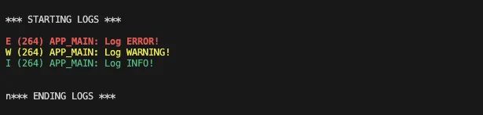

## Introduction

The most straightforward way to see what your C program is doing is to drop in a few `printf` statements. It’s simple, immediate, and every developer knows how to use it. But as soon as your application grows beyond a toy example, `printf` starts to show its limits: output becomes messy, important details get buried, and managing those statements turns into a chore. Using a logging library, on the other hand, gives you structured, configurable, and context-rich feedback without scattering prints all over your code.

It lets you control what gets recorded, where it goes, and how it looks, all while keeping your source clean. Additionally, logging can be easily disabled in production builds via a configuration option, so you don’t have to worry about performance or leaking sensitive information. In the sections that follow, we’ll refer to the logging library simply as “logging,” and we’ll explore why it is better than `printf` for debugging, as well as how adopting it can make your codebase easier to maintain and scale.


## Logging library

The ESP-IDF provides its logging functionality through the `log` component, included via `esp_log.h`. You’ve probably already seen this logging in action, as it’s used extensively throughout the ESP-IDF libraries.

ESP-IDF offers two logging implementations: __Log V1__ and __Log V2__, selectable through `CONFIG_LOG_VERSION`. Log V1 is the simpler, default option optimized for early and DRAM logging but with higher flash usage and limited flexibility, while Log V2 reduces flash usage, adds powerful customization features, and centralizes formatting at the cost of slightly higher stack usage. In this article, we will focus on Log V1, while Log V2 will be covered in a future article.


Let’s examine the output from the `hello_world` example. When you monitor your device while running `hello_world`, you’ll see something like:
<!--
```bash
[...]
I (223) spi_flash: flash io: dio
W (226) spi_flash: Detected size(4096k) larger than the size in the binary image header(2048k). Using the size in the binary image header.
I (238) sleep_gpio: Configure to isolate all GPIO pins in sleep state
I (245) sleep_gpio: Enable automatic switching of GPIO sleep configuration
I (251) main_task: Started on CPU0
I (251) main_task: Calling app_main()
[...]
``` -->




Lines starting with `I` are shown in green, while those starting with `W` appear in orange. These are examples of log messages: `I` denotes an informational message, and `W` denotes a warning. Although both are essentially printed messages with some extra formatting, they represent conceptually different types of messages. Their visibility can be controlled through a configuration parameter called *verbosity*.

### Logging core elements

To grasp how logging works in ESP-IDF, we will examine its three core elements:

* Tags
* Logging macros
* Verbosity levels

<!--
In the ESP-IDF logging system, verbosity levels such as ERROR, WARNING, INFO, DEBUG, and VERBOSE let you control the amount and type of information your application produces. By adjusting the log level, you can focus on critical errors in production while enabling detailed debug information during development or troubleshooting. This selective filtering keeps logs readable, improves performance, and helps you quickly pinpoint issues without wading through irrelevant messages. -->

#### Tags

A tag is simply a string used to group related log messages, typically by file or component. Tags are passed to the logging macros, as demonstrated in the next section. A common convention is to define a `TAG` constant as a `static const char *` pointer. In ESP-IDF, tags are usually declared at the top of the file like this:

```c
static const char *TAG = "TAG_NAME";
```


The `static` keyword limits the symbol’s visibility to the current file, while `const` ensures the string is stored in read-only memory instead of consuming RAM.


#### Logging macros

ESP-IDF offers a powerful logging system through the `ESP_LOGx` family of macros that are used for reporting errors, warnings, and other runtime information. These macros are task-safe, lightweight, and can be grouped per tag.

The available macros are:

* `ESP_LOGE` – Error
* `ESP_LOGW` – Warning
* `ESP_LOGI` – Info
* `ESP_LOGD` – Debug
* `ESP_LOGV` – Verbose

Here is a sample showing how to use one of these macros in your code:

```c
ESP_LOGE(TAG, "Failed to initialize sensor: %s", esp_err_to_name(ret));
```

Each logging macro takes two main arguments:

* __Tag__ - the label under which the log will be grouped.
* __Message__ – a `printf`-style format string followed by variadic arguments.

#### Verbosity

The difference between the logging macros is not just visual, it’s also tied to the _verbosity level_.
Verbosity levels determine which messages are actually printed to the serial console.

The reason why it’s possible to change the verbosity is that reducing it in ESP-IDF (e.g., via `CONFIG_LOG_DEFAULT_LEVEL`) provides several advantages:

* **Smaller binary size:** Fewer log strings and logging calls reduce the compiled code size.
* **Lower CPU load:** With fewer logs generated, the CPU spends less time formatting and outputting messages, improving runtime performance.
* **Reduced memory usage:** Less memory is needed for log strings and temporary buffers, which helps applications with tight memory limits.

These optimizations make logging more efficient without losing control over critical messages.


The `esp_log` component supports the following levels, from lowest to highest:

* __No output__
* __Error__
* __Warning__
* __Info__
* __Debug__
* __Verbose__

This order matters: for example, `ESP_LOGE` messages will appear even at the lowest verbosity setting that allows output, while `ESP_LOGV` messages are only shown when verbosity is set to the highest level.

You can change the default verbosity level in `menuconfig`:

   * `> ESP-IDF: SDK Configuration Editor (menuconfig)`<br>
    &rarr; `Component Config Log Level` &rarr; `Default Log Verbosity`


Fig.2 illustrates how different verbosity settings affect which log messages are shown. The default verbosity level is _info_.



### Filtering Logs

ESP-IDF gives you fine-grained control over log output, allowing you to filter messages by verbosity level and tag. You can do this both __at runtime in your application__ and __from the host using the IDF monitor__.

#### Filtering at Runtime

You can also adjust log verbosity directly within your application using the `esp_log_level_set()` function:

```c
esp_log_level_set("TAG", ESP_LOG_WARN); // Only warnings and errors for "TAG"
esp_log_level_set("TAG", ESP_LOG_NONE); // Disable all logs for "TAG"
```

This makes it possible to dynamically change log levels for specific modules or components while your program is running.


#### Filtering in the IDF Monitor

When using the IDF monitor, you can control which logs are displayed by filtering them by tag and verbosity level. This can be done with the `--print-filter` option or by setting the `ESP_IDF_MONITOR_PRINT_FILTER` environment variable. All logs are still transferred to the host over the serial port, but only those that match the filter are shown.

A filter is defined as a series of `<tag>:<log_level>` pairs, where `<log_level>` can be one of:

* `N` (None)
* `E` (Error)
* `W` (Warning)
* `I` (Info)
* `D` (Debug)
* `V` (Verbose)
* `*` (all)

For example you can write

```sh
idf.py monitor --print-filter="tag1:W"
```

Shows only warnings and errors for `tag1`.

```sh
idf.py monitor --print-filter="tag1:I tag2:W"
```

Shows `tag1` logs at Info level or less, and `tag2` logs at Warning level or less.

If no log level is specified, the default is __verbose__. You can also define global filters. For instance, `*:E` displays only errors across all tags.


Tag names must not include spaces, asterisks `*`, or colons `:`.
More details: [ESP-IDF Monitor Output Filtering](https://docs.espressif.com/projects/esp-idf/en/latest/esp32/api-guides/tools/idf-monitor.html#output-filtering).



## Putting it all together

Let’s try out the logging system in practice.
We’ll start from a bare-bones example available on [this GitHub repository](https://github.com/FBEZ-docs-and-templates/devrel-tutorials-code/tree/main/tutorial-basic-project).

The `main.c` file for this example looks like this:
```c
#include <stdio.h>
#include "sdkconfig.h"


void app_main(void)
{
    printf("Hello tutorial!\n");
}
```

In this section we will
1. Assign a tag to the logs (i.e. `TAG`)
2. Log a message for each level
3. Change verbosity level and check the output

### Assign a tag to the logs

When using a logging macro, the first argument is a _tag_ that groups related log messages.
You can pass a string literal directly, but it’s usually better to define a constant and reuse it throughout the same component or file.


In our example, we’ll use:

```c
static const char *TAG = "APP_MAIN";
```

### Log a message for each level

Before using the log macros, include the `esp_log.h` header:

```c
#include "esp_log.h"
```

Next, replace the `app_main` function with the following:

```c
void app_main(void)
{
    printf("\n\n\n*** STARTING LOGS ***\n\n");
    ESP_LOGE(TAG, "Log ERROR!");
    ESP_LOGW(TAG, "Log WARNING!");
    ESP_LOGI(TAG, "Log INFO!");
    ESP_LOGD(TAG, "Log DEBUG!");
    ESP_LOGV(TAG, "Log VERBOSE!");
    printf("\n\n\n*** ENDING LOGS ***\n\n\n");
}
```


The `printf` statements are used simply to separate the logs we created from the default ESP-IDF logs.


Now, build, flash, and monitor the code:

* `> ESP-IDF: Build, Flash and Start a Monitor on Your Device`

The relevant output is shown in Fig. 3.

<!--  -->



You can see that the error log appears in red, the warning log in yellow, and the info log in green.
The debug and verbose logs are missing because the current verbosity level does not allow them to be displayed.

### Change verbosity level and check the output

Let’s inspect the current verbosity level in `menuconfig`:

* `> ESP-IDF: SDK Configuration Editor (menuconfig)`<br>
  &rarr; `Component Config` &rarr; `Log Level` &rarr; `Default Log Verbosity`

The dropdown menu (see Fig. 4) lists all available levels. By default, it is set to `info`.



Now, let’s see what happens when we increase the verbosity:

* Change the dropdown value to `verbose`
* Save the configuration
* Build, flash, and start the monitor:<br>

   * `> ESP-IDF: Build, Flash and Start a Monitor on Your Device`

As expected, all log levels are now displayed, as shown in Fig. 5.



Note that the `ESP_LOGD` and `ESP_LOGV` messages appear in white, similar to `printf`.


For production, logs are usually disabled. You can do this by selecting `No output` in the dropdown menu.


### Change verbosity at runtime

You can also adjust the logging verbosity while your program is running.
Update your `app_main` function as follows:

```c
void app_main(void)
{
    printf("\n\n\n*** STARTING LOGS ***\n\n");
    ESP_LOGE(TAG, "Log ERROR!");
    ESP_LOGW(TAG, "Log WARNING!");
    ESP_LOGI(TAG, "Log INFO!");
    ESP_LOGD(TAG, "Log DEBUG!");
    ESP_LOGV(TAG, "Log VERBOSE!");

    esp_log_level_set("main", ESP_LOG_WARN);

    ESP_LOGE(TAG, "Log ERROR after set level");
    ESP_LOGW(TAG, "Log WARNING set level");
    ESP_LOGI(TAG, "Log INFO set level");
    ESP_LOGD(TAG, "Log DEBUG!");
    ESP_LOGV(TAG, "Log VERBOSE!");
    printf("\n\n\n*** ENDING LOGS ***\n\n\n");
}
```

In this example, we first print all log levels, then change the verbosity level of the `main` component to `WARN`. After that, only warnings and errors will appear in the output.

* Build, flash, and monitor your device:

  * `> ESP-IDF: Build, Flash and Start a Monitor on Your Device`

Your output should now look similar to Fig.5.



As you can see, the configuration log level is set to verbose, so in the first block all messages—including verbose—are printed. After calling `esp_log_level_set`, the log level for the _main_ component is reduced to warning, so only warnings and errors are displayed from that point on.


### Filtering with esp-idf monitor

As a last step, let's use the `idf.py monitor` to filter only the logs with tag "main" and just the ones with verbosity level less than info.

* `> ESP-IDF: Open ESP-IDF Terminal`
* In the terminal type: `idf.py monitor --print-filter="main:I"`

The output should look like Fig. 6.



In this case, even though the verbosity level is set to __verbose__, the monitor filters out all messages with the main tag below _info_.

In this example, this process is equivalent to setting the verbosity level to info in `menuconfig`. However, when working with multiple components, you can set a different displayed verbosity level for each one individually.

## Conclusion

In this article, we explored the ESP-IDF logging system, showed how to define a module tag, used the `ESP_LOGx` macros for different severity levels, and adjusted verbosity to control which messages to display.

We also demonstrated how to change log levels at runtime and filter messages in the IDF monitor, giving developers fine-grained control over log visibility and improving both development efficiency and application performance.
Unlike `printf`, logging provides structured, context-rich output that can be filtered by level, grouped by module, and disabled in production, making debugging and monitoring much easier.

### Further Reading

* For a deeper dive into the **logging library**, see the [ESP-IDF Programming Guide](https://docs.espressif.com/projects/esp-idf/en/stable/esp32/api-reference/system/log.html).
* To explore all host-side filtering options, refer to the [IDF Monitor documentation](https://docs.espressif.com/projects/esp-idf/en/latest/esp32/api-guides/tools/idf-monitor.html#output-filtering).
