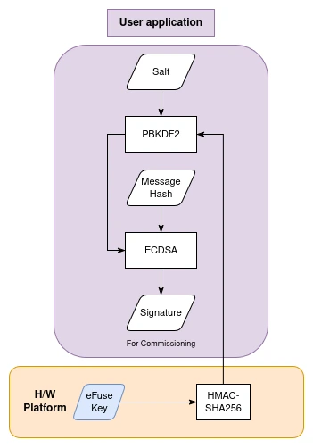
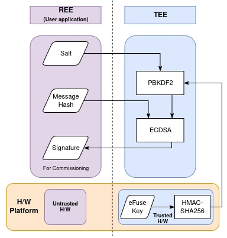
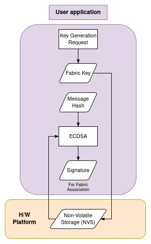
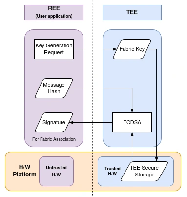
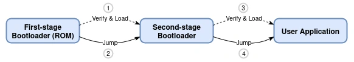
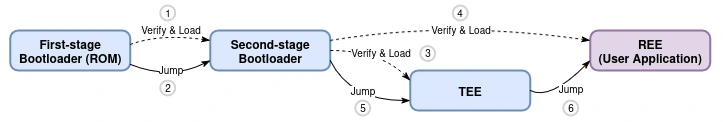

The introduction of the [ESP-TEE framework](https://developer.espressif.com/blog/2025/02/announcing-esp-tee/) for the ESP32-C6 SoC enables developers to integrate hardware-backed security directly into their connected products. By implementing a **Trusted Execution Environment (TEE)**, ESP-TEE provides secure storage and cryptographic computations within a **hardware-isolated environment** that is resistant to scalable remote software attacks.

Built on the **RISC-V architecture**, ESP-TEE on ESP32-C6 leverages specific ISA features like privilege modes, memory protection units, and custom hardware security features to establish a robust TEE. RISC-V's open architecture and security extensions (built-in and customized) delivers the transparent, auditable foundation that regulatory-compliant IoT security demands.

Designed with modern IoT security standards in mind, ESP-TEE naturally aligns with the **PSA Certified Level 2 (PSA-L2)** profile, helping manufacturers meet rigorous certification requirements with minimal integration effort.

<p align="center">
  
</p>
<figcaption style="text-align: center;">Matter with ESP-TEE</figcaption>

---

## The ESP-TEE Security Profile

The **ESP-TEE** framework extends the capabilities of the **ESP32 series SoCs** by creating a **hardware-enforced separation** between critical security functions and the regular application environment (Rich Execution Environment, REE).

- **Resistance to Scalable Remote Attacks**: Even if the user application (REE) is compromised, TEE-contained secrets remain secure, preventing large-scale remote key extraction.

- **Secure Key Management**: All private keys, both factory-provisioned and run-time generated, are derived and stored inside the TEE, never leave the protected environment, and are inaccessible to REE code.

- **Isolated Cryptographic Operations**: Signing, attestation, and key derivation execute entirely within the TEE, with the REE interacting only through controlled APIs - never accessing raw keys.

- **Feature-Rich Security Services**: ESP-TEE supports advanced features like TEE secure storage, secure OTA updates, and device attestation, enabling periodic verification of device identity and status through cryptographically secured tokens.

---

## Securing Matter Keys with ESP-TEE

As explained in [this article on the Matter Security Model](https://developer.espressif.com/blog/matter-security-model/), Matter devices have two primary types of keys that can be protected with ESP-TEE:

- **Device Attestation Certificate (DAC)** keys - Typically programmed once per device in the factory and used during device commissioning to establish device identity and authenticity.
- **Node Operational Certificate (NOC)** keys - Generated at runtime by the device whenever it joins a Matter Fabric and used for session establishment throughout the device's operational lifetime.

### Securing the Device Attestation Certificate (DAC)

According to the [ESP-Matter documentation](https://docs.espressif.com/projects/esp-matter/en/latest/esp32c6/security.html#device-identity), the ESP32-C6 supports protecting the **Device Attestation Certificate (DAC)** private key either through secure storage or by deriving it at runtime using the hardware HMAC peripheral. In both cases, the keys are securely stored either directly in persistent storage or as a source in eFuse, but they become accessible to the user application during signing operations such as commissioning.

ESP-TEE significantly enhances these approaches by executing all DAC operations entirely within the TEE, ensuring private keys remain inaccessible to the application code and fully hardware-protected.

1. **Secure Storage**: Stores the DAC private key in the TEE’s secure storage partition rather than in an encrypted [ESP Secure Certificate Manager](https://github.com/espressif/esp_secure_cert_mgr) format partition. The TEE secure storage also provides an interface to sign the given data with the required key ID. This ensures protection from any unauthorized software modifications.

2. **HMAC-based PBKDF2 Derivation**: Does not store the DAC private key at all. Instead, the key is computed at runtime using the ESP32-C6’s hardware HMAC peripheral (HMAC-SHA256) with PBKDF2. ESP-TEE controls access to the HMAC peripheral, so the entire key derivation process and signing happens in isolated execution environment, significantly reducing leakage risk.

<p align="center">
  
</p>
<figcaption style="text-align: center;">HMAC-based DAC: Standard Workflow</figcaption>

<p align="center">
  
</p>
<figcaption style="text-align: center;">HMAC-based DAC: Secured Workflow with ESP-TEE</figcaption>

### Securing Matter NOCs (Fabric Keys)

In non-TEE Matter deployments, **fabric keys** generated at runtime are stored in software-accessible memory, creating an attack surface for remote exploitation. With ESP-TEE, fabric keys are **either securely stored or derived inside the TEE**, and used for cryptographic operations without ever leaving the hardware-isolated environment - completely removing this vulnerability class.

<p align="center">
  
</p>
<figcaption style="text-align: center;">Fabric Keys: Standard Workflow</figcaption>

<p align="center">
  
</p>
<figcaption style="text-align: center;">Fabric Keys: Secured Workflow with ESP-TEE</figcaption>

---

## Implementation Considerations

Incorporating **ESP-TEE** into ESP-Matter introduces a few system-level changes compared to a standard ESP-Matter build. These trade-offs are expected given the additional security. We have ensured that this has minimal impact to the development workflows and memory footprint characterisations of the firmware.

Integration is straightforward and requires only:

- Enable ESP-TEE by setting the [`CONFIG_SECURE_ENABLE_TEE`](https://docs.espressif.com/projects/esp-idf/en/stable/esp32c6/api-reference/kconfig-reference.html#config-secure-enable-tee) Kconfig option.

- Update the partition table to include the required TEE components.

The rest of your development process remains unchanged - TEE firmware generation and signing are handled automatically by the build system. API compatibility is also ensured, so no modifications are required in the REE (user application).

Refer to the [ESP-TEE Usage](https://docs.espressif.com/projects/esp-idf/en/stable/esp32c6/security/tee/tee.html#usage) guide for more details.

### 1. Boot Flow Changes

The device boot sequence is modified when ESP-TEE is enabled. The TEE executes early in the boot process to handle all secure initialization for the system before the user application begins execution.

<p align="center">
  
</p>
<figcaption style="text-align: center;">Device Boot-up flow for ESP32-C6</figcaption>

<p align="center">
  
</p>
<figcaption style="text-align: center;">Device Boot-up flow for ESP32-C6 with ESP-TEE</figcaption>

The TEE supports secure Over-The-Air (OTA) firmware updates. The REE handles the download through any transport mechanism (e.g., HTTPS, MQTT), while the TEE manages the write process and verification before activation, automatically rolling back if an update fails. Note that REE (application) updates continue to work exactly as before. Refer to the [ESP-TEE OTA](https://docs.espressif.com/projects/esp-idf/en/stable/esp32c6/security/tee/tee-ota.html) guide for more details.


### 2. Memory Usage Impact

Enabling ESP-TEE introduces additional runtime overhead due to the TEE firmware and secure service execution. The following table shows measured heap usage before and after Matter commissioning for the `light` example:

| **Workflow**            | **Heap**  | **Standard** (KB) | **with ESP-TEE** (KB) | **△** (KB) |
|-------------------------|-----------|-------------------|-----------------------|-------------|
| **Boot-up**             | Free      | 276.35            | 245.19                | 31.16       |
|                         | Min. Free | 276.05            | 244.89                | 31.16       |
| **After Commissioning** | Free      | 185.54            | 153.51                | 32.03       |
|                         | Min. Free | 151.33            | 119.33                | 32.00       |

The memory delta represents the SRAM reserved for TEE operations, which can be managed through the [`CONFIG_SECURE_TEE_IRAM_SIZE`](https://docs.espressif.com/projects/esp-idf/en/stable/esp32c6/api-reference/kconfig-reference.html#config-secure-tee-iram-size) and [`CONFIG_SECURE_TEE_DRAM_SIZE`](https://docs.espressif.com/projects/esp-idf/en/stable/esp32c6/api-reference/kconfig-reference.html#config-secure-tee-dram-size) options. Also note that each secure service call incurs ~1000 CPU cycles to execute (6.25μs at 160MHz). This means commissioning and cryptographic flows will be slightly slower compared to standard implementations, but the difference is unnoticeable from an end-user perspective and system stability is not affected.

### 3. Partition Table Layout

With ESP-TEE, the flash layout i.e. the partition table needs to be modified. The partition table requires four additional partitions to accommodate TEE components: two partitions for the TEE app (192 KB each - enabling secure OTA updates), one partition for the TEE OTA data, and one partition for the TEE secure storage, which consumes 448 KB of flash memory.


While it is technically possible to use only one TEE app partition if TEE OTA is not  required, this configuration is not recommended for production deployments.


---

## Hands-On Example: Matter Light

To illustrate the above facts, we implemented a **Matter-enabled smart light** on the ESP32-C6 with the DAC protection handled by ESP-TEE. While the device in this example is a light, the same security profile applies equally to **any Matter device form factor** - from sensors to controllers.

> **Note:** This example uses experimental ESP-IDF and ESP-Matter branches for demonstration purposes. The workflow may change once ESP-TEE integration is officially supported in a stable ESP-Matter release.

### Prerequisites

Ensure you have both **ESP-IDF** and **ESP-Matter** installed and configured as per the [official ESP-Matter setup guide](https://docs.espressif.com/projects/esp-matter/en/latest/esp32c6/developing.html#getting-the-repository).

> **Tip:** Set `${idf_path}` and `${esp_matter_path}` to your ESP-IDF and ESP-Matter directories respectively.

### ESP-IDF

```bash
cd ${idf_path}
git remote add demo git@github.com:laukik-hase/esp-idf.git
git checkout demo/esp_matter_w_tee
```

### ESP-Matter

```bash
cd ${esp_matter_path}
git remote add demo git@github.com:laukik-hase/esp-matter.git
git fetch --no-recurse-submodules demo demo/esp_matter_w_tee
git checkout demo/esp_matter_w_tee

cd connectedhomeip/connectedhomeip
git remote add demo git@github.com:laukik-hase/connectedhomeip.git
git fetch --no-recurse-submodules demo demo/esp_matter_w_tee
git checkout demo/esp_matter_w_tee
```

These branches include the **experimental integration of ESP-TEE secure services** within the Matter Light example.

### Activating the Development Environment

```bash
export IDF_CCACHE_ENABLE=1

cd ${idf_path}
source export.sh

cd ${esp_matter_path}/connectedhomeip/connectedhomeip
source scripts/activate.sh

cd ../../
source export.sh
```

### Building and Flashing the Light Example

```bash
cd ${esp_matter_path}/examples/light
idf.py set-target esp32c6
idf.py -p <PORT> build flash
```

### Flashing Test Certificates

To simulate a secure device, flash the secure partitions and certificates for a factory-provisioned setup with a valid DAC and secure storage.

```bash
parttool.py --partition-table-offset 0xc000 erase_partition -n nvs
parttool.py --partition-table-offset 0xc000 write_partition -n secure_storage --input test_certs/esp_tee_sec_stg_nvs.bin
parttool.py --partition-table-offset 0xc000 write_partition -n esp_secure_cert --input test_certs/esp_secure_cert.bin
parttool.py --partition-table-offset 0xc000 write_partition -n fctry --input test_certs/partition.bin
```

### Monitoring Serial Output

Use the following to check initialization logs and confirm Matter + ESP-TEE setup:

```bash
idf.py monitor
```

### Alternative: PBKDF2-based DAC Workflow

By default, the example uses the DAC key stored in the TEE secure storage. To use the PBKDF2-based DAC workflow instead, follow the below steps.

First, burn the example HMAC key to eFuse:

```bash
espefuse.py -p PORT burn_key BLOCK_KEYx test_certs/hmac_key.bin HMAC_UP
```

*Note the eFuse key block number (x) - you'll need this in the next step.*

Configure ESP-TEE and Matter DAC settings with `menuconfig`:

```bash
idf.py fullclean
idf.py set-target esp32c6
idf.py menuconfig
```

- Navigate to `(Top) → ESP-TEE (Trusted Execution Environment) → Enable the ESP-TEE framework → Secure Services` and set `Secure Storage: eFuse HMAC key ID for PBKDF2 key derivation` to the value of **x**, the eFuse key block where the HMAC key was burned
- Navigate to `(Top) → Component config → CHIP Device Layer → Commissioning options → Use Secure Cert DAC Provider → Use ESP32 TEE (Trusted Execution Environment) → TEE: DAC key source` and enable `PBKDF2-HMAC derivation with eFuse key`

Save and exit the configuration, then build, flash, and test the example:

```bash
idf.py build flash
# No need to flash the test certificates again
parttool.py --partition-table-offset 0xc000 erase_partition -n nvs
idf.py monitor
```

### Device Commissioning

Commission your device using the [Matter controller tools](https://docs.espressif.com/projects/esp-matter/en/latest/esp32c6/developing.html#commissioning-and-control), such as the `chip-tool` or the ESP-Rainmaker mobile app.

---

## Conclusion

As regulatory frameworks such as the EU-CRA and RED DA come into force, and consumer expectations for security rise, ESP-TEE positions itself as a forward-looking solution for IoT. Its combination of hardware-backed protection and developer-friendly integration ensures manufacturers can meet tomorrow’s security standards today.

By anchoring all private keys and cryptographic operations within a hardware-isolated TEE, ESP-TEE empowers device vendors to deliver Matter products that are functional, secure and resilient against scalable, remote software attacks while achieving **PSA-L2 certification** readiness.

The convergence of Matter’s interoperability with ESP-TEE’s trusted security foundation creates a strong platform for the next generation of connected devices - where security is not an afterthought, but a core architectural principle embedded at the hardware level.

---

## Future Integration: ESP ZeroCode



Looking ahead, ESP-TEE security will become seamlessly integrated with Espressif's [ESP ZeroCode](https://developer.espressif.com/blog/announcing-esp-zerocode/) platform, where enabling enterprise-grade security becomes as simple as checking a checkbox in the web interface. The TEE binary becomes a part of the system firmware, managed entirely by Espressif with automatic OTA updates for security fixes and features.

The rest of the development process remains exactly the same - developers simply enable ESP-TEE in the [ZeroCode console](https://zerocode.espressif.com/) and continue focusing on their device logic and product functionality while Espressif handles all underlying security infrastructure, ultimately delivering PSA-L2 certification-ready Matter devices without any additional effort.

---

## References

- **ESP-TEE**: [Documentation](https://docs.espressif.com/projects/esp-idf/en/v5.5/esp32c6/security/tee/index.html) | [Examples](https://github.com/espressif/esp-idf/tree/v5.5/examples/security/tee)
- **ESP-Matter**: [Documentation](https://docs.espressif.com/projects/esp-matter/en/latest/esp32c6/index.html) | [Examples](https://github.com/espressif/esp-matter/tree/main/examples)

---
