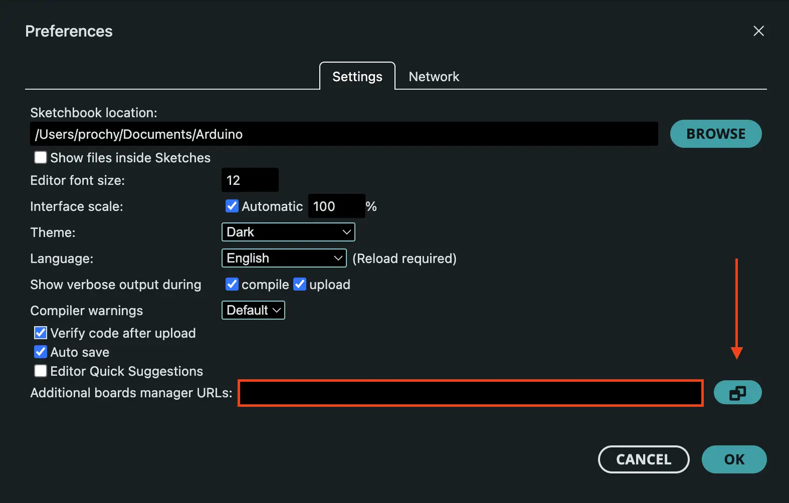

The [ESP32 Arduino Core](https://github.com/espressif/arduino-esp32) is a powerful development platform that brings the simplicity and accessibility of Arduino programming to Espressif's ESP32 series of microcontrollers. This integration allows developers to leverage the familiar Arduino environment while taking advantage of the ESP32's advanced features, including dual-core processing, built-in Wi-Fi and Bluetooth connectivity, and extensive peripheral support.

## What is the ESP32 Arduino Core?

The ESP32 Arduino Core is an open-source project developed by Espressif Systems that provides Arduino-compatible libraries and tools for programming ESP32 microcontrollers. It extends the Arduino platform to support the ESP32's unique capabilities while maintaining compatibility with the vast ecosystem of Arduino libraries and sketches.

### Key Features and Capabilities

The ESP32 Arduino Core provides comprehensive support for all Espressif mass-production SoCs and unlocks their powerful features:

- **Multi-SoC Support**: Compatible with all Espressif mass-production SoCs including ESP32, ESP32-S2, ESP32-S3, ESP32-C3, ESP32-C5, ESP32-C6, ESP32-H2, ESP32-P4 (as of the time of writing, with new SoCs being added regularly) 
- **Built-in Connectivity Libraries**: Native support for Wi-Fi (802.11 b/g/n), Ethernet, Bluetooth Low Energy (BLE), Zigbee protocols
- **Comprehensive Peripheral Support**: Extensive GPIO pins, ADC, DAC, I2C, I2S, SPI, UART, LEDC, Touch sensors, and many more peripherals
- **Built-in Libraries**: Rich ecosystem of pre-built libraries including WebServer, HTTP client, OTA updates, Matter, file system support, and more
- **Real-Time Operating System**: FreeRTOS-based multitasking capabilities for complex applications
- **Arduino Compatibility**: Seamless integration with existing Arduino libraries and code while adding ESP32-specific functionality

### Why Choose ESP32 Arduino Core?

The ESP32 Arduino Core is particularly beneficial for:

- **Rapid Prototyping**: Familiar Arduino syntax and extensive library support
- **Educational Purposes**: Easy learning curve for beginners
- **Professional Development**: Powerful enough for complex applications while maintaining simplicity
- **Huge Amount of Examples**: Extensive collection of example code covering all features and use cases
- **Community Support**: Large community and extensive documentation

## Prerequisites

Before setting up the ESP32 Arduino Core, ensure you have:

- A computer running Windows, macOS, or Linux
- [Arduino IDE](https://www.arduino.cc/en/software) installed (version 2.x recommended)
- Any ESP32 development board with a USB-to-UART interface or a USB-capable device.
- A good USB data cable to connect your ESP32 to your computer

## Installation Methods

There are two primary ways to install the ESP32 Arduino Core:

1. **Instalation via Arduino IDE Board Manager** (Recommended for beginners)
2. **Manual Installation using Git** (Advanced users and developers)

We'll cover both methods in detail.

## Method 1: Installation via Arduino IDE Board Manager

This is the recommended method for most users as it's straightforward and handles all dependencies automatically.

### Step 1: Add ESP32 Board Manager URL

1. In Arduino IDE, **open Preferences**:

   - Navigate to **File > Preferences** (Windows/Linux) or **Arduino > Preferences** (macOS)
   


2. **Add Board Manager URL**:

   - In the "Additional Board Manager URLs" field, add one of the following URLs:

   **Stable Release (Recommended for most users)**:
   ```md
   https://espressif.github.io/arduino-esp32/package_esp32_index.json
   ```
   
   **Development Release (Latest features, pre-release versions)**:
   ```md
   https://espressif.github.io/arduino-esp32/package_esp32_dev_index.json
   ```
   
   **For users in China (Mirror with better download speeds)**:
   
      {}
      https://jihulab.com/esp-mirror/espressif/arduino-esp32/-/raw/gh-pages/package_esp32_index_cn.json
      {}
      {}
      https://jihulab.com/esp-mirror/espressif/arduino-esp32/-/raw/gh-pages/package_esp32_dev_index_cn.json
      {}
   

   

   - If you have other URLs already, add this one on a new line
   - Click "OK" to save the settings

### Step 2: Install ESP32 Board Package

1. **Open Boards Manager**:
   - Navigate to **Tools > Board > Boards Manager...** or click on Boards manager icon in sidebar
   - In the search bar, type "esp32"
   - Look for "esp32 by Espressif Systems" in the results
   - Click the "Install" button
   - Wait for the installation to complete (this may take several minutes)

   

## Method 2: Manual Installation using Git

This method is recommended for advanced users who want more control over the installation or need to work with specific versions of the ESP32 Arduino Core.

### Prerequisites for Git Installation

- Git installed on your system
- Python 3.x installed

### Clone ESP32 Arduino Core Repository and Install Tools and Dependencies

The following asciinema recording demonstrates the complete manual installation process:

<script src="https://asciinema.org/a/xpWMVXgwnxAzk7g01aQVc7hBd.js" id="asciicast-xpWMVXgwnxAzk7g01aQVc7hBd" async="true"></script>

**What the recording shows:**

1. **Navigate to Arduino Directory**:
   ```bash
   cd Documents/Arduino
   ```

2. **Create Hardware Directory Structure**:
   ```bash
   mkdir -p hardware/espressif
   cd hardware/espressif
   ```

3. **Clone the Repository**:
   ```bash
   git clone https://github.com/espressif/arduino-esp32.git esp32
   ```

4. **Navigate to Tools Directory**:
   ```bash
   cd esp32/tools
   ```

5. **Run Installation Script**:
   ```bash
   python get.py
   ```

**Platform Notes:**
- **Windows**: Use Command Prompt or PowerShell instead of terminal
- **Linux/macOS**: The commands shown work directly in terminal
- **Alternative for Windows**: If Python is not available, you can run `get.exe` directly instead of `python get.py`

## Run your first sketch

To ensure everything is working correctly, let's create a simple test sketch:

1. **Open Arduino IDE**
2. **Select Board**: Go to **Tools > Board > ESP32 Arduino > ESP32 Dev Module**
3. **Select Port**: Choose the correct COM port for your ESP32
4. **Create New Sketch**: Go to **File > New**
5. **Paste Test Code**:
   ```cpp
   void setup() {
     Serial.begin(115200);
   }

   void loop() {
     Serial.println("Hello from ESP32 Arduino!");
     delay(1000);
   }
   ```
6. **Upload the Sketch**: Click the upload button (arrow icon)
7. **Open Serial Monitor**: Go to **Tools > Serial Monitor** and set baud rate to 115200

If you see "Hello from ESP32 Arduino!" appearing every second in the Serial Monitor, your ESP32 Arduino Core installation is successful!

### Understanding the Serial Monitor

The Serial Monitor is a powerful debugging tool that allows you to communicate with your ESP32 board through the USB connection. It's essential for:

- **Viewing Output**: See text messages, sensor readings, and debug information from your ESP32
- **Debugging Code**: Print variable values, status messages, and error information to troubleshoot your programs
- **Interactive Communication**: Send commands to your ESP32 and receive responses

**Key Serial Monitor Features:**
- **Baud Rate**: Must match the `Serial.begin()` rate in your code (115200 in our example)
- **Auto-scroll**: Automatically shows the latest messages
- **Clear**: Button to clear the display
- **Send**: Text field to send commands to your ESP32
- **Timestamps**: Optional feature to show when each message was received

**Common Serial Commands in Arduino:**
```cpp
Serial.begin(115200);        // Initialize serial communication at 115200 baud
Serial.println("Message");   // Print message and move to next line
Serial.print("Value: ");     // Print without moving to next line
Serial.println(variable);    // Print variable value
Serial.available();          // Check if data is available to read
Serial.read();               // Read incoming data
```

The Serial Monitor is your window into what's happening inside your ESP32, making it an indispensable tool for learning and debugging!

## Next Steps

Now that you have the ESP32 Arduino Core installed, you can:

- Try the example to connect your ESP32 to [Wi-Fi](https://github.com/espressif/arduino-esp32/blob/master/libraries/WiFi/examples/WiFiClientBasic/WiFiClientBasic.ino) or try out any of the [ESP32 examples](https://github.com/espressif/arduino-esp32/tree/master/libraries) included with the installation. These examples can be easily accessed in the Arduino IDE by going to **File > Examples** and selecting one of the ESP32 example sketches.
- Explore the [ESP32 Arduino Core documentation](https://docs.espressif.com/projects/arduino-esp32/en/latest/)
- If you don't have any ESP32 boards yet, you can use the [Wokwi simulator](https://wokwi.com/esp32) to start with ESP32 Arduino Core.
- Start building your first IoT project with built-in Wi-Fi and Bluetooth capabilities

The ESP32 Arduino Core opens up a world of possibilities for embedded development, combining the simplicity of Arduino with the power and connectivity features of the ESP32. Happy coding!
