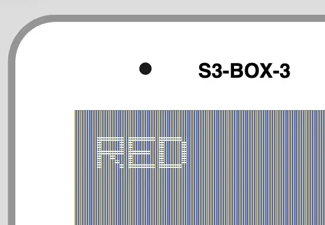
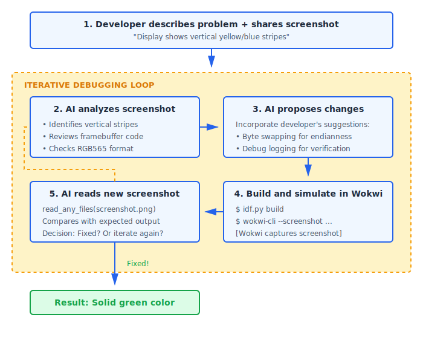

## Introduction

Porting graphics libraries to embedded systems often involves subtle bugs that are hard to diagnose - especially when dealing with color formats, endianness, and framebuffer handling. This article describes how we used Wokwi simulation combined with Warp's AI capabilities to iteratively solve a color mapping bug in the raylib ESP-IDF component, turning what could have been hours of trial-and-error into an efficient debugging workflow.

## The Challenge: Porting Raylib to ESP32

Raylib is a popular game programming library that recently gained software rendering support, making it suitable for embedded devices without GPUs. We were porting it to ESP32 devices (specifically the ESP32-S3-BOX-3) using ESP-IDF, wrapping the upstream raylib library as an ESP-IDF component.

The initial port compiled and ran, but there was a problem: instead of showing solid colors, the display showed vertical yellow/blue stripes. 



The framebuffer format was clearly wrong, but determining exactly where and how required multiple iterations.

## Enter Wokwi: Hardware Simulation for Bug Hunting

Rather than flash to physical hardware for every test, we used Wokwi - a powerful hardware simulator that can emulate ESP32 boards with displays. Wokwi is particularly valuable for bug hunting in embedded graphics applications because it provides:

1. **Screenshot Capability**: [Capture display output as PNG](https://docs.wokwi.com/wokwi-ci/cli-usage#automation) files at any point in execution - crucial for visual debugging
2. **Integrated Debugger**: Step through code, set breakpoints, and inspect variables without physical hardware
3. **Fast Iteration Cycles**: No need to physically flash devices between tests
4. **Reproducible Testing**: Same simulation conditions every time, eliminating hardware variability
5. **IDE Integration**: Works seamlessly with [VS Code](https://docs.wokwi.com/vscode/getting-started) and [CLion](https://plugins.jetbrains.com/plugin/23826-wokwi-simulator) for professional development workflows
6. **CI/CD Ready**: Automated testing in GitHub Actions with screenshot validation

Our Wokwi setup included:
- [ESP32-S3-BOX-3 board](https://github.com/espressif/esp-box) definition (320x240 ILI9341 display)
- Custom firmware with [Raylib Hello example](https://components.espressif.com/components/georgik/raylib/versions/5.6.0/examples/hello)
- Automated screenshot capture at specific timestamps

```bash path=null start=null
wokwi-cli \
  --diagram-file diagram.json \
  --screenshot-part esp \
  --screenshot-time 5000 \
  --screenshot-file screenshot.png \
  --timeout 6000 \
  boards/esp-box-3
```

## The AI-Assisted Debugging Loop

Here's where it got interesting. Instead of manually analyzing each screenshot and making educated guesses, we used [Warp's AI agent](https://www.warp.dev/) with vision capabilities to create a feedback loop:

### 1. Initial Problem Identification

**Developer**: "The screen should have a red background, but as you can see, it's not true. It has some kind of Yellow, blue, vertical line patterns."

**AI Action**: Read the screenshot, identified the vertical stripe pattern indicating likely color format mismatch or byte-order issues.

### 2. Hypothesis Generation

The AI analyzed the code and proposed several theories:
- RGB565 color format mismatch
- Endianness issues (big-endian vs little-endian)
- Incorrect framebuffer copy method
- RGBA vs RGB internal format confusion

### 3. Iterative Testing with Wokwi

For each hypothesis, we followed this pattern:

```text path=null start=null
1. AI proposes code change
2. Build firmware
3. Run Wokwi simulation with screenshot capture
4. AI reads the screenshot to verify if colors improved
5. Adjust based on results
```

This tight feedback loop was possible because:
- Wokwi provided consistent, reproducible screenshots
- [Warp AI](https://www.warp.dev/) could read images directly
- Build times were reasonable (~30 seconds)
- No physical hardware connection needed

### 4. The AI iterations: Direct Framebuffer Access

Since we established AI feedback loop, the AI was able to iterate over the problem. Thanks to provided feedback from developer, it was able to drive several iterations of the debugging process.

The AI discovered that the original code used `rlCopyFramebuffer()`, which performed:
```text path=null start=null
RGB565 → RGBA8888 → RGB565
```

This double conversion was corrupting colors. The debug process:

**Iteration 1**: Added debug logging to print pixel values
```c path=null start=null
ESP_LOGI("RAYLIB", "First pixel = 0x%04X (should be RED=0xF800)", framebuffer[0]);
```

Wokwi serial output showed: `0x28E6` (wrong!) instead of `0xF800` (red)

**Iteration 2**: Switch to direct framebuffer access using `swGetColorBuffer()`
```c path=null start=null
uint16_t *sw_framebuffer = (uint16_t *)swGetColorBuffer(&sw_width, &sw_height);
memcpy(framebuffer, sw_framebuffer, screen_width * screen_height * sizeof(uint16_t));
```

New pixel values: `0xE147` (closer, but still wrong)

**Iteration 3**: Add byte-swapping for SPI LCD endianness
```c path=null start=null
for (int i = 0; i < total_pixels; i++) {
    uint16_t pixel = framebuffer[i];
    framebuffer[i] = (pixel >> 8) | (pixel << 8);  // Swap bytes
}
```

**Screenshot verification**: Wokwi showed solid green (test was at 5 seconds when green was displayed) ✅

[](https://wokwi.com/experimental/viewer?diagram=https%3A%2F%2Fraw.githubusercontent.com%2Fgeorgik%2Fesp-idf-component-raylib%2Fmain%2Fraylib%2Fexamples%2Fhello%2Fwokwi%2Fesp-box-3%2Fdiagram.json&firmware=https%3A%2F%2Fgithub.com%2Fgeorgik%2Fesp-idf-component-raylib%2Freleases%2Fdownload%2Fv5.6.0%2Fraylib-hello-v5.6.0-esp-box-3.bin)

## The Complete Workflow in Action

Here's what a typical debugging iteration looked like. Note the iterative loop - we went through this cycle **multiple times** before finding the correct solution:



The key insight is the **feedback loop** (highlighted in yellow): AI proposes changes → build → Wokwi captures screenshot → AI verifies → if not fixed, iterate again. This cycle ran multiple times, with each iteration getting closer to the solution.

## Key Insights

### Why This Worked Well

1. **Visual Feedback is Critical**: Color bugs can't be debugged with logs alone - you need to see the actual output. Wokwi's screenshot capability made this trivial
2. **Wokwi's Debugging Power**: The integrated debugger would have allowed stepping through framebuffer operations if screenshots weren't sufficient
3. **Wokwi's Consistency**: Same simulation every time meant we could isolate variables and prove fixes definitively
4. **AI Vision + Code Understanding**: The AI could correlate visual output with code changes by reading Wokwi screenshots
5. **Fast Iteration**: ~2 minutes per cycle (build + simulate + analyze) vs. hours with physical hardware
6. **Professional Development Environment**: Wokwi's [VS Code](https://docs.wokwi.com/vscode/getting-started) and [CLion](https://plugins.jetbrains.com/plugin/23826-wokwi-simulator) integration meant we could debug just like with physical hardware

### Limitations We Hit

1. **Screenshot Timing**: Had to carefully time captures to match test sequence (red at 2.7s, green at 3.9s, etc.). The alternative approach is to use Wokwi Scenario files, which allows triggering screenshot based on the log message
2. **Endianness Assumptions**: Even AI made wrong guesses about byte order initially, requiring multiple iterations

## Lessons for Embedded Development

### 1. Simulation-First Development with Wokwi

Don't wait until hardware is available. Wokwi provides a simulated of MCUs:
- **Screenshot capture** for visual debugging - essential for graphics bugs
- **Integrated debugger** with breakpoints and variable inspection
- **IDE integration** with VSCode and CLion for professional workflows
- **Test display output** without physical devices
- **Capture exact visual state** for comparison and regression testing
- **CI/CD integration** for automated visual testing

### 2. AI as Debugging Partner

The AI helped in ways that went beyond code completion:
- **Pattern recognition**: Spotted vertical stripes → byte alignment issues
- **Cross-reference**: Connected pixel values to RGB565 bit packing
- **Hypothesis testing**: Proposed specific code changes to test theories
- **Visual verification**: Confirmed fixes by reading screenshots

### 3. Structured Debugging Workflow

The key was having a repeatable process:
```text path=null start=null
Observe → Hypothesize → Code → Build → Simulate → Capture → Verify → Repeat
```

Each step was automated or AI-assisted, keeping developer focus on problem-solving. Wokwi's screenshot capability was the key enabler - without it, we'd need physical hardware and manual camera captures for each test.

## The Complete Solution

The final fix involved three key changes:

```c path=null start=null
// 1. Direct framebuffer access (no conversion)
extern void *swGetColorBuffer(int *w, int *h);
uint16_t *sw_framebuffer = (uint16_t *)swGetColorBuffer(&sw_width, &sw_height);

// 2. Direct memory copy (RGB565 → RGB565)
memcpy(framebuffer, sw_framebuffer, screen_width * screen_height * sizeof(uint16_t));

// 3. Byte swap for SPI LCD endianness
for (int i = 0; i < total_pixels; i++) {
    uint16_t pixel = framebuffer[i];
    framebuffer[i] = (pixel >> 8) | (pixel << 8);
}
```

## CI/CD Integration

Once the fix was validated, we automated the visual testing:

```yaml path=null start=null
# .github/workflows/test-example.yml
- name: Simulate & take a screenshot
  run: |
    wokwi-cli \
      --screenshot-part "esp" \
      --screenshot-time 5000 \
      --screenshot-file "screenshot-${{ matrix.board }}.png" \
      "raylib/examples/hello/boards/${{ matrix.board }}"

- name: Flip screenshot vertically
  run: |
    convert "screenshot-${{ matrix.board }}.png" -flip "screenshot-${{ matrix.board }}.png"

- name: Upload Screenshot
  uses: actions/upload-artifact@v4
  with:
    name: screenshot-${{ matrix.board }}
    path: screenshot-${{ matrix.board }}.png
```

Now every commit produces screenshots showing correct color rendering across all supported boards.

[](https://wokwi.com/experimental/viewer?diagram=https%3A%2F%2Fraw.githubusercontent.com%2Fgeorgik%2Fesp-idf-component-raylib%2Fmain%2Fraylib%2Fexamples%2Fhello%2Fwokwi%2Fesp-box-3%2Fdiagram.json&firmware=https%3A%2F%2Fgithub.com%2Fgeorgik%2Fesp-idf-component-raylib%2Freleases%2Fdownload%2Fv5.6.0%2Fraylib-hello-v5.6.0-esp-box-3.bin)

**[▶️ Run online Wokwi ESP32-S3-BOX-3 (320x240)](https://wokwi.com/experimental/viewer?diagram=https%3A%2F%2Fraw.githubusercontent.com%2Fgeorgik%2Fesp-idf-component-raylib%2Fmain%2Fraylib%2Fexamples%2Fhello%2Fwokwi%2Fesp-box-3%2Fdiagram.json&firmware=https%3A%2F%2Fgithub.com%2Fgeorgik%2Fesp-idf-component-raylib%2Freleases%2Fdownload%2Fv5.6.0%2Fraylib-hello-v5.6.0-esp-box-3.bin)**

**Note:** The time based approach might not be suitable for all the cases. Wokwi can watch for keyword in the [log message to trigger screenshot](https://github.com/wokwi/wokwi-part-tests/blob/main/board-ssd1306/oled-esp32/ssd1306.test.yaml):

```yaml
steps:
  - wait-serial: 'Display initialized'

  - wait-serial: 'Counter: 0'
  - take-screenshot:
      part-id: 'lcd'
      compare-with: 'screenshots/counter-0.png'
```

## Conclusion

The combination of Wokwi simulation and AI-assisted debugging created a powerful workflow for solving a subtle embedded graphics bug. What traditionally might take days of trial-and-error with physical hardware was resolved in an afternoon through:

- **Visual verification** via Wokwi screenshots
- **AI code analysis** connecting visual symptoms to root causes  
- **Rapid iteration** without physical hardware constraints
- **Automated regression testing** via CI/CD

This approach isn't limited to graphics - any embedded system with visual, audio, or sensor output that can be simulated could benefit from this debugging methodology.

You can test the final result in web browser or flash it to ESP32-S3-BOX-3 using ESP-Launchpad.

**[▶️ Run online Wokwi ESP32-S3-BOX-3 (320x240)](https://wokwi.com/experimental/viewer?diagram=https%3A%2F%2Fraw.githubusercontent.com%2Fgeorgik%2Fesp-idf-component-raylib%2Fmain%2Fraylib%2Fexamples%2Fhello%2Fwokwi%2Fesp-box-3%2Fdiagram.json&firmware=https%3A%2F%2Fgithub.com%2Fgeorgik%2Fesp-idf-component-raylib%2Freleases%2Fdownload%2Fv5.6.0%2Fraylib-hello-v5.6.0-esp-box-3.bin)**

[](https://georgik.github.io/esp-idf-component-raylib/?flashConfigURL=https://georgik.github.io/esp-idf-component-raylib/config/config.toml)


## Resources

- [Wokwi](https://wokwi.com/esp32) - ESP32 hardware simulator with CI/CD support
- [Wokwi for VS Code](https://docs.wokwi.com/vscode/getting-started)
- [Wokwi for CLion](https://plugins.jetbrains.com/plugin/23826-wokwi-simulator)
- [Warp](https://warp.dev) - AI-powered terminal and development environment
- [Raylib](https://raylib.com) - Simple and easy-to-use programming library
- [Raylib ESP-IDF Component](https://github.com/georgik/esp-idf-component-raylib)
- [Component Registry with Raylib ESP-IDF Component](https://components.espressif.com/components/georgik/raylib/)
- [Component Registry with Raylib Port ESP-IDF Component](https://components.espressif.com/components/georgik/esp_raylib_port)
- [Flash Raylib Hello example with ESP-Launchpad](https://georgik.github.io/esp-idf-component-raylib/?flashConfigURL=https://georgik.github.io/esp-idf-component-raylib/config/config.toml)
