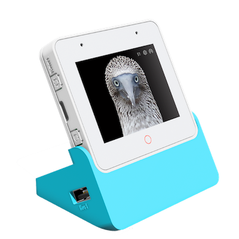
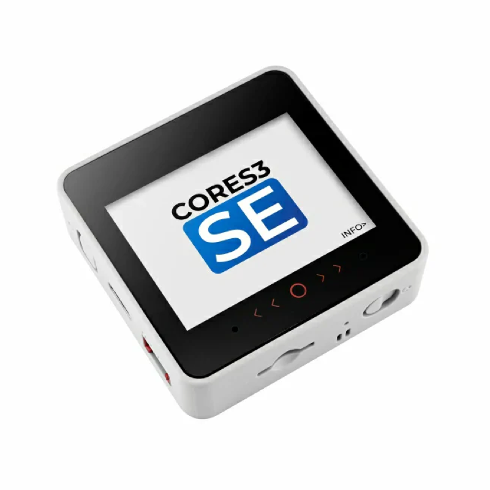



We are proud to announce the "Private AI Agents Platform" – a self-hosted, multi-modal AI agent platform that you can deploy in your AWS account. This platform is optimized and tuned for building and managing AI Agents that can be integrated in connected devices and companion phone apps and web dashboards. In this blog post we provide an introduction to this platform.



## AI Agents and IoT

The first question we need to answer is what an AI agent is, and why it has become so relevant for IoT. An AI agent is the workflow implementation that combines large language models (LLMs) with a tool calling layer that allows to read and change device state, invoke APIs, access knowledge base and make decisions based on the context. For device makers, this unlocks a new class of capabilities such as intelligent assistants in companion apps, natural multi-lingual voice interfaces for device control, intelligent customer support that works with the combination of actual device state and authoritative product documentation, and ultimately, ambient intelligence driven by events from sensors, cloud rules and other services.

## High Level Architecture

Engineering such an agent implementation for IoT systems requires a careful consideration to modality (text, speech), scalability, security, cost and safety. Keeping all these considerations in mind, the Private AI Agents Platform is built on AWS cloud services using AWS Fargate as a primary application platform and Amazon Bedrock Foundation Models as backend LLM system. Espressif has made an instance of this available for a [public trial](https://agents.espressif.com/). For the production cases, you can deploy the same in your own AWS account. Here is a high-level architecture of the system.


Now let's have a look at how we can create and use agents for various use-cases mentioned above.

## Defining the Agent

An **Agent** consists of an LLM selection, a system prompt—written in plain English—that defines its behavior, along with a set of tools that give it the ability to perform actions. The **AI Agents admin dashboard**, available at <https://agents.espressif.com/>, allows you to create and configure agents using pre-built templates or by defining them entirely from scratch.



### LLM Selection

The Agent definition process allows developers to choose from a range of supported **AWS Bedrock Foundation Models**, giving full control over performance, cost, and behavior. Each interaction modality—**voice** and **text**—can be assigned its own LLM, enabling optimized configurations such as lightweight models for conversational voice interfaces and more capable models for complex text reasoning. This flexibility ensures that every agent can be tuned precisely to its use-case while maintaining consistent deployment and governance within the customer's own cloud environment.

### System Prompt

Every agent—whether created from a template or built from scratch—includes a **system prompt**. The system prompt defines the agent's behavior and establishes its persona, such as a voice controller, storyteller, or customer support assistant. When you name an agent, the dashboard can automatically generate an initial system prompt using the LLM, which you may keep, modify, or replace entirely. During interactions, the user's query is combined with this system prompt, guiding the LLM to reason and respond in alignment with the agent's intended role.

### Tools

**Tools** are pluggable actions that an agent can invoke to perform specific tasks. The dashboard includes several pre-defined tools—such as ESP RainMaker control, Volume Control, and Emotion Detection—and allows you to create custom tools tailored to your application. The platform supports two categories of tools.

#### Remote Tools

The Private AI Agents Platform supports the **Model Context Protocol (MCP)**, enabling device makers to plug their agents into a much broader ecosystem of third-party MCP-compatible services and tools. With MCP servers, agents can seamlessly interact with external systems—such as querying a knowledge base, communicating to the device cloud, creating a customer ticket, or communicating with other services—without building custom integrations. This pluggability dramatically accelerates development and ensures agents can evolve as the ecosystem grows. The platform also supports OAuth authentication to the MCP servers, allowing securely logging in and getting the user context wherever required.

#### Local Tools

In addition to remote tools powered by MCP servers, the Private AI Agents Platform also supports **Local Tools**, which allow tool calls to be executed directly on the client—such as the IoT device itself or a companion mobile application. Local Tools enable agents to trigger real-time, device-level actions without requiring any backend integration. For example, if a smart device needs to respond to a voice command like *"Turn off the bedroom fan"*, the developers can simply expose a Local Tool such as `toggleFan` or `setSpeed`, and the agent will deliver the instruction directly to the device or app for immediate execution. This makes Local Tools ideal for tight device control loops, offline-capable interactions, and low-latency experiences, ensuring that agents can act as naturally and responsively as users expect.

Once an agent is defined, you can test it directly from the web dashboard to observe how it responds to queries and invokes tools in real time. The dashboard provides an interactive interface for trying out both **text** and **voice** modalities, making it easy to validate behavior, fine-tune prompts, and verify tool integrations before deploying the agent into your application.

## Getting Started on a Real Device: Step-by-Step

Once your agent is configured, you can run it on real hardware using any of the three supported development kits: **EchoEar**, **ESP32-S3-Box**, and **M5Stack Core S3**. The **agent client** is fully compatible with all three platforms, enabling you to test voice interactions, tool execution, and end-to-end behavior exactly as users would experience it.

  <figure style="flex: 1; margin: 0;">
    
  </figure>
  <figure style="flex: 1; margin: 0;">
    
  </figure>
  <figure style="flex: 1; margin: 0;">
    
  </figure>

### 1. Program the firmware

You can flash pre-compiled firmware to these boards directly from your web browser without requiring any toolchain installation. This makes it incredibly easy to get started and validate your agent in minutes. The full source code for the firmware will also be made available soon, allowing developers to explore, customize, and extend the client implementation as needed. For instructions on flashing and using the device please refer to: <https://github.com/espressif/esp-agents-firmware>

### 2. Provision the device using the ESP RainMaker Home app

Next, open the **ESP RainMaker Home** app to configure the device's Wi-Fi credentials. The app guides you through the provisioning process, ensuring the device connects securely to your network and becomes ready to communicate with your agent.

### 3. Configure a new Agent into the Device

This is an optional step, where you can change the default Agent running on the device. Once the device is online, use the same mobile app to link it to your agent. Each agent created in the dashboard has a unique **Agent URL** represented as a QR code. Simply scan this QR code with your phone's camera, and the app will automatically write the correct **Agent ID** into the device. Note that, the device firmware has a default agent configured in it which makes it act as a "Friend" of the user.

### 4. Interact with the device using voice

With provisioning and configuration complete, your device is now fully connected to the agent. Speak naturally to the device to issue commands, ask questions, or trigger actions. The agent will process your input, reason about it, and call the appropriate tools in real time.

## Trying out Phone App Chat Agent

A completely different application of the Private Agent Platform is to directly integrate AI Agent into your connected device's companion app. The **ESP RainMaker Home** app also includes a built-in **Chat Agent** feature that demonstrates this. Any agent you create in the dashboard can be configured as the chat agent within the app, allowing you to test conversational interactions immediately with no additional development required.



Because the chat agent can invoke **Local Tools**, it can retrieve real-time device status directly from the user's hardware, allowing support scenarios such as *"Why is my purifier showing a red light?"* or *"Check if my fan is connected."* This combination of conversational understanding and live device context enables a much more effective and personalized support experience within the companion app.

We are excited hear your feedback once you try this out: <https://agents.espressif.com>
