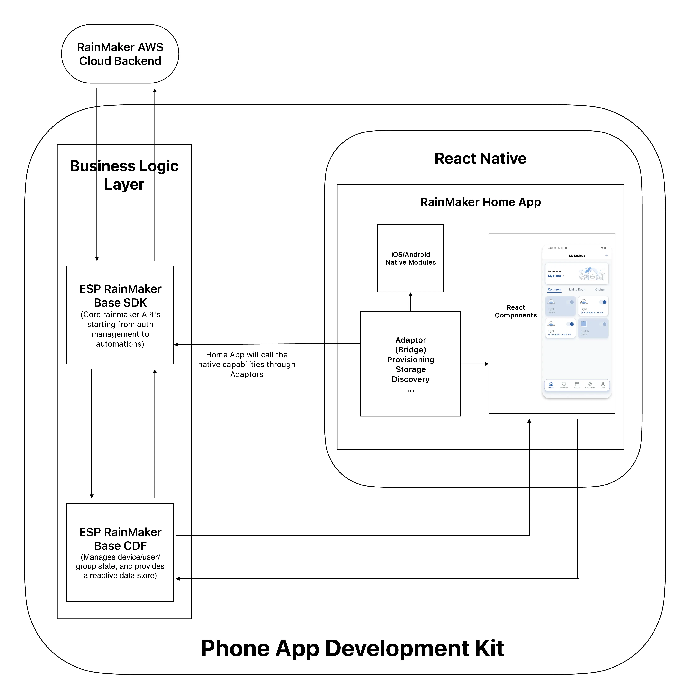

## **Introducing the ESP RainMaker Phone App Development Kit**

Espressif is excited to announce the ESP RainMaker Phone App Development Kit, a complete toolkit that makes it faster and easier than ever to deliver production-ready mobile apps based on ESP RainMaker backend solutions.

This new development kit combines our cross-platform SDK, Central Data Framework (CDF), and a reference home app into one cohesive package. Developers can begin with a production-ready reference app and easily update branding and UI elements to align with their product line. When needed, the architecture also allows expanding or modifying control interfaces, workflows, and user journeys without reworking the core logic.

By building on the proven ESP RainMaker backend, the kit ensures developers don’t need to reinvent device provisioning, secure communication, or state management. Instead, they can focus on creating polished, branded experiences for their customers—while relying on Espressif’s robust cloud and device management infrastructure.

## **Purpose**

Espressif has always provided ready-to-use ESP RainMaker Phone Apps, available on both iOS and Android app stores. To give developers full flexibility, the source code for these apps has always been open-sourced on GitHub, allowing customisations to match specific requirements.

However, in practice, the process of integrating and maintaining these custom apps has proven cumbersome:

* Separate native codebases for iOS and Android had to be maintained.  
* No unified Phone App SDK existed, making feature development inconsistent.  
* UI and business logic were tightly coupled, reducing flexibility.  
* Any new feature or stability update from Espressif required customers to rebase their custom forks, a process many found time-consuming and error-prone.

As a result, many customers avoided upgrading unless absolutely necessary, which led to fragmented user experiences across different RainMaker-powered apps.

The ESP RainMaker Phone App Development Kit is created to solve these challenges. By providing a cross-platform SDK, a Central Data Framework, and a reference app, it allows developers to:

* Ensure consistency across apps with a shared SDK and predictable APIs.  
* Simplify maintenance and upgrades, since future Espressif improvements flow seamlessly into customer apps.  
* Guarantee quality and security, with a unified baseline maintained by Espressif.

Together, these benefits help customers accelerate time-to-market with pre-built, production-ready components.

## **Core Components**

This kit brings together three key elements:

The Phone App Development Kit is built around three connected layers, designed to simplify development while ensuring long-term maintainability:

### **1\. RainMaker Base SDK**

A cross-platform, TypeScript-based SDK that exposes RainMaker's core APIs in a clean, consistent way. It absorbs the complexity of networking, security, and platform differences so Espressif can roll out backend or protocol updates once, and all apps benefit instantly. Instead of reinventing onboarding, provisioning, or cloud flows for each platform, developers get a unified, type-safe API that they can drop into iOS, Android, or even web apps. This reduces boilerplate and accelerates app delivery.

For more details, see the [RainMaker Base SDK Documentation](https://docs.rainmaker.espressif.com/docs/sdk/rainmaker-base-sdk/overview/).

### **2\. RainMaker Base CDF (Central Data Framework)**

A reusable framework that sits between the SDK and the UI. It intercepts API calls, manages device/user/group state, and provides a reactive data store, ensuring smooth, scalable performance even as devices or features grow. Developers no longer need to manually manage state synchronization or performance optimizations. The CDF handles the heavy lifting, making apps more responsive and reliable with less code.

For more details, see the [RainMaker CDF Documentation](https://docs.rainmaker.espressif.com/docs/sdk/rainmaker-cdf/overview/).

### **3\. RainMaker Home App (Reference Application)**

A production-ready showcase demonstrating how the SDK and CDF work together in a real-world app. It acts as both a validation tool for Espressif's architecture and a starter template for customers. Instead of starting from a blank screen, developers can use the Home App as a blueprint, customizing branding, UI, or features while inheriting proven patterns. This dramatically shortens time to market and lowers development risk.

For more details, see the [RainMaker Home App Documentation](https://docs.rainmaker.espressif.com/docs/dev/phone-app/home-app/home-app-intro/).

## **Technology & Architecture**

### **TypeScript at the Core**

TypeScript is widely adopted across the industry, allowing teams to onboard quickly while maintaining consistency and predictability across features and releases.

**Flow Diagram**

    <figure>
        
    </figure>

### **Overall Architecture at a Glance**

* **Business logic layer** – RainMaker Base SDK services, leveraging TypeScript's static typing to safely interface with the RainMaker backend.

* **Native modules** – Platform-specific integrations (Bluetooth, Wi-Fi) exposed to the React Native layer through adapter modules.

* **Cloud backend** – ESP RainMaker cloud services handling device management, provisioning and secure communication.

### **Our Reference App, Powered by React Native**

The reference app is built with React Native, a framework embraced by the open-source community for delivering high-quality mobile apps. With a single codebase producing native experiences for both iOS and Android, React Native reduces engineering overhead while accelerating feature delivery.

A vibrant plugin ecosystem and strong community support make it easy to extend functionality, while lightweight native adapters give seamless access to platform-specific capabilities like Bluetooth and Wi-Fi provisioning.

This combination, TypeScript at the core and React Native at the app layer, ensures that Espressif can innovate quickly while giving customers a development experience that is modern, efficient, and production-ready.

## **Features at a Glance**

The ESP RainMaker Phone App Development Kit ships with a rich set of production-ready features, so developers can spend less time reinventing the basics and more time creating differentiated user experiences.

* Secure by design – Built-in user authentication and account management.

* Effortless onboarding – Wi-Fi provisioning and device setup in just a few taps.

* Always in sync – Real-time device status, control, and seamless OTA firmware updates.

* Smart living features – Configurable scenes, schedules, and automations to match user lifestyles.

* Stay connected – Push notifications to keep users informed and engaged.

## **Easy Customisation for Your Brand**

We know every product needs its own identity. This kit makes customisation simple without adding engineering overhead.

* Brand alignment – Update colors, fonts, and logos to reflect your product line.

* Flexible extension – Add custom screens, features, or device types without disrupting the core flow.

* Accelerated delivery – Reuse proven, production-grade logic while focusing only on what makes your product unique.

* Localisation support – Adapt language and region-specific behaviour to align with market requirements, without restructuring app flows.

* Customer-ID based device discovery – Enable Bluetooth advertising and device discovery workflows using customer identifiers, allowing apps to detect and provision only the devices intended for their ecosystem.

* Other enhancements – Support for custom deployment configurations, and app-level theming ensures the solution can scale to different product variations and ecosystem requirements.

## **Custom Deployment Configurations**

For teams building across multiple models, markets, or release cycles, the Phone App Development Kit provides deeper configuration controls that help manage how the app evolves and interacts with the broader product ecosystem.

* Environment-aware builds – Switch between development, staging, and production environments through centralized configuration, ensuring clean environment management without duplicating codebases.

* UI layouts and custom workflows – Define feature-specific UI layouts, user journeys, and interaction flows directly within the configuration model, enabling teams to adapt the app experience for different markets, device categories, or product-tier requirements.

* Provisioning flow customisation – Tailor onboarding sequences, fallback logic, and device pairing behaviour to suit different product lines or deployment strategies.  
* Feature development guides – Access structured, feature-focused development guides that document patterns, API usage, UI recommendations, and integration rules, helping teams implement product-specific capabilities in a consistent and scalable way.

* Scale across product families – Manage multiple device variants and configurations through structured config files, enabling ecosystem growth without architectural rewrites.

For comprehensive guidance on building your own app, see the [Phone App Development Documentation](https://docs.rainmaker.espressif.com/docs/dev/phone-app/mobile-app-intro/).

## **Roadmap & What’s Next**

The kit is designed as a living platform—today it covers the essentials, tomorrow it evolves with the smart home ecosystem. Coming soon:

* Richer experiences – Time-series data visualization and integrations with Alexa and Google Assistant.

* Matter-ready – Native support for Matter devices, ensuring your app works seamlessly with the latest IoT standards.

* Developer-first tooling – CLI-based configuration for theming, setup, and faster onboarding.

* Smarter notifications – Customizable delivery channels, priority settings, and styles for maximum flexibility.

**Reference Links**

* ESP RainMaker Typescript Base SDK :- [https://www.npmjs.com/package/@espressif/rainmaker-base-sdk](https://www.npmjs.com/package/@espressif/rainmaker-base-sdk)
* ESP RainMaker Typescript Base CDF :- [https://www.npmjs.com/package/@espressif/rainmaker-base-cdf](https://www.npmjs.com/package/@espressif/rainmaker-base-cdf)

