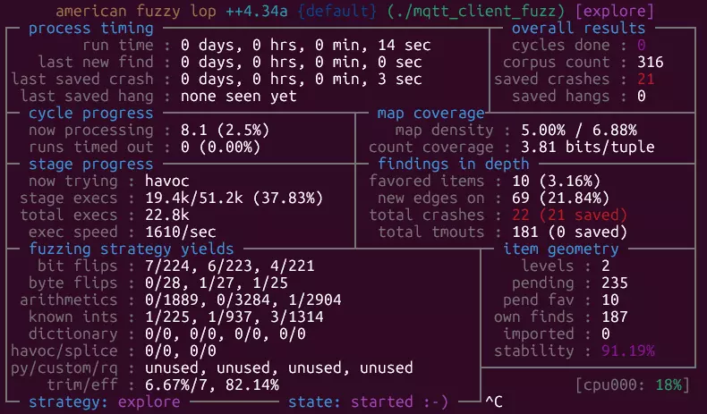

## Introduction

Fuzzing is one of the highest-leverage testing techniques you can add to an embedded codebase, especially for components that parse or generate data “from the outside world”: network packets, file formats, configuration blobs, discovery protocols, or any user-controlled input. Instead of crafting one “good” test vector at a time, a fuzzer repeatedly mutates inputs and feeds them into your code at high speed, looking for crashes, hangs, and sanitizer findings that indicate memory safety bugs, logic errors, or unhandled edge cases.

In embedded work we often assume fuzzing is “too heavy” because the target runs on a microcontroller. In practice, the trick is to fuzz **on the host** whenever possible. You compile a small slice of the component for Linux (or macOS/Windows), add sanitizers (ASan/UBSan), and fuzz the parsing/handling logic in a tight loop. This moves the expensive part—millions of iterations—off the device, while still finding real vulnerabilities that would manifest on hardware.

This article gives you a practical, repeatable workflow. We’ll start with a minimal “hello world” demonstration using a black-box mutator, then move to a coverage-guided campaign with AFL++, and finally outline how to design a fuzz harness for a protocol component.

## Principles and types

At a high level, fuzzing is “dynamic testing with adversarial inputs.” The key idea is simple: your code should be able to reject malformed inputs safely, without crashes or resource exhaustion. Fuzzing operationalizes this by continuously generating malformed inputs and observing whether the program misbehaves.

There are three common approaches, which differ mainly in how they generate inputs and how much feedback they use:

- **Black-box fuzzing (e.g., radamsa)**: Treats your program as a function that either succeeds or fails. The fuzzer mutates inputs without any feedback from the program. This is quick to set up and surprisingly effective for parsers, but it may plateau because it doesn’t “know” which inputs explore new code paths.

- **Grey-box fuzzing (e.g., AFL++)**: Uses lightweight runtime feedback (usually code coverage) to guide mutations. When a new input reaches new code paths, it’s kept as an interesting seed. Over time this builds a corpus that explores deeper state machines and corner cases. Grey-box fuzzing is often the sweet spot for C/C++ embedded components compiled for host execution.

- **White-box techniques (e.g., angr / symbolic execution)**: Try to reason about paths and constraints to generate inputs that reach specific program states. This can work without source code, but setup and scaling are harder; it’s commonly used in research and specialized audits rather than as a day-to-day pipeline.

Two concepts make fuzzing dramatically more productive:

- **Sanitizers**: Build your harness with ASan/UBSan (and optionally MSan/TSan) so “silent” memory corruption becomes an immediate, actionable crash with a stack trace.
- **A focused harness**: Fuzz the smallest slice of code that processes untrusted data. If your harness needs networking, threads, or timers, fuzzing throughput collapses and results become noisy.

## Hello world (radamsa)

Before jumping to full coverage-guided fuzzing, it’s useful to internalize what fuzzing is doing with a tiny, concrete example. Consider a program that prints a greeting using a command-line argument. A common C mistake is accidentally treating user input as a format string—something that may “work” during normal testing but becomes dangerous under adversarial inputs.

Here’s the contrived pattern:

```c
printf("Hello ");
printf(argv[1]);  // correct would be: printf("%s", argv[1]);
printf("!\n");
```

Why is this a problem? Because sequences like `%s`, `%n`, or `%p` are interpreted by `printf` as format specifiers. With the wrong input, the program may read (or even write) memory it shouldn’t. On many systems it won’t reliably crash without instrumentation, which is exactly why fuzzing and sanitizers pair so well.

Black-box fuzzing with `radamsa` is an easy way to explore this. You start with a seed input (“David”), let `radamsa` mutate it many times, and execute the program repeatedly. The key is to compile with sanitizers so you turn undefined behavior into a reproducible, diagnosable failure.

```bash
clang -O1 -g -fsanitize=address -fno-omit-frame-pointer hello.c -o hello
echo "David" | radamsa -n 1000 | xargs -I{} ./hello "{}"
```

What you’re practicing here is the core workflow you’ll reuse later:

- Define a small entry point (the “device under test”).
- Feed it mutated inputs at high speed.
- Make failures loud (sanitizers) and actionable (stack traces).

Once this clicks, you’re ready for grey-box fuzzing where the tool actively discovers deeper program behavior.

## mDNS example

Now scale the same mindset to a real embedded component: something that parses network packets and processes semi-structured data. mDNS is a great example because it’s widely deployed and has many edge cases: variable-length fields, compressed names, multiple record types, and “optional” lists that are easy to mishandle. The mDNS test harness is located in [esp-protocols](https://github.com/espressif/esp-protocols/tree/master/components/mdns/tests/host_unit_test) repository and a quick fuzzing campain runs in [GitHub CI workflows](https://github.com/espressif/esp-protocols/blob/767a090dc53adf359bd69631add598b7a1875199/.github/workflows/mdns__host-tests.yml#L110-L153).

The practical approach is to fuzz **on the host**:

- Extract the packet parsing/handling logic you care about (or compile the component for Linux with minimal shims).
- Build a fuzz harness that takes a raw byte buffer and calls into the parser as if it came from the network.
- Compile with sanitizers and run a fuzzer that can drive the harness millions of times.

With AFL++, you get coverage-guided exploration. In plain terms: AFL++ mutates your input corpus, runs the harness, and keeps inputs that reach new code. When a crash happens, AFL++ stores the minimal reproducer and you can triage it deterministically.

In a real campaign, you’ll usually see multiple “crash types.” Some will be duplicates, some will be timeouts, and some will be genuine memory safety issues (use-after-free, invalid free, buffer overflow). The most useful habit is to treat each crash as a data point that answers two questions:

- **Can an external party realistically deliver this input to the device?** (e.g., multicast packet on the local network)
- **What is the impact?** (reset loop, memory corruption, denial of service, or potential code execution)

Once you have a reproducer, fixing is often straightforward: validate lengths, harden list processing, avoid trusting pointers derived from malformed input, and ensure ownership rules are consistent. The bigger win is the lesson learned: a 15–30 minute host fuzz run can reveal issues that traditional unit tests rarely hit, especially in rarely-exercised error paths and boundary conditions.

## Walkthrough (MQTT example)

For protocol components such as MQTT clients, effective fuzzing requires generating protocol-plausible inputs and driving the implementation through relevant state transitions in a deterministic harness.

If you want to see a full working example, here’s an MQTT fuzz harness you can use as a reference: [0xFFFFE `examples/10_afl_mqtt`](https://github.com/david-cermak/0xFFFFE/tree/main/examples/10_afl_mqtt).

Here’s a workflow you can reuse for almost any network-facing ESP-IDF component:

### 1. Assess the component (pick the risk surface)

Start by mapping untrusted inputs and privilege:

- **Untrusted input**: network packets, broker responses, topics/payloads, properties, auth data, configuration blobs.
- **Parser boundaries**: where bytes turn into structs/strings/lists.
- **State machine edges**: reconnect, partial reads, timeouts, oversized fields, invalid UTF-8, and “optional” fields.

A useful heuristic is the “rule of two”: if at least two of these are true—implemented in an unsafe language (C/C++), exposed to external input, or runs with high privilege/availability requirements—then fuzzing is likely worth it.

#### Example: keep the client connected while feeding input

When fuzzing protocol state machines, a useful pattern is to “pin” the component in a meaningful state (e.g., connected) and repeatedly execute a single processing step per input. The exact APIs vary, but the harness shape often looks like this (pseudo-code):

```c
int esp_mqtt_client_fuzz_step(esp_mqtt_client_handle_t client /*, ... */)
{
    // Ensure a valid transport is selected (inject fuzz transport for host runs).
    if (client->transport == NULL && client->config && client->config->transport) {
        client->transport = client->config->transport;
    }

    // Initial connect if needed (mocked / shimmed in a host harness).
    if (client->state == MQTT_STATE_INIT || client->state == MQTT_STATE_DISCONNECTED) {
        // ... perform mock connect / set up state ...
    }

    // Process "incoming data" once.
    if (client->state == MQTT_STATE_CONNECTED && client->transport) {
        int recvd = mqtt_message_receive(client, read_poll_timeout_ms);
        // ... decode/validate/state transitions ...
        return recvd;
    }
    return 0;
}
```

### 2. Build a fuzz target (small, fast, deterministic)

Your goal is a harness that:

- Compiles and runs on Linux (or in a container) with sanitizers enabled.
- Invokes only the layers you want to test (e.g., decoding/validation/state transitions), not full networking stacks.
- Avoids threads, timers, and blocking I/O. Context switches and sleeps destroy fuzzing throughput and make failures nondeterministic.

If the real component expects “socket reads,” simulate them with an in-memory buffer and a tiny shim.

#### Example: mock/fuzz transport layer

If the component reads from a socket/transport, you can provide a transport that reads from the current fuzz input buffer:

```c
// Prepare a custom transport wrapping the current input.
esp_transport_handle_t fuzz_transport =
    esp_transport_fuzz_init(data, size, g_autopilot, g_mode, g_frag); // handle errors

esp_mqtt_client_config_t cfg = {0};

// Use direct transport mode (no real sockets).
cfg.broker.address.transport = MQTT_TRANSPORT_UNKNOWN;
cfg.network.transport = fuzz_transport;

// ... initialize the client with cfg ...
```

### 3. Seed with valid-ish inputs (don’t start from pure noise)

Fuzzers work best when they can mutate inputs that are already close to valid. Build a small seed corpus:

- Captured real traffic (sanitized)
- Manually crafted minimal messages
- Generated examples (including LLM-generated “valid” messages), then validated by your parser

Optionally, add a few unit/property tests to encode invariants (“never crash,” “never allocate unbounded memory,” “reject invalid lengths”).

Example seed generator: [`gen_seeds.py`](https://github.com/david-cermak/0xFFFFE/blob/main/examples/10_afl_mqtt/gen_seeds.py)

```python
# Largely generate by LLM to exercise edge cases
def gen_publish(out: str) -> None:
    ...
    # QoS 0 with retain and dup flags
    name = "publish_qos0_retain.bin"; pkt = pkt_publish(topic, b"retain", qos=0, dup=False, retain=True)
    write_seed(out, name, pkt); write_dynamic_seed(out, 0x01, name, pkt)
    ...
    # QoS 1/2 variants
    ...
    # Boundary tests around Remaining Length varint (keep files modest)
    # Use short topic to keep payload sizes manageable.
    short_topic = "t"
    # For QoS0: RL = 2+len(topic) + payload_len
    vh_len_q0 = 2 + len(short_topic)
    # Choose total RL near 127 and 128 boundaries.
    for rl in (127, 128, 129):
        payload_len = max(0, rl - vh_len_q0)
        pl = bytes([0xAA]) * payload_len
        name = f"publish_qos0_rl{rl}.bin"; pkt = pkt_publish(short_topic, pl, qos=0)
        write_seed(out, name, pkt); write_dynamic_seed(out, 0x01, name, pkt)

    # For QoS1: RL = 2+len(topic) + 2(pkt id) + payload
    ...
    ...

def main() -> None:
    ...
    gen_connack(out_dir)
    gen_publish(out_dir)
    gen_qos_acks(out_dir)
    gen_subacks(out_dir)
    gen_misc(out_dir)
```

### 4. Run fuzzing (iterate on harness + corpus)

Run AFL++ (or another engine) locally or in CI. If you use AFL++, you can run it in a container so you don’t need to install anything on your host:

```bash
$ podman images
REPOSITORY                         TAG           IMAGE ID      CREATED       SIZE
docker.io/aflplusplus/aflplusplus  dev           020c3086c031  3 months ago  6.26 GB
$ podman run -it --rm -v "$LOCAL_HARNESS_DIR:/fuzz" 020c3086c031 bash
# Inside the container
[AFL++ 3a7d79187853]$ afl-fuzz -i seeds -o findings --   ./mqtt_client_fuzz --mode=mqtt5
```

Expect to iterate: when coverage stalls, add seeds, simplify code paths, and remove unnecessary dependencies.



### 5. Triage results (make it actionable)

For each unique crash:

- Reproduce it with the saved input and the same build flags.
- Determine reachability on-device (can the attacker deliver it?).
- Patch, add a regression test, and keep the reproducer in the corpus so the bug stays dead.

This loop—risk surface → minimal harness → good seeds → fuzz → triage—is the core skill. Once you have it, applying it to ESP-MQTT becomes mostly a matter of selecting the right entry points and modeling component state.

If using AFL++, inspect the `findings/default` directory. The tool saves crashes and hangs into the corresponding subdirectories as binary inputs:

```bash
$ ls -la  findings/default/crashes/
-rw------- 1 david david  557 Dec 30 15:00 README.txt
-rw------- 1 david david   28 Dec 30 15:00 id:000000,sig:04,src:000008,time:234,execs:1292,op:flip32,pos:6
-rw------- 1 david david   28 Dec 30 15:00 id:000001,sig:04,src:000008,time:1284,execs:2761,op:havoc,rep:1
...
```

Then rebuild the harness without AFL++ instrumentation (still with sanitizers) and rerun it on the saved inputs to confirm and debug the issue (undefined behavior, timeouts, exceptions, etc.).

## Conclusion

Fuzzing is not “random testing.” Done well, it’s a disciplined way to continuously pressure-test the parts of embedded systems that most often fail under real-world conditions: parsers, protocol handlers, and error paths. The practical recipe is consistent:

- Fuzz on the host with sanitizers to get fast, diagnosable failures.
- Keep harnesses small and deterministic so throughput stays high.
- Seed with realistic inputs so the fuzzer can explore deeper states.
- Treat triage as part of development: reproduce, assess impact, fix, and lock in regressions.

You don’t need a massive infrastructure to start. A single harness and a short weekly CI job can catch memory safety bugs and denial-of-service issues long before they show up on hardware or in production networks. As you expand beyond basic fuzzing, consider integrating property-based tests (to encode “correct behavior” beyond “does it crash?”) and exploring more advanced techniques when your threat model demands it.

## Report issues

This article provides step-by-step guidelines for fuzzing ESP-IDF components, and we encourage users to test and exercise their own components as well as internal/core SDK components. If you discover a security issue in ESP-IDF or an Espressif-managed component, please report it via [Espressif Advisories](https://www.espressif.com/en/support/documents/advisories).
