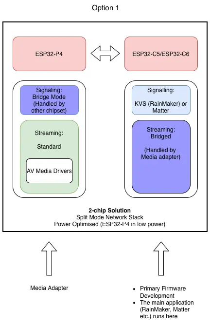
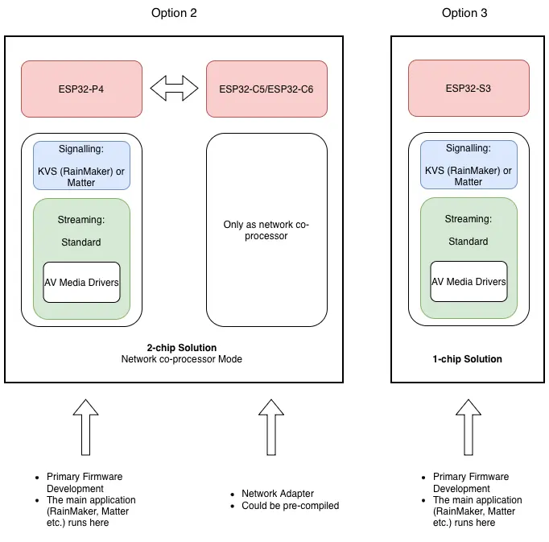
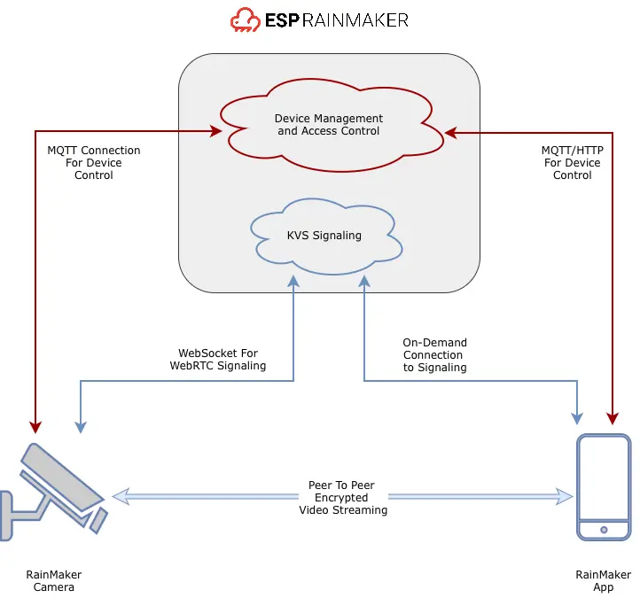

## Introduction

Today we're excited to announce the **ESP-IDF port of the Amazon KVS WebRTC SDK**, bringing enterprise-grade WebRTC video streaming capabilities to Espressif's microcontrollers. This port includes significant optimizations for ESP32 devices, enabling real-time audio and video streaming with features like STUN/TURN ICE servers, two-way audio/video streaming, data channel support, and [WebRTC ingestion](https://docs.aws.amazon.com/kinesisvideostreams-webrtc-dg/latest/devguide/webrtc-ingestion.html) for ingesting video to KVS.

Espressif's adaptation goes beyond a simple port—it introduces revolutionary features like **WebRTC Split Mode** for battery-powered devices, memory footprint optimizations, and a simplified API that makes WebRTC integration straightforward for developers.

As a demonstration of the SDK's capabilities, we're also announcing **ESP RainMaker Camera**—a production-ready camera solution built on top of the KVS WebRTC SDK. [ESP RainMaker](https://rainmaker.espressif.com/en) is already trusted across a wide range of IoT devices, and now with camera support, developers can build secure, low-latency streaming solutions with minimal effort.

## Amazon KVS WebRTC SDK For ESP

The [Amazon KVS WebRTC SDK for ESP](https://github.com/awslabs/amazon-kinesis-video-streams-webrtc-sdk-c/tree/beta-reference-esp-port) is a complete ESP-IDF adaptation of Amazon's WebRTC SDK, specifically optimized for Espressif's resource-constrained microcontrollers. This port enables real-time audio and video streaming on ESP32 devices with enterprise-grade features.

### Key Adaptations and Enhancements

#### Memory Footprint Optimizations

The ESP port introduces several memory optimizations critical for microcontroller deployments:

- **Alternative WebSocket Client**: Option to use `esp_websocket_client` as an alternative to libwebsockets, reducing memory footprint
- **Dynamic Memory Allocations**: By default, KVS uses static allocation of large buffers (~20KB) for each signaling message. The ESP port implements dynamic allocation strategies, allowing all messages to fit within the same memory footprint
- **SPIRAM Integration**: Modified memory allocation APIs to use SPIRAM (external RAM) wherever possible, preserving precious internal SRAM for critical operations

#### WebRTC Split Mode

One of the most significant innovations is the **WebRTC Split Mode** architecture:

- **Dual-Device Architecture**: Split mode distributes WebRTC functionality across two processors:
  - **Media Processor** (e.g., ESP32-P4): Handles video/audio capture, encoding, and streaming
  - **Network Processor** (e.g., ESP32-C6 or ESP32-C5): Handles network connectivity and signaling with AWS KVS
- **Power Optimization**: The media processor can enter deep sleep when not streaming, while the network processor maintains connectivity in light sleep mode
- **Instant Wake-up**: Shared network stack enables immediate IP address acquisition after wake-up, eliminating connection delays
- **Battery-Powered Applications**: This architecture enables battery-powered camera devices with significantly reduced power consumption

#### Simplified API with Smart Defaults

The SDK provides a simplified high-level API that reduces configuration complexity. This architecture allows developers to mix and match components based on their specific requirements, whether building a simple single-device solution or a complex multi-device system.

#### Deployment Architectures

The SDK supports multiple deployment architectures, each optimized for different use cases:

**Split Mode - Dual Chip Solution** (e.g., ESP32-P4 Function EV Board or C5 Core Board):

    <figure>
        
        <figcaption>Deployment Architecture (Option 1)</figcaption>
    </figure>

**Standalone Mode**
  - **Dual Chip Solution** (e.g., ESP32-P4 Function EV Board with network adapter). (Refer option 2)
  - **Single Chip Solution** (e.g., ESP32-S3-EYE). (Refer option 3).

    <figure>
        
        <figcaption>Deployment Architecture (Option 2 and Option 3)</figcaption>
    </figure>

## Examples by Espressif

The KVS WebRTC SDK ESP port includes comprehensive examples demonstrating different deployment scenarios. Each example showcases specific capabilities and use cases:

### Example Comparison

| Example | Signaling | Peer Connection | Hardware | Power Profile | Best For |
|---------|-----------|-----------------|----------|---------------|----------|
| **webrtc_classic/** | KVS | KVS | Single ESP32 | Standard | Learning, AWS integration |
| **esp_camera/** | AppRTC | KVS | Single ESP32 | Standard | Browser testing, no AWS |
| **split_mode/** | | | | | Battery-powered 2-chip Camera Implementation with 2 firmwares from the following rows: |
| **split_mode/streaming_only/** | Bridge | KVS | ESP32-P4 | Deep sleep capable | Battery-powered streaming |
| **split_mode/signaling_only/** | KVS | Bridge | ESP32-C6/C5 | Light sleep | Always-on connectivity |

**Note**: `streaming_only` and `signaling_only` work together as a pair for split mode deployments. They are typically used together on dual-chip boards like the ESP32-P4 Function EV Board (ESP32-P4 + ESP32-C6) or ESP32-P4-C5 Core Board (ESP32-P4 + ESP32-C5).

For detailed setup instructions and API documentation, see the [esp_port README](https://github.com/awslabs/amazon-kinesis-video-streams-webrtc-sdk-c/tree/beta-reference-esp-port/esp_port/README.md) and [API_USAGE.md](https://github.com/awslabs/amazon-kinesis-video-streams-webrtc-sdk-c/tree/beta-reference-esp-port/esp_port/API_USAGE.md).

## ESP RainMaker Camera - Production Use-Case

[ESP RainMaker Camera](https://github.com/espressif/esp-rainmaker/tree/master/examples/camera) demonstrates a production-ready camera solution built on top of the KVS WebRTC SDK. It showcases how the SDK's features can be integrated with ESP RainMaker's device management ecosystem to create a complete, secure camera solution.

The demonstration below shows the ESP RainMaker Camera in action:

    

        <iframe style="position: absolute; top: 0; left: 0; width: 100%; height: 100%;" src="https://www.youtube.com/embed/OWUbNJ3H71U" frameborder="0" allow="accelerometer; autoplay; clipboard-write; encrypted-media; gyroscope; picture-in-picture" allowfullscreen></iframe>
    

    
RainMaker Camera Demonstration

### How RainMaker Camera Leverages KVS SDK

It leverages several key SDK features:

- **Simplified API**: Uses the SDK's 4-line configuration approach with smart defaults
- **Split Mode Architecture**: Implements the split mode for battery-powered deployments
- **Credential Management**: Integrates RainMaker's streamlined AWS credential API with the SDK's credential callback mechanism
- **Pluggable Interfaces**: Uses KVS signaling and peer connection interfaces seamlessly

### RainMaker Camera Components

ESP RainMaker consists of 3 main components:

  1. Cloud Backend
  2. Open Source Phone apps: Android and iOS
  3. Open Source Firmware SDK

Camera support has been added to all components, enabling developers to start using it immediately with no custom development required.

    <figure>
        
        <figcaption>ESP RainMaker Camera Architecture Overview</figcaption>
    </figure>

### Architecture

RainMaker Camera follows the same deployment architectures as the KVS WebRTC SDK, supporting both standalone and split mode configurations. The standalone mode can run on a single chip (e.g., ESP32-S3-EYE) or use a dual-chip setup with a network adapter, while split mode distributes signaling and streaming across two processors for optimal power efficiency. The architecture diagrams shown in the [Amazon KVS WebRTC SDK For ESP](#amazon-kvs-webrtc-sdk-for-esp) section above illustrate these deployment patterns.

### Key Capabilities

**ESP32-P4 Performance**: Takes full advantage of the ESP32-P4's processing power, enabling smooth 1080p@30fps audio and video streaming. The [ESP32-P4](https://docs.espressif.com/projects/esp-dev-kits/en/latest/esp32p4/esp32-p4-function-ev-board/user_guide_v1.4.html) provides MIPI-CSI support for camera capture and hardware H.264 encoding, making it ideal for next-generation connected camera applications.

**Battery-Powered Operation**: RainMaker Camera is the first WebRTC camera running on microcontrollers that supports battery-powered operation. It uses the SDK's split mode architecture:

- Signaling and streaming are split across two different chips
- ESP32-P4 handles streaming and can enter deep sleep when idle
- ESP32-C6 or ESP32-C5 maintains connectivity in light sleep mode
- Both devices wake up only when streaming is requested
- After streaming ends, both devices return to sleep, saving significant power

**Security and Privacy**: Delivers strong security and privacy safeguards that modern regulations require, ensuring safe and compliant remote viewing. RainMaker securely stores device certificates and provides APIs for obtaining security tokens used by the KVS signaling connection.

**Developer Experience**: Building a RainMaker Camera feels like building any other RainMaker device. Developers keep the familiar ESP-IDF workflow, add camera support, and stay aligned with ESP-RainMaker's philosophy of simple and flexible APIs. Signaling and credentials are managed transparently without requiring developers to handle the details.

**End-User Experience**: Provisioning happens through the RainMaker app, live streaming is just a click away, and security is backed by Espressif hardware and the ESP-IDF community.

**Business Value**: Provides a low-cost, full-fledged solution that enables rapid prototyping and faster time-to-market, built on robust ecosystem support.

## Choosing the Right Hardware

The KVS WebRTC SDK ESP port supports a range of ESP32 development boards. The same hardware can be used with different examples depending on your use case. Here's a unified guide to help you choose:

| Board | Video | Encoding | Compatible Examples | Power Profile | Best For |
|------|-------|----------|---------------------|---------------|----------|
| **ESP32‑P4‑Function EV** | 1080p@30fps | Hardware H.264 | `webrtc_classic`, `esp_camera`, `streaming_only`+`signaling_only` (split mode), RainMaker Camera (standalone or split) | Standard or Battery-powered | Production streaming, power optimization |
| **ESP32‑P4‑C5 Core Board** | 1080p@30fps | Hardware H.264 | `webrtc_classic`, `esp_camera`, `streaming_only`+`signaling_only` (split mode), RainMaker Camera (standalone or split) | Standard or Battery-powered | Premium performance, 5GHz Wi-Fi |
| **ESP32‑S3‑EYE** | QVGA@5-10FPS | Software only | `webrtc_classic`, `esp_camera`, RainMaker Camera (standalone) | Standard | Development, testing, prototyping |

**Hardware Details:**

- **ESP32‑P4‑Function EV Board**: Production-grade board with hardware H.264 encoder. Has both ESP32-P4 and ESP32-C6 onboard, enabling standalone or split mode deployments. [Docs](https://docs.espressif.com/projects/esp-dev-kits/en/latest/esp32p4/esp32-p4-function-ev-board/index.html)
- **ESP32‑P4‑C5 Core Board**: Premium solution similar to Function EV Board, but with ESP32-C5 (instead of C6) for network processing. Features 5GHz Wi-Fi connectivity and supports both standalone and split mode deployments.
- **ESP32‑S3‑EYE**: Built-in camera and microphone, ideal for development/testing. [Guide](https://github.com/espressif/esp-who/blob/master/docs/en/get-started/ESP32-S3-EYE_Getting_Started_Guide.md)

**Important Notes**:

- **For standalone mode** (`webrtc_classic`, `esp_camera`, or RainMaker Camera standalone) on dual-chip boards (ESP32-P4 Function EV or C5 Core Board), the network processor (ESP32-C6 or ESP32-C5) must be flashed with the [`network_adapter`](https://github.com/awslabs/amazon-kinesis-video-streams-webrtc-sdk-c/tree/beta-reference-esp-port/esp_port/examples/network_adapter) firmware, which acts as a Wi-Fi modem. The network processor transparently forwards network traffic to the main processor.
- **For split mode** (`streaming_only` + `signaling_only`), both the ESP32-P4 Function EV Board and ESP32-P4-C5 Core Board are ideal as they have both processors onboard. The Function EV Board has ESP32-P4 (for streaming) and ESP32-C6 (for signaling), while the C5 Core Board has ESP32-P4 (for streaming) and ESP32-C5 (for signaling with 5GHz Wi-Fi). The network processor handles signaling while the P4 handles streaming and can sleep when not in use, enabling battery-powered camera applications.

## Getting Started with Examples

We provide two sets of examples, based on what you intend to do.

- Examples with AWS KVS WebRTC SDK: These are available in the [AWS KVS](https://github.com/awslabs/amazon-kinesis-video-streams-webrtc-sdk-c/tree/beta-reference-esp-port/esp_port/examples/) repository. These examples demonstrate the core SDK capabilities and provide a foundation for building your own WebRTC applications. If you have an existing solutions with AWS KVS, or are building one from scratch, prefer this to get started with.
- Examples with ESP RainMaker Camera: These are available in the [RainMaker Camera](https://github.com/espressif/esp-rainmaker/tree/master/examples/camera/README.md) repository. These examples demonstrate an end-to-end usecase facilitated with our free ESP RainMaker deployment. If you want to try and end-to-end camera demonstration quickly, prefer this to get started with.

## Upcoming features

- **Support For New Dev Board**: Support for more development kits out of the box
- **Activity detection**: Detecting different kinds of activity using AI and vision capabilities to take smart actions
- **Clip Storage**:
  - **Local Storage**: Storing the feed to local storage for viewing later
  - **Cloud Storage**: Optionally uploading of important clips to the RainMaker cloud for later viewing
- **Multi-client**: More robust streaming for concurrent viewing
- **Two-way Audio+Video**: For certain use-cases like video doorbells

---

Do give it a try and let us know what you build! Feedback is welcome.

**NOTE**

- Starting from version 3.4.0, camera support is available for private deployments. Please contact Espressif for the details.
