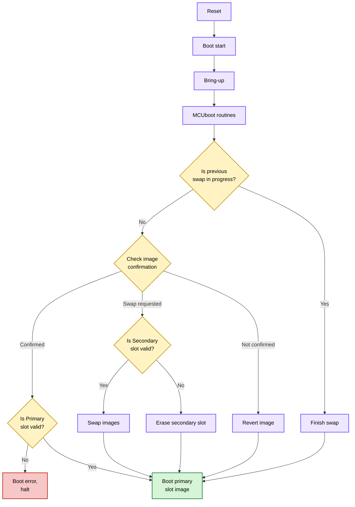

## Introduction


This is a translated and updated version of my original article on the [Embarcados website](https://embarcados.com.br/primeiros-passos-com-esp32-utilizando-mcuboot-como-bootloader/).


In the embedded world, firmware updates are essential and increasingly important. As IoT solutions grow exponentially in numbers and complexity, so does the concern to make devices secure and updatable in the field efficiently.

Some years ago, [**MCUboot**](https://github.com/mcu-tools/mcuboot) emerged as an open source bootloader project for small and low-cost systems, designed to simplify and provide a standard in this field. It started as an Apache Mynewt subproject when developers decided to separate the bootloader from OS development. Later, it was ported to **Zephyr RTOS** and became its default bootloader.

**Espressif Systems** has been broadening support for additional **third-party RTOSes** such as [**Zephyr**](https://www.zephyrproject.org/) and [**NuttX**](https://nuttx.apache.org/), offering developers more choices for its SoCs. For this reason, a port for Espressif SoCs has been created within the MCUboot project.

This article shows how to get started with MCUboot on your ESP32-based project. It covers what MCUboot is, how to set the environment and configure the application side, then how to build the [MCUboot Espressif Port](https://docs.mcuboot.com/readme-espressif.html) bootloader and flash it onto the device. We will use the [ESP32 DevKitC](https://docs.espressif.com/projects/esp-idf/en/latest/esp32/hw-reference/esp32/get-started-devkitc.html) board in this guide.


The MCUboot-compatible application in this guide can be either a NuttX or Zephyr RTOS application built for Espressif SoCs with MCUboot compatibility configuration enabled.

This guide assumes that you are familiar with building and configuring the chosen RTOS.


## What is MCUboot?

MCUboot is an open source secure bootloader for 32-bit microcontrollers. The project defines a common infrastructure for secure boot and it mainly covers:

- **Fault-tolerant updates**: MCUboot defines a clear flash layout. It uses slots to store the main bootable image and the update image in separate flash regions. A scratch area (see the table about areas below) supports swapping images during firmware updates. This design ensures updates are reliable and allows MCUboot to recover or revert if any issues occur.

- **Security**: MCUboot validates firmware images by checking hashes and verifying signatures using asymmetric key algorithms such as RSA 2048/3072, ECDSA, and ed25519. These mechanisms ensure the integrity and authenticity of the images.

The project aims to standardize these aspects comprehensively. MCUboot core features are independent from any operating system and hardware, relying on hardware porting layers from the target host OS.

### Image and flash organization

To track the general information, swap and update states from an application image, MCUboot requires specific data added by `imgtool`. This tool is provided within the MCUboot project and it formats the image binary adding the expected header and trailer, the signature, and can also generate signing keys.

MCUboot defines a flash organization where a flash area can contain multiple executable images depending on its boot and update configuration. Each image area contains two image slots: primary and secondary. By default, the bootloader only runs an image from the primary slot. The secondary slot is where an incoming image for firmware update is staged prior to being installed; then its content will be either swapped to the primary slot or overwritten during the update.

We can identify four types of flash areas in the layout:

| AREA | ID | DESCRIPTION |
|------|----|----|
| Bootloader | 0 | Bootloader region (MCUboot) |
| Primary Slot | 1 | Main bootable image, code always runs from there |
| Secondary Slot | 2 | Staging area for firmware updates, it stores the incoming image and, after the swap, stores the original image to enable recovery if needed |
| Scratch | 3 | Temporary area used for helping the image swap when updating |


As explained in [Application Startup Flow](https://docs.espressif.com/projects/esp-idf/en/stable/esp32/api-guides/startup.html), Espressif SoCs have a ROM bootloader (or *First Stage Bootloader*) which, as the name suggests, runs from the *Read-Only Memory* after reset and it is not modifiable, thus the MCUboot Espressif Port bootloader is the *Second Stage Bootloader*.


MCUboot also supports multiple images, allowing you to define additional image areas with their own primary and secondary slots.

For the MCUboot Espressif Port the layout information is stored in the `<MCUBOOT_DIR>/boot/espressif/port/<ESP_SOC>/bootloader.conf` file. Addresses and sizes can be modified, but the following rules must be followed:

- Bootloader address must be kept since it's where the ROM bootloader looks for a valid *Second Stage Bootloader* to start.
- None of the slots must overlap.
- Primary and Secondary slots must be the same size.
- Scratch area must be large enough to store at least the largest flash sector that will be swapped.
- Both MCUboot and the application must be aware of this layout for correct operation.


Flash organization is configurable and must match between MCUboot and the application being booted to ensure proper operation.


### High-level overview of the boot process

The following diagram shows the basic boot execution flow:



Notice that the bootloader verifies both slots in the process, but only boots the image from the Primary Slot:




The boot process and organization presented here are related to the Espressif Port current support to MCUboot. See more at the official [MCUboot documentation](https://docs.mcuboot.com/).


## Setting the environment

First, prepare the development environment. This guide assumes the use of Linux (Ubuntu 20.04.2 LTS or later).

Ensure you have `git`, `Python3`, `pip`, `CMake` and `Ninja` installed. If you don't, you can run the following (this step is optional):

```bash
sudo apt update
sudo apt upgrade
sudo apt install git python3 python3-pip cmake ninja-build
```

### MCUboot Espressif Port HAL

The MCUboot Espressif Port relies on HAL (Hardware Abstraction Layer) sources provided by **ESP-IDF**. To build the project, you should have **one of the following**:

- Install ESP-IDF, which allows building the project standalone
- Use Zephyr HAL source from Espressif ([`hal_espressif`](https://github.com/zephyrproject-rtos/hal_espressif))
- Use NuttX HAL source from Espressif ([`esp-hal-3rdparty`](https://github.com/espressif/esp-hal-3rdparty/))

For Zephyr and NuttX HAL sources, it is recommended to only use them within their respective RTOS build systems, as the source revisions may not match the expected versions.

**Installing ESP-IDF v5.1.6**

  ```bash
  git clone --recursive https://github.com/espressif/esp-idf.git
  ```

  ```bash
  cd <IDF_PATH>
  git checkout v5.1.6
  ```

  ```bash
  <IDF_PATH>/install.sh
  ```

  ```bash
  . <IDF_PATH>/export.sh
  ```

  More information about ESP-IDF installation can be found [here](https://docs.espressif.com/projects/esp-idf/en/latest/esp32/get-started/index.html#manual-installation).

### Clone and set up MCUboot

1. Clone the repository into a directory of your choice (other than ESP-IDF installation):

    ```bash
    git clone https://github.com/mcu-tools/mcuboot.git
    cd mcuboot
    ```

2. Install the additional dependencies needed by MCUboot:

    ```bash
    pip3 install -r scripts/requirements.txt
    ```

3. Update the MbedTLS submodule required by MCUboot:

    ```bash
    git submodule update --init --recursive ext/mbedtls
    ```

4. Any images you plan to boot with MCUboot must be formatted and signed using `imgtool`. You can find `imgtool` at `<MCUBOOT_DIR>/scripts/imgtool.py` (where `<MCUBOOT_DIR>` is the path to the cloned repository), or optionally, you can install it as follows:

    ```bash
    pip3 install imgtool
    ```


MCUboot repository includes some sample cryptographic keys for signing and testing the secure boot verification. It is crucial that you **never use these sample keys in production** since the private key is available in the MCUboot repository.
See how to generate and manage cryptographic keys at the [imgtool documentation](https://docs.mcuboot.com/imgtool.html).


## Building and flashing MCUboot on ESP32

With everything set, let's configure, build and flash the MCUboot Espressif Port bootloader.

1. Firstly set the flash layout organization in the `<MCUBOOT_DIR>/boot/espressif/port/esp32/bootloader.conf` file, it must match the same flash organization as the chosen RTOS. For example:

    ```text
    CONFIG_ESP_FLASH_SIZE=4MB
    CONFIG_ESP_BOOTLOADER_SIZE=0xF000
    CONFIG_ESP_BOOTLOADER_OFFSET=0x1000
    CONFIG_ESP_IMAGE0_PRIMARY_START_ADDRESS=0x20000
    CONFIG_ESP_APPLICATION_SIZE=0x150000
    CONFIG_ESP_IMAGE0_SECONDARY_START_ADDRESS=0x170000
    CONFIG_ESP_SCRATCH_OFFSET=0x3E0000
    CONFIG_ESP_SCRATCH_SIZE=0x1F000
    ```

2. Compile and generate the ELF:

    ```bash
    cd <MCUBOOT_DIR>/boot/espressif
    cmake -DCMAKE_TOOLCHAIN_FILE=tools/toolchain-esp32.cmake -DMCUBOOT_TARGET=esp32 -DESP_HAL_PATH=<IDF_PATH> -DMCUBOOT_FLASH_PORT=/dev/ttyUSB0 -B build -GNinja
    ```

    ```bash
    ninja -C build/
    ```

3. Erase the device's flash:

    ```bash
    esptool.py -p <PORT> erase_flash
    ```

4. Flash MCUboot Espressif Port bootloader to your board:

    ```bash
    ninja -C build/ flash
    ```

    Alternatively:

    ```bash
    esptool.py -p /dev/ttyUSB0 -b 921600 --before default_reset --after hard_reset --chip esp32 write_flash --flash_mode dio --flash_size detect --flash_freq 40m 0x1000 build/mcuboot_esp32.bin
    ```


You may adjust the USB port (`-p /dev/ttyUSB0`) and baud rate (`-b 921600`) according to your board connection.


5. Check the serial monitor on the UART port (the same port used to flash) and reset your ESP32 board. This guide uses `picocom` tool, but any serial monitor tool can be used:

    ```bash
    picocom -b 115200 /dev/ttyUSB0
    ```

Since no image has been flashed yet, you will see MCUboot waiting for an application image in the primary slot.

```text
[esp32] [INF] *** Booting MCUboot build v2.3.0-rc2-3-g234c66e6 ***
[esp32] [INF] [boot] chip revision: v3.0
[esp32] [INF] [boot.esp32] SPI Speed      : 40MHz
[esp32] [INF] [boot.esp32] SPI Mode       : DIO
[esp32] [INF] [boot.esp32] SPI Flash Size : 4MB
[esp32] [INF] [boot] Enabling RNG early entropy source...
[esp32] [INF] Primary image: magic=unset, swap_type=0x1, copy_done=0x3, image_ok=0x3
[esp32] [INF] Scratch: magic=unset, swap_type=0x1, copy_done=0x3, image_ok=0x3
[esp32] [INF] Boot source: primary slot
[esp32] [INF] Image index: 0, Swap type: none
[esp32] [ERR] Unable to find bootable image
```

## Preparing and flashing an application

You can use applications from either Zephyr or NuttX, ensuring MCUboot compatibility is enabled in whichever RTOS you use.

This section briefly outlines the required Kconfigs for configuring a NuttX or Zephyr application for MCUboot compatibility. It assumes you are already familiar with building and configuring your chosen RTOS.

### NuttX RTOS

Set the `menuconfig` options:

- Enable the `CONFIG_ESP32_APP_FORMAT_MCUBOOT` option
- Match the `SPI Flash Configuration` with the slots configuration in `<MCUBOOT_DIR>/boot/espressif/port/esp32/bootloader.conf`

In this guide’s example, `menuconfig` was set as follows:

- System Type -> Bootloader and Image Configuration->
    - Enable MCUboot-bootable format (`CONFIG_ESP32_APP_FORMAT_MCUBOOT`): y
- System Type -> SPI Flash Configuration ->
    - Application image primary slot offset (`CONFIG_ESP32_OTA_PRIMARY_SLOT_OFFSET`): 0x20000
    - Application image secondary slot offset (`CONFIG_ESP32_OTA_SECONDARY_SLOT_OFFSET`): 0x170000
    - Application image slot size (in bytes) (`CONFIG_ESP32_OTA_SLOT_SIZE`): 0x150000
    - Scratch partition offset (`CONFIG_ESP32_OTA_SCRATCH_OFFSET`): 0x3E0000
    - Scratch partition size (`CONFIG_ESP32_OTA_SCRATCH_SIZE`): 0x1F000

### Zephyr RTOS

Enable the `CONFIG_BOOTLOADER_MCUBOOT` configuration and check if the flash partitions on the `DTS` from your board matches what was set in the `<MCUBOOT_DIR>/boot/espressif/port/esp32/bootloader.conf`. For this example it is possible to set an overlay file with the following content:

```text
&flash0 {
	partitions {
		boot_partition: partition@0 {
			label = "mcuboot";
			reg = <0x0 DT_SIZE_K(64)>;
		};

		slot0_partition: partition@20000 {
			label = "image-0";
			reg = <0x20000 DT_SIZE_K(1344)>;
		};

		slot1_partition: partition@170000 {
			label = "image-1";
			reg = <0x170000 DT_SIZE_K(1344)>;
		};

		storage_partition: partition@3b0000 {
			label = "storage";
			reg = <0x3B0000 DT_SIZE_K(192)>;
		};

		scratch_partition: partition@3e0000 {
			label = "image-scratch";
			reg = <0x3E0000 DT_SIZE_K(124)>;
		};
	};
};
```

### Signing and Flashing the Application

Before flashing, sign the application binary using `scripts/imgtool.py` with `python3`. Replace `<APP_BIN>` with your application binary (e.g., `nuttx.hex` or `zephyr.bin`), and `signed.bin` will be the output signed image:

```bash
python3 scripts/imgtool.py sign --align 4 -v 0 -H 32 --pad-header -S 0x00150000 <APP_BIN> signed.bin
```

Alternatively, using `imgtool` (if you installed **imgtool** through **pip**):

```bash
imgtool sign --align 4 -v 0 -H 32 --pad-header -S 0x00150000 <APP_BIN> signed.bin
```


A **Zephyr** image with MCUboot compatibility doesn't need the `--pad-header` parameter.


Here is a quick look into what these `imgtool sign` parameters do:

- `--align 4`: Specify the flash device alignment as 4 bytes (32-bit word).
- `-v 0`: Specify the image version (in this case, `0`).
- `-H 32`: Specify the MCUboot header size to be added to the image binary.
- `--pad-header`: Indicates to `imgtool` to add the MCUboot header into the beginning of the image binary, instead of overwritting it (the Zephyr build for some platforms already pads the binary beginning with 0s and may not need this parameter).
- `-S 0x00150000`: Indicates the slot size so the tool can add the MCUboot trailer properly.


This step just adds the basic required header, however notice that we didn't add any cryptographic key for security verification yet. It will be covered in the following parts of this MCUboot guide series. Refer to the [imgtool documentation](https://docs.mcuboot.com/imgtool.html) for more information.


Flash the signed image to the device at the primary slot address:

```bash
esptool.py -p /dev/ttyUSB0 -b 921600 --before default_reset --after hard_reset --chip esp32 write_flash --flash_mode dio --flash_size detect --flash_freq 40m 0x20000 signed.bin
```

Checking the serial monitor, MCUboot should now successfully load and boot the application from the primary slot.

**NuttX's nsh**:

```text
[esp32] [INF] *** Booting MCUboot build v2.3.0-rc2-3-g234c66e6 ***
[esp32] [INF] [boot] chip revision: v3.0
[esp32] [INF] [boot.esp32] SPI Speed      : 40MHz
[esp32] [INF] [boot.esp32] SPI Mode       : DIO
[esp32] [INF] [boot.esp32] SPI Flash Size : 4MB
[esp32] [INF] [boot] Enabling RNG early entropy source...
[esp32] [INF] Primary image: magic=unset, swap_type=0x1, copy_done=0x3, image_ok=0x3
[esp32] [INF] Scratch: magic=unset, swap_type=0x1, copy_done=0x3, image_ok=0x3
[esp32] [INF] Boot source: primary slot
[esp32] [INF] Image index: 0, Swap type: none
[esp32] [INF] Disabling RNG early entropy source...
[esp32] [INF] br_image_off = 0x20000
[esp32] [INF] ih_hdr_size = 0x20
[esp32] [INF] Loading image 0 - slot 0 from flash, area id: 1
[esp32] [INF] DRAM segment: start=0x250a4, size=0xce4, vaddr=0x3ffb2010
[esp32] [INF] IRAM segment: start=0x20080, size=0x5024, vaddr=0x40080000
[esp32] [INF] start=0x40082048
IROM segment aligned lma 0x00040000 vma 0x400d0000 len 0x012afc (76540)
DROM segment aligned lma 0x00030000 vma 0x3f410000 len 0x003060 (12384)

NuttShell (NSH) NuttX-10.4.0
nsh>
```

**Zephyr's hello world**:

```text
[esp32] [INF] *** Booting MCUboot build v2.3.0-rc2-3-g234c66e6 ***
[esp32] [INF] [boot] chip revision: v3.0
[esp32] [INF] [boot.esp32] SPI Speed      : 40MHz
[esp32] [INF] [boot.esp32] SPI Mode       : DIO
[esp32] [INF] [boot.esp32] SPI Flash Size : 4MB
[esp32] [INF] [boot] Enabling RNG early entropy source...
[esp32] [INF] Primary image: magic=unset, swap_type=0x1, copy_done=0x3, image_ok=0x3
[esp32] [INF] Scratch: magic=unset, swap_type=0x1, copy_done=0x3, image_ok=0x3
[esp32] [INF] Boot source: primary slot
[esp32] [INF] Image index: 0, Swap type: none
[esp32] [INF] Disabling RNG early entropy source...
[esp32] [INF] br_image_off = 0x20000
[esp32] [INF] ih_hdr_size = 0x20
[esp32] [INF] Loading image 0 - slot 0 from flash, area id: 1
[esp32] [INF] DRAM segment: start=0x25f10, size=0x1110, vaddr=0x3ffb0000
[esp32] [INF] IRAM segment: start=0x20080, size=0x5e90, vaddr=0x40080000
[esp32] [INF] start=0x400830e0
I (327) boot: IROM      : lma=00040000h vma=400d0000h size=036D8h ( 14040) map
I (327) boot: DROM      : lma=00030000h vma=3f400000h size=00E94h (  3732) map
I (343) boot: libc heap size 182 kB.
I (343) spi_flash: detected chip: generic
I (343) spi_flash: flash io: dio
*** Booting Zephyr OS build v4.3.0-rc2-65-g03ce83a18fd5 ***
Hello World! esp32_devkitc/esp32/procpu
```

## Conclusion

MCUboot provides a solid structure and defines a standard flow for firmware updates and secure boot. These features are already implemented in the bootloader and can be easily enabled without many modifications when developing firmware.

Furthermore, as an open source project, MCUboot benefits from development by an interested and diverse community, resulting in faster issue resolution and active development.

In this guide, we covered how to build MCUboot bootloader for ESP32, how to sign an image, and how to organize flash properly. For more detailed information, refer to the [official MCUboot documentation](https://docs.mcuboot.com/).

The next step for this series is to understand how updates work in the MCUboot and use this feature appropriately.

## Resources

- [Original article (PT-BR language)](https://embarcados.com.br/primeiros-passos-com-esp32-utilizando-mcuboot-como-bootloader/)
- [MCUboot design documentation](https://docs.mcuboot.com/design.html)
- [MCUboot Espressif Port documentation](https://docs.mcuboot.com/readme-espressif.html)
- [MCUboot Walkthrough and Porting Guide](https://interrupt.memfault.com/blog/mcuboot-overview)
