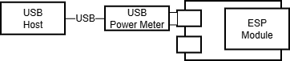
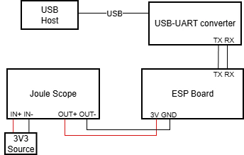

## Power Management in NuttX

### What is Power Management and Why It is Needed

Power management is the process of controlling energy consumption in devices to optimize efficiency, balance performance, and reduce costs. Power management features have an important place in embedded systems, especially for battery-powered or always-on IoT devices to achieve longer battery life which can be done by reducing power consumption through the use of sleep modes via turning off parts of the chip.

### Type of Sleep Modes on Espressif Devices

Espressif microcontrollers support these two major sleep modes:

- #### Light Sleep
Digital peripherals, most of the RAM, and CPUs are clock-gated and their supply voltage is reduced. When system wakes up, it resumes execution their internal states are preserved. Power consumption gain is not the best but recovery is faster in this case.

- #### Deep Sleep
CPUs, most RAM, and many peripherals are completely powered off. Only the RTC controller, ULP coprocessor and RTC fast memory stay powered on. Power consumption gain is better than light sleep but device restarts after sleep. It is a better solution for long idle period use cases.

### Wake Up Sources From Sleep Modes

- #### Light sleep wakeup table:

| Device/Wakeup source | Timer | External (ext0) | External (ext1) | ULP Coprocessor | GPIO | UART | Touchpad |
|----------------------|-------|-----------------|-----------------|-----------------|------|------|----------|
| ESP32                | Yes   | Yes*            | Yes*            | Yes*            | Yes* | Yes* | Yes*     |
| ESP32-S2             | Yes   | Yes             | Yes             | Yes             | Yes  | Yes  | Yes*     |
| ESP32-S3             | Yes   | Yes             | Yes             | Yes             | Yes  | Yes  | Yes*     |
| ESP32-C3             | Yes   | No              | No              | No              | Yes  | Yes  | No       |
| ESP32-C6             | Yes   | No              | Yes             | Yes             | Yes  | Yes  | No       |
| ESP32-H2             | Yes   | No              | Yes             | No              | Yes  | Yes  | No       |

`*`: Not supported on NuttX


- #### Deep sleep wakeup table:

| Device/Wakeup source | Timer | External (ext0) | External (ext1) | ULP Coprocessor | Touchpad |
|----------------------|-------|-----------------|-----------------|-----------------|----------|
| ESP32                | Yes   | Yes*            | Yes*            | Yes*            | Yes*     |
| ESP32-S2             | Yes   | Yes             | Yes             | Yes             | Yes*     |
| ESP32-S3             | Yes   | Yes             | Yes             | Yes             | Yes*     |
| ESP32-C3             | Yes   | No              | No              | No              | No       |
| ESP32-C6             | Yes   | No              | Yes             | Yes             | No       |
| ESP32-H2             | Yes   | No              | Yes             | No              | No       |

`*`: Not supported on NuttX

> - There is an important difference between ext0 and ext1 wakeup modes, ext0 wakeup mode allows to configure one pin, while ext1 wakeup mode can be enabled for multiple pins

> - UART FIFO buffer handling differs when entering sleep modes. Before deep sleep, UART FIFO content is flushed, while in light sleep it is suspended and sent after wake-up

### NuttX Power Management System

This section will explain NuttX power manager internals to understand how to get the device into different power consumption modes.

#### Power Management States

<cite>[Various “sleep” and low power consumption states have various names and are sometimes used in conflicting ways. In the NuttX PM logic, we will use the following terminology:<br><br>
`NORMAL`: The normal, full power operating mode.<br><br>
`IDLE`: This is still basically normal operational mode, the system is, however, IDLE and some simple simple steps to reduce power consumption provided that they do not interfere with normal Operation. Simply dimming the a backlight might be an example some that that would be done when the system is idle.<br><br>
`STANDBY`: Standby is a lower power consumption mode that may involve more extensive power management steps such has disabling clocking or setting the processor into reduced power consumption modes. In this state, the system should still be able to resume normal activity almost immediately.<br><br>
`SLEEP`: The lowest power consumption mode. The most drastic power reduction measures possible should be taken in this state. It may require some time to get back to normal operation from SLEEP (some MCUs may even require going through reset).
][1]</cite>

To match with these states to Espressif's sleep modes; idle and normal states are equivalent to normal working mode, standby state is light-sleep and sleep state is equal to deep sleep mode.

#### Power Management Governor

NuttX has different type of power manager systems called governor that gives decision between power state changes. To them briefly:

- **Greedy Governor:** This is the simplest governor which always selects the least power consumption state available. This method is suitable for aggressive power saving because it can enter into sleep mode without any delay or activity tracking. It will be a great choice for systems where immediate power saving is critical and rapid fluctuation between power states is not an issue.

- **Stability Governor:** This governor extends the greedy governor by still choosing the least power consumption state available with a difference of time-based stability check. This method is better for systems where rapid power state transitions should be to avoided.

- **Activity Governor:** This governor based on activity reports from drivers. This method is better for systems where dynamic workloads that require a balance between power efficiency and responsiveness.

### How to Use Sleep Modes

This section assumes that NuttX environment had already installed. To install environment please refer to [Getting Started with NuttX and ESP32
](https://developer.espressif.com/blog/2020/11/nuttx-getting-started/) article. Basic required options for power manager had already enabled on `pm` defconfig which are available for every Espressif chip supported in NuttX.

Here is the example command for building and flashing to use power manager on esp32c6:

```
make distclean &&
./tools/configure.sh esp32c6-devkitc:pm &&
make &&
make flash ESPTOOL_PORT=/dev/ttyUSB0 ESPTOOL_BINDIR=./ &&
```

This configuration uses `GREEDY` governor and sets `CONFIG_PM_GOVERNOR_EXPLICIT_RELAX` option to `-1` to do not let power management control by timers instead of completely manual. This power manager setup checks the power state counts and immediately transitions the device to the highest power consuming state whose count is greater than zero. Therefore, if the `NORMAL` and `IDLE` states are removed, device will enter light-sleep and if `STANDBY` state also removed device will enter deep-sleep.

### Entering Into Sleep Modes from NuttX Shell

To switch the power state, the current state counts must be examined to determine the correct number of state transitions required. The `pmconfig` command queries state counts of all power states. Here is an example output:

```
nsh> pmconfig
Last state 0, Next state 0

/proc/pm/state0:
DOMAIN0                   WAKE           SLEEP          TOTAL
normal                    8s 100%        0s   0%        8s 100%
idle                      0s   0%        0s   0%        0s   0%
standby                   0s   0%        0s   0%        0s   0%
sleep                     0s   0%        0s   0%        0s   0%

/proc/pm/wakelock0:
DOMAIN0                   STATE          COUNT          TIME
system                    normal         2              8s
system                    idle           1              8s
system                    standby        1              8s
system                    sleep          1              8s

/proc/pm/preparefail0:
CALLBACKS                 IDLE           STANDBY        SLEEP
```

To decrease the count of a power state `pmconfig relax <STATE_NAME>` command, to increase the count of a power state `pmconfig stay <STATE_NAME>` command can be used. Here is an example usage and result:

- Decreasing the count of a power state example:

```
# Query of power states
nsh> pmconfig
Last state 0, Next state 0

/proc/pm/state0:
DOMAIN0                   WAKE           SLEEP          TOTAL
normal                    8s 100%        0s   0%        8s 100%
idle                      0s   0%        0s   0%        0s   0%
standby                   0s   0%        0s   0%        0s   0%
sleep                     0s   0%        0s   0%        0s   0%

/proc/pm/wakelock0:
DOMAIN0                   STATE          COUNT          TIME
system                    normal         2              8s
system                    idle           1              8s
system                    standby        1              8s
system                    sleep          1              8s

/proc/pm/preparefail0:
CALLBACKS                 IDLE           STANDBY        SLEEP

# normal power state count was 2, after this command it should be 1
nsh> pmconfig relax normal

nsh> pmconfig
Last state 0, Next state 0

/proc/pm/state0:
DOMAIN0                   WAKE           SLEEP          TOTAL
normal                   25s 100%        0s   0%       25s 100%
idle                      0s   0%        0s   0%        0s   0%
standby                   0s   0%        0s   0%        0s   0%
sleep                     0s   0%        0s   0%        0s   0%

/proc/pm/wakelock0:
DOMAIN0                   STATE          COUNT          TIME
system                    normal         1              25s
system                    idle           1              25s
system                    standby        1              25s
system                    sleep          1              25s

/proc/pm/preparefail0:
CALLBACKS                 IDLE           STANDBY        SLEEP
```
- Increasing the count of a power state example:

```
# Query of power states
nsh> pmconfig
Last state 0, Next state 0

/proc/pm/state0:
DOMAIN0                   WAKE           SLEEP          TOTAL
normal                    8s 100%        0s   0%        8s 100%
idle                      0s   0%        0s   0%        0s   0%
standby                   0s   0%        0s   0%        0s   0%
sleep                     0s   0%        0s   0%        0s   0%

/proc/pm/wakelock0:
DOMAIN0                   STATE          COUNT          TIME
system                    normal         2              8s
system                    idle           1              8s
system                    standby        1              8s
system                    sleep          1              8s

/proc/pm/preparefail0:
CALLBACKS                 IDLE           STANDBY        SLEEP

# idle power state count was 1, after this command it should be 2
nsh> pmconfig stay idle

nsh> pmconfig
Last state 0, Next state 0

/proc/pm/state0:
DOMAIN0                   WAKE           SLEEP          TOTAL
normal                   31s  51%       29s  48%       60s 100%
idle                      0s   0%        0s   0%        0s   0%
standby                   0s   0%        0s   0%        0s   0%
sleep                     0s   0%        0s   0%        0s   0%

/proc/pm/wakelock0:
DOMAIN0                   STATE          COUNT          TIME
system                    normal         2              60s
system                    idle           2              60s
system                    standby        1              60s
system                    sleep          1              60s

/proc/pm/preparefail0:
CALLBACKS                 IDLE           STANDBY        SLEEP
```

- To let the device enter into light sleep, `normal` and `idle` state counts needs to be 0. While decreasing count of that states it is better to start from the least power consuming one to prevent the system entering into other power states. Here is an example:

```
nsh> pmconfig relax idle
nsh> pmconfig relax normal
nsh> pmconfig relax normal
nsh> up_idlepm: newstate= 2 oldstate=0
up_idlepm: newstate= 0 oldstate=2
nsh>
```

- To let the device enter into deep sleep, `standby` state need to removed additional to required process for light sleep. Here is an example:

```
nsh> pmconfig relax standby
nsh> pmconfig relax idle
nsh> pmconfig relax normal
nsh> pmconfig relax normal
nsh> up_idlepm: newstate= 3 oldstate=0
ESP-ROM:esp32c6-20220919
Build:Sep 19 2022
rst:0x5 (DSLEEP),boot:0xc (SPI_FAST_FLASH_BOOT)
SPIWP:0xee
mode:DIO, clock div:2
load:0x40800000,len:0x7ee4
load:0x40807ef0,len:0xff0
SHA-256 comparison failed:
Calculated: a2d5509f5471c59fa78a97c6f2cd7b2b4468a3a523ae330348591699de2bc9a1
Expected: 00000000f0700000000000000000000000000000000000000000000000000000
Attempting to boot anyway...
entry 0x40807b9c
*** Booting NuttX ***
dram: lma 0x00000020 vma 0x40800000 len 0x7ee4   (32484)
dram: lma 0x00007f0c vma 0x40807ef0 len 0xff0    (4080)
padd: lma 0x00008f08 vma 0x00000000 len 0x70f0   (28912)
imap: lma 0x00010000 vma 0x42020000 len 0xb200   (45568)
padd: lma 0x0001b208 vma 0x00000000 len 0x4df0   (19952)
imap: lma 0x00020000 vma 0x42000000 len 0x1f7e8  (129000)
total segments stored 6

NuttShell (NSH) NuttX-10.4.0
nsh>
```

### Entering Into Sleep Modes from Application

Here is a snippet for entering into sleep mode:

```
#include <nuttx/config.h>
#include <nuttx/power/pm.h>
#include <sys/boardctl.h>
#include <sys/ioctl.h>

static void remove_state(enum pm_state_e state)
{
  int count;
  struct boardioc_pm_ctrl_s ctrl =
  {
  };
  ctrl.action = BOARDIOC_PM_RELAX;

  count = pm_staycount(PM_IDLE_DOMAIN, state);
  for (int i = 0; i < count; i++)
    {
      ctrl.state = state;
      boardctl(BOARDIOC_PM_CONTROL, (uintptr_t)&ctrl);
    }
}


int main(int argc, char *argv[])
{
    if (deep_sleep)
      {
        /* Entering deep sleep */
        remove_state(PM_STANDBY);
      }

    /* Entering light sleep */
    remove_state(PM_IDLE);
    remove_state(PM_NORMAL);

    return 0;
}
```

This snippet will let the device enter sleep mode with decreasing power state counts. To increase a power state count, `BOARDIOC_PM_STAY` action needs to be used instead of `BOARDIOC_PM_RELAX` in `boardctl` call. For more information about custom applications on NuttX please check [NuttX official custom apps guide](https://nuttx.apache.org/docs/latest/guides/customapps.html), [Integrating External Libraries into NuttX Applications](https://developer.espressif.com/blog/2025/11/nuttx-external-lib/) and [Building Applications on NuttX: Understanding the Build System](https://developer.espressif.com/blog/2024/09/building-applications-on-nuttx-understanding-the-build-system/) articles.

### Power Consumption Measurements

#### Test Benches

- USB power meter connected to the microcontroller and commands send through built in USB-UART converter.


- Microcontroller is powered through a multimeter for power measurement, while UART communication is handled separately via a USB-UART  converter.


#### Results

| Device/Operation Mode      | Idle   | Light Sleep | Deep Sleep |
|----------------------------|--------|-------------|------------|
| ESP32 (esp32-devkitc)      |42.3 mA |1.4 mA       |1 mA        |
| ESP32-S2 (esp32s2-saola-1) |26 mA   |2.1 mA       |1.24 mA     |
| ESP32-S3 (esp32s3-devkitc) |46 mA   |4.3 mA       |1.24 mA     |
| ESP32-C3 (esp32c3-devkit)  |18 mA   |1 mA         |815 μA      |
| ESP32-C6 (esp32c6-devkitc) |26 mA   |1.32 mA      |540 μA*     |
| ESP32-H2 (esp32h2-devkit)  |14 mA   |880 μA       |510 μA**    |

`*`: Overall board consumtion, module consumption is 48 μA

`**`: Overall board consumtion, module consumption is 8 μA

### Conclusion

In this article, we took a look NuttX power management system and how to use light sleep and deep sleep modes on Espressif microcontrollers with using NuttX shell or NuttX applications.

### Resources
- [Espressif sleep modes docs](https://docs.espressif.com/projects/esp-idf/en/stable/esp32/api-reference/system/sleep_modes.html)
- [NuttX PM docs](https://nuttx.apache.org/docs/10.0.1/components/power.html)
- [Getting Started with NuttX and ESP32 article](https://developer.espressif.com/blog/2020/11/nuttx-getting-started/)
- [Integrating External Libraries into NuttX Applications article](https://developer.espressif.com/blog/2025/11/nuttx-external-lib/)
- [Building Applications on NuttX: Understanding the Build System article](https://developer.espressif.com/blog/2024/09/building-applications-on-nuttx-understanding-the-build-system/)
- [NuttX Custom Apps How-to doc](https://nuttx.apache.org/docs/latest/guides/customapps.html)

[1]: https://nuttx.apache.org/docs/10.0.1/components/power.html
