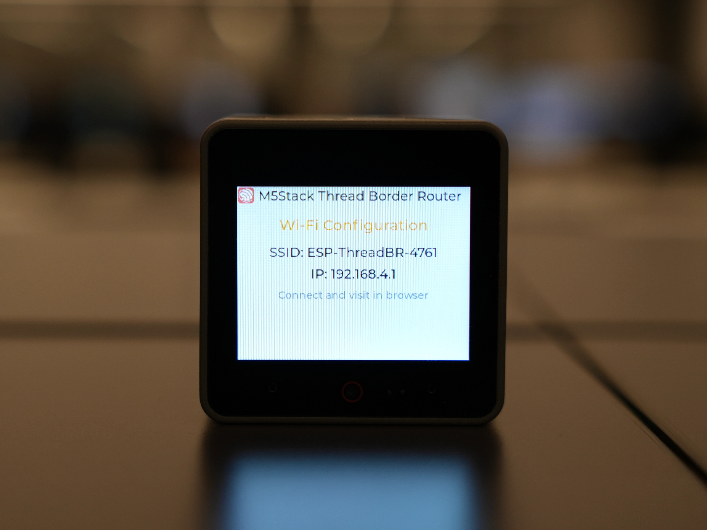
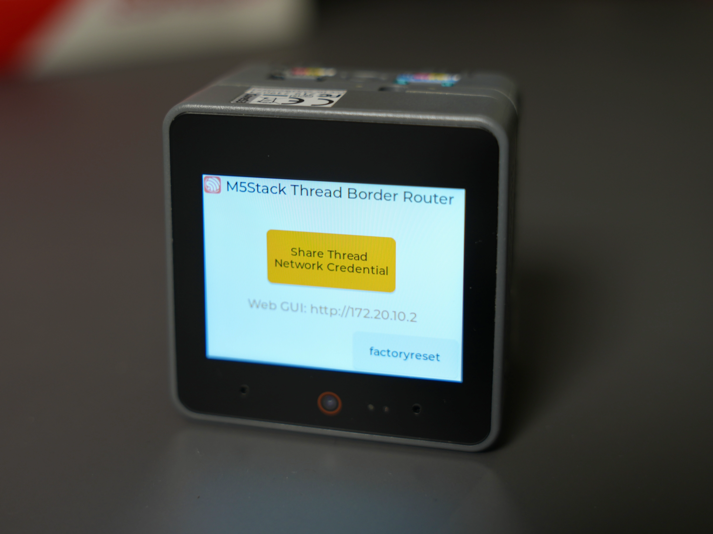
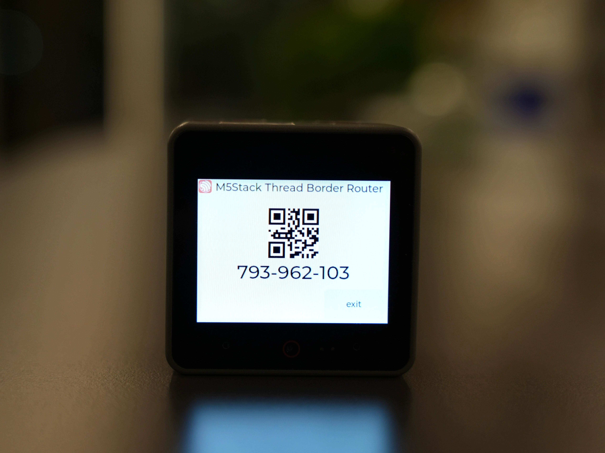
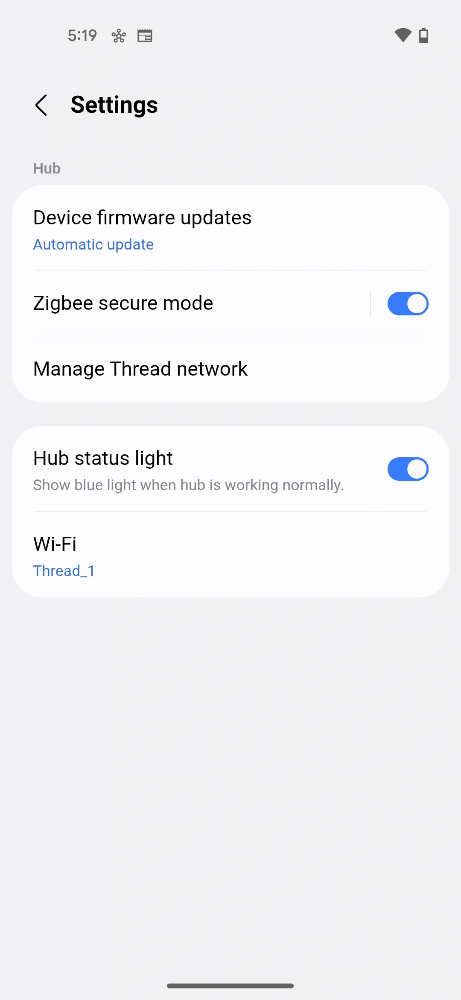
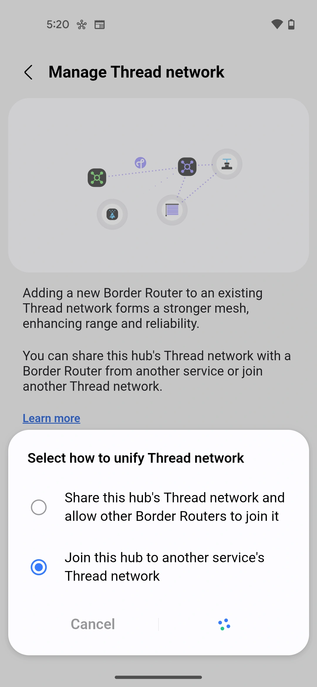
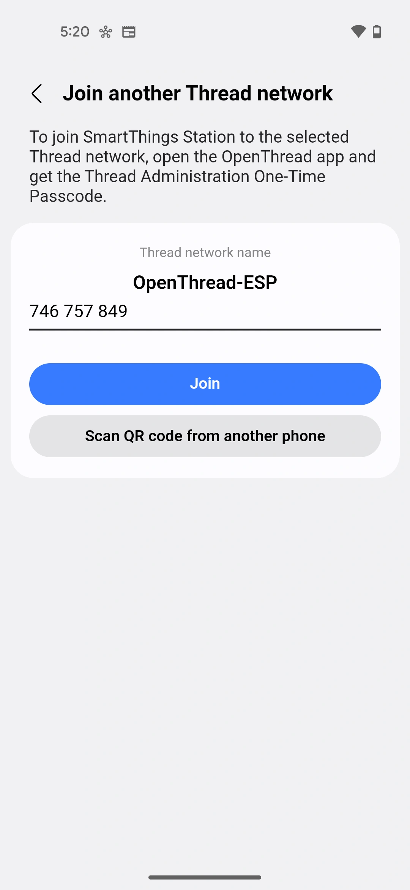
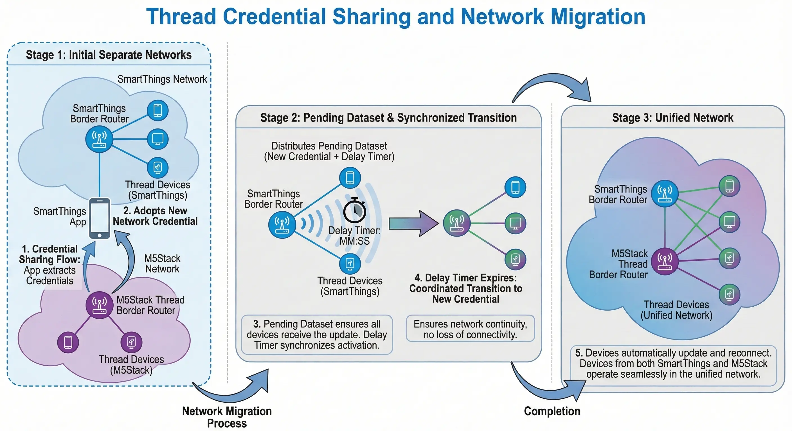

Thread Credentials Sharing is an important feature introduced in [Thread 1.4](https://www.threadgroup.org/Portals/0/Documents/Thread_1.4_Features_White_Paper_September_2024.pdf). It's a secure procedure that allows sharing administrative access to an existing Thread network and extracting its network credentials. This feature enables new Thread Border Routers and devices to join an existing Thread network, creating a unified, scalable, and interoperable mesh without recreating a new network.

## What is Thread Network Credentials

Thread network credentials are a set of security and operational parameters required for a device to be part of a Thread network. It's usually called the Operational Dataset and includes the following items:

```
Active Timestamp: 1
Channel: 14
Wake-up Channel: 21
Channel Mask: 0x07fff800
Ext PAN ID: 02784020fbd06377
Mesh Local Prefix: fd2c:c3b9:f1fa:5de9::/64
Network Key: c3d8c8cf8a427b13facf757d2bab1249
Network Name: ESP-BR-4760
PAN ID: 0xfc30
PSKc: 8001219ca519cdf7103bb5c814fbf320
Security Policy: 672 onrc 0
```

The corresponding binary format (TLV-encoded Operational Dataset) is a compact hexadecimal representation:
```
0e080000000000010000000300000e4a0300001535060004001fffe0020802784020fbd063770708fd2cc3b9f1fa5de90510c3d8c8cf8a427b13facf757d2bab1249030b4553502d42522d343736300102fc3004108001219ca519cdf7103bb5c814fbf3200c0402a0f7f8
```

Unlike Wi-Fi SSID and password, Thread credentials are not easy for humans to remember and type into mobile apps. A secure and user-friendly approach is desired, and the Thread Credentials Sharing feature addresses this need.

## Why Thread Credentials Sharing is Important

Thread Credentials Sharing addresses several critical challenges in Thread network deployment and management:

- **Avoiding network fragmentation:** Credentials sharing allows Thread devices to join a single Thread network, reducing fragmentation and improving the overall mesh efficiency.
- **Better coverage:** By allowing Thread routers to join the same network, you can extend coverage and improve network reliability through redundancy.
- **Cross-ecosystem interoperability:** Thread Border Routers and devices from different ecosystems and device makers can all work in a single network, sharing the same Thread network infrastructure.
- **Seamless device migration:** Devices can be easily operated among different ecosystems without network reconfiguration.
- **Improved user experience:** Credentials sharing simplifies the onboarding process for new devices and network migration.

Typical usage scenarios include:

- **Onboarding new devices:** When you want to onboard a new Thread device, but your app doesn't know the credentials of the existing Thread network in your home.
- **Ecosystem migration:** When there are multiple Thread networks from different ecosystems in your home, and you want to migrate them into a single network to provide better network connectivity.
- **Enabling Multi-Admin Environments:** There could be multiple admin roles to onboard new devices on the same network (e.g., Matter protocol). They should share the same network credentials.

## How Thread Credentials Sharing Works

Thread Credentials Sharing involves three key participants:

- **User**: The human user who initiates and facilitates the credentials sharing process
- **Border Router**: Strictly speaking, it's the Border Agent role of the network, holding the existing Thread network credentials and sharing them
- **Commissioner Candidate**: Typically a mobile app that receives the credentials and onboards new devices or manages the network

The procedure follows these steps:

  

1. **Start Credential Sharing:** The user starts the Credentials Sharing process on the Border Router. It can be triggered in various ways, for example:
   - The Border Router's display screen (if available)
   - The Border Router's vendor-specific mobile app

2. **Generate One-Time Passcode (OTPC):** The Border Router generates a one-time passcode (OTPC) and advertises a MeshCoP-ePSKc DNS-SD service (`_meshcop-e._udp`).

3. **Display / Get OTPC:** The user retrieves the OTPC from the Border Router, either from its display screen or mobile app.

4. **Input OTPC:** The user inputs the OTPC into the Commissioner Candidate (typically a mobile app).

5. **Derive ePSKc:** The Commissioner Candidate derives the ePSKc (Ephemeral Pre-Shared Key) from the OTPC.

6. **Discover Border Router:** The Commissioner Candidate discovers the Border Router operating in ePSKc mode via DNS-SD (mDNS).

7. **Establish Secure Session:** The Commissioner Candidate establishes a secure DTLS session with the Border Router using the derived ePSKc.

8. **Extract Credential:** The Border Router securely transfers the Thread network credentials to the Commissioner Candidate.

9. **Use the Credential:** Once the Credentials Sharing procedure is complete, the Commissioner Candidate can use the credentials to:
   - Commission new devices to the same Thread network
   - Migrate or restore existing Thread networks
   - Securely store the credentials in the phone's keychain for reuse by other apps

## Production Considerations

Credentials Sharing is a mandatory feature for Thread 1.4 Border Routers. Every Thread 1.4 (and later) certified Border Router must support this feature to ensure interoperability and seamless network management across different ecosystems and platforms.

## Demo using M5Stack Thread Border Router and Samsung SmartThings app

The [M5Stack Thread Border Router](https://shop.m5stack.com/products/m5stack-thread-border-router) is a Thread 1.4 certified Border Router that supports the Credentials Sharing feature. It provides a practical example of how Credentials Sharing works in real-world deployments.

The Samsung SmartThings ecosystem also supports the Thread 1.4 Credentials Sharing feature. For more details, see SmartThings [release notes](https://community.smartthings.com/t/aeotec-smart-home-hub-2-aeotec-smart-home-hub-2018-2015-model-hub-firmware-release-notes-0-58-10/305623#p-1442134-general-2).

In this demo, we start with two separate Thread networks: one hosted by Samsung SmartThings and another by the M5Stack Thread Border Router. We then demonstrate using the SmartThings app to extract Thread credentials from the M5Stack Thread Border Router and migrate the SmartThings Thread Border Router to the M5Stack network. This demonstrates how the two networks can be migrated into a single unified network.

### Set up M5Stack Thread Border Router

You can either get an [M5Stack Thread Border Router](https://shop.m5stack.com/products/m5stack-thread-border-router) with pre-flashed firmware, or set it up yourself by building and flashing the example from the [Espressif Thread BR repository](https://github.com/espressif/esp-thread-br/tree/main/examples/m5stack_thread_border_router).

1. **First Boot:** On first boot, the device will start in SoftAP mode and provide a Wi-Fi configuration web service.

2. **Configure Wi-Fi:**
   - Join the SoftAP network (SSID: `ESP-ThreadBR-xxx`) from your phone or PC
   - Visit `http://192.168.4.1` to configure Wi-Fi SSID and password

Once configured, the device does the following:

- Connects to the configured Wi-Fi network
- Forms a Thread network
- Acts as a Thread Border Router


  
  
  


### Perform Credentials Sharing using SmartThings App

The steps to perform Credentials Sharing using the SmartThings app:

1. **Set up SmartThings Hub:** Using the SmartThings app, set up a SmartThings hub with Thread Border Router capability.

2. **Generate OTPC:** Click the `Share Thread Network Credential` button on the M5Stack Thread Border Router screen. The device will generate an OTPC and display it on the screen, along with a QR code for easy scanning.

3. **Navigate to Thread Network Settings:** In the SmartThings app, navigate to **Settings** → **Manage Thread Network** → **Unify Thread network** → **Join this hub to another service's Thread network** → Choose the discovered network. (please ensure the Phone is on the same Wi-Fi network as the M5Stack Thread Border Router)

4. **Enter OTPC:** On the `Join another Thread network` page, input the OTPC or scan the QR code from the M5Stack screen.

5. **Complete Migration:** The credentials sharing process will happen automatically. Once complete, you will find that the SmartThings hub has migrated itself to the M5Stack Thread Border Router's network.

Some key screenshots from step 3 and 4 are shown below:


  
  
  


When the SmartThings Border Router migrates to the M5Stack network, the Thread devices that were previously connected to the original SmartThings network need to update their network configuration. This process is handled automatically through Thread's **Pending Dataset** mechanism:

<div style="display: flex; justify-content: center; gap: 10px; margin: 20px 0; flex-wrap: wrap;">
  <figure style="margin: 0; flex: 1; min-width: 400px; max-width: 100%;">
    
  </figure>
</div>

1. **Pending Dataset Distribution:** After the Border Router adopts the new network credentials, it distributes a Pending Operational Dataset to all devices in its network. This dataset contains the new network parameters (network key, PAN ID, channel, etc.) that will replace the current Active Operational Dataset.

2. **Synchronized Transition:** Along with the Pending Dataset, there is a corresponding Delay Timer, ensuring all devices receive the update and can synchronize the transition. When the timer expires, all devices simultaneously switch to the new Active Operational Dataset. Throughout the transition, device connectivity is maintained, ensuring a seamless user experience.

This mechanism ensures that all devices smoothly transition to the unified network without becoming orphaned or requiring manual reconfiguration.

The credential sharing and network migration process is now complete, and devices from both the SmartThings and M5Stack networks are operating seamlessly within a unified Thread network.

This demo shows how Credentials Sharing simplifies the process of adding new Border Routers or migrating between ecosystems, making Thread networks more user-friendly and interoperable. The M5Stack Thread Border Router serves as an excellent example of how Thread 1.4 features can be implemented in practical, developer-friendly hardware.

## Other Credentials Sharing Methods

The method described above is the standardized Thread credentials sharing mechanism defined in the [Thread Specification](https://www.threadgroup.org/Resources#specifications), there are other methods available depending on the platform and ecosystem.

### OS-Level APIs

As mentioned in the procedure section, once the Commissioner Candidate receives the credentials, it can store them in the phone's keychain for future use. The same credentials can be read by other phone apps running on the same device. Both iOS and Android mobile operating systems provide native APIs for Thread credentials management:

- **iOS Thread Network Framework:** Apple provides the [Thread Network framework](https://developer.apple.com/documentation/threadnetwork) that allows apps to store and retrieve Thread credentials securely in the system keychain. This enables seamless credentials sharing between apps and system services. The framework includes the [Thread Network Credentials API](https://developer.apple.com/documentation/threadnetwork/managing-thread-network-credentials) for managing credentials.

- **Android Google Home APIs:** Google provides Thread credentials management through the [Google Home APIs](https://developers.home.google.com/thread), allowing Android apps to access and share Thread network credentials. Similar to iOS, this provides high-level APIs for managing credentials.

These OS-level APIs provide a secure and straightforward way for applications to access Thread credentials and share them among apps from different ecosystems.

### Application-Level Protocols

Some application protocols implement credentials sharing mechanisms over the application layer secure session:

- **Matter:** The [Matter specification](https://csa-iot.org/all-solutions/matter/) includes a `Thread Border Router Management Cluster` that can be used for Thread network management, including credentials operations. Matter controllers can use this cluster to manage Thread Border Routers and retrieve network credentials. This provides an application-layer abstraction for Thread credentials management within the Matter ecosystem, enabling seamless integration with Matter-based smart home systems.

- **ESP RainMaker:** Espressif's [RainMaker over Thread](https://developer.espressif.com/blog/2025/02/rainmaker-over-thread/) solution provides a Thread Border Router service that includes credentials management capabilities. This allows RainMaker apps to share and manage Thread credentials for devices in the RainMaker ecosystem.

### REST APIs

Some Thread Border Router implementations provide local REST APIs that allow authorized applications to retrieve network credentials. These are typically secured using local network access control and provide a web-based interface for Thread network management. For example:

- **OpenThread Border Router (OTBR/ot-br-posix):** Provides REST APIs as defined in the [openapi.yaml](https://github.com/openthread/ot-br-posix/blob/main/src/rest/openapi.yaml)
- **Espressif Thread Border Router SDK:** Provides compatible REST APIs as documented in the [Thread REST APIs guide](https://docs.espressif.com/projects/esp-thread-br/en/latest/codelab/web-gui.html#thread-rest-apis)

## Conclusion

Thread Credential Sharing is a pivotal feature that addresses key challenges in Thread network deployment and management. By enabling secure sharing of network credentials, it prevents network fragmentation, enables cross-ecosystem interoperability, and significantly simplifies device onboarding and migration.

## Related Resources

- [Thread 1.4 Features White Paper](https://www.threadgroup.org/Portals/0/Documents/Thread_1.4_Features_White_Paper_September_2024.pdf) - Official Thread Group documentation on Thread 1.4 features
- [Apple Thread Network framework](https://developer.apple.com/documentation/threadnetwork) - iOS Thread Network framework documentation
- [Google Home APIs for Thread](https://developers.home.google.com/thread) - Android Thread credentials management APIs
- [M5Stack Thread Border Router](https://shop.m5stack.com/products/m5stack-thread-border-router) - M5Stack Thread Border Router documentation
- [Espressif Thread Border Router](https://docs.espressif.com/projects/esp-thread-br) - Espressif's Thread Border Router solution
- [OpenThread](https://openthread.io/) - Open-source Thread stack implementation
