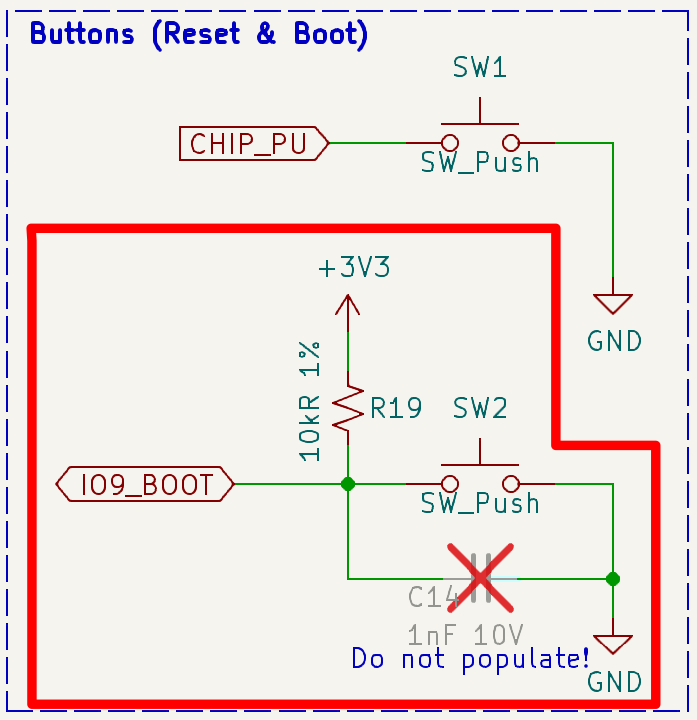

## Introduction

Buttons are fundamental input elements in embedded systems, yet handling them properly requires careful attention to debouncing, event detection, and timing. Today, we're excited to introduce the [**button**](https://components.espressif.com/components/espressif/button) component, a robust and feature-rich button driver for ESP-IDF that simplifies button handling in your projects.

The button component provides a comprehensive solution for managing physical buttons in your ESP32 projects, supporting both GPIO-based buttons and ADC-based button matrices.

The button component is one of many components available on the ESP component registry.


The [ESP Component Registry](https://developer.espressif.com/blog/2024/10/what-is-the-esp-registry/) is a centralized platform that hosts reusable software components for ESP-IDF projects. It simplifies development by providing pre-built, tested libraries that can be easily integrated into an application, helping developers accelerate their projects by leveraging community‑tested solutions.


## Key Features

The button component offers several powerful features:

- **Multiple Button Types**: Support for GPIO buttons and ADC button matrices
- **Event Detection**: Comprehensive event handling including press, release, long press, and repeat press
- **Debouncing**: Built-in software debouncing to eliminate false triggers
- **Low Power Support**: Optimized for battery-powered applications
- **Callback System**: Easy-to-use callback mechanism for button events
- **Thread-Safe**: Safe to use in multi-threaded applications
- **Rich Event Types**: Supports 11 different button events including:
  - Button pressed, released, and press repeat
  - Single click, double click, and multiple click detection
  - Long press start, hold, and release events
  - Press repeat done and press end notifications

## Application Examples

The button component enables developers to create responsive and reliable button-based interfaces across various use cases:

- **Smart Light Controls**: Implement single click for on/off, double click for brightness adjustment, and long press for color selection
- **Device Menu Navigation**: Use button events to navigate through device settings and menus with intuitive multi-tap interactions
- **IoT Gateway Configuration**: Trigger Wi-Fi provisioning mode with a long press, or reset settings with specific button combinations
- **Wearable Interfaces**: Handle button inputs in space-constrained devices with multiple functions mapped to single button
- **Industrial Control Panels**: Implement fail-safe button handling with debouncing for reliable machine control
- **Home Automation Hubs**: Manage complex automation scenes with simple button interactions and customizable timing

## Basic Example

Here's a practical example demonstrating how to set up the button component with GPIO button handling. We'll break it down into steps to understand each part.

This example creates a button application that detects multiple button events on GPIO pin 9. The code initializes the button hardware, configures timing parameters for different press types, and registers callback functions that execute when specific button events are detected. When you interact with the button, the appropriate callback function is triggered, logging the event type to the console for monitoring and debugging purposes.


This example uses the [**ESP32-C3-DevKit-RUST-2**](https://docs.espressif.com/projects/esp-dev-kits/en/latest/esp32c3/esp32-c3-devkit-rust-2/index.html) development board. GPIO pin 9 is the button pin on this board, but you can adapt the GPIO pin number to match your specific hardware configuration.


### Hardware

The ESP32-C3-DevKit-RUST-2 board features a built-in button connected to GPIO9. This button is connected between the GPIO pin and ground with an external 10kΩ pull-up resistor, configuring it as an active-low input. When pressed, the button pulls GPIO9 to ground (logic low), and when released, the pull-up resistor brings the pin back to VCC (logic high).

<figure style="width: 60%; margin: 0 auto;">
  
  <figcaption>Button Schematic on the ESP32-C3-DevKit-RUST-2</figcaption>
</figure>

**Note**: GPIO9 on the ESP32-C3 is a boot strapping pin used for download mode. Avoid pressing the button during boot to prevent entering download mode unintentionally.

### Component Installation

You can easily add the button component to your ESP-IDF project using the IDF Component Manager:

```bash
idf.py add-dependency "espressif/button=*"
```

This command will install the latest available version of the button component.

Or manually add it to your `idf_component.yml` file:

```yaml
dependencies:
  espressif/button: "^4.1.5"
```


**Note**: At the time of this article's publication, the current version is 4.1.5. The `^4.1.5` version specification means the dependency will use version 4.1.5 or any newer compatible release if available.


### Step 1: Include Required Headers

First, include the necessary headers for button handling:

```c
#include "iot_button.h"
#include "button_gpio.h"
```

### Step 2: Define GPIO and Configuration

Set the GPIO pin and configure logging:

```c
// Define button GPIO and active level
#define BUTTON_IO_NUM           9 // GPIO number for the button
#define BUTTON_ACTIVE_LEVEL     0 // Active level for the button (0 for active low, 1 for active high)

static const char *TAG = "BUTTON";
```

### Step 3: Create Event Callback Functions

Define callback functions that will be triggered when button events occur:

```c
// Callback functions for button events
static void button_single_click_event_cb(void *arg, void *data)
{
    ESP_LOGI(TAG, "Button single click!");
}

static void button_double_click_event_cb(void *arg, void *data)
{
    ESP_LOGI(TAG, "Button double click!");
}

static void button_long_press_event_cb(void *arg, void *data)
{
    ESP_LOGI(TAG, "Button long press!");
}

static void button_repeat_event_cb(void *arg, void *data)
{
    ESP_LOGI(TAG, "Button press repeat!");
}
```

These callback functions are invoked automatically by the button component when their respective button events are detected. In this example, each callback simply logs a message to the console for demonstration purposes. In your actual application, you should replace these log statements with your application-specific logic—for example, toggling an LED in the single click callback, adjusting brightness levels in the double click callback, or triggering Wi-Fi provisioning in the long press callback. The `arg` parameter can be used to pass user-defined context data to the callback, while the `data` parameter provides event-specific information from the button component.

### Step 4: Configure Button Timing

In the `app_main()` function, create the button configuration with timing parameters:

```c
void app_main(void)
{
    // Create button configurations
    const button_config_t btn_cfg = {
        .long_press_time = 5000,      // Long press time in milliseconds
        .short_press_time = 200,      // Short press time in milliseconds
    };
```

The timing configuration defines how the component distinguishes between different button press types. The `short_press_time` parameter sets the minimum duration (in milliseconds) that a button must be pressed to register as a valid press, effectively serving as the debounce threshold—in this example, 200ms filters out mechanical bounce and accidental touches. The `long_press_time` parameter determines how long a button must be held before triggering a long press event—here set to 5000ms (5 seconds). These timing values can be adjusted based on your application requirements: shorter values for more responsive interfaces, or longer values for applications requiring deliberate user interaction to prevent accidental triggers.

### Step 5: Configure GPIO Settings

Set the GPIO-specific configuration for your button:

```c
    const button_gpio_config_t btn_gpio_cfg = {
        .gpio_num = BUTTON_IO_NUM,
        .active_level = BUTTON_ACTIVE_LEVEL,
        .disable_pull = false,
    };
```

The `active_level` parameter determines the logic level that indicates a button press. With **active low** (`0`), the button pulls the GPIO to ground when pressed, which is the most common configuration using pull-up resistors. In this case, the GPIO reads low (0) when pressed and high (1) when released. With **active high** (`1`), the button connects the GPIO to VCC when pressed, typically used with pull-down resistors, where the GPIO reads high (1) when pressed and low (0) when released. The `disable_pull` setting controls whether the internal pull-up or pull-down resistor is disabled—setting it to `false` enables the internal pull resistor, which is recommended for most applications to ensure a defined logic level when the button is not pressed.

### Step 6: Create the Button Device

Initialize the button device using the configurations:

```c
    // Button handle
    button_handle_t btn;
    // Create a new button device
    esp_err_t ret = iot_button_new_gpio_device(&btn_cfg, &btn_gpio_cfg, &btn);
```

### Step 7: Register Event Callbacks

Register the callback functions for different button events:

```c
    // Register callback for button press
    ret = iot_button_register_cb(btn, BUTTON_SINGLE_CLICK, NULL, button_single_click_event_cb, NULL);
    ESP_ERROR_CHECK(ret);
    ret = iot_button_register_cb(btn, BUTTON_DOUBLE_CLICK, NULL, button_double_click_event_cb, NULL);
    ESP_ERROR_CHECK(ret);
    ret = iot_button_register_cb(btn, BUTTON_LONG_PRESS_UP, NULL, button_long_press_event_cb, NULL);
    ESP_ERROR_CHECK(ret);
    ret = iot_button_register_cb(btn, BUTTON_PRESS_REPEAT, NULL, button_repeat_event_cb, NULL);
    ESP_ERROR_CHECK(ret);
}
```

This example demonstrates several important aspects of button configuration and handling. GPIO 9 is configured with active-low logic, meaning the button pulls the GPIO low when pressed. The timing parameters are set to detect a long press after 5 seconds and a short press after 200 milliseconds, providing flexibility for different interaction patterns.

The component handles multiple event types including single clicks, double clicks, long presses, and repeated presses, all managed through the callback system. Your application-specific code for handling each button interaction should be implemented inside the respective callback functions—for instance, toggling an LED in the single click callback or triggering Wi-Fi provisioning in the long press callback. Error checking with `ESP_ERROR_CHECK()` ensures each callback registration succeeds, while logging in each event callback provides clear console output for easy debugging and verification of button behavior.

## Complete Source Code

The full source code for this example is available in the [developer-portal-codebase](https://github.com/espressif/developer-portal-codebase/tree/main/content/blog/component-introduction-button) repository.

## Conclusion

If you plan to use buttons in your next ESP-IDF project, consider integrating the **espressif/button** component. This will help you focus on your application logic instead of low-level button management.

The component's comprehensive event detection system, including support for single clicks, double clicks, long presses, and repeat presses, provides the flexibility needed for modern embedded applications. With built-in debouncing, thread-safe operation, and support for both GPIO and ADC button matrices, you can implement sophisticated button interfaces without reinventing the wheel.

Whether you're building a smart home device, an IoT gateway, or an industrial control panel, the espressif/button component handles the complexity of reliable button input detection so you can concentrate on creating great user experiences. Available through the ESP Component Registry, it's easy to integrate and comes with the reliability and support of an official Espressif component.

## Resources

- [button Component on ESP Component Registry](https://components.espressif.com/components/espressif/button)
- [ESP Component Registry Documentation](https://docs.espressif.com/projects/idf-component-manager/en/latest/)
- [ESP32-C3-DevKit-RUST-2 Documentation](https://docs.espressif.com/projects/esp-dev-kits/en/latest/esp32c3/esp32-c3-devkit-rust-2/index.html)
- [What is the ESP Component Registry?](https://developer.espressif.com/blog/2024/10/what-is-the-esp-registry/)
- [GitHub - button Repository](https://github.com/espressif/esp-iot-solution)
