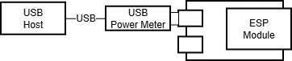
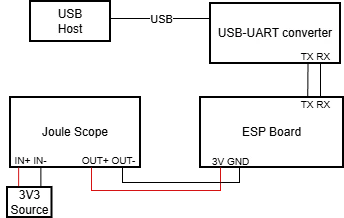

## What is power management

Power management is the process of controlling energy consumption in devices to optimize efficiency, balance performance, and reduce costs. It is especially important in embedded systems, where many applications must operate for long periods on limited power sources. By reducing power consumption—often by entering sleep modes or shutting down unused parts of the chip—devices can significantly extend operating life and improve overall efficiency.

## Power Modes on Espressif Devices

Espressif microcontrollers support several predefined power modes designed to optimize power consumption for a wide range of use cases:

- **Active mode**: The HP CPU, RF circuits, and all peripherals are powered on, offering maximum performance with the highest power consumption.

- **Modem‑sleep mode**: The HP CPU remains on while its clock frequency may be reduced. The RF circuits are periodically switched on when required by internal operation to keep active wireless connections running. This mode is available only on Wi‑Fi or radio‑capable devices.

- **Light‑sleep mode**: Digital peripherals, most RAM, and CPUs are clock‑gated with reduced supply voltage. Internal state is preserved, enabling fast wakeup with moderate power savings.

- **Deep‑sleep mode**: Only the ULP coprocessor and RTC fast memory stay powered on. Wakeup requires a full restart, making it ideal for long idle periods.

These modes can be reconfigured if needed. More details and useful links can be found in the power management sections of chip datasheets and technical reference manuals. As an example, for ESP32-C6, see its [chip datasheet](https://documentation.espressif.com/esp32-c6_datasheet_en.pdf#page=43) and [technical reference manual](https://documentation.espressif.com/esp32-c6_technical_reference_manual_en.pdf#lowpowm).

For a deeper understanding of what the ULP coprocessor is and what it does, see also the article [Building low power applications on Espressif chips: Ultra-Low-Power (ULP) coprocessor](https://developer.espressif.com/blog/2025/04/ulp-lp-core-get-started).

## NuttX Power Management System

This section provides an overview of NuttX power manager internals. It will help understand how to get the device into different power consumption modes. For more detailed information, feel free to check the [NuttX Power Management documentation](https://nuttx.apache.org/docs/latest/components/drivers/special/power/pm/index.html).

### Power Management States

NuttX power management (PM) logic has the following states:
- `NORMAL`: This is the full‑power operating state.
- `IDLE`: Very similar to `NORMAL`, this state has limited trivial optimizations allowed that do not interfere with normal operation. A simple example is dimming a screen backlight when the system is idle.
- `STANDBY`: This state allows deeper power savings, CPU clock reductions. In this state, the system should still be able to resume normal activity almost immediately.
- `SLEEP`: The lowest power consumption mode. Wakeup requires more time (some MCUs require a full restart). This state is appropriate for long idle periods.

Espressif power modes compare to NuttX power states as follows:

| Espressif Power Mode | NuttX Power State |
|----------------------|-------------------|
| Active state         | `NORMAL`          |
| Active state         | `IDLE`            |
| Light sleep          | `STANDBY`         |
| Deep sleep           | `SLEEP`           |

Note: Modem-sleep mode has no equivalent in Espressif’s NuttX power management implementation.

### Power Management Governors

NuttX utilizes a power management system involving power‑management “governors”. A governor is a handler that automatically selects the appropriate power state based on the system condition. The active governor is chosen during system initialization through configuration options.

- **Greedy Governor**: Always selects the lowest‑power state available. This method is suitable for systems where aggressive power saving is more important than activity tracking or avoiding frequent state changes. Enabled with the `CONFIG_PM_GOVERNOR_GREEDY` configuration option.

- **Stability Governor**: Works like the greedy governor but adds a time‑based stability check to prevent rapid transitions between states. This method is suitable for systems that need predictable power‑state behavior. Enabled with the `CONFIG_PM_GOVERNOR_STABILITY` configuration option.

- **Activity Governor**: Uses activity reports from drivers to determine the appropriate power state. This method is better for systems with dynamic workloads that need a balance between responsiveness and efficiency. Enabled with the `CONFIG_PM_GOVERNOR_ACTIVITY` configuration option.

### How NuttX Power Management System Works

The NuttX power management system is built around a simple idea: each power state has a “stay count” and these counts determine how far the system is allowed to drop into lower‑power modes. A governor monitors these counts and chooses the deepest power state permitted.

Here are the core concepts:

- **Power State Counts**: The power manager defines four power states: `NORMAL`, `IDLE`, `STANDBY`, and `SLEEP`. Each state has a count that indicates that state to remain active. The governor uses this information to decide on the next power state.

* **Modifying Power State Counts**:  Peripheral drivers or applications can “hold” a state (increase its count) or “release” it (decrease its count). Counts may be changed by drivers—for example, the UART driver may keep the system out of sleep while active—or manually via the `pmconfig` shell command or application calls.

* **Governor Logic (State Transition)**:  When a power state count changes, the state transition system -- the governor -- re‑evaluates which states are allowed. The rule is basically the system may enter a power state only if all higher‑power states have a count of zero.

  Examples:
  - If `NORMAL` reaches zero &rarr; system may enter `IDLE`.
  - If `NORMAL` and `IDLE` reach zero &rarr; system may enter `STANDBY` (light sleep).
  - If `NORMAL`, `IDLE`, and `STANDBY` reach zero &rarr; system may enter `SLEEP` (deep sleep).

All in all, power state control is based on modifying power state counts.

* **Query current state counts** to see which power states are active.
* **Decrease a state count** (relax) transitions to lower power consuming states.
* **Increase a state count** (stay) to keep the system in a higher‑power state.

## How to Use Power States

In this section, we will show how to enter different power states with the Greedy governor using the NuttX shell and a custom application.


This section assumes that the NuttX development environment is already set up. If you need installation instructions, please refer to the article [Getting Started with NuttX and ESP32
](https://developer.espressif.com/blog/2020/11/nuttx-getting-started/).


To use power manager, we need to enable certain configuration options. The default `pm` defconfigs, available for all Espressif boards supported by NuttX, already include the necessary power‑management configuration options. So we will use them.

Also worth to mention that this article will not touch into wake up modes from sleep. To get information about wakeup modes please refer to related [NuttX docs](https://nuttx.apache.org/docs/latest/platforms/risc-v/esp32c6/boards/esp32c6-devkitc/index.html#pm)

To build and flash NuttX with power‑management support on the ESP32‑C6, use the following commands:

```
make distclean &&
./tools/configure.sh esp32c6-devkitc:pm &&
make &&
make flash ESPTOOL_PORT=/dev/ttyUSB0 ESPTOOL_BINDIR=./ &&
```

The `pm` configuration used in this article enables the **Greedy** power‑management governor and sets `CONFIG_PM_GOVERNOR_EXPLICIT_RELAX = -1`. This prevents NuttX from automatically entering lower‑power states at boot, ensuring that all transitions occur only when explicitly triggered by the shell or your application. This makes testing and demonstrations predictable and easier to follow.

When reducing stay counts to allow deeper power states, it is best to relax them starting from the **least power‑consuming state**. This avoids the system briefly entering unintended intermediate states during the transition.

### Entering Sleep Modes from NuttX Shell

Before changing the power state, you should first check the current state counts to determine the correct number of required state transitions. The `pmconfig` command displays the stay counts for all power states. For example:

```
nsh> pmconfig
Last state 0, Next state 0
[...]
/proc/pm/wakelock0:
DOMAIN0                   STATE          COUNT          TIME
system                    normal         2              8s
system                    idle           1              8s
system                    standby        1              8s
system                    sleep          1              8s
[...]
```

To change the count of a power state, use the following commands:

- Decrease the count: `pmconfig relax <STATE_NAME>`
- Increase the count: `pmconfig stay <STATE_NAME>`

#### Changing the count of a power state

According to the output above, the `STANDBY` power state count is 1. Let's decrease the state count by running this command:

```
nsh> pmconfig relax standby
```

To make sure that the above command has decreased the `STANDBY` power state count to 0, let's query the power states again:

```
nsh> pmconfig

# Output
Last state 0, Next state 0
[...]
/proc/pm/wakelock0:
DOMAIN0                   STATE          COUNT          TIME
system                    normal         2              25s
system                    idle           1              25s
system                    standby        0              25s
system                    sleep          1              25s
[...]
```


According to the output above, the `IDLE` power state count is 1. Let's increase the state count by running this command:

```
nsh> pmconfig stay idle
```

Now the `IDLE` power state count needs to be 2:

```
nsh> pmconfig

# Output
Last state 0, Next state 0
[...]
/proc/pm/wakelock0:
DOMAIN0                   STATE          COUNT          TIME
system                    normal         2              60s
system                    idle           2              60s
system                    standby        0              60s
system                    sleep          1              60s
[...]
```

#### Changing the power state

Assuming that the system just booted up, here is the system state counts:

```
nsh> pmconfig
Last state 0, Next state 0
[...]
/proc/pm/wakelock0:
DOMAIN0                   STATE          COUNT          TIME
system                    normal         2              8s
system                    idle           1              8s
system                    standby        1              8s
system                    sleep          1              8s
[...]
```

Let's put the device into light sleep:

```
nsh> pmconfig relax idle
nsh> pmconfig relax normal
nsh> pmconfig relax normal
nsh> up_idlepm: newstate= 2 oldstate=0
up_idlepm: newstate= 0 oldstate=2
nsh>
```


Let's put the device into deep sleep:

To achieve this, the `standby` state must be removed in addition to the required steps for light sleep. The following example assumes that the system has just booted up. The power state counts for a freshly booted up system can be checked above.

```
nsh> pmconfig relax standby
nsh> pmconfig relax idle
nsh> pmconfig relax normal
nsh> pmconfig relax normal
nsh> up_idlepm: newstate= 3 oldstate=0
ESP-ROM:esp32c6-20220919
Build:Sep 19 2022
rst:0x5 (DSLEEP),boot:0xc (SPI_FAST_FLASH_BOOT)
SPIWP:0xee
mode:DIO, clock div:2
load:0x40800000,len:0x7ee4
load:0x40807ef0,len:0xff0
SHA-256 comparison failed:
Calculated: a2d5509f5471c59fa78a97c6f2cd7b2b4468a3a523ae330348591699de2bc9a1
Expected: 00000000f0700000000000000000000000000000000000000000000000000000
Attempting to boot anyway...
entry 0x40807b9c
*** Booting NuttX ***
dram: lma 0x00000020 vma 0x40800000 len 0x7ee4   (32484)
dram: lma 0x00007f0c vma 0x40807ef0 len 0xff0    (4080)
padd: lma 0x00008f08 vma 0x00000000 len 0x70f0   (28912)
imap: lma 0x00010000 vma 0x42020000 len 0xb200   (45568)
padd: lma 0x0001b208 vma 0x00000000 len 0x4df0   (19952)
imap: lma 0x00020000 vma 0x42000000 len 0x1f7e8  (129000)
total segments stored 6

NuttShell (NSH) NuttX-10.4.0
nsh>
```

When the device enters any sleep mode, it sleeps for a predefined duration by default. This duration can be modified during system configuration. The relevant configuration options are:
- Light sleep: The device sleeps for the sum of `CONFIG_PM_ALARM_SEC` seconds and `CONFIG_PM_ALARM_NSEC` nanoseconds.
- Deep sleep: The device sleeps for the sum of `CONFIG_PM_SLEEP_WAKEUP_SEC` seconds and `CONFIG_PM_SLEEP_WAKEUP_NSEC` nanoseconds.

Other wakeup modes can be found in the related NuttX documentation. As an example, see the [ESP32-C6 power management](https://nuttx.apache.org/docs/latest/platforms/risc-v/esp32c6/boards/esp32c6-devkitc/index.html#pm) document.

### Entering Sleep Modes from Application

As mentioned on previous sections `pm` defconfig will be used for required configs to use power manager. Below is a snippet that lets the device to enter sleep modes by decreasing power state counts. To increase a power state count, in `boardctl` call, use the action `BOARDIOC_PM_STAY` instead of `BOARDIOC_PM_RELAX`.

```
#include <nuttx/config.h>
#include <nuttx/power/pm.h>
#include <sys/boardctl.h>
#include <sys/ioctl.h>

static void remove_state(enum pm_state_e state)
{
  int count;
  struct boardioc_pm_ctrl_s ctrl =
  {
  };
  ctrl.action = BOARDIOC_PM_RELAX;

  count = pm_staycount(PM_IDLE_DOMAIN, state);
  for (int i = 0; i < count; i++)
    {
      ctrl.state = state;
      boardctl(BOARDIOC_PM_CONTROL, (uintptr_t)&ctrl);
    }
}


int main(int argc, char *argv[])
{
    if (deep_sleep)
      {
        /* Entering deep sleep */
        remove_state(PM_STANDBY);
      }

    /* Entering light sleep */
    remove_state(PM_IDLE);
    remove_state(PM_NORMAL);

    return 0;
}
```

For more information about custom applications on NuttX, please check the following documents.

- [NuttX official custom apps guide](https://nuttx.apache.org/docs/latest/guides/customapps.html), [Integrating External Libraries into NuttX Applications](https://developer.espressif.com/blog/2025/11/nuttx-external-lib/)
- [Building Applications on NuttX: Understanding the Build System](https://developer.espressif.com/blog/2024/09/building-applications-on-nuttx-understanding-the-build-system/) articles.

## Power Consumption Measurements

### Test Benches

- `pm` config used for all devices (e.g `esp32c6-devkitc:pm`). This config does not enable any RF circuitry.

- USB power meter connected to the microcontroller and commands send through built in USB-UART converter.


- Microcontroller is powered through a multimeter for power measurement, while UART communication is handled separately via a USB-UART  converter.


### Results

| Device/Power State         | `NORMAL` | `STANDBY`   | `SLEEP`    |
|----------------------------|----------|-------------|------------|
| ESP32 (esp32-devkitc)      |42.3 mA   |1.4 mA       |1 mA        |
| ESP32-S2 (esp32s2-saola-1) |26 mA     |2.1 mA       |1.24 mA     |
| ESP32-S3 (esp32s3-devkitc) |46 mA     |4.3 mA       |1.24 mA     |
| ESP32-C3 (esp32c3-devkit)  |18 mA     |1 mA         |815 μA      |
| ESP32-C6 (esp32c6-devkitc) |26 mA     |1.32 mA      |540 μA*     |
| ESP32-H2 (esp32h2-devkit)  |14 mA     |880 μA       |510 μA**    |

`*`: Overall board consumtion, module consumption is 48 μA

`**`: Overall board consumtion, module consumption is 8 μA

**These results are not optimized numbers and should not be considered as reference values.**

Applying these numbers to an application, a battery-powered embedded system with a 2000 mAh battery (a typical 18650 cell has capacity around 2500 mAh) could, in theory, extend its operating time from approximately 77 hours (about 3 days) to up to 3,703 hours (around 154 days) when using the esp32c6-devkitc, without any hardware changes. This is a purely theoretical estimate; in practice, actual gains will vary.

## Conclusion

In this article, we explored the NuttX power management system and demonstrated how to use light sleep and deep sleep modes on Espressif microcontrollers, both from the NuttX shell and within NuttX applications.

## Resources
- [Espressif sleep modes docs](https://docs.espressif.com/projects/esp-idf/en/stable/esp32/api-reference/system/sleep_modes.html)
- [NuttX PM docs](https://nuttx.apache.org/docs/10.0.1/components/power.html)
- [Getting Started with NuttX and ESP32 article](https://developer.espressif.com/blog/2020/11/nuttx-getting-started/)
- [Integrating External Libraries into NuttX Applications article](https://developer.espressif.com/blog/2025/11/nuttx-external-lib/)
- [Building Applications on NuttX: Understanding the Build System article](https://developer.espressif.com/blog/2024/09/building-applications-on-nuttx-understanding-the-build-system/)
- [NuttX Custom Apps How-to doc](https://nuttx.apache.org/docs/latest/guides/customapps.html)
-  [Building low power applications on Espressif chips: Ultra-Low-Power (ULP) coprocessor article](https://developer.espressif.com/blog/2025/04/ulp-lp-core-get-started)
