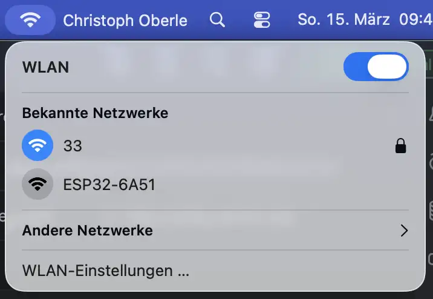
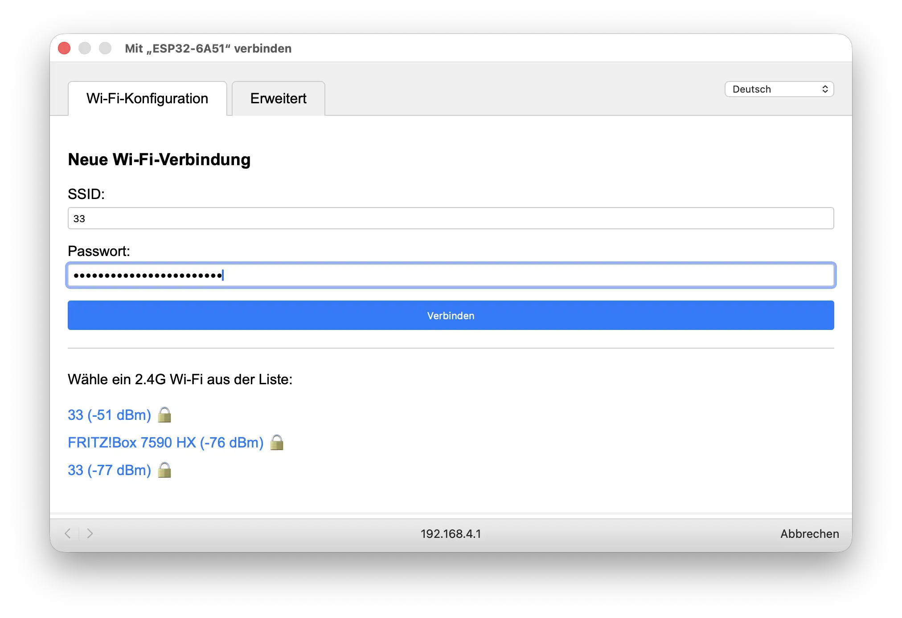

## Introduction
For beginners it is not easy to establish a minimal working environment for the ESP32 SoCs with e.g. Wi-Fi, buttons, LEDs and waking up from Deep Sleep. Unfortunately such a minimal environment is necessary to get things done. In this article, we will use these C++ components:
* one for Wi-Fi management to connect the ESP SoC with the local Wi-Fi network
* one for Deep Sleep operation.

First we describe how C++ components are structured using the examples of the Wi-Fi manager component `wifi_manager` and the Deep Sleep component `deep_sleep`.

Then we guide you how to use these C++ components in your ESP program - step by step. 

## Structure of C++ Components

C++ components use C++ classes to encapsulate the complexity of the component. The component user only has to know how to create an instance of the class and how to use the available methods.   

## 1. Wi-Fi Manager as a C++ Component
This C++ component is available on the ESP Component Registry at 
[elrebo-de/wifi_manager](https://components.espressif.com/components/elrebo-de/wifi_manager).
### Purpose
The easiest method to connect an ESP32 chip with the local network (LAN) is to establish a Wi-Fi connection. With this component there is no need to give the Wi-Fi credentials (SSID and password) in configuration parameters, because it starts a Wi-Fi access point with a login page. This allows to choose the SSID from a list of Wi-Fi networks and enter the password. Then a connection to the given Wi-Fi network is established. The SSID and the password only have to be entered once, because they are stored in non-volatile flash storage, from where they are retrieved on subsequent startups.

### Interface
Because the complexity of the implementation is hidden inside the C++ class, the public interface is small and easy to use.
```C++
class Wifi {
public:
    // Constructor
	Wifi( std::string tag,          // tag for ESP_LOGx
          std::string ssid_prefix,  // AP mode SSID prefix
          std::string language      // Web UI language
	    );
	virtual ~Wifi();

    void RestartStation();

    std::string GetSsid() const;
    std::string GetIpAddress() const;
    int GetRssi() const;
    int GetChannel() const;
    std::string GetMacAddress() const;

    bool IsConnected() const;
```
### Functionality
#### Create an Instance of Class Wifi
To use this component you only have to create an instance of class Wifi in the beginning of your program, everything else is done inside the class.
```C++
    /* Initialize WifiManager class */
    ESP_LOGI(tag, "WifiManager");
    Wifi wifi(
		std::string("WifiManager"), // tag
		std::string("ESP32"), // ssid_prefix
		std::string("de-DE") // language
    );
```
#### Call Method `IsConnected()`
A call to the public method `isConnected()` will only return, when the Wi-Fi network is connected.
```C++
    ESP_LOGI(tag, "Wifi is %s", wifi.IsConnected() ? "connected" : "not connected");
```
So, what happens "under the hood"?

When the method `IsConnected()` is called for the first time, there are no credentials for the Wi-Fi network available on the ESP chip and the ESP starts a Wi-Fi access point.



That's in german, which depends on your computer's language settings. Here you can see the Wi-Fi access point of the ESP system named "ESP32-6A51". The prefix "ESP32" depends on the parameter `ssid_prefix` in the constructor of class `Wifi` (see above).

When you connect to this Wi-Fi access point you see a web page where you can enter the Wi-Fi credentials (SSID and password).



That's in german too, which depends on the parameter `language` in the constructor of class Wifi (see above).

After entering the credentials they are stored in the non volatile flash storage, the Wi-Fi network is connected and the method `IsConnected()`returns `true`.

And when the method `IsConnected()` is called for the second time, then the credentials are already present in the non volatile flash storage, they are used for connecting to the Wi-Fi network and method `IsConnected()`returns `true` without any user interaction and the Wi-Fi network is connected. 

#### Request Connection Information
When the network is connected, you can request the technical information with the methods `GetSsid()`, `GetIpAddress()`, `GetRssi()`, `GetChannel()` and `GetMacAddress()`.
```C++
    ESP_LOGI(tag, "Ssid: %s", wifi.GetSsid().c_str());
    ESP_LOGI(tag, "IpAddress: %s", wifi.GetIpAddress().c_str());
    ESP_LOGI(tag, "Rssi: %i", wifi.GetRssi());
    ESP_LOGI(tag, "Channel: %i", wifi.GetChannel());
    ESP_LOGI(tag, "MacAddress: %s", wifi.GetMacAddress().c_str());
```

## 2. Deep Sleep as a C++ Component
This C++ component is available on the ESP Component Registry at
[elrebo-de/deep_sleep      ](https://components.espressif.com/components/elrebo-de/deep_sleep).
### Purpose
Sometimes you want to enter Deep Sleep mode after your SoC has done its work. Wake up could be triggered by different events. This component allows to go to Deep Sleep and to wake up after a certain time or when a button is pressed. The boot count is incremented with every boot process.
### Interface
Because the complexity of the implementation is hidden inside the C++ class, the public interface is small and easy to use.
```C++
class DeepSleep {
public:
    // Constructor
	DeepSleep( std::string tag,
	           int *bootCount
	         );
	virtual ~DeepSleep();

	esp_sleep_wakeup_cause_t GetWakeupReason();

    esp_err_t EnableTimerWakeup( unsigned long sleepTime,
                            std::string sleepTimeUnit // {"min", "sec", "milliSec", "microSec"}
                          );
    esp_err_t EnableGpioWakeup( gpio_num_t gpio,
                           int level  // level: 1 = High, 0 = Low
                          );
	esp_err_t GoToDeepSleep();

```
### Functionality
#### Create an Instance of Class DeepSleep
To use this component you have to create an instance of class DeepSleep and to define variable `bootCount` as an RTC_DATA_ATTR in the beginning of your program.
```C++
#include "deep_sleep.hpp"
RTC_DATA_ATTR int bootCount = 0;

extern "C" void app_main(void)
{
    /* Initialize DeepSleep class */
    ESP_LOGI(tag, "DeepSleep");
    DeepSleep deepSleep(
		std::string("DeepSleep"), // tag
		&bootCount // Address of int bootCount in RTC_DATA
    );
```
Because the variable `bootCount` is declared as an RTC_DATA_ATTR its value is remembered after Deep Sleep. 
#### Show the bootCount and find out the Wakeup Reason
You can also find out, what the wakeup reason was by calling `GetWakeupReason()`.
```C++
    /* Deep Sleep: show bootCount */
    ESP_LOGI(tag, "bootCount: %i", bootCount);
    
    ESP_LOGI(tag, "GetWakeupReason");
    esp_sleep_wakeup_cause_t wakeupReason = deepSleep.GetWakeupReason();

    switch(wakeupReason) {
        case ESP_SLEEP_WAKEUP_EXT0 : ESP_LOGI(tag, "Wakeup caused by external signal using RTC_IO"); break;
        case ESP_SLEEP_WAKEUP_EXT1 : ESP_LOGI(tag, "Wakeup caused by external signal using RTC_CNTL"); break;
        case ESP_SLEEP_WAKEUP_TIMER : ESP_LOGI(tag, "Wakeup caused by timer"); break;
        case ESP_SLEEP_WAKEUP_TOUCHPAD : ESP_LOGI(tag, "Wakeup caused by touchpad"); break;
        case ESP_SLEEP_WAKEUP_ULP : ESP_LOGI(tag, "Wakeup caused by ULP program"); break;
        case ESP_SLEEP_WAKEUP_GPIO : ESP_LOGI(tag, "Wakeup caused by gpio"); break;
        default : ESP_LOGI(tag, "Wakeup was not caused by deep sleep: %d",wakeupReason); break;
    }
```
#### Configure the Wakeup Sources
Once your application has completed its tasks, configure the desired wake up source, either a timer or a GPIO button or both. This is done with methods `EnableTimerWakeup` and `EnableGpioWakeup`.
```C++
    ESP_LOGI(tag, "EnableTimerWakeup");
    ESP_ERROR_CHECK(deepSleep.EnableTimerWakeup(30, "sec"));  // enable wake up after 30 seconds sleep time

    ESP_LOGI(tag, "EnableGpioWakeup");
        ESP_ERROR_CHECK(deepSleep.EnableGpioWakeup((gpio_num_t) 39, 0));  // enable wake up when GPIO 39 is pulled down
```
Here the program will wake up from Deep Sleep after 30 seconds or when the button on GPIO 39 is pulled down.
#### Go to Deep Sleep
Finally you send the ESP chip to Deep Sleep with method `GoToDeepSleep()`.
```C++
    bool rc = false;
    ESP_LOGI(tag, "GoToDeepSleep");
    rc = deepSleep.GoToDeepSleep(); // go to deep sleep
    
    // this statement will not be reached, if GoToDeepSleep is working
    ESP_LOGI(tag, "GoToDeepSleep rc=%u", rc);
}
```
## Step by Step Guide
Let us start with an empty ESP program, then we add the WiFi functionality and finally the Deep Sleep functionality.

The source code for Step 1 to Step 6 can be found on GitHub at https://github.com/elrebo-de/cpp_components_for_esp_idf.git.

### Step 1: Create an ESP Project `myproject` containing an "empty" C++ program
Let's start with setting up a directory structure for our project:
```
myproject/
   CMakeLists.txt
   main/
      CMakeLists.txt
      main.cpp
```
There are three files in two directories:
#### myproject/CMakeLists.txt
The CMakeLists file for the project:
```text
# The following five lines of boilerplate have to be in your project's
# CMakeLists in this exact order for cmake to work correctly
cmake_minimum_required(VERSION 3.16)

include($ENV{IDF_PATH}/tools/cmake/project.cmake)
# "Trim" the build. Include the minimal set of components, main, and anything it depends on.
idf_build_set_property(MINIMAL_BUILD ON)
project(myproject)
```
This file is needed for the build.
#### myproject/main/CMakeLists.txt
The CMakeLists.txt file for the main component
```text
idf_component_register(SRCS "main.cpp")
```
This file defines how the "main" component can be made - the only source is "main.cpp".
#### myproject/main/main.cpp
The main C++ program:
```C++
#include "esp_log.h"

static char tag[] = "myproject";

extern "C" void app_main(void)
{
    ESP_LOGI(tag, "Start");

    /* here the "real" work is done! */

    ESP_LOGI(tag, "End");
}
```
This is the main program! It does nothing except to log the Start and the End of the execution.

To build and execute this project on a ESP32C3 board I use these commands in the project's directory:
```shell
source /Users/christophoberle/esp-idf/esp-idf/export.sh
idf.py set-target esp32c3  
idf.py build
idf.py flash monitor
```
* The `source` command sets the ESP-IDF environment on my computer. On your computer there will be a different path to the esp-idf directory.
* `idf.py set-target esp32c3` sets the target ESP chip (here it is an ESP32-C3 SoC).
* `idf.py build` builds the program.
* `idf.py flash monitor` flashes the program onto the chip and monitors the execution.

This is the end of the terminal log:
```terminaloutput
christophoberle@MacBookPro myproject % idf.py flash monitor                                   
Executing action: flash
Serial port /dev/cu.usbmodem101
Connecting...
Detecting chip type... ESP32-C3
Running ninja in directory /Users/christophoberle/github/cpp_components_for_esp_idf/step1/myproject/build
Executing "ninja flash"...
[1/5] cd /Users/christophoberle/github/cpp_components_for_esp_idf/step1/myproject/...istophoberle/github/cpp_components_for_esp_idf/step1/myproject/build/myproject.bin
myproject.bin binary size 0x24c70 bytes. Smallest app partition is 0x100000 bytes. 0xdb390 bytes (86%) free.
[1/1] cd /Users/christophoberle/github/cpp_components_for_esp_idf/step1/myproject/.../github/cpp_components_for_esp_idf/step1/myproject/build/bootloader/bootloader.bin
Bootloader binary size 0x5210 bytes. 0x2df0 bytes (36%) free.
[4/5] cd /Users/christophoberle/esp-idf/esp-idf/components/esptool_py && /Users/ch.../Users/christophoberle/esp-idf/esp-idf/components/esptool_py/run_serial_tool.cmake
esptool.py --chip esp32c3 -p /dev/cu.usbmodem101 -b 460800 --before=default_reset --after=hard_reset write_flash --flash_mode dio --flash_freq 80m --flash_size 2MB 0x0 bootloader/bootloader.bin 0x10000 myproject.bin 0x8000 partition_table/partition-table.bin
esptool.py v4.11.dev1
Serial port /dev/cu.usbmodem101
Connecting...
Chip is ESP32-C3 (QFN32) (revision v0.4)
Features: WiFi, BLE, Embedded Flash 4MB (XMC)
Crystal is 40MHz
USB mode: USB-Serial/JTAG
MAC: b0:a6:04:00:6a:50
Uploading stub...
Running stub...
Stub running...
Changing baud rate to 460800
Changed.
Configuring flash size...
Flash will be erased from 0x00000000 to 0x00005fff...
Flash will be erased from 0x00010000 to 0x00034fff...
Flash will be erased from 0x00008000 to 0x00008fff...
SHA digest in image updated
Compressed 21008 bytes to 13178...
Writing at 0x00000000... (100 %)
Wrote 21008 bytes (13178 compressed) at 0x00000000 in 0.2 seconds (effective 804.0 kbit/s)...
Hash of data verified.
Compressed 150640 bytes to 81334...
Writing at 0x0002da38... (100 %)
Wrote 150640 bytes (81334 compressed) at 0x00010000 in 0.6 seconds (effective 1880.1 kbit/s)...
Hash of data verified.
Compressed 3072 bytes to 103...
Writing at 0x00008000... (100 %)
Wrote 3072 bytes (103 compressed) at 0x00008000 in 0.0 seconds (effective 546.4 kbit/s)...
Hash of data verified.

Leaving...
Hard resetting via RTS pin...
Executing action: monitor
Running idf_monitor in directory /Users/christophoberle/github/cpp_components_for_esp_idf/step1/myproject
Executing "/Users/christophoberle/.espressif/python_env/idf5.5_py3.13_env/bin/python /Users/christophoberle/esp-idf/esp-idf/tools/idf_monitor.py -p /dev/cu.usbmodem101 -b 115200 --toolchain-prefix riscv32-esp-elf- --target esp32c3 --revision 3 --decode-panic backtrace /Users/christophoberle/github/cpp_components_for_esp_idf/step1/myproject/build/myproject.elf /Users/christophoberle/github/cpp_components_for_esp_idf/step1/myproject/build/bootloader/bootloader.elf -m '/Users/christophoberle/.espressif/python_env/idf5.5_py3.13_env/bin/python' '/Users/christophoberle/esp-idf/esp-idf/tools/idf.py'"...
--- esp-idf-monitor 1.8.0 on /dev/cu.usbmodem101 115200
--- Quit: Ctrl+] | Menu: Ctrl+T | Help: Ctrl+T followed by Ctrl+H
ESP-ROM:esp32c3-api1-20210207
Build:Feb  7 2021
rst:0x15 (USB_UART_CHIP_RESET),boot:0xd (SPI_FAST_FLASH_BOOT)
Saved PC:0x40381d24
--- 0x40381d24: rv_utils_wait_for_intr at /Users/christophoberle/esp-idf/esp-idf/components/riscv/include/riscv/rv_utils.h:79
--- (inlined by) esp_cpu_wait_for_intr at /Users/christophoberle/esp-idf/esp-idf/components/esp_hw_support/cpu.c:62
SPIWP:0xee
mode:DIO, clock div:1
load:0x3fcd5820,len:0x15ac
load:0x403cbf10,len:0xc34
--- 0x403cbf10: esp_bootloader_get_description at /Users/christophoberle/esp-idf/esp-idf/components/esp_bootloader_format/esp_bootloader_desc.c:39
load:0x403ce710,len:0x2fd0
--- 0x403ce710: esp_flash_encryption_enabled at /Users/christophoberle/esp-idf/esp-idf/components/bootloader_support/src/flash_encrypt.c:89
entry 0x403cbf1a
--- 0x403cbf1a: call_start_cpu0 at /Users/christophoberle/esp-idf/esp-idf/components/bootloader/subproject/main/bootloader_start.c:25
I (24) boot: ESP-IDF v5.5.1 2nd stage bootloader
I (24) boot: compile time Mar 19 2026 23:21:17
I (25) boot: chip revision: v0.4
I (25) boot: efuse block revision: v1.3
I (28) boot.esp32c3: SPI Speed      : 80MHz
I (32) boot.esp32c3: SPI Mode       : DIO
I (36) boot.esp32c3: SPI Flash Size : 2MB
I (39) boot: Enabling RNG early entropy source...
I (44) boot: Partition Table:
I (46) boot: ## Label            Usage          Type ST Offset   Length
I (53) boot:  0 nvs              WiFi data        01 02 00009000 00006000
I (59) boot:  1 phy_init         RF data          01 01 0000f000 00001000
I (66) boot:  2 factory          factory app      00 00 00010000 00100000
I (72) boot: End of partition table
I (76) esp_image: segment 0: paddr=00010020 vaddr=3c020020 size=06780h ( 26496) map
I (87) esp_image: segment 1: paddr=000167a8 vaddr=3fc8b600 size=011e0h (  4576) load
I (91) esp_image: segment 2: paddr=00017990 vaddr=40380000 size=08688h ( 34440) load
I (104) esp_image: segment 3: paddr=00020020 vaddr=42000020 size=11dech ( 73196) map
I (117) esp_image: segment 4: paddr=00031e14 vaddr=40388688 size=02e08h ( 11784) load
I (120) esp_image: segment 5: paddr=00034c24 vaddr=50000000 size=00020h (    32) load
I (124) boot: Loaded app from partition at offset 0x10000
I (126) boot: Disabling RNG early entropy source...
I (142) cpu_start: Unicore app
I (150) cpu_start: Pro cpu start user code
I (150) cpu_start: cpu freq: 160000000 Hz
I (151) app_init: Application information:
I (151) app_init: Project name:     myproject
I (155) app_init: App version:      ae6a76f-dirty
I (159) app_init: Compile time:     Mar 19 2026 23:21:11
I (164) app_init: ELF file SHA256:  8c1b970e6...
I (168) app_init: ESP-IDF:          v5.5.1
I (172) efuse_init: Min chip rev:     v0.3
I (176) efuse_init: Max chip rev:     v1.99 
I (180) efuse_init: Chip rev:         v0.4
I (184) heap_init: Initializing. RAM available for dynamic allocation:
I (190) heap_init: At 3FC8D610 len 000329F0 (202 KiB): RAM
I (195) heap_init: At 3FCC0000 len 0001C710 (113 KiB): Retention RAM
I (201) heap_init: At 3FCDC710 len 00002950 (10 KiB): Retention RAM
I (207) heap_init: At 50000020 len 00001FC8 (7 KiB): RTCRAM
I (213) spi_flash: detected chip: generic
I (216) spi_flash: flash io: dio
W (219) spi_flash: Detected size(4096k) larger than the size in the binary image header(2048k). Using the size in the binary image header.
I (232) sleep_gpio: Configure to isolate all GPIO pins in sleep state
I (238) sleep_gpio: Enable automatic switching of GPIO sleep configuration
I (245) main_task: Started on CPU0
I (245) main_task: Calling app_main()
I (245) myproject: Start
I (245) myproject: End
I (255) main_task: Returned from app_main()

Done
christophoberle@MacBookPro myproject % 
```
After 245 msec the main program is started on CPU0, our routine `app_main` is called, the Start and End of execution is logged and 10 msec later `app_main` has returned.

Our first ESP program - which does nothing - is working!

### Step 2: Add component Wi-Fi Manager
Now we connect our ESP SoC with the world through a Wi-Fi network connection.

As described on the ESP Component Registry for the component we add it to the project by executing 
```shell
idf.py add-dependency "elrebo-de/wifi_manager^1.4.2"
```
#### myproject/main/idf_component.yml
As a result of this command an additional file `idf_component.yml` is added to our project:
```yaml
## IDF Component Manager Manifest File
dependencies:
  ## Required IDF version
  idf:
    version: '>=4.1.0'
  # # Put list of dependencies here
  # # For components maintained by Espressif:
  # component: "~1.0.0"
  # # For 3rd party components:
  # username/component: ">=1.0.0,<2.0.0"
  # username2/component2:
  #   version: "~1.0.0"
  #   # For transient dependencies `public` flag can be set.
  #   # `public` flag doesn't have an effect dependencies of the `main` component.
  #   # All dependencies of `main` are public by default.
  #   public: true
  elrebo-de/wifi_manager: ^1.4.2
```
When `idf.py set-target esp32c3` is executed, a new directory `managed_components` is created, which contains the needed components for the Wi-Fi manager.

When we run this program, nothing has changed:
```terminaloutput
I (245) main_task: Started on CPU0
I (245) main_task: Calling app_main()
I (245) myproject: Start
I (245) myproject: End
I (255) main_task: Returned from app_main()
```
### Step 3: Integrate `wifi_manager` into your `main.cpp` program 
Now we can use the `wifi_manager` component by including the component's header file into our `main.cpp` program and creating an instance of class `Wifi`. After the call to method `IsConnected()` our ESP SoC is connected to the Wi-Fi network and we can retrieve the connection information as described above.
#### myproject/main/main.cpp
The new `main.cpp` now looks like this:
```C++
#include "esp_log.h"
#include "wifi_manager.hpp"

static char tag[] = "myproject";

extern "C" void app_main(void)
{
    ESP_LOGI(tag, "Start");

    /* Initialize WifiManager class */
    ESP_LOGI(tag, "WifiManager");
    Wifi wifi(
		std::string("WifiManager"), // tag
		std::string("ESP32"), // ssid_prefix
		std::string("de-DE") // language
    );

    /* Wait until Wi-Fi is connected */
    ESP_LOGI(tag, "Wifi is %s", wifi.IsConnected() ? "connected" : "not connected");

    /* Retrieve connection information */
    ESP_LOGI(tag, "Ssid: %s", wifi.GetSsid().c_str());
    ESP_LOGI(tag, "IpAddress: %s", wifi.GetIpAddress().c_str());
    ESP_LOGI(tag, "Rssi: %i", wifi.GetRssi());
    ESP_LOGI(tag, "Channel: %i", wifi.GetChannel());
    ESP_LOGI(tag, "MacAddress: %s", wifi.GetMacAddress().c_str());

    /* here the "real" work is done! */

    ESP_LOGI(tag, "End");
}
```
When we run this program the terminal log looks totally different. All the functionality described above is working now. We can enter the credentials on a web page , the credentials are stored in non volatile flash memory and they are retrieved from there in subsequent runs. The end of the terminal log now shows:
```terminaloutput
I (58601) WifiManager: Starting station
I (58601) wifi:mode : sta (b0:a6:04:00:6a:50)
I (58601) wifi:enable tsf
I (58601) WifiManager: wait until Wifi station is connected
I (59601) WifiManager: wait until Wifi station is connected
I (60601) WifiManager: wait until Wifi station is connected
I (61011) WifiStation: Found AP: 33, BSSID: 38:10:d5:53:7f:21, RSSI: -49, Channel: 9, Authmode: 7
I (61011) WifiStation: Found AP: 33, BSSID: 74:42:7f:fe:b3:ee, RSSI: -79, Channel: 9, Authmode: 3
W (61021) wifi:Password length matches WPA2 standards, authmode threshold changes from OPEN to WPA2
I (61031) wifi:new :<9,0>, old:<1,0>, ap:<255,255>, sta:<9,0>, prof:1, snd_ch_cfg:0x0
I (61031) wifi:state: init -> auth (0xb0)
I (61841) WifiManager: wait until Wifi station is connected
I (61851) wifi:state: auth -> assoc (0x0)
I (61861) wifi:state: assoc -> run (0x10)
I (61891) wifi:connected with 33, aid = 7, channel 9, BW20, bssid = 38:10:d5:53:7f:21
I (61891) wifi:security: WPA3-SAE, phy: bgn, rssi: -50
I (61891) wifi:pm start, type: 0

I (61891) wifi:dp: 1, bi: 102400, li: 10, scale listen interval from 1024000 us to 1024000 us
I (61901) wifi:set rx beacon pti, rx_bcn_pti: 0, bcn_timeout: 25000, mt_pti: 0, mt_time: 10000
I (61911) wifi:AP's beacon interval = 102400 us, DTIM period = 1
I (61921) wifi:<ba-add>idx:0 (ifx:0, 38:10:d5:53:7f:21), tid:0, ssn:0, winSize:64
I (62841) WifiManager: wait until Wifi station is connected
I (62931) esp_netif_handlers: sta ip: 192.168.178.146, mask: 255.255.255.0, gw: 192.168.178.1
I (62931) WifiStation: Got IP: 192.168.178.146
I (63841) WifiManager: Wifi station is connected
I (63841) myproject: Wifi is connected
I (63841) myproject: Ssid: 33
I (63841) myproject: IpAddress: 192.168.178.146
I (63841) myproject: Rssi: -49
I (63841) myproject: Channel: 9
I (63841) myproject: MacAddress: B0:A6:04:00:6A:50
I (63851) myproject: End
I (63851) main_task: Returned from app_main()
```
### Step 4: Add component Deep Sleep
Now we add component Deep Sleep to send our ESP SoC to Deep Sleep after the work is done.

As described on the ESP Component Registry for the component we add it to the project by executing
```shell
idf.py add-dependency "elrebo-de/deep_sleep^1.2.1"
```
#### myproject/main/idf_component.yml
As a result of this command file `idf_component.yml` now looks like this:
```yaml
## IDF Component Manager Manifest File
dependencies:
  ## Required IDF version
  idf:
    version: '>=4.1.0'
  # # Put list of dependencies here
  # # For components maintained by Espressif:
  # component: "~1.0.0"
  # # For 3rd party components:
  # username/component: ">=1.0.0,<2.0.0"
  # username2/component2:
  #   version: "~1.0.0"
  #   # For transient dependencies `public` flag can be set.
  #   # `public` flag doesn't have an effect dependencies of the `main` component.
  #   # All dependencies of `main` are public by default.
  #   public: true
  elrebo-de/wifi_manager: ^1.4.2
  elrebo-de/deep_sleep: ^1.2.1
```
The new dependency to `elrebo-de/deep_sleep` has been added.

When `idf.py set-target esp32c3` is executed, an additional component for Deep Sleep is added into directory `managed_components`.
### Step 5: Integrate `deep_sleep` into your `main.cpp` program
Now we can use the `deep_sleep` component by including the component's header file into our `main.cpp` program  defining an RTC_DATA_ATTR `bootCount` and creating an instance of class `DeepSleep`. 
Then we can retrieve the Wakeup Reason, configure the Wakeup sources and finally go to Deep Sleep.
#### myproject/main/main.cpp
The new `main.cpp` now looks like this:
```C++
#include "esp_log.h"
#include "wifi_manager.hpp"
#include "deep_sleep.hpp"
RTC_DATA_ATTR int bootCount = 0;

static char tag[] = "myproject";

extern "C" void app_main(void)
{
    ESP_LOGI(tag, "Start");

    /* Deep Sleep: Initialize DeepSleep class */
    ESP_LOGI(tag, "DeepSleep");
    DeepSleep deepSleep(
		std::string("DeepSleep"), // tag
		&bootCount // Address of int bootCount in RTC_DATA
    );

    /* Deep Sleep: show bootCount */
    ESP_LOGI(tag, "bootCount: %i", bootCount);

    /* Deep Sleep: Retrieve the Wakeup reason */
    ESP_LOGI(tag, "GetWakeupReason");
    esp_sleep_wakeup_cause_t wakeupReason = deepSleep.GetWakeupReason();

    switch(wakeupReason) {
        case ESP_SLEEP_WAKEUP_EXT0 : ESP_LOGI(tag, "Wakeup caused by external signal using RTC_IO"); break;
        case ESP_SLEEP_WAKEUP_EXT1 : ESP_LOGI(tag, "Wakeup caused by external signal using RTC_CNTL"); break;
        case ESP_SLEEP_WAKEUP_TIMER : ESP_LOGI(tag, "Wakeup caused by timer"); break;
        case ESP_SLEEP_WAKEUP_TOUCHPAD : ESP_LOGI(tag, "Wakeup caused by touchpad"); break;
        case ESP_SLEEP_WAKEUP_ULP : ESP_LOGI(tag, "Wakeup caused by ULP program"); break;
        case ESP_SLEEP_WAKEUP_GPIO : ESP_LOGI(tag, "Wakeup caused by gpio"); break;
        default : ESP_LOGI(tag, "Wakeup was not caused by deep sleep: %d",wakeupReason); break;
    }

    /* Wi-Fi: Initialize WifiManager class */
    ESP_LOGI(tag, "WifiManager");
    Wifi wifi(
		std::string("WifiManager"), // tag
		std::string("ESP32"), // ssid_prefix
		std::string("de-DE") // language
    );

    /* Wi-Fi: Wait until Wi-Fi is connected */
    ESP_LOGI(tag, "Wifi is %s", wifi.IsConnected() ? "connected" : "not connected");

    /* Wi-Fi: Retrieve connection information */
    ESP_LOGI(tag, "Ssid: %s", wifi.GetSsid().c_str());
    ESP_LOGI(tag, "IpAddress: %s", wifi.GetIpAddress().c_str());
    ESP_LOGI(tag, "Rssi: %i", wifi.GetRssi());
    ESP_LOGI(tag, "Channel: %i", wifi.GetChannel());
    ESP_LOGI(tag, "MacAddress: %s", wifi.GetMacAddress().c_str());

    /* here the "real" work is done! */

    /* Deep Sleep: Configure the Wakeup Sources */
    ESP_LOGI(tag, "EnableTimerWakeup");
    ESP_ERROR_CHECK(deepSleep.EnableTimerWakeup(30, "sec"));  // enable wake up after 30 seconds sleep time

    ESP_LOGI(tag, "EnableGpioWakeup");
        ESP_ERROR_CHECK(deepSleep.EnableGpioWakeup((gpio_num_t) 0, 1));  // enable wake up when GPIO 0 is pulled up
    ESP_LOGI(tag, "End");

    /* Deep Sleep: Go to Deep Sleep */
    bool rc = false;
    ESP_LOGI(tag, "GoToDeepSleep");
    rc = deepSleep.GoToDeepSleep(); // go to deep sleep

    // this statement will not be reached, if GoToDeepSleep is working
    ESP_LOGI(tag, "GoToDeepSleep rc=%u", rc);
}
```
When we run this program the terminal log contains some new entries. In the beginning Deep Sleep is initialized and the Wakeup reason is logged:
```terminaloutput
I (374) main_task: Started on CPU0
I (374) main_task: Calling app_main()
I (374) myproject: Start
I (374) myproject: DeepSleep
I (384) myproject: GetWakeupReason
I (384) myproject: Wakeup was not caused by deep sleep: 0
I (384) myproject: WifiManager
I (394) WifiManager: Startup
```
Then after the work is done, the Wakeup sources are configured and the system is entering Deep Sleep mode. After 30 seconds the system wakes up again:
```terminaloutput
I (6564) myproject: EnableTimerWakeup
I (6564) DeepSleep: Setup chip to sleep for 30 sec
I (6574) myproject: EnableGpioWakeup
I (6574) DeepSleep: GPIO 0 is valid wakeup gpio: true
I (6574) DeepSleep: gpio_config
================IO DUMP Start================
IO[0] -
  Pullup: 0, Pulldown: 1, DriveCap: 2
  InputEn: 1, OutputEn: 1, OpenDrain: 0
  FuncSel: 1 (GPIO)
  GPIO Matrix SigOut ID: 128 (simple GPIO output)
  GPIO Matrix SigIn ID: (simple GPIO input)
  SleepSelEn: 1

=================IO DUMP End=================
I (6614) DeepSleep: esp_deep_sleep_enable_gpio_wakeup
I (6614) myproject: End
I (6614) myproject: GoToDeepSleep
I (6624) DeepSleep: Going to sleep now
--- Error: read failed: [Errno 6] Device not configured
--- Waiting for the device to reconnect...........................................................
I (1544) WifiManager: wait (max. 30 seconds) until Wifi station is connected
I (2544) WifiManager: wait (max. 30 seconds) until Wifi station is connected

```
After 6.614 sec the system is going to Deep Sleep and the connection to the device is lost. 

Unfortunately the beginning of the execution after Wakeup is not logged. Logging only restarts 1.544 sec after the restart.

We will fix this issue in the next step, so that we can see the beginning of the log after restart.
### Step 6: Delay execution after restart to enable reconnect of terminal
To delay the restart of the ESP SoC we call command `vTaskDelay` from the FreeRTOS package at the very beginning of `app_main`.
#### myproject/main/main.cpp
`main.cpp` now is:
```C++
#include "esp_log.h"
#include "wifi_manager.hpp"
#include "deep_sleep.hpp"
RTC_DATA_ATTR int bootCount = 0;
#include "freertos/task.h"

static char tag[] = "myproject";

extern "C" void app_main(void)
{
    /* Delay to reconnect terminal after Wakeup */
    vTaskDelay(pdMS_TO_TICKS(500)); // Delay for 500 msec

    ESP_LOGI(tag, "Start");

    /* Deep Sleep: Initialize DeepSleep class */
    ESP_LOGI(tag, "DeepSleep");
    DeepSleep deepSleep(
		std::string("DeepSleep"), // tag
		&bootCount // Address of int bootCount in RTC_DATA
    );

    /* Deep Sleep: show bootCount */
    ESP_LOGI(tag, "bootCount: %i", bootCount);

    /* Deep Sleep: Retrieve the Wakeup reason */
    ESP_LOGI(tag, "GetWakeupReason");
    esp_sleep_wakeup_cause_t wakeupReason = deepSleep.GetWakeupReason();

    switch(wakeupReason) {
        case ESP_SLEEP_WAKEUP_EXT0 : ESP_LOGI(tag, "Wakeup caused by external signal using RTC_IO"); break;
        case ESP_SLEEP_WAKEUP_EXT1 : ESP_LOGI(tag, "Wakeup caused by external signal using RTC_CNTL"); break;
        case ESP_SLEEP_WAKEUP_TIMER : ESP_LOGI(tag, "Wakeup caused by timer"); break;
        case ESP_SLEEP_WAKEUP_TOUCHPAD : ESP_LOGI(tag, "Wakeup caused by touchpad"); break;
        case ESP_SLEEP_WAKEUP_ULP : ESP_LOGI(tag, "Wakeup caused by ULP program"); break;
        case ESP_SLEEP_WAKEUP_GPIO : ESP_LOGI(tag, "Wakeup caused by gpio"); break;
        default : ESP_LOGI(tag, "Wakeup was not caused by deep sleep: %d",wakeupReason); break;
    }

    /* Wi-Fi: Initialize WifiManager class */
    ESP_LOGI(tag, "WifiManager");
    Wifi wifi(
		std::string("WifiManager"), // tag
		std::string("ESP32"), // ssid_prefix
		std::string("de-DE") // language
    );

    /* Wi-Fi: Wait until Wi-Fi is connected */
    ESP_LOGI(tag, "Wifi is %s", wifi.IsConnected() ? "connected" : "not connected");

    /* Wi-Fi: Retrieve connection information */
    ESP_LOGI(tag, "Ssid: %s", wifi.GetSsid().c_str());
    ESP_LOGI(tag, "IpAddress: %s", wifi.GetIpAddress().c_str());
    ESP_LOGI(tag, "Rssi: %i", wifi.GetRssi());
    ESP_LOGI(tag, "Channel: %i", wifi.GetChannel());
    ESP_LOGI(tag, "MacAddress: %s", wifi.GetMacAddress().c_str());

    /* here the "real" work is done! */

    /* Deep Sleep: Configure the Wakeup Sources */
    ESP_LOGI(tag, "EnableTimerWakeup");
    ESP_ERROR_CHECK(deepSleep.EnableTimerWakeup(30, "sec"));  // enable wake up after 30 seconds sleep time

    ESP_LOGI(tag, "EnableGpioWakeup");
        ESP_ERROR_CHECK(deepSleep.EnableGpioWakeup((gpio_num_t) 0, 1));  // enable wake up when GPIO 0 is pulled up
    ESP_LOGI(tag, "End");

    /* Deep Sleep: Go to Deep Sleep */
    bool rc = false;
    ESP_LOGI(tag, "GoToDeepSleep");
    rc = deepSleep.GoToDeepSleep(); // go to deep sleep

    // this statement will not be reached, if GoToDeepSleep is working
    ESP_LOGI(tag, "GoToDeepSleep rc=%u", rc);
}
```
As you see in the terminal log, the first ESP_LOGI call is seen at 894 msec and the Wakeup reason is shown too.
```terminaloutput
I (7294) myproject: End
I (7294) myproject: GoToDeepSleep
I (7304) DeepSleep: Going to sleep now
--- Error: read failed: [Errno 6] Device not configured
--- Waiting for the device to reconnect...........................................................
I (894) myproject: Start
I (894) myproject: DeepSleep
I (894) myproject: GetWakeupReason
I (894) myproject: Wakeup caused by timer
I (894) myproject: WifiManager
I (894) WifiManager: Startup
I (904) WifiManager: Initializing...
```
### Summary: What did we achieve
In a program with only 75 lines of code we have set up a run time environment in our ESP32 SoC which connects to a local Wi-Fi network and goes to Deep Sleep after it has done its work. The Wakeup reason can be configured(timer and/or button) and the bootCount and the Wakeup reason can be retrieved in the program. 

Now we can start to add the actual functionality of our project at position
```C+
    /* here the "real" work is done! */
```
in program `myproject/main/main.cpp`.
## Available Components for a Minimal Working Environment
Currently there are the following components ready to use with ESP IDF V5.5+ published on ESP Component Registry.
### wifi_manager
[elrebo-de/wifi_manager      ](https://components.espressif.com/components/elrebo-de/wifi_manager) – to set up a Wifi connection
### deep_sleep
[elrebo-de/deep_sleep        ](https://components.espressif.com/components/elrebo-de/deep_sleep) – to go to deep sleep
### generic_button
[elrebo-de/generic_button    ](https://components.espressif.com/components/elrebo-de/generic_button) – to use push buttons
### onboard_led
[elrebo-de/onboard_led       ](https://components.espressif.com/components/elrebo-de/onboard_led) – to use the onboard LED
### time_sync
[elrebo-de/time_sync         ](https://components.espressif.com/components/elrebo-de/time_sync) – to synchronize time with an SNTP source
### i2c_master
[elrebo-de/i2c_master        ](https://components.espressif.com/components/elrebo-de/i2c_master) – to use an I2C bus
### generic_nvsflash
[elrebo-de/generic_nvsflash  ](https://components.espressif.com/components/elrebo-de/generic_nvsflash) – to store/retrieve values in non volatile flash storage
### hcsr04_sensor
[elrebo-de/hcsr04_sensor     ](https://components.espressif.com/components/elrebo-de/hcsr04_sensor) – to measure distances with an HCSR04 sensor
### shelly_plug
[elrebo-de/shelly_plug       ](https://components.espressif.com/components/elrebo-de/shelly_plug) – to use a shelly plug as a power switch
### http_config_server
[elrebo-de/http_config_server](https://components.espressif.com/components/elrebo-de/shelly_plug) – to use a web page to enter configuration parameters
