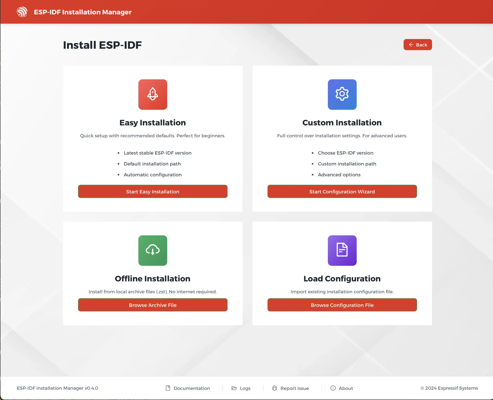
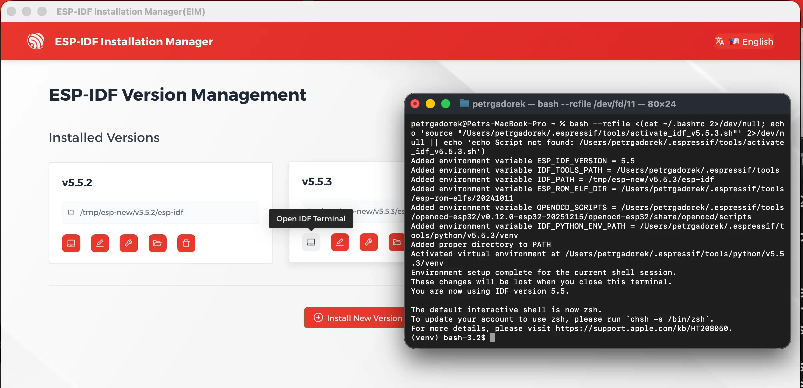
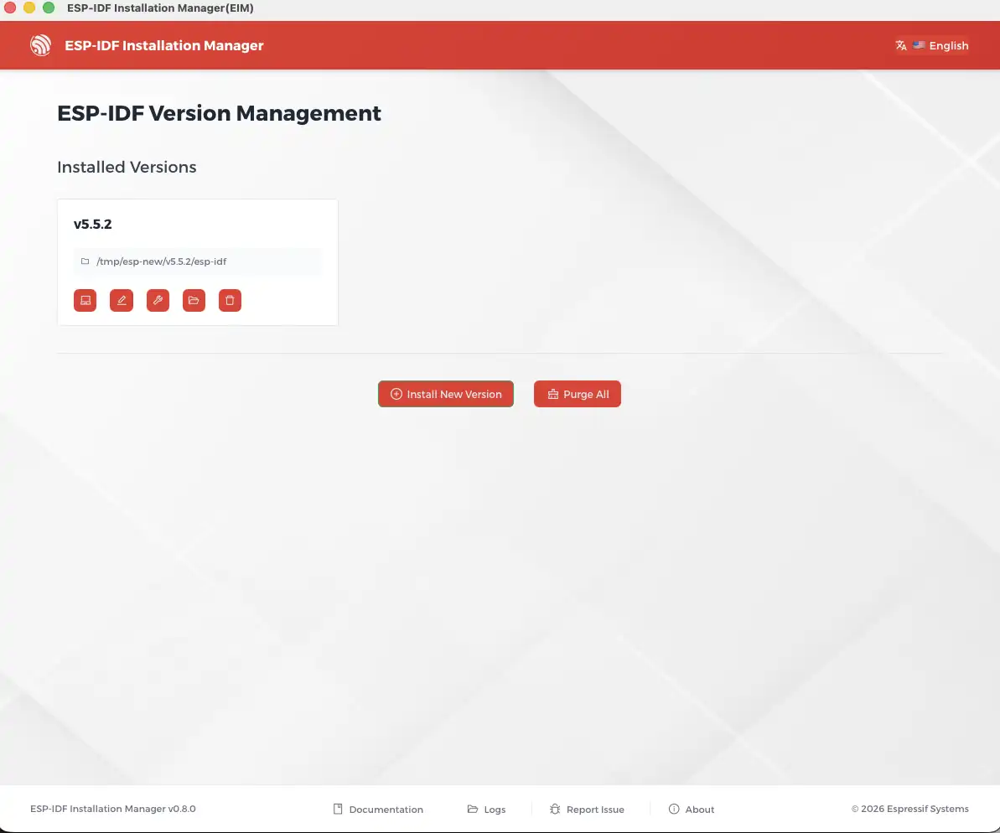

## Introducing ESP-IDF Installation Manager v0.8

The ESP-IDF Installation Manager (EIM) is a cross-platform tool designed to simplify the installation and management of the Espressif IoT Development Framework. Version 0.8 introduces several notable enhancements, and in this article we will focus on:

* Native package manager EIM installation methods
* ESP-IDF offline installation
* Improved ESP-IDF environment activation
* CI/CD integration
* Version management

EIM addresses a common pain point in embedded development: configuring toolchains and dependencies across different operating systems. Whether you're a developer working on a single project or part of a team requiring reproducible builds, EIM provides a consistent experience across Windows, macOS, and Linux.

## EIM installation methods

EIM 0.8 offers multiple installation options to suit different workflows and preferences.

### Package Manager Installation (Recommended)

The simplest way to install EIM is through your platform's native package manager.


{}
```powershell
# Install GUI version
winget install Espressif.EIM
# Install CLI version only
winget install Espressif.EIM-CLI
```
{}
{}
```bash
# First add the EIM tap
brew tap espressif/eim
# Install GUI version
brew install --cask eim-gui
# Or install CLI version only
brew install eim
```
{}
{}
```bash
# Add the EIM APT repository
echo "deb [trusted=yes] https://dl.espressif.com/dl/eim/apt/ stable main" | \
    sudo tee /etc/apt/sources.list.d/espressif.list
# Update package lists
sudo apt update
# Install CLI version
sudo apt install eim-cli
# Or install GUI version
sudo apt install eim
```
{}
{}
```bash
# Download and install the RPM repository configuration
sudo dnf install https://dl.espressif.com/dl/eim/rpm/eim-repo-latest.noarch.rpm
# Install CLI version
sudo dnf install eim-cli
# Or install GUI version
sudo dnf install eim
```
{}


### Portable Binary Installation

For users who prefer self-contained binaries or lack package manager access, visit the [EIM downloads page](https://dl.espressif.com/dl/eim/) for platform-specific binaries and detailed installation instructions.

## ESP-IDF offline installation

For air-gapped environments, networks with restricted access, or simply when you want the fastest and most reliable installation experience, EIM supports fully offline installation through pre-built archives.

Pre-packaged offline archives for every supported ESP-IDF version and platform are available at [https://dl.espressif.com/dl/eim/?tab=offline](https://dl.espressif.com/dl/eim/?tab=offline).



Download the appropriate archive for your platform and ESP-IDF version, then install using:

```bash
# Install from a downloaded archive
eim install --use-local-archive /path/to/archive.zip
```

Offline installation is also available directly through the GUI for users who prefer a visual interface.

**Why choose offline installation?**

- **Fastest method**: Skip all downloads and verification steps—everything is already included
- **Most reliable**: No network issues, no server timeouts, no corrupted downloads
- **Tested and verified**: Each archive is pre-built and tested before publication
- **Fail-safe solution**: When other installation methods encounter issues, offline archives almost always succeed
- **In areas with restricted or slow Internet**: Windows users should consider using offline archives for the most consistent experience.

This method is particularly valuable for:
- Industrial environments with restricted network access
- CI/CD runners in private networks
- Team environments requiring consistent tool versions
- Users in regions with network connectivity challenges


## Improved ESP-IDF environment activation

Traditional ESP-IDF installation methods used `install.sh` and `export.sh` scripts from the IDF repository. EIM replaces these with a modern, cross-platform approach.

### Installation is Now Simpler

The `install.sh` script from the ESP-IDF repository is no longer needed. EIM handles all toolchain and dependency installation automatically through the commands described above.

### Activation Scripts Replace export.sh

The `export.sh` script has been replaced by version-specific activation scripts. After installing ESP-IDF with EIM, activate the environment by sourcing the activation script:

```bash
# Activate a specific ESP-IDF version
source ~/.espressif/tools/activate_idf_v5.3.2.sh
```

To find the activation script path for any installed version, use:

```bash
eim select
```

This command displays all installed versions along with their activation script paths.

### Opening the IDF Shell

Across all platforms, you can open the IDF Shell from the EIM GUI: go to the **Version Manager** view and click **“Open IDF Shell”** next to the version you want. This launches a terminal with the ESP-IDF environment already activated.



On Windows, EIM also adds an **IDF Shell** shortcut to your desktop and an entry in the Windows Terminal dropdown menu for quick access.

## CI/CD Integration

EIM enables seamless automation in CI/CD pipelines, allowing you to install ESP-IDF and set up projects consistently across different environments.

### Headless installation

The EIM supports headless mode for automated installations. Actually the `install` command runs in non-interactive (headless) mode by default. You can configure params of the headless instllation by CLI commands like:
```bash
# Install specific version
eim install -i v5.3.2

# Custom installation path
eim install -p /opt/esp-idf
```

or if this gets too complex for your need you can use configuration file. All the detailed information about this can be found in the [documentaion](https://docs.espressif.com/projects/idf-im-ui/en/latest/cli_configuration.html).

### GitHub Actions

For GitHub workflows, use the official [install-esp-idf-action](https://github.com/espressif/install-esp-idf-action) for GitHub workflows:

```yaml
steps:
  - uses: actions/checkout@v4
  - name: Install ESP-IDF
    uses: espressif/install-esp-idf-action@v1
    with:
      version: "v5.0"
      path: "/custom/path/to/esp-idf"
      tools-path: "/custom/path/to/tools"
```

### Docker Integration

For Docker and containerized build environments, you can find comprehensive examples in the [Headless Usage documentation](https://docs.espressif.com/projects/idf-im-ui/en/latest/headless_usage.html#docker-integration).

### Custom Repository Configuration

For organizations using ESP-IDF forks with custom modifications:

```bash
# For GitHub repositories
eim install -i v5.3.2 --repo-stub my-github-user/my-custom-idf

# For GitLab or self-hosted repositories
eim install -i v5.3.2 --mirror https://gitlab.example.com --repo-stub my-gitlab-user/my-custom-idf
```

## Version Management

EIM makes it easy to manage multiple ESP-IDF versions on a single system. Switch between versions instantly without reinstalling tools.

You can quickly select your preferred ESP-IDF version from the GUI, as illustrated in the image below.



## Documentation and Resources

- **EIM Documentation**: [https://docs.espressif.com/projects/idf-im-ui/en/latest/](https://docs.espressif.com/projects/idf-im-ui/en/latest/)
- **EIM Repository**: [https://github.com/espressif/idf-im-ui](https://github.com/espressif/idf-im-ui)
- **EIM Downloads**: [https://dl.espressif.com/dl/eim/](https://dl.espressif.com/dl/eim/)
- **ESP-IDF Documentation**: [https://docs.espressif.com/projects/esp-idf/en/latest/](https://docs.espressif.com/projects/esp-idf/en/latest/)

## Conclusion

EIM 0.8 simplifies ESP-IDF installation across all major platforms through native package managers, supports offline deployments for restricted environments, and integrates seamlessly with CI/CD pipelines. Whether you're setting up a new development machine or configuring automated builds, EIM provides a consistent and reliable installation experience.
