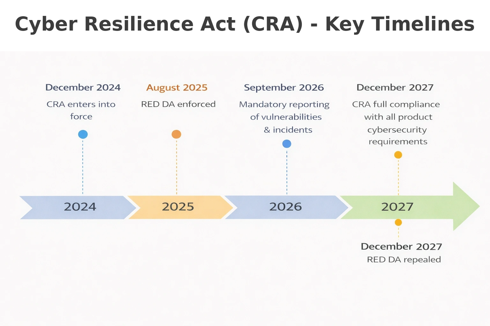
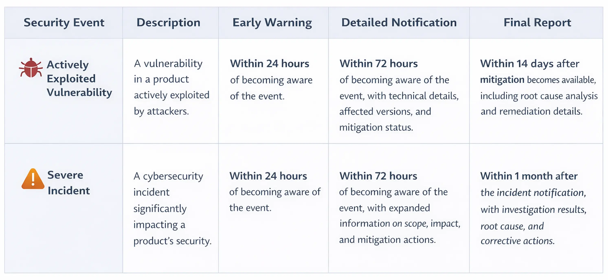
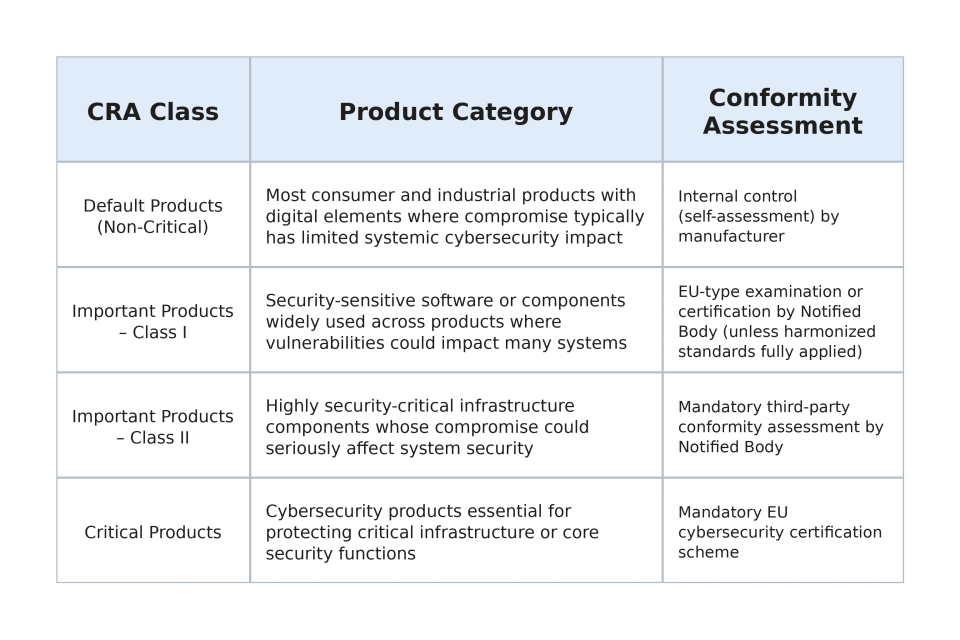

## Introduction to the Cyber Resilience Act (CRA)

The European Union’s Cyber Resilience Act (CRA) represents a fundamental shift in how cybersecurity is regulated for connected products placed on the EU market. Like the RED Delegated Act clarified cybersecurity expectations for radio equipment, the CRA establishes horizontal cybersecurity requirements for a broad range of digital products — including IoT devices and digital products built on ESP32 SoCs and modules, as well as related software frameworks (such as ESP-IDF), companion mobile applications, and associated cloud offering as part of the overall product solution.

As an EU Regulation, it becomes directly binding law across all Member States once it enters into force. The same legal text applies uniformly across the entire EU, ensuring consistent cybersecurity obligations in every country.

For manufacturers, this means the CRA creates a single, harmonized cybersecurity framework for the entire EU market. Product manufacturers can follow one common compliance plan for the entire EU instead of preparing different plans for each country.

### Scope of the CRA

The CRA applies broadly to:
- Hardware and software products with digital elements (e.g., smart home hubs, network-connected printers)
- IoT devices and connectivity modules (e.g., smart thermostats, Wi-Fi or BLE modules integrated into consumer devices)
- Embedded systems with network interfaces (e.g., industrial controllers, smart meters)
- Firmware and software components supplied with the product (e.g., device operating systems, companion mobile applications provided with the device and cloud deployment)

Products already regulated under sector-specific EU frameworks (e.g., medical devices, automotive under UNECE, aviation) may have partial or full exemptions where equivalent cybersecurity requirements already exist.

For typical ESP32-based designs — such as smart home devices, industrial sensors, wearables, gateways, and consumer IoT products — the CRA is applicable.

## CRA Timeline

The CRA was politically agreed in 2023 and has entered into force in December 2024.

Key milestones:
- Entry into force: 10 December 2024 (20 days after publication in the Official Journal of the EU)
- Vulnerability reporting obligations apply from: 11 September 2026 (21 months after entry into force)
- Full application of core CRA requirements from: 11 December 2027 (36 months after entry into force)

Manufacturers placing products on the EU market should begin gap analysis and implementation planning early.

## Essential CRA Requirements

The CRA defines essential cybersecurity requirements that manufacturers must meet before placing products on the EU market.
These obligations extend beyond firmware design. They impact provisioning flows, lifecycle management, update strategy, documentation, and post-market processes.

### Cybersecurity Requirements for Products with Digital Elements

[Annex I Part I](https://eur-lex.europa.eu/legal-content/EN/TXT/?uri=CELEX%3A02024R2847-20241120#anx_I) of the CRA defines a set of baseline cybersecurity requirements that must be implemented in the design and development of products with digital elements. In simple terms, manufacturers must ensure that products are built with security in mind from the beginning.

Key high-level requirements include:

- Secure-by-design and secure-by-default development
- Cybersecurity risk assessment at product level
- Protection against unauthorized access and misuse
- Secure update mechanisms
- Vulnerability handling and coordinated disclosure processes
- Data protection and minimization principles
- Logging and monitoring capabilities (where relevant)
- Transparency obligations (security documentation and instructions)

### Vulnerability Handling Requirements

[Annex I PART II](https://eur-lex.europa.eu/legal-content/EN/TXT/?uri=CELEX%3A02024R2847-20241120#anx_I) of the CRA also defines requirements for how manufacturers must handle vulnerabilities discovered during the product lifecycle.

Manufacturers must establish processes to identify, manage, and remediate vulnerabilities affecting their products. In particular, the CRA introduces two reportable security conditions:

**- Actively exploited vulnerability** – a vulnerability that is currently being exploited in the product\
**- Severe incident** – a security incident that significantly impacts the security of a product or its users

To address these situations, manufacturers are expected to:

- Maintain a vulnerability handling and coordinated disclosure process
- Monitor and assess vulnerabilities reported by researchers, customers, or internal teams
- Provide vulnerability fixes and security updates for the declared support period of the product
- Inform users about available security updates and mitigation measures
- Maintain communication channels for vulnerability reporting
- Establish processes to assess and report actively exploited vulnerabilities and severe incident
- Submit reports through the [**Single Reporting Platform (SRP)**](https://www.enisa.europa.eu/topics/product-security-and-certification/single-reporting-platform-srp) designated under the CRA. The SRP forwards the notifications to **ENISA** and the relevant national **CSIRTs** and **market surveillance authorities**, ensuring coordinated incident handling across the EU
- Follow CRA vulnerability notification timelines:

 For more details on managing security lifecycle in ESP32 products, please see the related [blog](https://developer.espressif.com/blog/2026/03/esp32-security-updates/).

## CRA Compliance Process

The CRA introduces a structured conformity assessment framework.

### Step 1: Product Classification

Under the CRA (see [Annex III](https://eur-lex.europa.eu/legal-content/EN/TXT/?uri=CELEX%3A02024R2847-20241120#anx_III) & [Annex IV](https://eur-lex.europa.eu/legal-content/EN/TXT/?uri=CELEX%3A02024R2847-20241120#anx_IV)), products are categorized as:
- Default (non-critical) products
- Important products (Class I and Class II)
- Critical products (subject to stricter conformity assessment)

Most ESP32-based IoT products are expected to fall under the Default or Important Class I category, depending on functionality and risk profile.

### Step 2: Conformity Assessment

Manufacturers must:
- Perform cybersecurity risk assessment
- Implement required technical and organizational measures
- Prepare technical documentation
- Draft an EU Declaration of Conformity
- Affix CE marking (including CRA compliance)

Certain product categories may require third-party conformity assessment by a Notified Body.

#### CRA Product Classes and Compliance Process

### Step 3: Post-Market Obligations

Compliance does not end at market entry. Manufacturers must:
- Monitor vulnerabilities
- Issue security updates
- Maintain vulnerability handling procedures
- Notify ENISA of actively exploited vulnerabilities

The CRA establishes lifecycle-based cybersecurity accountability.

## Obligations: OEM vs. Platform Vendor (Espressif Systems)

### OEM (Product Manufacturer) Obligations

The OEM placing the final product on the EU market is legally considered the **manufacturer** under the CRA. As per CRA [Article 13](https://eur-lex.europa.eu/legal-content/EN/TXT/?uri=CELEX%3A02024R2847-20241120#art_13) and [Article 14](https://eur-lex.europa.eu/legal-content/EN/TXT/?uri=CELEX%3A02024R2847-20241120#art_14), manufacturers are responsible for:

- Conducting product-level cybersecurity risk assessment
- Ensuring compliance with the CRA essential cybersecurity requirements
- Maintaining vulnerability management and disclosure processes
- Providing required CRA compliance and technical documentation (including user cybersecurity information, support period, update policy, and vulnerability contact)
- Defining support period and update policy
- Preparing technical documentation and EU Declaration of Conformity

Even when using certified modules or open-source frameworks, responsibility for final product compliance remains with the OEM.

### Platform Vendor Obligations

Platform vendors supply components, platforms, or software frameworks that are integrated by manufacturers into final products. While the OEM placing the product on the EU market remains the legal manufacturer, platform vendors are expected to support the security posture of the ecosystem.

Typical responsibilities of a platform vendor include:

- Designing hardware and software platforms with built‑in security capabilities
- Providing documentation of available security features and recommended secure configurations
- Maintaining a vulnerability handling and disclosure process for the platform
- Informing downstream manufacturers about vulnerabilities that may affect their products
- Providing security update or vulnerability fixes for supported platform components
- Publishing security advisories and guidance when vulnerabilities are identified

These practices help manufacturers integrate the platform securely and meet their CRA obligations.

## How Espressif Will Support OEM Customers for CRA Compliance

Espressif is committed to supporting customers through:

### Secure Hardware Capabilities
- Hardware root-of-trust
- Secure Boot
- Flash Encryption
- Cryptographic accelerators
- eFuse-based key storage

### Secure Software Framework
- Open-source and actively maintained
- Regular security patches
- Coordinated vulnerability disclosure process
- Secure OTA update mechanisms
- Industry-standard cryptographic libraries

### Documentation and Compliance Guidance
- Security application notes
- Production configuration guidelines
- Reference architectures for secure provisioning
- Mapping guidance aligned with CRA after the harmonized standard are available

### Transparency and Vulnerability Management
- Public security advisories
- Long-term maintenance branches
- Clear vulnerability reporting channels

### Collaboration and Customer Support
- Recommendations on security configuration reviews
- Best-practice recommendations for lifecycle management
- Support for third-party certification and conformity activities

Espressif maintains a comprehensive product security program to support customers in meeting their cybersecurity and compliance obligations. More details about Espressif’s security processes, vulnerability handling practices, and security advisories are available on the Espressif [Product Security page.](https://docs.espressif.com/projects/esp-product-security/en/latest/)

## Final Thoughts

The Cyber Resilience Act represents a structural evolution in EU product regulation. Cybersecurity is no longer optional or market-driven — it is a legal requirement spanning the entire product lifecycle.

For OEMs building on ESP32 platforms, early preparation is critical:
- Conduct a gap analysis
- Define update and vulnerability handling processes
- Enable hardware security features in production
- Maintain comprehensive technical documentation

Espressif Systems remains committed to delivering secure SoCs, secure software frameworks, and transparent security practices to help customers confidently place CRA-compliant products on the EU market.

Cybersecurity is not just regulatory compliance — it is product quality, customer trust, and long-term sustainability.

For assistance, customers can contact [sales@espressif.com](mailto:sales@espressif.com).

## Frequently Asked Questions (FAQ)

**Q1: Does the CRA apply only to connected IoT devices?**\
**A:** No. The CRA applies to all "products with digital elements," which includes hardware, embedded software, standalone software, and digital services supplied as part of a product solution.

**Q2: When will harmonized standards supporting the CRA be available?**\
**A:** Most harmonized standards expected to start publishing by end of the year 2026.

**Q3: Should a product comply with both the CRA and RED Delegation Act after CRA comes into the force?**\
**A:** The CRA will also apply to the same categories of radio equipment currently covered by the RED DA. These products must follow RED DA cybersecurity rules if placed on the market between 1 August 2025 and December 2027 and will follow CRA rules if placed on the market from December 2027 onward. Even after the RED DA is repealed, market surveillance will continue to check compliance for products sold during that earlier period.

**Q4: For how long must a manufacturer provide security updates?**\
**A:** Manufacturers must provide security updates for the declared support period, which must be proportionate to the product’s expected lifetime and clearly communicated to users as required under the CRA.

**Q5: Do products already placed on the market need to comply with the CRA?**\
**A:** Products placed on the EU market before the CRA’s full application date (11 December 2027) are generally not retroactively affected. Products placed on the market after that date must fully comply with the CRA requirements. However, any product placed on the market after 11 September 2026 must already follow the vulnerability reporting obligations under [Article 14](https://eur-lex.europa.eu/legal-content/EN/TXT/?uri=CELEX%3A02024R2847-20241120#art_14) of the CRA.

## References
- [Cyber Resilience Act (Regulation (EU) 2024/2847)](https://eur-lex.europa.eu/legal-content/EN/TXT/?uri=CELEX%3A02024R2847-20241120)
- [Cyber Resilience Act implementation - Frequently asked questions](https://digital-strategy.ec.europa.eu/en/library/cyber-resilience-act-implementation-frequently-asked-questions)
