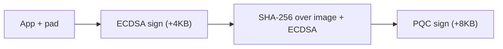
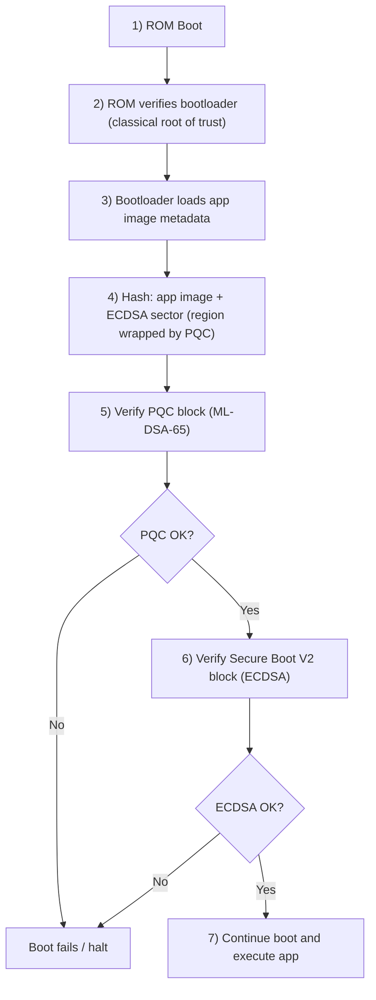

## 1. Introduction: Why Post-Quantum Security Matters for ESP32

Post-quantum cryptography is required because large-scale quantum computers would break the public-key foundations used across today’s secure systems. **Shor’s algorithm** can solve integer factorization and discrete logarithm problems efficiently on a quantum computer, which directly threatens **RSA** (factorization) and **ECDSA/ECC** (discrete logarithm). In practical terms, signatures and key exchange mechanisms based on these assumptions lose long-term security once capable quantum hardware exists.

This is why PQC has moved from theory to standards. In 2024, NIST finalized the first PQC standards: **FIPS 203 (ML-KEM)**, **FIPS 204 (ML-DSA)**, and **FIPS 205 (SLH-DSA)**. For cloud systems, migration is mostly a software and operational challenge; for embedded systems, especially long-lived IoT devices, it is a lifecycle challenge.

ESP32-class deployments often remain in the field for 10-15 years, which intersects with “**Harvest Now, Decrypt Later**” risk models where adversaries can collect signed firmware artifacts and revisit them later with stronger capability. In this context, authenticity and trust-chain durability matter as much as confidentiality. This post presents a **measured research prototype** of hybrid secure boot using post-quantum verification on ESP32-class targets, centered on `pqc_boot_verify`, with secure boot and flash encryption enabled under realistic bootloader constraints.

---

## 2. From Classical Secure Boot to Hybrid PQC Verification

Traditional secure boot relies on classical public-key signatures (commonly RSA or ECDSA): ROM code verifies the bootloader, the bootloader is loaded, then the bootloader verifies the app image before execution.

In this model, signature trust is anchored in classical algorithms. If large-scale quantum capability becomes practical, Shor's algorithm threatens those classical assumptions, especially for long-lived firmware ecosystems where signed artifacts can be collected and re-analyzed later.

For that reason, this prototype uses a **hybrid implementation** rather than replacing the classical path outright:

- Keep the existing classical secure boot trust chain in place.
- Add PQC verification in the app verification path.
- Require both checks to pass before boot continues.

To do this without breaking the existing flow, the design extends the image-signature area by appending a dedicated PQC signature sector after the standard secure boot signature block. This keeps compatibility with current boot stages while adding post-quantum verification material.

---

## 3. Prototype Scope and Targeting

This implementation is intentionally positioned as a **research/prototype with measured results**, not a production readiness claim.

### Current targeting

- Primary test target: **ESP32-C5**
- Design intent: reusable across other ESP32 SoCs with sufficient memory budget
- Classic ESP32 is excluded from this path
- Resource-constrained targets remain the strictest validation point for portability assumptions

### Key constraints (prototype context)

- Secure Boot + Flash Encryption increase bootloader code size.
- Bootloader code size (excluding signature): ~64 KB (ESP32-C3 reference).
- No OS/runtime environment during bootloader execution.
- CPU frequency in measured context: 80 MHz.

The working model is: if the constrained targets are stable, broader adoption on larger-memory SoCs is practical.

---

## 4. Hybrid Secure Boot Architecture

The prototype keeps classical trust intact and adds PQC verification in the app image path. The **PQC signature block is a wrapper over the application image plus the ECDSA Secure Boot V2 sector**: the digest that ML-DSA verifies is computed across that combined region, so the PQC signature binds both the firmware image and the classical signature block.

### Signing order (build / host pipeline)

On the signing side, the image is produced in **two steps**: classical signing first, then post-quantum signing over the already-classically-signed layout.



### Verification model

- ROM boot flow remains unchanged (classical ROM verification of bootloader).
- Bootloader verifies the application image in **strict order**:
  1. **ML-DSA-65 (PQC block)** — if this fails, boot **stops**; ECDSA is not attempted.
  2. **ECDSA V2 Secure Boot** — run **only after** PQC verification succeeds.
- Boot proceeds only if **both** checks pass.



This preserves backward trust assumptions while introducing forward-looking cryptographic resilience.

---

## 5. Flash Signature Layout: Extending Without Breaking Existing Flow

The prototype appends a dedicated PQC sector after the standard secure boot sector.

- Existing secure boot V2 signature sector: **4 KB**
- Added PQC signature sector: **8 KB**
- Combined signature footprint: **12 KB**


### PQC signature block (8 KB) details

Based on `pqc_sig_block.h`, the PQC sector contains one packed `pqc_sig_block_t` of exactly **8192 bytes**, appended after the 4 KB ECDSA sector.

**Note:** The PQC signature block is kept at **8 KB** (a multiple of 4 KB) because bootloader `mmap` parsing operates in **4 KB** units.

| Section | Size | Details |
| --- | --- | --- |
| Header | 4 bytes | `magic_byte` (`0xE8`), `version` (`0x01`), `algorithm_id`, `flags` |
| Image digest | 32 bytes | SHA-256 of **image content + ECDSA sector** (wrapped region) |
| Length fields | 8 bytes | `public_key_len`, `signature_len` for the active PQC algorithm |
| Public key area | 2592 bytes max | Fixed-size array; zero-padded if the algorithm uses fewer bytes |
| Signature area | 4627 bytes max | Fixed-size array; zero-padded if the algorithm uses fewer bytes |
| CRC | 4 bytes | CRC-32-LE over bytes from offset `0` up to (not including) `block_crc` |
| Padding | Remainder | Zero fill so the packed block is exactly **8192** bytes |

---

## 6. Memory Strategy Under Bootloader Constraints

Bootloader environments cannot rely on normal application allocation behavior. This prototype uses an explicit temporary-memory strategy.

### Current approach

- **TLSF allocator** for PQC/liboqs allocation paths.
- Fixed temporary region near top of app SRAM.
- Current configured temporary pool budget in this setup: **72 KB**.
- No additional assertion-based safety guards are enabled yet (known prototype limitation).

Stack-heavy PQC verification is isolated to avoid collision with normal bootloader execution stack behavior.

---

## 7. Verification Flow (Pseudocode)

```c
verify_app_hybrid(image_start, ecdsa_block_start):
    pqc_block_start = ecdsa_block_start + 4KB

    init_tlsf_temp_pool()

    // Hash region covers app image + ECDSA sector
    digest = sha256_flash(image_start, pqc_block_start - image_start)

    pqc_block = mmap(pqc_block_start, 8KB)
    validate_pqc_header_crc_lengths(pqc_block)

    // Trust binding checks
    if pqc_block.public_key != compiled_trusted_pqc_pubkey:
        fail_boot()
    if pqc_block.image_digest != digest:
        fail_boot()

    // PQC check first
    if !mldsa65_verify(digest, pqc_block.signature, trusted_pubkey):
        fail_boot()

    // Classical check
    if !verify_ecdsa_v2_signature(ecdsa_block_start):
        fail_boot()

    destroy_tlsf_temp_pool()
    zero_temp_region()
    continue_boot()
```

---

## 8. Measured Results (ESP32-C5 Prototype)

### Hybrid secure boot path (`pqc_boot_verify`)

Under bootloader conditions (~80 MHz CPU context), current measurements show:

- **ML-DSA-65 verify:** ~68 ms (software path)
- **ECDSA verify:** ~7 ms (classical path with hardware acceleration)

### `signature_basic` example (ML-DSA-65 on ESP32-C5)

The **`signature_basic`** project under `post_quantum_cryptography` benchmarks ML-DSA-65 signing and verification in the application (not the hybrid bootloader). Figures below come from captured serial logs in that tree (e.g. `signature_basic/test.txt` and `signature_basic/hehe.txt`), **20 iterations** each, chip reported as **ESP32-C5**.

| Path | Sign (avg) | Verify (avg) |
| --- | --- | --- |
| **esp-liboqs** (ML-DSA-65) | ~26.9 ms (min ~24 ms, max ~42 ms) | ~18.0 ms |
| **WolfSSL** (ML-DSA-65) | ~40.5 ms | ~18.3 ms |
| **esp-mldsa-native** (ML-DSA-65) | ~198 ms | ~21.8 ms |

These numbers illustrate how **implementation choice** (reference liboqs, WolfSSL, or native) shifts cost; the hybrid bootloader prototype sits in a different integration context but uses the same algorithm family.

This is the core engineering message: hybrid PQC verification is practical on-device, but timing and memory budgets must be planned explicitly.

---

## 9. Why Hybrid Now Instead of Full Replacement

The prototype keeps **ECDSA** in the trust chain because classical secure boot is mature, widely deployed, and well understood on ESP32-class hardware. **PQC** is standardized, but bootloader use is still relatively new: implementations are **not yet as field-tested** as long-running RSA/ECDSA stacks, and software verification paths remain **vulnerable to side-channel analysis (SCA)**—timing, power, and fault injection—without strong countermeasures. Keeping hybrid verification treats PQC as a forward-looking layer rather than the only gate until embedded PQC paths gain more scrutiny and hardening.

For long-lived devices, **harvest now, decrypt later** also applies to **authenticity**: an adversary can store signed firmware and classical keys today and attack them when quantum-capable cryptanalysis is practical. A **PQC** signature over the image plus ECDSA block addresses that horizon; requiring **both** PQC and classical checks to pass hedges quantum-era breaks while retaining today’s proven secure boot path.

---

## 10. How to Build and Test pqc_boot_verify

To execute this prototype flow, clone the repository and run from the `pqc_boot_verify` project directory:

```bash
cd pqc_boot_verify
idf.py set-target esp32c5
```

Enable **Secure Boot** and **Flash Encryption** in menuconfig, and generate the classical secure boot signing keys (ECDSA/RSA) through the usual ESP-IDF flow. For PQC, run the signing script: **generated key material is stored under the project `keys/` directory** by default (override with `python scripts/pqc_sign.py keygen --keys-dir <dir>`). **Generate the C header that embeds the PQC public key** so the bootloader can verify against a compiled-in trusted key:

```bash
python scripts/pqc_sign.py keygen
python scripts/pqc_sign.py header --pk keys/pqc_ml_dsa_65_public.bin --output path/to/pqc_public_key.h
```

Then build, flash, and monitor:

```bash
idf.py build
idf.py encrypted-flash monitor
```

For project-specific scripts and implementation details, refer to the `post_quantum_cryptography` workspace (including `pqc_boot_verify/scripts/pqc_sign.py`).

---

## References
- [Espressif blog structure reference (GitHub source)](https://github.com/espressif/developer-portal/blob/main/content/blog/2026/03/red_da_assessment_tool_overview/index.md)
- [Published RED DA article format reference](https://raw.githubusercontent.com/espressif/developer-portal/main/content/blog/2026/03/red_da_assessment_tool_overview/index.md)