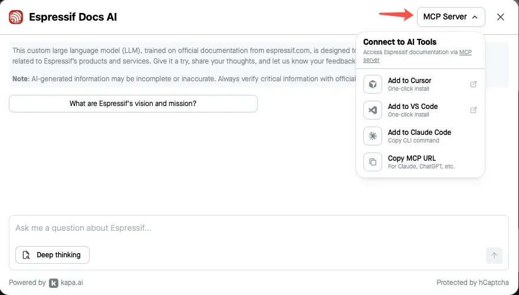
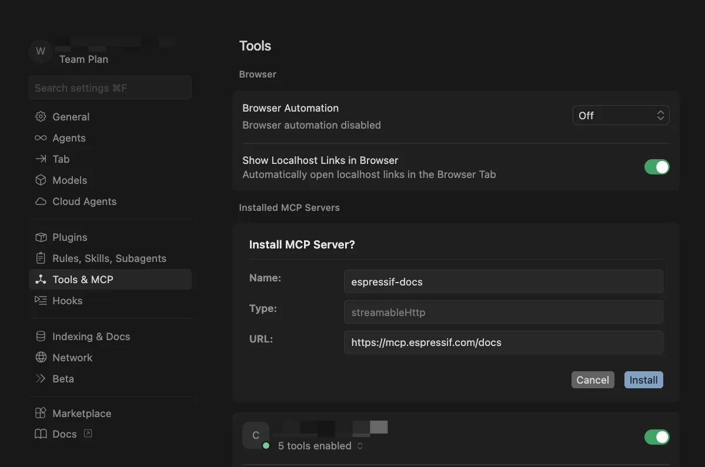
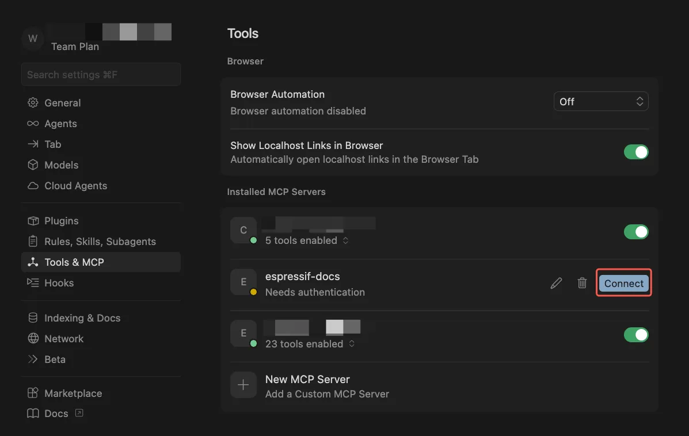
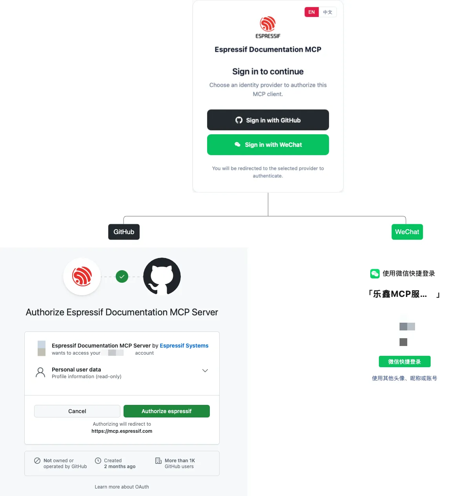
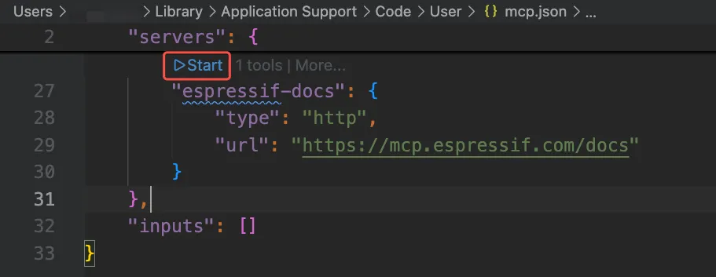
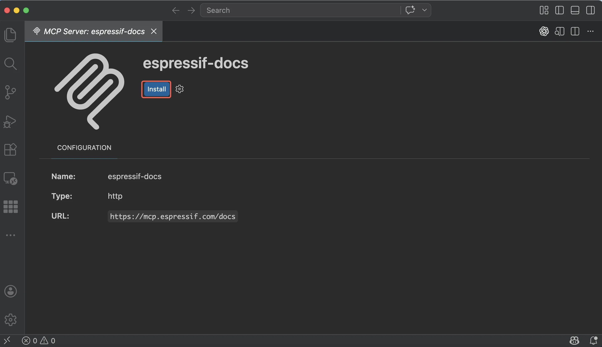
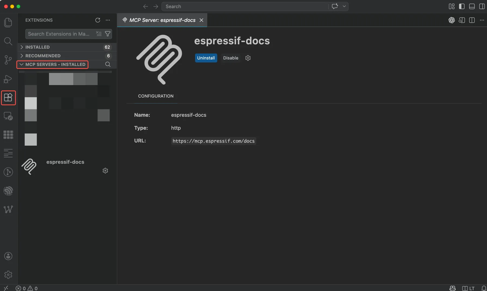
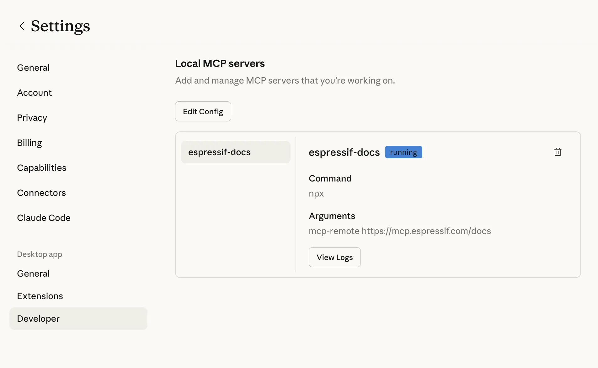
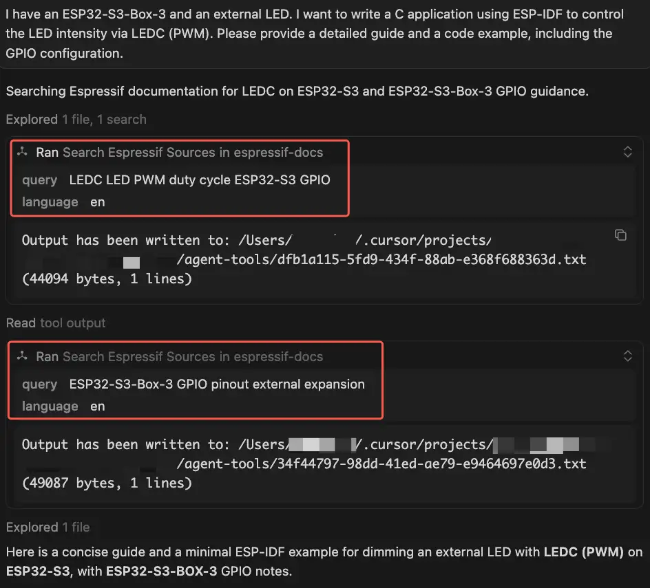
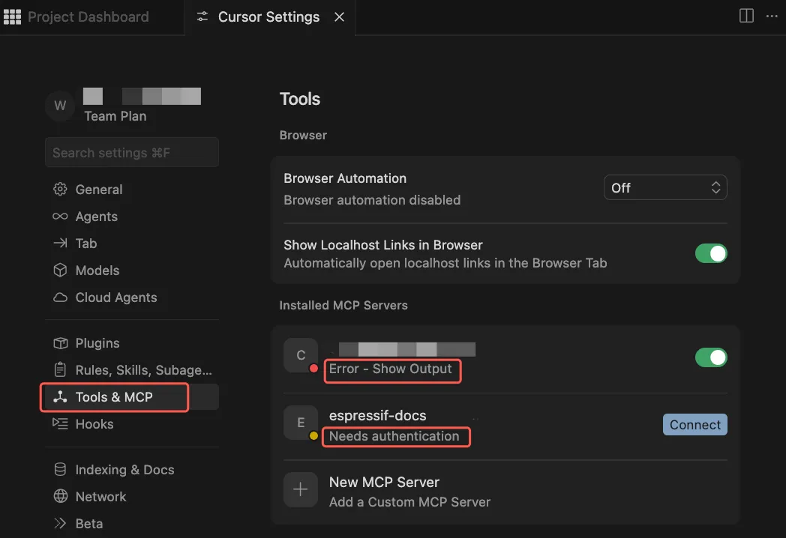

## Why MCP?

[Model Context Protocol (MCP)](https://modelcontextprotocol.io/docs/getting-started/intro) is a standard that lets AI agents connect to external data sources, tools, and workflows. Instead of guessing from training data or search results, AI agents act on real, up-to-date context.

The Espressif Documentation MCP server implements this standard for Espressif's
documentation. Once installed in Cursor, VS Code, Claude Code, or other AI applications, the MCP server gives your AI agent direct access to official Espressif documentation. In practice, this means you can:

- **Stay in your editor** — query the full Espressif documentation corpus through your AI agent without switching to a browser or a PDF viewer
- **Work faster and more accurately** — get implementation guidance, code examples, and bugfix suggestions grounded in official documentation, rather than relying on web search results or agent training data
- **Reduce hallucinations** — agent outputs are based on real, current Espressif documentation rather than fabricated or obsolete content

See [Espressif Documentation MCP server demo](https://pic2.zhimg.com/v2-12ca2503a172fd9f23418959619a81cf_r.gif).

## MCP Server Capabilities

The Espressif Documentation MCP server provides the following tools to AI agents:

| Tool | Description |
|------|-------------|
| `search_espressif_sources (query, language)` | Performs semantic retrieval against the latest Espressif documentation in English and Chinese. It returns the most relevant text fragments with source URLs, providing official reference for your AI assistants. |

The MCP server shares the same knowledge sources as the [Espressif Documentation chatbot](https://chat.espressif.com), including:

- Chip and module datasheets
- Technical Reference Manuals (TRM)
- Hardware Design Guidelines (HDG)
- SDK documentation, such as the latest version of ESP-IDF Programming Guide
- Product Change Notices (PCN), advisories, and certificates
- Espressif blog posts and technical articles
- Documentation for selected end-of-life (EOL) or not-recommended-for-new-design (NRND) products
- Selected M5Stack documentation

## MCP Server vs. Chatbot

Both the MCP server and the [Espressif Documentation chatbot](https://chat.espressif.com) provide access to up-to-date Espressif documentation, but they are designed for different scenarios.

| Use Case | MCP Server | Documentation Chatbot |
|:----------|------------|-----------------------|
| Integrated into IDE workflow | ✅ | ❌ |
| Modify project code | ✅ | ❌ |
| Perform structured reasoning over docs | ✅ | ⚠️ Limited |
| Quick documentation Q&A | ⚠️ | ✅ |
| Learning & exploration | ⚠️ | ✅ |
| Non-technical users | ❌ | ✅ |

In short:

- Use the **MCP server** for integrating documentation into your development workflow.
- Use the **chatbot** for learning and documentation exploration.

## How to Install the MCP Server

1. Open the [Espressif Documentation chatbot widget](https://chat.espressif.com)

2. Click **"MCP Server"** in the upper-right of the widget. Choose where to use the MCP server and follow the corresponding instructions below.

   


      {}

1. Open **Cursor** on your PC.
2. In the Espressif Documentation chatbot widget under **"MCP Server"**, click **"Add to Cursor"**. You may need to allow the website to open Cursor.

   

Add the following to your `.cursor/mcp.json` file:

```json
{
  "mcpServers": {
    "espressif-docs": {
      "url": "https://mcp.espressif.com/docs"
    }
  }
}
```

Save the file, restart Cursor, and open the Cursor Settings page. Continue from Step 4.

On Linux, clicking **Add to Cursor** or editing the `.cursor/mcp.json` file may have no effect if the system has not registered the `cursor://` URL protocol handler.

To verify, run the following command in a terminal:
```bash
xdg-open "cursor://test"
```

If nothing happens or an error is shown, the URL handler is not registered. This is a system-level issue and must be fixed before the MCP server can be added via browser.

   

3. In the Cursor Settings page that opens, click **"Install"** under **"Install MCP Server?"**

   

4. After the MCP server is installed, click **"Connect"** to authenticate. Allow Cursor to open the external website and follow the on-screen prompt.
> **Note:** Wechat authentication is not yet implemented. This step will be enabled in a future release.

   
   

      {}

      {}
1. Open **VS Code** on your PC.
2. In the Espressif Documentation chatbot widget, under **"MCP Server"**, click **"Add to VS Code"**. You may need to allow the website to open VS Code.


Add the following to your `.vscode/mcp.json` file:

```json
{
  "servers": {
    "espressif-docs": {
      "url": "https://mcp.espressif.com/docs"
    }
  }
}
```

Save the file, click "Start" above the code you just added to start the MCP server, and continue from Step 4.


On Linux, clicking **Add to VS Code** or editing the `.vscode/mcp.json` file may have no effect if the system has not registered the `vscode://` URL protocol handler.

To verify, run the following command in a terminal:
```bash
xdg-open "vscode://test"
```

If nothing happens or an error is shown, the URL handler is not registered. This is a system-level issue and must be fixed before the MCP server can be added via browser.


3. Click **"Install"** from the MCP installation page.

   

4. Allow VS Code to open the external website and follow the on-screen prompt to authenticate with the MCP server.
   
   > **Note:** Wechat authentication is not yet implemented. This step will be enabled in a future release.
5. When authentication finishes, the MCP server appears under **Extension > MCP SERVERS – INSTALLED**.

   

      {}

      {}
1. Under **"MCP Server"**, click **"Add to Claude Code"** to copy the CLI command.
2. Paste and execute the command in your terminal.
3. Upon success, you will see the following message printed in the terminal:

```
Added HTTP MCP server espressif-docs with URL: https://mcp.espressif.com/docs to local config
File modified: /Users/user/.claude.json [project: /Users/user]
```
4. Authenticate with the MCP server:
> **Note:** Wechat authentication is not yet implemented. This step will be enabled in a future release.
   - Start Claude Code in your terminal by running ``claude``
   - Type ``/mcp`` to open the MCP management panel
   - Select the MCP server, and then select ``Authenticate``
   - A browser window will open for you to log in. Follow the on-screen prompt to authenticate with the MCP server.
   

      {}

      {}
1. Add the following snippet to your Claude Desktop config file to install the Docs MCP server:
   - macOS: `~/Library/Application Support/Claude/claude_desktop_config.json`
   - Windows: `%APPDATA%\Claude\claude_desktop_config.json`

   ```json
   {
      "mcpServers": {
         "espressif-docs": {
            "command": "npx",
            "args": ["mcp-remote", "https://mcp.espressif.com/docs"]
         }
      }
   }
   ```

2. Save the file and restart Claude Desktop. An external browser window will open automatically. Follow the on-screen prompt to authenticate with the MCP server.

> **Note:** Wechat authentication is not yet implemented. This step will be enabled in a future release.
3. After successful authentication, you will see the MCP servers appear in **"Settings > Developer > Local MCP servers"**.

   

      {}


## Example Prompts

You can start experimenting with the Documentation MCP server for the following use cases:

**Generate code**

> I have an ESP32-S3-Box-3 and an external LED. I want to write a C application using ESP-IDF to control the LED intensity via LEDC (PWM). Please provide a detailed guide and a code example, including the GPIO configuration.

**Review code**

> Review the SPI initialization code against the ESP-IDF SPI Master driver documentation. Highlight and correct any wrong API usage, deprecated functions, or missing configuration steps.

**Troubleshoot**

> I'm getting this error: "CMake Error at run_serial_tool.cmake:67 (message): idf.py: error: argument --port: expected one argument". Look up what causes this in the ESP-IDF documentation and suggest a fix.

**Update code following the style guide**

> Update the code to follow the Espressif IoT Development Framework Style Guide.

**Generate files**

> Based on the ESP-IDF partition table documentation, generate a partition table CSV for a 4 MB flash with a 1 MB factory app partition, a 512 KB OTA_0 partition, a 512 KB OTA_1 partition, and a 16 KB NVS partition.

**Update configuration options**

> Check Espressif documentation for the recommended I2C pins on ESP32-C3, and modify pin configuration options `I2C_MASTER_SCL` and `I2C_MASTER_SDA` accordingly.

**Migrate to a new ESP-IDF version**

> My project currently targets ESP-IDF v5.1. Using the ESP-IDF v5.2 and v5.3 migration guides, list the breaking API changes that affect UART and I2C drivers, and update the calls in `main/comm.c` accordingly.

## Best Practices

- **Check the tool call indicator** in your editor to confirm the MCP server is being queried. If you don't see it, the agent may be answering from training data or searching the web.

  

- **Explicitly instruct the agent** if it does not consult the MCP server by default. Add `"refer to Espressif documentation"` to your prompt, or define this requirement in [`AGENTS.md`](https://agents.md/):

  ```markdown
  # AGENTS.md
  Always use the Espressif documentation MCP server if you need to work
  with ESP chips or ESP SDKs such as ESP-IDF and ESP-ADF, without me
  having to explicitly ask.
  ```

## Limitations

The Espressif Documentation MCP server has the following limitations:

- **Retrieval only** — the MCP server retrieves documentation and supplies it as context for AI agents. It does not execute code, modify files, or perform actions — those remain the responsibility of the AI agent.
- **Public Espressif documentation only** — the knowledge sources cover public Espressif documentation only. They do not include code repositories, GitHub issues, community or third-party forums, internal or unpublished documents, or documentation for all EOL and NRND products.
- **Rate limits apply** — to ensure fair access for all users, the following per-user limits apply:
  - 40 requests per user per hour
  - 200 requests per user per day
- **Not designed for open-ended learning or exploration** — if you want to ask questions, browse topics, or get documentation summaries conversationally, use the [Espressif Documentation Chatbot](https://chat.espressif.com) instead.

## FAQ

### Do I need internet access to use the MCP server?

Yes. You need access to the public internet to connect to the MCP server.

### Do I need an account to use the MCP server?

Yes. You need either a GitHub account or a WeChat account to authenticate with the MCP server. Only your anonymized account ID is stored — this is used solely to enforce per-user rate limits and ensure fair usage.

> **Note:** WeChat authentication is not yet implemented and will be enabled in a future release.

### Do I need to manually start the MCP server after installation?

No. The MCP server is a remote service, so there is no local process to start.

**Exception:** If you configured the MCP server by manually editing `mcp.json` in VS Code, click **Start** above the server entry to open the authentication page, see [VS Code](#how-to-install-the-mcp-server). Once authenticated, the server connects automatically from that point on.

### Why didn't the agent consult the Espressif Documentation MCP server, even though I asked it to?

**Step 1: Check the MCP server status in your editor.**

- **Cursor**: Go to **Settings > Tools & MCP**.
- **VS Code**: Open the Extensions panel and go to **MCP SERVERS –
  INSTALLED**.
- **Claude Code**: Run `claude mcp list` in your terminal.
- **Claude Desktop**: Go to **Settings > Desktop > Developer > Local MCP servers**.

If the MCP server is disabled, enable it.

If authentication has expired, re-authenticate or re-add the MCP server.

If an error persists, submit a [feedback](https://www.espressif.com/en/company/documents/documentation_feedback) with the error message shown in your editor.



**Step 2: Check whether the agent is allowed to use the MCP server tools.**

- **Cursor**: Go to **Settings > Agents > MCP Allowlist**. The agent will prompt you the first time it calls an MCP tool. If it does not, add the tool manually, for example `espressif-docs: search_espressif_sources`.
- **VS Code**: Agent tool permissions are managed per-session. The first time the agent calls an MCP tool in a session, it will prompt you to allow or deny it.
- **Claude Code**: The first time the agent calls an MCP tool, it will prompt you to allow or deny it. You may also run:
   ```
   claude --allowedTools mcp__espressif-docs__search_espressif_sources
   ```
- **Claude Desktop**: Go to **Settings > Customize > Connectors > Desktop > Tool permissions**. By default, this is set to `Needs approval`, meaning you will be prompted each time the agent calls a tool.

**Step 3. Try a different editor.**

MCP support varies across editors. If the MCP server is enabled and allowed but the agent still does not call it, try a different editor. For example, if you are using Cursor, try VS Code or Claude Code instead.

If the issue persists across editors, the problem likely lies with the MCP server itself. Check the [status page](https://status.espressif.tools/status/mcp) to see if there are any known outages.

### Can the MCP server answer questions about end-of-life software, e.g., ESP-IDF v4.4?

No. The knowledge sources cover the latest ESP-IDF version. Documentation for end-of-life versions, such as ESP-IDF v4.4, or any version other than the latest, is not included. If your project targets an EOL version, the MCP server may return documentation that does not match your SDK version.

### Why is the agent linking to documents in English instead of Chinese?

The MCP server searches either the English or Chinese documentation depending on the language of your query. If your AI agents do not specify the query language, English documentation is returned by default.

Each response includes links to the source documentation pages, so you can refer to the full context of the returned content.
