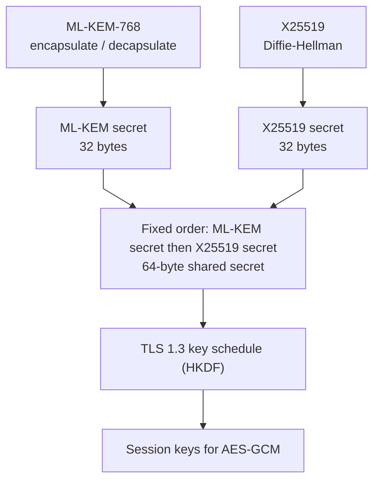
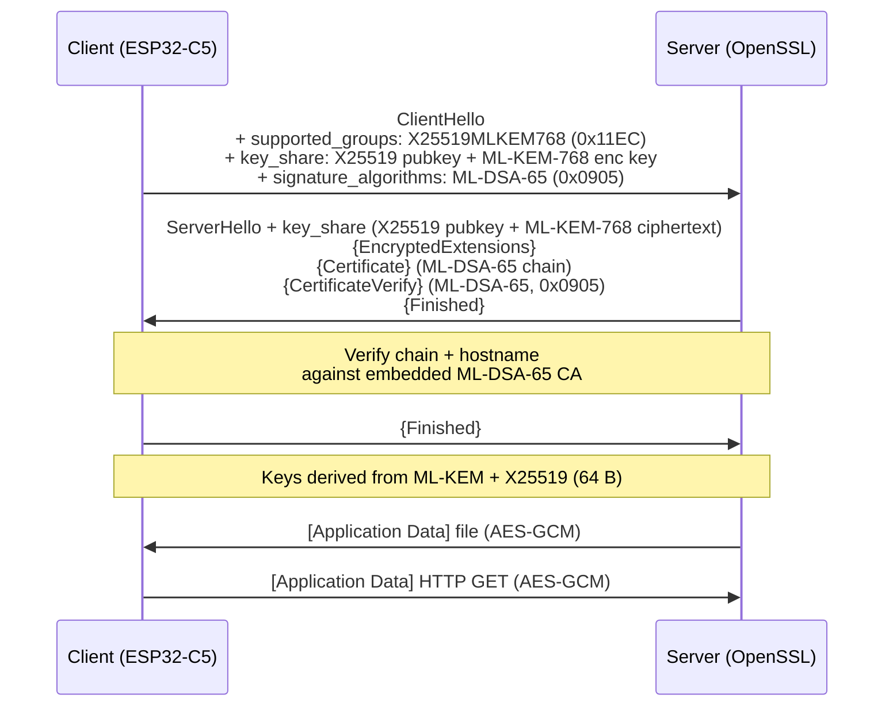
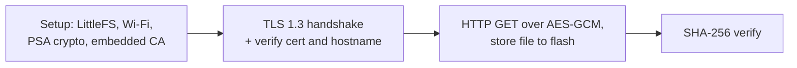

## 1. Introduction

TLS is the base of secure communication for connected devices. Today it uses classical public-key methods, such as X25519 or ECDHE for key exchange and RSA or ECDSA for authentication. A large quantum computer running Shor's algorithm could break both. The biggest near-term risk is "harvest now, decrypt later": an attacker can record a TLS session today and decrypt it later once quantum hardware exists. An ESP32-class device often stays in the field for 10 to 15 years, so any secret it negotiates over a classical-only key exchange sits inside that window.

PQC support on ESP SoCs now reaches into the network stack, not just secure boot. This article describes `esp-hybrid-tls`, a working example that runs a full hybrid PQC TLS 1.3 session on an ESP32-C5 acting as the client, against an OpenSSL server. It uses X25519MLKEM768 for the key exchange and ML-DSA-65 for certificate authentication. It then downloads a file protected by AES-GCM, stores it in flash, and checks it with SHA-256. The example follows two IETF drafts: [`draft-ietf-tls-ecdhe-mlkem`](https://datatracker.ietf.org/doc/draft-ietf-tls-ecdhe-mlkem/) for the hybrid key exchange and [`draft-ietf-tls-mldsa`](https://datatracker.ietf.org/doc/draft-ietf-tls-mldsa/) for ML-DSA signatures in TLS 1.3.

## 2. IETF Standards

The IETF drafts do not replace the classical methods. Instead they take a hybrid approach: run a classical algorithm and a post-quantum algorithm together, and require both to contribute. The connection stays at least as strong as the stronger of the two. It only breaks if an attacker breaks both the classical curve and the post-quantum lattice scheme.

`esp-hybrid-tls` applies this idea to the two parts of a TLS 1.3 handshake that can be negotiated:

| TLS mechanism | Classical | Post-Quantum | Used in this example |
| --- | --- | --- | --- |
| Key exchange (named group) | X25519 | ML-KEM-768 | X25519MLKEM768 (IANA `0x11EC`) |
| Authentication (signature) | none | ML-DSA-65 | ML-DSA-65 (sig scheme `0x0905`, X.509 `id-ml-dsa-65`, RFC 9881) |

The key exchange is truly hybrid, because the shared secret comes from both X25519 and ML-KEM-768. Authentication uses pure ML-DSA-65 for the certificate chain and for the `CertificateVerify` message. The record protection stays as normal TLS 1.3 AEAD, which is AES-GCM. The ML-KEM and ML-DSA implementations come from the [liboqs](https://github.com/open-quantum-safe/liboqs) project.

## 3. Hybrid Key Exchange

The interesting part of the handshake is how one shared secret is built from two separate methods. The named group X25519MLKEM768 joins:

- X25519, a classical Elliptic-Curve Diffie-Hellman exchange over Curve25519, which gives a 32-byte shared secret.
- ML-KEM-768, a lattice-based Key Encapsulation Mechanism (FIPS 203), which gives a 32-byte shared secret.

### Producing the Secrets

X25519 works the usual Diffie-Hellman way. Both sides exchange public keys, and each side derives the same 32-byte secret from its own private key and the peer's public key.

ML-KEM is a KEM, so it works in a different way and is not symmetric:

1. The client generates an ML-KEM-768 keypair and sends the encapsulation key (the public key) to the server inside its `key_share`.
2. The server encapsulates. It picks a random shared secret and, using the client's encapsulation key, produces a ciphertext plus that 32-byte shared secret. It sends the ciphertext back in its `key_share`.
3. The client decapsulates the ciphertext with its private key and recovers the same 32-byte shared secret.

### Mixing the Secrets

The two secrets are then joined to form the input to the TLS key schedule. For X25519MLKEM768, the draft fixes the order as the ML-KEM secret first, then the X25519 secret:

`shared_secret = ML-KEM-768 secret (32 bytes) + X25519 secret (32 bytes) = 64 bytes`

Because both halves feed the TLS 1.3 key schedule (HKDF), every derived key depends on both. An attacker must break X25519 and ML-KEM-768 to recover the session keys. Breaking only one is not enough.



## 4. Certificate Authentication

Key exchange protects secrecy. Authentication protects against an active man-in-the-middle. Following [`draft-ietf-tls-mldsa`](https://datatracker.ietf.org/doc/draft-ietf-tls-mldsa/), this example authenticates the server with ML-DSA-65 (FIPS 204), a lattice-based signature scheme:

- The CA certificate and the server certificate are both signed with ML-DSA-65 (`id-ml-dsa-65` in the X.509 certificate).
- During the handshake, the server signs the transcript in its `CertificateVerify` message using TLS signature scheme `0x0905`.
- The ESP32-C5 client checks the server certificate chain against an embedded ML-DSA-65 CA certificate and checks the `CertificateVerify` signature. Both use ML-DSA-65 verification from liboqs.

Certificate verification is strict. The chain must be valid and the hostname must match the certificate, or the handshake stops.

## 5. Handshake Negotiation

Everything hybrid about this handshake is negotiated through standard TLS 1.3 extensions in the ClientHello. There is no custom protocol. The ESP32-C5 simply advertises the PQC options and the server picks them.

On the client side (ESP32-C5):

- `supported_groups` advertises X25519MLKEM768 (`0x11EC`) as a named group.
- `key_share` carries the X25519 public key together with the ML-KEM-768 encapsulation key.
- `signature_algorithms` advertises ML-DSA-65 (`0x0905`).

On the server side (OpenSSL):

- It selects the X25519MLKEM768 group and returns its own `key_share` (X25519 public key plus ML-KEM ciphertext).
- It presents an ML-DSA-65 certificate chain and signs `CertificateVerify` with `0x0905`.

The record cipher suite is a normal TLS 1.3 AEAD suite, for example `TLS_AES_256_GCM_SHA384`. The PQC parts live in the key-exchange and authentication extensions, not in the symmetric cipher.

The diagram below shows the TLS 1.3 handshake as message flights, in the usual client-and-server style. Each arrow is one flight, and the messages it carries are listed next to it. Braces `{ }` mark messages encrypted under the handshake keys, and `[ ]` marks encrypted application data.



The client also forces TLS 1.3, because X25519MLKEM768 exists only there, and sets strict certificate checking:

```c
/* X25519MLKEM768 is available only in TLS 1.3 */
mbedtls_ssl_conf_min_tls_version(&conf, MBEDTLS_SSL_VERSION_TLS1_3);
mbedtls_ssl_conf_max_tls_version(&conf, MBEDTLS_SSL_VERSION_TLS1_3);

/* Verify the chain and hostname against the embedded ML-DSA-65 CA */
mbedtls_ssl_conf_authmode(&conf, MBEDTLS_SSL_VERIFY_REQUIRED);
mbedtls_ssl_conf_ca_chain(&conf, &cacert, NULL);
```

## 6. Example Flow

The client runs the full flow inside a dedicated FreeRTOS task:



1. Setup. It mounts a LittleFS partition, connects to Wi-Fi, starts PSA crypto, and loads the ML-DSA-65 CA certificate that is embedded into the firmware at build time.
2. Handshake. It connects over TCP and performs the TLS 1.3 handshake, negotiating X25519MLKEM768 and authenticating the server with ML-DSA-65. On success it logs the negotiated cipher suite and confirms that the certificate chain and hostname checks passed.
3. Request and response. It sends an HTTP GET over the encrypted channel. Both directions are protected with AES-GCM. The server responds with a file.
4. Store and verify. The downloaded file is written to `/lfs/testfile.bin` in the ESP32 flash, then hashed with SHA-256 so the client can confirm the file matches the server's known checksum.

For testing, the example talks to a local OpenSSL server hosted on macOS on the same LAN. OpenSSL 3.6 or later supports pure ML-DSA-65 and the X25519MLKEM768 group natively, so no extra provider is needed. The certificates for the CA and the server are generated with OpenSSL, and the CA certificate is embedded into the firmware so the device trusts it.

## 7. Memory Footprint

To measure the cost of going post-quantum, the same example was built two ways and made to download the same 100 KB file over TLS 1.3. One is a classical baseline (X25519 + ECDSA-P256) and the other is the default PQC build (X25519MLKEM768 + ML-DSA-65). The numbers below come from on-device watermark logs (measured on an ESP32-S3 with a 16 KB handshake task) and describe the software-only PQC path.

| | Classical (X25519 + ECDSA-P256) | PQC (X25519MLKEM768 + ML-DSA-65) | Difference |
|---|---|---|---|
| App binary | 1,025,648 B | 1,082,688 B | +55.7 KB |
| Flash code (`.text`+`.rodata`) | 936,010 B | 993,050 B | +55.7 KB |
| Static RAM (`.bss`+`.data`) | 47,564 B | 47,572 B | +8 B (about 0) |
| Peak task stack used | about 8.4 KB | about 11.2 KB | +2.8 KB |
| Transient handshake heap | about 17.4 KB | about 47.9 KB | +30.5 KB |
| Retained session heap | about 8.8 KB | about 13.5 KB | +4.7 KB |
| Transient working set (stack+heap) | about 25.8 KB | about 59.1 KB | +33.3 KB |

Main points:

- Flash. PQC adds about 56 KB of code (liboqs ML-DSA-65 and ML-KEM-768), but almost no extra static RAM. liboqs keeps nothing large in `.bss` or `.data`, so its working memory is all transient.
- RAM at handshake time. The PQC transient working set is about 2.3 times the classical one (about 59 KB against about 26 KB). Most of it is ML-DSA-65 verify scratch (about 31 KB) and ML-KEM-768 scratch (about 13 KB), placed on the heap by default. Moving those buffers back onto the stack would push the task from 16 KB toward 80 to 100 KB. So the choice is where the transient RAM lives, not whether it exists.
- Retained cost per connection is only about 5 KB higher for PQC, for the larger ML-KEM key material and certificate state.

The dynamic-buffer feature (`CONFIG_MBEDTLS_DYNAMIC_BUFFER`) frees the mbedTLS record buffers between handshake phases. Peak heap used by the handshake plus the 100 KB download:

| Config | Peak heap used |
|--------|----------------|
| Classical (X25519 + ECDSA-P256) | 44.9 KB |
| Classical + `DYNAMIC_BUFFER` | 5.9 KB |
| PQC (X25519MLKEM768 + ML-DSA-65) | 60.9 KB |
| PQC + `DYNAMIC_BUFFER` | 48.5 KB |

For the classical path, almost the whole cost is the record buffers, which the feature can reclaim (44.9 KB down to 5.9 KB). For PQC, the roughly 44 KB of liboqs crypto scratch is live during the handshake and cannot be reclaimed, so only the roughly 12 KB of record buffers are freed (60.9 KB down to 48.5 KB). Post-quantum handshakes are dominated by crypto scratch, not by buffering.

## 8. Usage

The hybrid PQC support comes from a bundled PQC-enabled mbedTLS plus liboqs, so no manual patching is needed. The key options are already set in `sdkconfig.defaults`:

```ini
CONFIG_MBEDTLS_USE_BUNDLED_PQC=y
CONFIG_MBEDTLS_SSL_PROTO_TLS1_3=y
CONFIG_MBEDTLS_SSL_TLS1_3_KEY_EXCHANGE_GROUP_X25519MLKEM768=y
CONFIG_MBEDTLS_SSL_TLS1_3_SIG_P384_MLDSA65=y   # enables ML-DSA-65 auth
CONFIG_LIBOQS_ENABLED=y
```

Set the target, configure Wi-Fi in `menuconfig`, build with the server LAN IP, then flash:

```bash
idf.py set-target esp32c5
idf.py build -DTLS_TEST_SERVER_IP=192.168.x.x
idf.py -p PORT flash monitor
```

Start the test server on the host (macOS), which offers the hybrid group and an ML-DSA-65 certificate:

```bash
./scripts/run_server.sh mldsa65   # ML-DSA-65 on port 8444
```

On success the monitor log shows the TLS 1.3 handshake completing with X25519MLKEM768 (`0x11EC`), ML-DSA-65 verification passing, the file downloading over AES-GCM, and its SHA-256 digest.

## 9. Conclusion

`esp-hybrid-tls` shows that a full hybrid post-quantum TLS 1.3 session is practical on an ESP32-C5 today, using only standardized IETF mechanisms:

- X25519MLKEM768 hybrid key exchange, where the session keys depend on both a classical and a post-quantum secret. This directly answers the "harvest now, decrypt later" risk.
- ML-DSA-65 certificate authentication, checked end to end against an embedded CA.
- A real workload, an AES-GCM protected file download stored in flash and validated with SHA-256.

The cost is modest and well understood: about 56 KB more flash, almost no extra static RAM, and a larger but bounded transient handshake footprint that can be tuned by choosing where the crypto scratch lives. As the PQC support in ESP-IDF matures, hybrid PQC TLS becomes a practical path for securing long-lived connected devices through the quantum transition.

## References

- [IETF: Hybrid key exchange in TLS 1.3, `draft-ietf-tls-ecdhe-mlkem`](https://datatracker.ietf.org/doc/draft-ietf-tls-ecdhe-mlkem/)
- [IETF: ML-DSA in TLS 1.3, `draft-ietf-tls-mldsa`](https://datatracker.ietf.org/doc/draft-ietf-tls-mldsa/)
- [Open Quantum Safe: liboqs](https://github.com/open-quantum-safe/liboqs)
- [NIST FIPS 203 (ML-KEM)](https://csrc.nist.gov/pubs/fips/203/final) and [FIPS 204 (ML-DSA)](https://csrc.nist.gov/pubs/fips/204/final)
