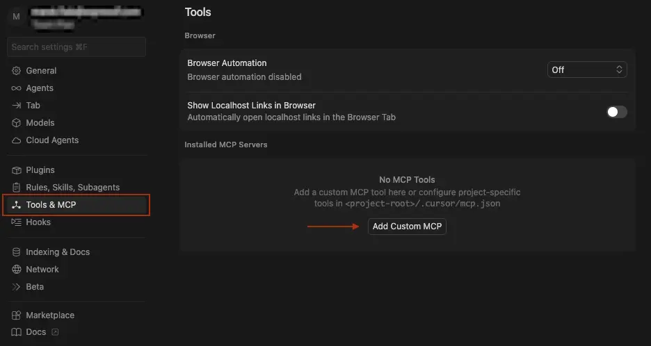
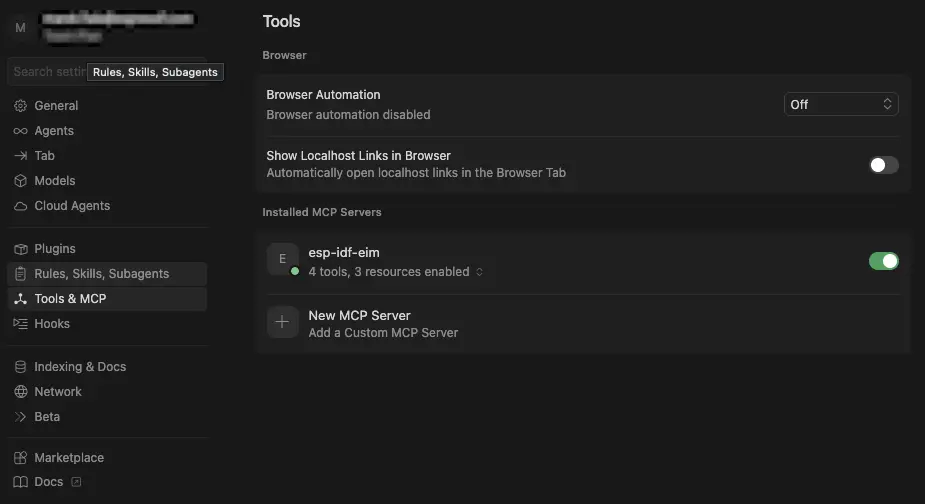
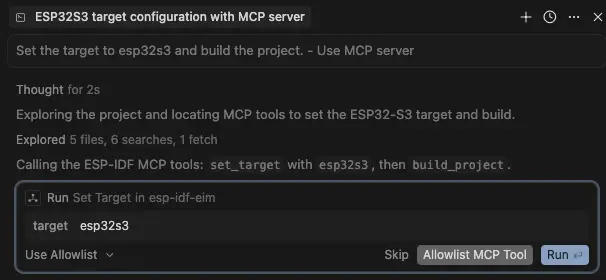
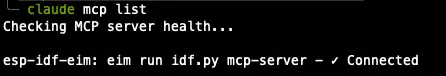
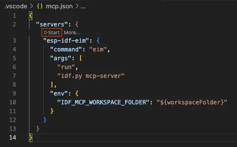
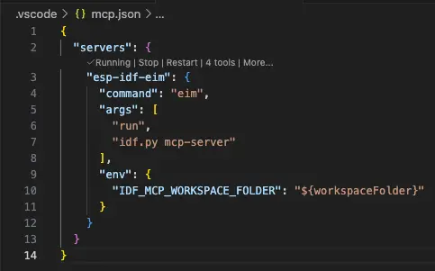
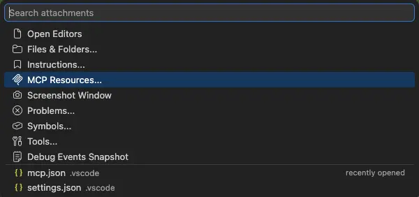
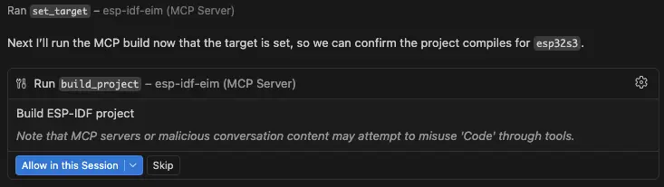

Espressif recently introduced the [Documentation MCP server](../doc-mcp-server/), a remote service that gives AI agents access to official Espressif documentation directly inside your editor. It helps with code generation, reviews, troubleshooting, and migration -- all grounded in real, up-to-date docs.

But documentation lookup is only half the story. Once the AI knows what to do, it still cannot do it: setting the target, building the firmware, flashing it to a device, or checking the project state all remain manual steps.

The **ESP-IDF Tools local MCP server** closes that gap. It is a stdio-based [MCP](https://modelcontextprotocol.io/docs/getting-started/intro) server built into `idf.py` that exposes project actions and state to any MCP-capable AI client. Instead of copying commands from a chat window into a terminal, you can tell the assistant to set the target to ESP32-C6, build the project, list connected devices, and flash -- and it will execute each step directly.

Together, the two servers form a complete AI-assisted workflow: the Documentation server provides knowledge, and the Tools server provides actions.

| | Documentation MCP Server | Tools local MCP Server |
|:--|:--|:--|
| Transport | Remote (HTTP/SSE) | Local (stdio) |
| What it does | Retrieves Espressif documentation | Executes project actions (build, flash, etc.) |
| Requires ESP-IDF installed | No | Yes (v6.0+, via EIM) |
| Authentication | GitHub / WeChat login | None (runs locally) |

## Available Tools and Resources

The Tools MCP server exposes tools (actions the AI can execute) and resources (read-only project data).

**Tools:**

| Tool | Description |
|------|-------------|
| `set_target(target)` | Set the chip target (esp32, esp32s3, esp32c6, etc.) |
| `build_project()` | Build the ESP-IDF project |
| `flash_project(port)` | Flash the built firmware to a connected device |
| `clean_project()` | Remove build artifacts |

**Resources:**

| Resource | Description |
|----------|-------------|
| `project://config` | Current project configuration and build directory details |
| `project://status` | Build status, current target, IDF version, and build artifact presence |
| `project://devices` | List of connected serial ports |

The listed tools map directly to familiar `idf.py` subcommands, so the AI is effectively running the same operations you would run manually. The resources give the AI enough context to answer questions like "has this project been built?" or "which serial ports are available?" without requiring you to check yourself.

## Preparing the Environment

Before you begin, make sure your environment meets the following requirements:

- Obtain the [EIM installer](https://docs.espressif.com/projects/idf-im-ui/en/latest/) v0.8.1 or newer
- Using EIM, install ESP-IDF v6.0 or newer
  - During ESP-IDF installation, enable the `mcp` feature -- see [EIM CLI Configuration - Global Features](https://docs.espressif.com/projects/idf-im-ui/en/latest/cli_configuration.html#global-features-all-versions) for how to enable specific features
- An MCP-capable AI client such as [Cursor IDE](https://www.cursor.com/) or [Claude Code](https://docs.anthropic.com/en/docs/agents-and-tools/claude-code/overview)

## Starting the Server

The Tools MCP server is a **local stdio server**. MCP defines two transport types: HTTP-based servers run remotely and the AI client connects to them over the network, while stdio-based servers run as local processes on your machine and communicate with the AI client through standard input/output (stdin/stdout). The Tools MCP server uses the stdio transport -- the AI client spawns it as a subprocess and exchanges messages with it directly, with no remote service or authentication involved.

There are two ways to start the server, depending on your environment:

**Option 1: Using `eim run` (recommended)**

```bash
eim run "idf.py mcp-server"
```

EIM spawns a new process with the ESP-IDF environment already activated. This is the best option for AI clients that do not inherit your shell environment, such as Cursor IDE.

**Option 2: Using `idf.py` directly**

```bash
idf.py mcp-server
```

Run this from a shell where the ESP-IDF environment is already activated (e.g., after running `. ./export.sh`). If you are not inside the project directory, point to it explicitly:

```bash
idf.py -C /path/to/your/project mcp-server
```

> **Note:** In both cases, the server must be started from (or pointed at) a valid ESP-IDF project directory.

## Setting Up the Tools MCP Server

Configuring the Tools MCP server follows the same pattern as any other MCP integration: register the server in your AI client, open your ESP-IDF project, and start using the assistant. The examples below cover Cursor IDE and Claude Code, but the same approach applies to any MCP-capable AI client -- consult your client's documentation on how to register a local stdio MCP server.


      {}

1. Open Cursor on your PC and open your ESP-IDF project.

2. Open Cursor Settings and navigate to the **Tools & MCP** tab. Click the **"Add custom MCP server"** button.

   

3. Add the following to your `.cursor/mcp.json` file:

    ```json
    {
      "mcpServers": {
        "esp-idf-eim": {
          "command": "eim",
          "args": [
            "run",
            "idf.py mcp-server"
          ],
          "env": {
            "IDF_MCP_WORKSPACE_FOLDER": "${workspaceFolder}"
          }
        }
      }
    }
    ```

    _The `IDF_MCP_WORKSPACE_FOLDER` variable tells the server which folder is your ESP-IDF project. This is necessary because Cursor's AI process does not inherit your shell environment, so the server cannot discover the project directory on its own._

4. Back in **Settings > Tools & MCP**, look for the `esp-idf-eim` entry. It should show a green status indicator once the server starts successfully. If the server shows an error, see the [Troubleshooting](#troubleshooting) section below.

   

5. Open the AI chat (Agent mode) and try a prompt:

    ```text
    Set the target to esp32s3 and build the project.
    ```

    > **Note:** Some AI agents may not use the MCP server automatically. If that happens, mention the server explicitly in your prompt, for example: "Set the target to esp32s3 and build the project. - Use MCP server."

    The assistant tries to call `set_target` and `build_project` through the MCP server and ask you for permissions. 

   

    A typical response of succesfull execution may look like this:

    ```text
    Here is what ran via the ESP-IDF MCP server:

    set_target — target: esp32s3
    Result: Target set to: esp32s3

    build_project — no extra arguments
    Result: Successfully built project

    The project is configured for ESP32-S3 and the build completed successfully
    through MCP. If you want a follow-up (e.g. flash_project or project://status),
    say what you need next.
    ```

      {}

      {}

1. Register the server using the Claude CLI:

    ```bash
    claude mcp add --transport stdio esp-idf-eim -- eim run "idf.py mcp-server"
    ```

    You can verify the connection by running `claude mcp list`:

      

2. Navigate to your ESP-IDF project directory and start Claude Code:

    ```bash
    claude
    ```

3. Try a prompt:

    ```text
    Show me the project status and list connected serial devices.
    ```

    > **Note:** Some AI agents may not use the MCP server automatically. If that happens, mention the server explicitly in your prompt, for example: "Show me the project status and list connected serial devices. Use the MCP server."

    The assistant reads `project://status` and `project://devices` through the MCP server. A typical response looks like this:

    ```text
    ESP-IDF Project: hello_world
    - Target: esp32s3
    - IDF Version: v6.0
    - Project Path: /home/user/esp/projects/hello_world
    - Build Directory: /home/user/esp/projects/hello_world/build

    Build Artifacts:
    - ✓ Bootloader: Built
    - ✓ Partition table: Built
    - ✗ Application flash: Not built
    - ✓ Flash arguments: Generated

    Connected Serial Devices

    Available ports:
    - /dev/cu.debug-console
    - /dev/cu.Bluetooth-Incoming-Port (Bluetooth)

    Note: No ESP32 serial devices are currently connected. The available
    ports are system console and Bluetooth devices. To flash the project,
    you'll need to connect an ESP32-S3 device via USB.
    ```

      {}

      {}

> **Note:** VS Code supports both global (user-level) and local (project-level) MCP server configuration. For this setup, use the **local** option — VS Code cannot reliably resolve `${workspaceFolder}` in global MCP configuration. This means the `.vscode/mcp.json` file must be created in **each ESP-IDF project** you want to use with the MCP server, unlike Cursor or Claude Code where a single global registration covers all projects.

1. Open your ESP-IDF project in VS Code (**File > Open Folder...**).

2. In the project root, create `.vscode/mcp.json`.

3. Add the following configuration:

    ```json
    {
      "servers": {
        "esp-idf-eim": {
          "command": "eim",
          "args": [
            "run",
            "idf.py mcp-server"
          ],
          "env": {
            "IDF_MCP_WORKSPACE_FOLDER": "${workspaceFolder}"
          }
        }
      }
    }
    ```

    _The `IDF_MCP_WORKSPACE_FOLDER` variable tells the server which folder is your ESP-IDF project. This is necessary because VS Code's AI process does not inherit your shell environment, so the server cannot discover the project directory on its own._

4. A **Start** button should appear after a moment. Click it to start the MCP server.

   

5. Verify that the server is running — it should show a ✓ next to the server name.

   

   > **Note:** By default, VS Code's AI chat exposes only the MCP **tools** (actions such as build and flash). MCP **resources** (`project://status`, `project://config`, `project://devices`) are not attached automatically. To include a resource in a conversation, click the **+** button in the chat input, select **MCP Resources...** from the context menu, and pick the resource you want.

   

6. Open the AI chat and try a prompt:

    ```text
    Set the target to esp32s3 and build the project.
    ```

    > **Note:** Some AI agents may not use the MCP server automatically. If that happens, mention the server explicitly in your prompt, for example: "Set the target to esp32s3 and build the project. Use the MCP server."

    The assistant calls `set_target("esp32s3")` and `build_project()` through the MCP server. VS Code will ask for your confirmation before executing each tool call.

   

    After you confirm, a typical response looks like this:

    ```text
    Target was set to esp32s3 via MCP, and the project build completed successfully via MCP as well.
    ```

      {}



If you also use the [Documentation MCP server](../doc-mcp-server/), you can register both servers in the same configuration. For example, in Cursor's `.cursor/mcp.json`:

```json
{
  "mcpServers": {
    "esp-idf-eim": {
      "command": "eim",
      "args": [
        "run",
        "idf.py mcp-server"
      ],
      "env": {
        "IDF_MCP_WORKSPACE_FOLDER": "${workspaceFolder}"
      }
    },
    "espressif-docs": {
      "url": "https://mcp.espressif.com/docs"
    }
  }
}
```

## Example Workflow

Here is a realistic multi-step session showing how the Tools MCP server works in practice:

**Step 1 -- Configure and build**

```text
Set the target to esp32c6 and build the project.
```

The assistant calls `set_target("esp32c6")` followed by `build_project()`. Build progress and the final result (success or error output) are reported back.

**Step 2 -- Check devices and flash**

```text
Show me connected devices and flash the firmware.
```

The assistant reads `project://devices` to discover available serial ports, then calls `flash_project(port)` with the appropriate port.

**Step 3 -- Verify the result**

```text
What is the current build status?
```

The assistant reads `project://status` and `project://config` to report the target chip, IDF version, project path, and which build artifacts are present.

**Step 4 -- Clean up**

```text
Clean the build artifacts.
```

The assistant calls `clean_project()` to remove the build directory contents.

Each of these steps runs through a controlled interface that reflects the actual state of your project. The assistant does not guess or simulate -- it executes real `idf.py` commands and returns real output.

## Using Both MCP Servers Together

The Documentation and Tools MCP servers are designed to complement each other. The Documentation server gives the AI access to datasheets, API references, migration guides, and hardware design guidelines. The Tools server lets it act on that knowledge by building, flashing, and managing your project.

When both servers are configured, the AI can handle end-to-end tasks that span documentation lookup and project actions. For example:

```text
Check the ESP-IDF documentation for the recommended I2C pins on ESP32-C3,
update the pin configuration in my project, and build it.
```

In this scenario, the assistant queries the Documentation MCP server for the hardware reference, updates the source code, then uses the Tools MCP server to build the project and verify the result.

For setup instructions for the Documentation MCP server, see the [companion article](../doc-mcp-server/).

## Troubleshooting

**"MCP dependencies not available"**

The `mcp` feature is not installed in your ESP-IDF environment. Re-run the EIM installer and make sure to enable the `mcp` feature. See the [EIM documentation](https://docs.espressif.com/projects/idf-im-ui/en/latest/cli_configuration.html#global-features-all-versions) for details.

**"Open the MCP server in a valid ESP-IDF project directory"**

The server could not find a valid ESP-IDF project. Make sure you are either running the server from inside a project directory, or that `IDF_MCP_WORKSPACE_FOLDER` points to one. A valid project directory contains a `CMakeLists.txt` that includes the ESP-IDF project CMake file.

**Server not appearing in Cursor**

Verify that `eim` is on your system `PATH` by running `eim --version` in a terminal. If Cursor cannot find `eim`, the server will fail to start silently. Also confirm the `.cursor/mcp.json` file exists and contains valid JSON.

## Conclusion

The ESP-IDF Tools local MCP server gives AI assistants a direct, structured way to interact with your ESP-IDF projects. The core benefit is straightforward: the assistant can execute real project actions -- set target, build, flash, clean, and query status -- not just describe them.

Combined with the [Documentation MCP server](../doc-mcp-server/), it forms a complete AI-assisted development loop: look up the right API or configuration, apply changes to the code, build, and flash -- all from a single conversation.

If you already use an MCP-capable AI client, this feature is an easy way to make AI assistance more practical in everyday ESP-IDF work. Start by adding the MCP server to your AI client configuration, connect it to your project, and use natural language to drive the familiar `set_target` -> `build` -> `flash` workflow.
