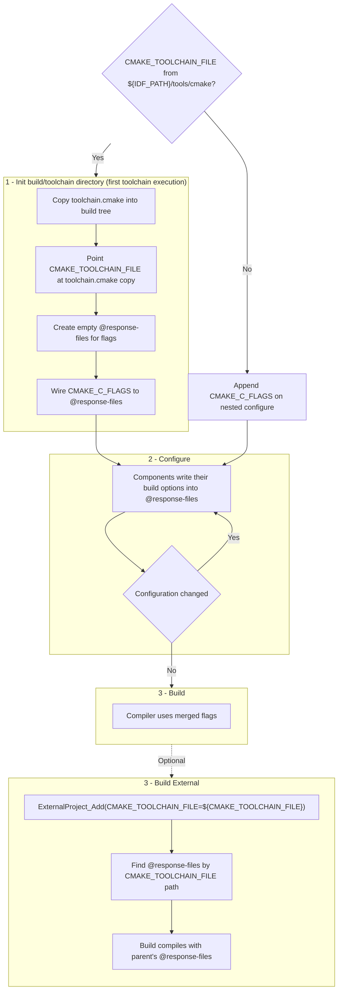

## Prologue

Most ESP-IDF developers never need this article: for typical projects the platform already resolves compiler flags, and you can keep using ESP-IDF as usual. This article is meant for software developers who enjoy tricky problem-solving.

## Overview

In ESP-IDF, part of the compiler configuration is affected by Kconfig and by components that inject additional flags during configuration. Examples include options such as `--specs=picolibc.specs` or `-mdisable-hardware-atomics`.

> **Note:** Flags of this kind must be applied consistently to every compiled translation unit in the project. If only some sources are built with them, you can get compile failures, link errors, or subtle runtime faults because the ABI, standard library contract, or code generation assumptions no longer match across object files.

The sections below explain how that setup behaves in the main ESP-IDF build, and how required compiler flags propagate into external CMake projects.

## What leads to the problem

There are a few constraints to keep in mind:

- Kconfig is integrated with CMake, so the final set of compiler options is not always known at the start of CMake configuration.
- Individual components can register their own compiler options based on Kconfig settings.
- [ExternalProject_Add()](https://cmake.org/cmake/help/latest/module/ExternalProject.html#command:externalproject_add) runs in an isolated CMake environment, so those compiler options must be passed explicitly.

That leads to several practical issues:

- External projects do not inherit build settings from the parent project automatically.
- Updating [CMAKE_LANG_FLAGS](https://cmake.org/cmake/help/latest/variable/CMAKE_LANG_FLAGS.html) after [project()](https://cmake.org/cmake/help/latest/command/project.html) is too late.
- External projects usually do not know anything about ESP-IDF-specific Kconfig options.
- If a project ignores Kconfig settings, it may build incorrectly after an ESP-IDF update or configuration change.

## Implemented Approach

The goal is to keep a set of flags mutable during CMake configuration without changing the visible compiler command line every time those flags change.

The practical way to do this is to use [response-files](https://gcc.gnu.org/wiki/Response_Files). A response-file lets the compiler read additional options from a file, for example through an argument such as `@flags`.

This is useful here because it gives you two properties:

- The response-file can be updated during CMake configuration.
- The compile command line stays stable because it still only refers to `@flags`.

At first glance, it may seem enough to place the response-files under `CMAKE_BINARY_DIR` and reference them from `CMAKE_<LANG>_FLAGS`. That is not enough for external projects, because each nested build gets its own `CMAKE_BINARY_DIR`.

The workaround is to tie the response-files to `CMAKE_TOOLCHAIN_FILE` instead. External projects already need the toolchain file so that CMake knows which compiler to use, which makes it a reliable anchor point.

In this approach, the toolchain file does the following on its first execution:

- Copies itself into the current `CMAKE_BINARY_DIR`.
- Updates `CMAKE_TOOLCHAIN_FILE` to point to that copied file.
- Creates or locates the response-files near the copied toolchain file.
- Connects `CMAKE_<LANG>_FLAGS` to those response-files.

This works for the common `ExternalProject_Add()` pattern where the nested configure step passes:

```cmake
-DCMAKE_TOOLCHAIN_FILE=${CMAKE_TOOLCHAIN_FILE}
```

That pattern is already widely used to avoid hardcoding the original toolchain path, so the response-file setup travels with it.

## Configuration Flow

The overall flow looks like this:




## Thin ice: relying on CMake internals

Some projects use variables such as `CMAKE_C_IMPLICIT_LINK_DIRECTORIES`, which are initialized very early in CMake processing. At that point, the response-files may not yet contain the final flags, so CMake can derive incomplete or incorrect paths.

One example is [esp_gcov](https://github.com/espressif/idf-extra-components/blob/78b69f3b7d167d0c08124dcf3887a5db62967913/esp_gcov/CMakeLists.txt#L21).

To work around this, the implementation calls [cmake_determine_compiler_abi()](https://github.com/Kitware/CMake/blob/805a40b668a5bef4593ba2dcb51806f7dd35a04a/Modules/CMakeDetermineCompilerABI.cmake#L15) after each update to the response-files. This function is not part of CMake's documented public API. CMake itself marks it as internal:

```C
# This is used internally by CMake and should not be included by user
```


In practice, `cmake_determine_compiler_abi()` appears stable and behaves consistently across CMake 3.x and 4.x. Still, this is the main trade-off of the approach: it relies on internal CMake behavior to keep early compiler checks aligned with the generated response-files.


## Conclusion

You do not need to figure out which ESP-IDF compiler flags from the parent project must be passed into `ExternalProject_Add()`. Passing `-DCMAKE_TOOLCHAIN_FILE=${CMAKE_TOOLCHAIN_FILE}` is enough to keep the nested build aligned.

This still relies on CMake internals, so a future CMake release may eventually give ESP-IDF maintainers another problem-solving exercise.

## Code reference

- [toolchain.cmake](https://github.com/espressif/esp-idf/blob/508ba7ae0430e4dd0be876384d8eea699c27da3b/tools/cmake/toolchain.cmake) - main logic
- [toolchain_flags.cmake](https://github.com/espressif/esp-idf/blob/508ba7ae0430e4dd0be876384d8eea699c27da3b/tools/cmake/toolchain_flags.cmake) - @response-files manipulation logic
- [CMakeLists.txt](https://github.com/espressif/esp-idf/blob/508ba7ae0430e4dd0be876384d8eea699c27da3b/CMakeLists.txt#L82-L89) - usage example