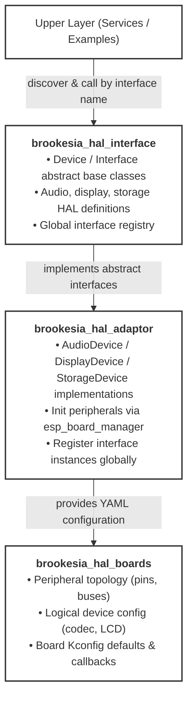
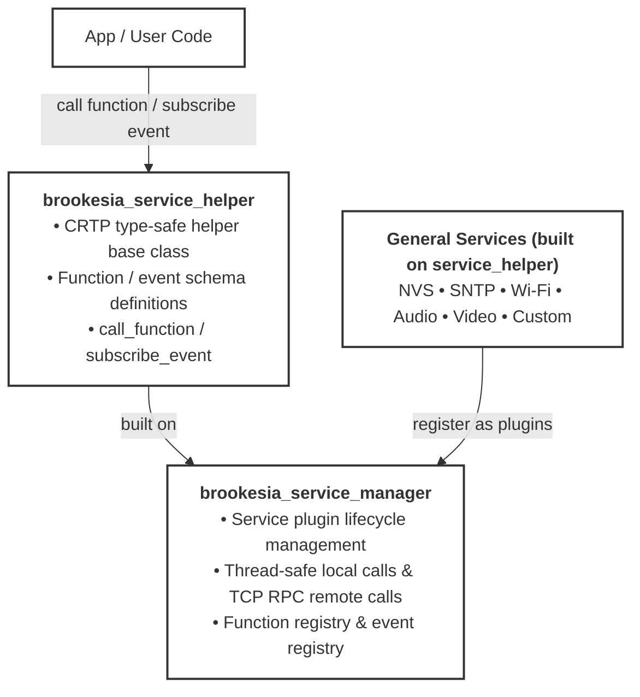
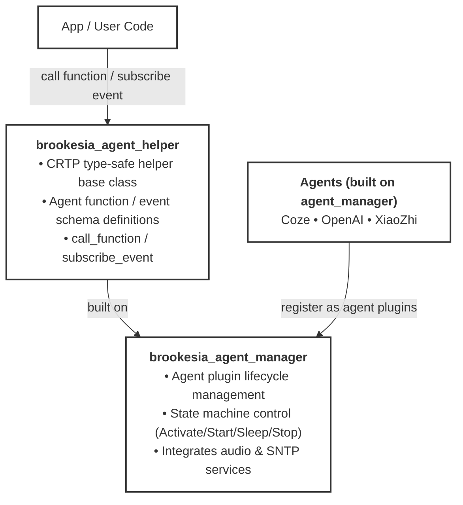

## Why ESP-Brookesia Needed a New Architecture

ESP-Brookesia targets AIoT devices with rich human-machine interaction requirements. In practice, this means the framework must handle hardware differences, provide system-level capabilities such as Wi-Fi, audio, video, and storage, and connect those capabilities to AI agents in a consistent way.

As the project grew, it became increasingly important to define clearer boundaries between these responsibilities. The v0.7 redesign reorganizes the framework into a layered architecture with well-defined extension points. The result is a structure that is easier to port, easier to scale, and easier to reuse across different AI interaction products.

## Architecture Overview

ESP-Brookesia v0.7 is built on top of `ESP-IDF` and distributed through the `ESP Component Registry`. From low-level dependencies to application-facing AI features, the new architecture forms a complete stack for AIoT product development.



At a high level, the architecture can be understood as three tiers:

- **Environment and dependency**: `ESP-IDF` provides the toolchain, runtime, and driver foundation, while the `ESP Component Registry` handles component packaging and dependency management.
- **Service and framework**: Utils, HAL, General Service, AI Agent, and AI Expression are the core modules that make up the framework itself.
- **Application layer**: Product applications and reference projects are built on top of these reusable modules.

This redesign brings several practical improvements:

- **Clearer separation of concerns**: utility code, hardware abstraction, system services, and AI logic are no longer mixed together.
- **Easier board bring-up**: HAL interfaces and board-level configuration make it simpler to support multiple hardware targets.
- **Better reuse**: services are uniformly exposed as functions and events, which makes them reusable across local calls, remote RPC, and MCP tools.
- **Stronger AI integration**: agents are now connected to system services and device capabilities through a cleaner and more extensible model.

## Core Modules of the Framework

The following sections walk through each core module of the ESP-Brookesia framework. While each module has a distinct responsibility, together they also form an internal dependency chain: Utils and HAL provide the foundation, General Service builds on top of them, and AI Agent and AI Expression sit at the top of the stack.

### Utils

The `Utils` module provides the foundation used by the rest of the framework. Rather than solving a single product feature, it collects the common building blocks that repeatedly appear in embedded application development.

The main components in this module include:

- [brookesia_lib_utils](https://components.espressif.com/components/espressif/brookesia_lib_utils): a general-purpose utility library with plugins, state machines, task scheduling, thread configuration, and runtime profiling
- [brookesia_mcp_utils](https://components.espressif.com/components/espressif/brookesia_mcp_utils): MCP utilities that expose service functions as MCP tools

### HAL

The `HAL` module addresses a core problem in embedded development: how to keep higher-level modules independent from specific development boards. In ESP-Brookesia v0.7, HAL is split into three cooperating parts:

- [brookesia_hal_interface](https://components.espressif.com/components/espressif/brookesia_hal_interface): defines standardized hardware interfaces such as audio, display, touch, and storage
- [brookesia_hal_adaptor](https://components.espressif.com/components/espressif/brookesia_hal_adaptor): implements those interfaces and performs board-specific initialization
- [brookesia_hal_boards](https://components.espressif.com/components/espressif/brookesia_hal_boards): describes board topology, pins, and driver parameters through YAML configuration

This structure keeps services and applications dependent only on abstract interfaces, while board-specific differences are handled through adaptors and configuration. For products that need to support multiple hardware platforms, this significantly reduces porting effort.

### General Service

The `General Service` module is the unified runtime surface for reusable system capabilities. The service framework uses a `Manager + Helper` model:

- [brookesia_service_manager](https://components.espressif.com/components/espressif/brookesia_service_manager): manages service plugin lifecycle, function registration, event dispatching, local calls, and remote RPC
- [brookesia_service_helper](https://components.espressif.com/components/espressif/brookesia_service_helper): provides type-safe function calls and event subscriptions for application-side use

On top of this framework, ESP-Brookesia provides a set of ready-to-use services:

- [Wi-Fi](https://components.espressif.com/components/espressif/brookesia_service_wifi): connection management, scanning, and SoftAP provisioning
- [Audio](https://components.espressif.com/components/espressif/brookesia_service_audio): audio capture, playback, and related processing
- [Video](https://components.espressif.com/components/espressif/brookesia_service_video): video codec and display-related capabilities
- [NVS](https://components.espressif.com/components/espressif/brookesia_service_nvs): non-volatile storage
- [SNTP](https://components.espressif.com/components/espressif/brookesia_service_sntp): network time synchronization
- [Custom](https://components.espressif.com/components/espressif/brookesia_service_custom): a lightweight extension mechanism for custom services

This service model is particularly useful for AIoT products for two reasons:

- All service capabilities are expressed uniformly as functions and events, which makes integration and debugging far more consistent.
- The same services can be used both locally and through TCP/JSON-based remote RPC, making them suitable for device-internal logic and cross-device scenarios.

For implementation details, see the [Service application development guide](https://docs.espressif.com/projects/esp-brookesia/en/latest/service/usage.html).

### AI Agent

The `AI Agent` module provides a unified management model for integrating multiple AI backends. Instead of focusing on a single provider, it is designed around multi-agent integration, switching, and lifecycle management.

In the current implementation:

- [brookesia_agent_manager](https://components.espressif.com/components/espressif/brookesia_agent_manager): handles agent plugin registration, state-machine-based lifecycle control, activation, startup, sleep, wake-up, and shutdown
- [brookesia_agent_helper](https://components.espressif.com/components/espressif/brookesia_agent_helper): provides type-safe helper APIs for function and event interaction
- Supported agent implementations currently include [Coze](https://components.espressif.com/components/espressif/brookesia_agent_coze), [OpenAI](https://components.espressif.com/components/espressif/brookesia_agent_openai), and [Xiaozhi](https://components.espressif.com/components/espressif/brookesia_agent_xiaozhi)

The key architectural shift here is that AI becomes a system-level capability rather than an isolated feature. Agents can integrate with foundational services such as audio and time synchronization, and they can also access device capabilities through `Function Calling / MCP`.

That gives LLM-based applications a direct path from user interaction to device-side service execution.

### AI Expression

If AI Agent defines how a device thinks and acts, `AI Expression` defines how that device is perceived by the user.

The current implementation is built primarily around [brookesia_expression_emote](https://components.espressif.com/components/espressif/brookesia_expression_emote), which provides:

- emoji and animation asset management
- expression switching and animation playback control
- QR code display and hiding
- visual presentation of event messages

This module is especially valuable for voice assistants, companion devices, desktop robots, and screen-based HMI products. It allows devices not only to respond, but also to visually express state and intent.

## Two Examples That Show the Architecture in Practice

To make the framework easier to explore, ESP-Brookesia ships with several examples that exercise different modules of the framework. The following two are especially useful as entry points.

### `examples/service/console`

`examples/service/console` is an interactive CLI example for the service framework. It runs over a serial console, supports command history, and is ideal for quickly validating whether service capabilities are registered and behaving correctly during early integration.

This example helps illustrate several important properties of the new service architecture:

- list registered services, functions, and events from the command line
- invoke service functions directly
- subscribe to and unsubscribe from service events
- start the RPC server and perform remote calls
- inspect runtime information such as memory and thread profiling data

If you want to validate Wi-Fi, audio, NVS, or custom service integration before building a full UI, this example is one of the fastest ways to do it. It effectively acts as a practical debug entry point for the General Service module.

- [Source: `examples/service/console`](https://github.com/espressif/esp-brookesia/tree/master/examples/service/console)

### `examples/agent/chatbot`

While the console example focuses on framework validation, `examples/agent/chatbot` is much closer to a complete product reference. It combines HAL, services, agents, and expression capabilities into a full AI voice interaction device.

The example demonstrates several representative features:

- wake word detection and voice conversation
- support for multiple AI agents with runtime switching
- expression animations driven by AI state
- gesture-based navigation between expression and settings screens
- direct hardware control through MCP tools

The last point is particularly important. In this example, the agent does not just talk to the user. It can also invoke device capabilities through MCP, such as changing screen brightness, adjusting volume, or muting audio. This is a good illustration of the architecture's core value: a clean path from LLM reasoning to agent orchestration, service invocation, and hardware control.

- [Source: `examples/agent/chatbot`](https://github.com/espressif/esp-brookesia/tree/master/examples/agent/chatbot)

## Why This Matters for Product Development

With the v0.7 redesign, ESP-Brookesia becomes more than a collection of reusable components. It becomes a structured engineering framework for building AIoT interaction products.

For platform developers, the HAL module isolates board differences. For application developers, the General Service module exposes device capabilities through a consistent interface. For AI application developers, Function Calling and MCP create a direct connection between LLMs and device-side functionality.

Together, these modules form an end-to-end development path from hardware abstraction to services, AI orchestration, and expressive user interaction.

If you want to explore the framework further, the following resources are a good starting point:

- [ESP-Brookesia GitHub repository](https://github.com/espressif/esp-brookesia)
- [ESP-Brookesia Programming Guide](https://docs.espressif.com/projects/esp-brookesia/en)

We hope this new architecture makes it easier to extend ESP-Brookesia with new services, agents, and application patterns, and we look forward to feedback from developers building on it.
