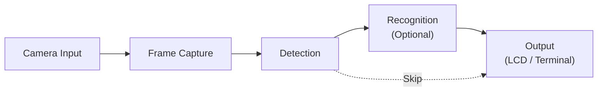
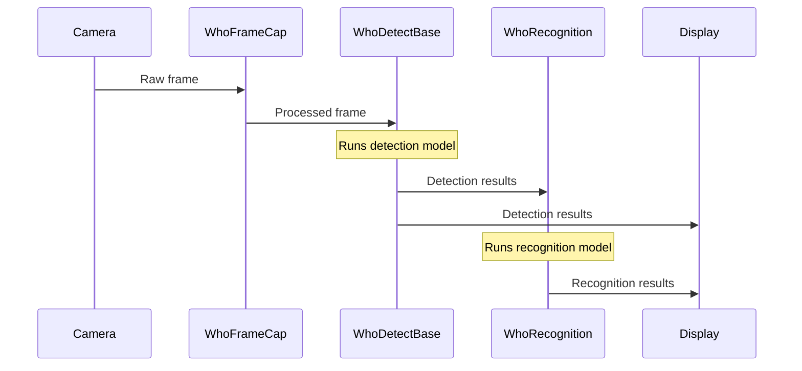
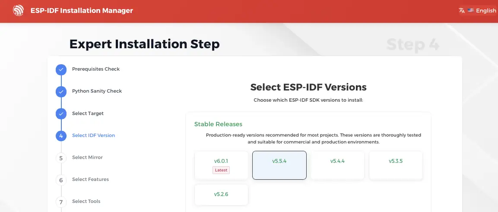
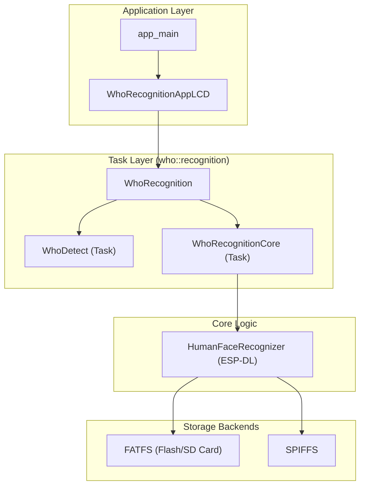

## Introduction

ESP-WHO is an image processing development platform built on Espressif chips. It provides a practical framework for developing computer vision applications, including human face detection, face recognition, pedestrian detection, and QR code recognition.

ESP-WHO enables developers to run image processing workloads directly on Espressif SoCs. The platform builds on the [ESP-DL library](https://github.com/espressif/esp-dl) or optimized deep learning inference and integrates with common peripherals such as cameras, displays, and storage. The current version targets the ESP32-S3 and the newer ESP32-P4 chips.

The framework uses a task-based architecture built on FreeRTOS. The base classes `WhoTaskBase` and `WhoTask` define a consistent lifecycle for asynchronous operations across the framework.

### Component Hierarchy

ESP-WHO organizes functionality into components. The frame capture pipeline lives in `who_frame_cap`, where `WhoFrameCapNode` serves as the base class for processing stages. Nodes connect through queues and event bits to form an asynchronous pipeline.

For detection and recognition, `WhoDetect` consumes frames from a `WhoFrameCapNode` and runs an ESP-DL detection model (for example, face or pedestrian detection). `WhoRecognitionCore` extends detection by performing feature extraction and matching, and it manages an internal state machine for ENROLL, RECOGNIZE, and DELETE operations.

A typical workflow looks like this:



ESP-WHO follows a layered architecture with ESP-IDF at its foundation. It uses Board Support Packages (BSP) to abstract hardware differences, so the same application code can run on different targets such as the ESP32-S3-EYE or the ESP32-P4-Function-EV-Board. Applications select the right hardware drivers at compile time through configuration files like `sdkconfig.bsp.<board_name>`.

The examples currently support these evaluation boards:

- [ESP32-P4 Function EV Board](https://docs.espressif.com/projects/esp-dev-kits/en/latest/esp32p4/esp32-p4-function-ev-board/user_guide.html)
- [ESP32-S3-EYE](docs/en/get-started/ESP32-S3-EYE_Getting_Started_Guide.md)
- [ESP32-S3-Korvo-2](https://docs.espressif.com/projects/esp-adf/en/latest/design-guide/dev-boards/user-guide-esp32-s3-korvo-2.html)

In this tutorial, we use the ESP32-S3-EYE board. We start by compiling and running the face recognition example, then extend it to turn on an LED whenever a face is detected.


## Get started

In this section, we compile and run a face recognition example on the ESP32-S3-EYE board. This board includes both a camera and a display, so you can see detections in real time. A block diagram overview of its operation is shown below:





The example also includes facial feature management (saving and deleting) through button presses.

### Prerequisites

ESP-WHO currently targets ESP-IDF v5.5.x. Before you begin, make sure you have this version installed.

#### Install ESP-IDF v5.5.x

- Open EIM, or [install it](https://docs.espressif.com/projects/idf-im-ui/en/latest/) if you do not have it on your machine.
- Choose **Custom installation** (the Quick installation defaults to ESP-IDF v6).
- Select and install ESP-IDF v5.5.x (at the time of writing, 5.5.4).



- Finish the installation procedure



You can find a detailed guide in this [developer portal article](https://developer.espressif.com/blog/2026/03/esp-idf-installation-manager/).



#### Compile and run the example


1. Clone the `esp-who` repository:

   ```bash
   git clone https://github.com/espressif/esp-who.git
   ```


2. Open the `esp-who/examples/human-face-recognition` folder


To run `esp-who` you need to setup a couple of CMake flags. Here you can find the instructions for both VSCode and CLI.



{}

* Copy the following `settings.json` into your project's `.vscode` folder and update the paths so the ESP-IDF extension knows which board and toolchain to use:

   ```json
   {
     "idf.currentSetup": "<path-to-esp-idf>/v5.5.4/esp-idf",
     "idf.openOcdConfigs": [
       "board/esp32s3-builtin.cfg"
     ],
     "idf.customExtraVars": {
       "IDF_EXTRA_ACTIONS_PATH": "<path-to-esp-who>/esp-who/tools",
       "SDKCONFIG_DEFAULTS": "sdkconfig.bsp.esp32_s3_eye",
       "IDF_TARGET": "esp32s3"
     }
   }
   ```

* Run `> ESP-IDF: Open ESP-IDF Terminal`.
* In the ESP-IDF terminal, run `idf.py reconfigure`.
* Run `> ESP-IDF: Select Port to Use (COM, tty, usbserial)`.
* Run `> ESP-IDF: Build, Flash and Start a Monitor`.

{}
{}

* Open a terminal and find the activation script:

   ```terminal
   eim select
   ```

* Run the activation script (replace with the path from the previous step):

  ```bash
  source ~/.espressif/tools/activate_idf_v5.5.4.sh
  ```

* Verify that the `idf.py` tool is activated:

  ```bash
  idf.py --version
  ```

* Export the `IDF_EXTRA_ACTIONS_PATH`:

  ```bash
  export IDF_EXTRA_ACTIONS_PATH=<path-to-esp-who>/esp-who/tools/
  ```

* Configure the project for the ESP32-S3-EYE board:

  ```bash
  idf.py -DSDKCONFIG_DEFAULTS=sdkconfig.bsp.esp32_s3_eye set-target esp32s3
  ```

* Build the project:

  ```bash
  idf.py build
  ```

* Flash the project:

  ```bash
  idf.py -p <your-port> flash
  ```

* Start a monitor:

  ```bash
  idf.py -p <your-port> monitor
  ```
{}



During startup, you should see log messages showing the camera, buttons, and LVGL graphics stack initializing:

```terminal
I (1240) cam_hal: cam init ok
I (1254) camera: Camera PID=0x26 VER=0x42 MIDL=0x7f MIDH=0xa2
I (1254) camera: Detected OV2640 camera
I (1254) camera: Detected camera at address=0x30
[...]
I (1732) LVGL: Starting LVGL task
I (1853) S3-EYE: Setting LCD backlight: 100%
[...]
W (1966) dl::Model: Minimize() will delete variables not used in model inference, which will make it impossible to test or debug the model.
[...]
I (2053) button: IoT Button Version: 4.1.5
I (2057) gpio: GPIO[0]| InputEn: 1| OutputEn: 0| OpenDrain: 0| Pullup: 1| Pulldown: 0| Intr:0
I (2065) main_task: Returned from app_main()
```

If everything works, you should now see the camera output on the LCD screen. Point the camera at your face and you should see dots marking your facial features.




### Application Overview

This example follows the structure shown below.



`WhoRecognitionAppLCD` manages the camera frames, runs detection, stores recognition features on the SD card or flash, and renders the results on the display using LVGL.

In the next section, we extend the example to perform a custom action (logging a message and turning on an LED) whenever a face is detected.

## Adding actions on detection

The example we just ran uses the `WhoRecognitionAppLCD` class. This class handles camera frames, runs detection, draws bounding boxes around detected faces, and lets you enroll, recognize, or delete face features through the display.

In this section, we add an action on detection: we log the detection to the console and turn on an LED.

To add custom behavior on detection, we create a subclass of `WhoRecognitionAppLCD` and override the `detect_result_cb` callback.

The detection result arrives in the `result_t result` parameter. We can use its `det_res.empty()` method to check whether any face was found.

Here is the code, followed by a step-by-step explanation:
```c
class WhoRecognitionAppLCDWithCallback : public WhoRecognitionAppLCD {
public:
    WhoRecognitionAppLCDWithCallback(who::frame_cap::WhoFrameCap *frame_cap) : WhoRecognitionAppLCD(frame_cap)
    {
    }

protected:
    virtual void detect_result_cb(const who::detect::WhoDetect::result_t &result) override
    {
        // Log face detection to terminal
        if (!result.det_res.empty()) {
            ESP_LOGI("DETECTION", "Face detected!");
        }
        // Call parent implementation to keep LCD display working
        WhoRecognitionAppLCD::detect_result_cb(result);
    }
};
```

### Class declaration and inheritance

```cpp
class WhoRecognitionAppLCDWithCallback : public WhoRecognitionAppLCD {
```

We create a new class that inherits from `WhoRecognitionAppLCD`. Inheritance lets us keep all the existing behavior while adding our own.

### Public constructor

```cpp
public:
    WhoRecognitionAppLCDWithCallback(who::frame_cap::WhoFrameCap *frame_cap) : WhoRecognitionAppLCD(frame_cap)
    {
    }
```

- The initializer list `: WhoRecognitionAppLCD(frame_cap)` calls the parent constructor, which sets up the LCD, camera pipeline, and models.
- The empty body shows that we do not need any extra setup, since the parent already set everything up

### Protected virtual method override

```cpp
protected:
    virtual void detect_result_cb(const who::detect::WhoDetect::result_t &result) override
    {
```

- `protected:` keeps the method internal to the framework.
- `virtual` and `override` tell the compiler we are replacing the parent's implementation.
- The framework calls this method automatically whenever detection runs.

### Face detection check and logging

```cpp
if (!result.det_res.empty()) {
    ESP_LOGI("DETECTION", "Face detected!");
}
```

We check whether `det_res` contains any results. If it does, we print a message to the terminal.

### Call the parent implementation

```cpp
WhoRecognitionAppLCD::detect_result_cb(result);
```

We forward the result to the parent so the LCD still draws bounding boxes and updates the UI. Without this call, the display would stop working.


<details><summary>Complete code</summary>

```c
#include "frame_cap_pipeline.hpp"
#include "who_recognition_app_lcd.hpp"
#include "who_recognition_app_term.hpp"
#include "who_spiflash_fatfs.hpp"

using namespace who::frame_cap;
using namespace who::app;
using namespace who::detect;

// Custom app class to inject the face detection callback
class WhoRecognitionAppLCDWithCallback : public WhoRecognitionAppLCD {
public:
    WhoRecognitionAppLCDWithCallback(who::frame_cap::WhoFrameCap *frame_cap) : WhoRecognitionAppLCD(frame_cap)
    {
    }

protected:
    virtual void detect_result_cb(const who::detect::WhoDetect::result_t &result) override
    {
        // Log face detection to terminal and turn on LED
        if (!result.det_res.empty()) {
            ESP_LOGI("DETECTION", "Face detected!");
            bsp_led_set(BSP_LED_GREEN, true);
        } else {
            bsp_led_set(BSP_LED_GREEN, false);
        }
        // Call parent implementation to keep LCD display working
        WhoRecognitionAppLCD::detect_result_cb(result);
    }
};

extern "C" void app_main(void)
{
    vTaskPrioritySet(xTaskGetCurrentTaskHandle(), 5);
    ESP_ERROR_CHECK(fatfs_flash_mount());
    ESP_ERROR_CHECK(bsp_leds_init());
    ESP_ERROR_CHECK(bsp_led_set(BSP_LED_GREEN, false));

    auto frame_cap = get_dvp_frame_cap_pipeline();

    auto recognition_app = new WhoRecognitionAppLCDWithCallback(frame_cap);
    // try this if you don't have a lcd.
    //auto recognition_app = new WhoRecognitionAppTerm(frame_cap);
    recognition_app->run();
}
```

</details>


If you now build and flash this firmware, the green LED turns on whenever a face is detected and turns off when no face is present.



## Conclusion

In this article, we explored the ESP-WHO framework, compiled and ran a face recognition example on the ESP32-S3-EYE board, and learned how to extend the example with custom detection callbacks. We saw how ESP-WHO's layered architecture, built on ESP-IDF and ESP-DL, makes it straightforward to add application-specific logic while preserving the framework's display and recognition features.
