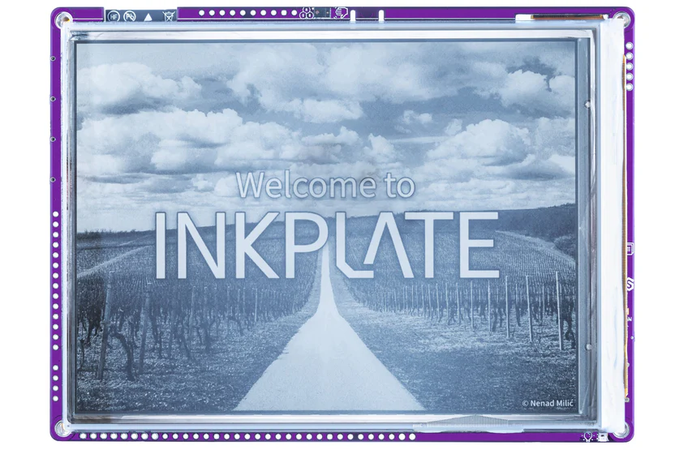

## What is Inkplate?

[Inkplate](https://soldered.com/inkplate/) is a line of e-paper development boards from [Soldered Electronics](https://soldered.com/), a hardware company from the EU. The idea is simple: take a genuine e-paper display, pair it with an ESP32, add a battery charger, RTC, microSD slot, and a Qwiic (formerly easyC) connector, and ship it as a single ready-to-use board. No soldering a display breakout to a dev board, no hunting down drivers. Just plug in USB-C and start writing code.

Most Inkplate displays use panels **recycled from decommissioned e-readers**. This keeps the price reasonable, reduces waste, and means the screen has already survived years of actual use before it ends up on your desk.

## Why ESP32?

E-paper holds an image indefinitely without consuming any power. That only pays off if the microcontroller behind it can also sleep aggressively, and ESP32 can.

With deep sleep currents down to 18-25 µA and Wi-Fi on demand, an Inkplate board can wake up, connect to the internet, pull fresh data, update the display, and go back to sleep. The whole cycle might take a few seconds, after which it draws essentially nothing until the next refresh. Depending on how often you update, a small Li-Ion battery can last weeks or months.

Ecosystem is the other side of it. ESP32 has solid Arduino IDE and MicroPython support, the Inkplate library is Adafruit GFX-compatible, and there's no shortage of community examples to reference. I²C, SPI, UART, and the onboard Qwiic (formerly easyC) connector handle most peripheral needs without much extra wiring.

## The Inkplate Lineup

Soldered currently offers eight models:

| Model | Screen | Resolution | Highlights |
|---|---|---|---|
| **Inkplate 2** | 2.13″ | 202×104 | Tri-color (B/W/Red), tiny form factor |
| **Inkplate 4TEMPERA** | 3.8″ | 600×600 | Touchscreen, frontlight, 0.18 s fast refresh |
| **Inkplate 5V2** | 5.2″ | 1280×720 | High resolution, 0.26 s fast refresh |
| **Inkplate 6** | 6.0″ | 800×600 | Classic workhorse, 8 grayscale levels |
| **Inkplate 6FLICK** | 6.0″ | 1024×758 | Multi-touch, 64-step frontlight, 0.23 s fast refresh |
| **Inkplate 6COLOR** | 5.8″ | 600×448 | 7-color e-paper (B/W/Red/Yellow/Green/Blue/Orange) |
| **Inkplate 10** | 9.7″ | 1200×825 | Largest display, great for dashboards |
| **Inkplate 6MOTION** | 6.0″ | 1024×758 | 16 grayscale levels, 91 ms partial refresh (up to 11 FPS) |

All of them share the same base: open-source hardware and software, USB-C, Li-Ion charging, RTC (PCF85063A), Qwiic (formerly easyC) connector, designed and made in the EU.

### Inkplate 6MOTION: A Special Case



The 6MOTION is a different beast. Instead of running everything on a single ESP32, it uses a **dual-processor architecture**: an STM32H743 handles the display and peripherals at full speed, with an **ESP32-C3 as the Wi-Fi and Bluetooth co-processor**. The result is a **91 ms partial refresh**, which works out to roughly 11 FPS. That's fast enough for animations and interactive interfaces, which isn't something you typically associate with e-paper.

It also packs more hardware than the rest of the lineup: LSM6DSO32 accelerometer and gyroscope, APDS-9960 gesture and proximity sensor, SHTC3 temperature and humidity sensor, a rotary encoder with backlit indicator, two WS2812B RGB LEDs, three side push buttons, and 30+ GPIO pins.

## Getting Started

All Inkplate models work with the [Inkplate Arduino Library](https://github.com/SolderedElectronics/Inkplate-Arduino-library), which handles the e-paper driver and wraps everything in an Adafruit GFX-compatible API.

### 1. Install the board definition

In Arduino IDE, add the following URL to *File → Preferences → Additional Boards Manager URLs*:

```
https://github.com/SolderedElectronics/Dasduino-Board-Definitions-for-Arduino-IDE/raw/master/package_Dasduino_Boards_index.json
```

Then open *Tools → Board → Boards Manager*, search for **Inkplate Boards**, and install.

### 2. Hello World

```cpp
#include "Inkplate.h"

Inkplate display(INKPLATE_1BIT);

void setup() {
    display.begin();
    display.clearDisplay();
    display.setCursor(100, 100);
    display.setTextSize(5);
    display.print("Hello, World!");
    display.display();
}

void loop() {}
```

### 3. Fetching live data over Wi-Fi

Since Wi-Fi is built in, pulling live data doesn't require any extra hardware. This example grabs a one-line weather summary from wttr.in, shows it on the display, and goes to deep sleep for 30 minutes before repeating:

```cpp
#include "Inkplate.h"
#include <WiFi.h>
#include <HTTPClient.h>

Inkplate display(INKPLATE_1BIT);

void setup() {
    display.begin();
    WiFi.begin("your-ssid", "your-password");
    while (WiFi.status() != WL_CONNECTED) delay(500);

    HTTPClient http;
    http.begin("http://wttr.in/?format=3");
    if (http.GET() == HTTP_CODE_OK) {
        display.clearDisplay();
        display.setCursor(10, 10);
        display.setTextSize(3);
        display.print(http.getString());
        display.display();
    }
    http.end();

    // Deep sleep for 30 minutes, then wake up and refresh
    esp_sleep_enable_timer_wakeup(30ULL * 60 * 1000000);
    esp_deep_sleep_start();
}

void loop() {}
```

## MicroPython Support

Most Inkplate models also run MicroPython through the [Inkplate MicroPython library](https://github.com/SolderedElectronics/Inkplate-micropython). Flash the provided firmware and the display works the same way:

```python
from inkplate6 import Inkplate

display = Inkplate()
display.begin()
display.clearDisplay()
display.printText(10, 10, "Hello from MicroPython!")
display.display()
```

## What People Build With It

The most common use case is probably some kind of dashboard or information display, something that shows data from the internet and sits on a desk or wall, running off a battery for months without needing attention. Calendar displays, weather stations, Home Assistant panels, that sort of thing.

Other things people build:

- **E-readers**: load text from microSD or a web server and flip through pages
- **AI image frames**: generate a new image via the OpenAI API each morning and display it
- **IoT sensor nodes**: attach sensors via Qwiic (formerly easyC) and push readings to an MQTT broker or similar
- **Anything battery-powered**: the combination of e-paper and deep sleep makes surprisingly long runtimes practical

The [Inkplate Arduino library examples](https://github.com/SolderedElectronics/Inkplate-Arduino-library/tree/master/examples) include working code for most of these.

## Open Source

All Inkplate hardware (KiCad schematics and PCB layouts) and software are fully open source:

- **Arduino library & hardware files:** [github.com/SolderedElectronics](https://github.com/SolderedElectronics)
- **Full documentation:** [docs.soldered.com/inkplate](https://docs.soldered.com/inkplate)
- **Store:** [soldered.com/categories/inkplate](https://soldered.com/categories/inkplate/)

## Wrapping Up

E-paper projects have a reputation for being fiddly to set up, and that's fair when you're wiring a raw panel to a dev board. Inkplate skips that part. The display, charging, RTC, and connectivity are all there, the library handles the driver, and you're writing application code from the start. Most people get something running in an afternoon. The 6MOTION takes it further than you'd expect e-paper to go, but even the simpler models are capable of a lot if the project is mostly about showing information and staying out of the way.
