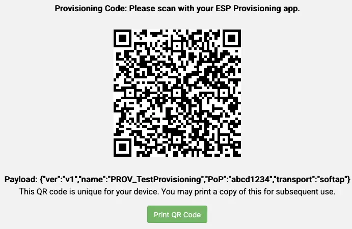
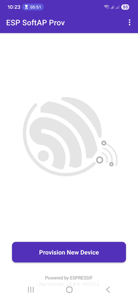
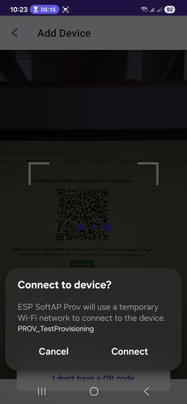
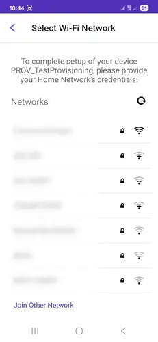
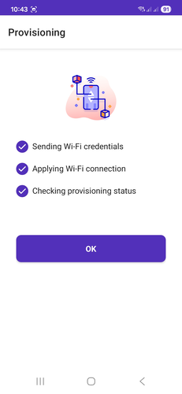

## Introduction

IoT devices need an internet connection to perform their functions. When we manufacture an IoT device, we don't know where it will end up, and we certainly won't know the SSID and password of the end user's network. For this reason, we always need a way for the customer to provide at least these two parameters.

The process of configuring, registering, and preparing a device so that it can securely and effectively connect to an IoT platform or cloud service is called **provisioning**.

Provisioning seems like a simple affair on the surface, but there are quite a few things to take care of. The majority of IoT devices lack input peripherals like keyboards or screens, so Wi-Fi and BLE are commonly used to provide communication. In this tutorial, we focus on Wi-Fi provisioning, where the main idea is to run an HTTP server on the device and let the user input the SSID and password via a smartphone browser or app.

The steps for the simplest possible Wi-Fi provisioning are at least:

1. The IoT device starts an Access Point (AP) and a Station (STA) interface (for later connection).
2. The IoT device starts an HTTP server.
3. The IoT device serves a page (or endpoint) with fields for SSID and password.
4. The user's smartphone connects to the IoT device AP.
5. The user inputs the SSID and password.
6. The IoT device's STA interface tries to connect to the target network.
7. On success, it reports a success message and shuts down the HTTP server.
8. On failure, it reports an error message.

<!--  -->




Beyond this basic flow, we typically want:

- __Visible SSID list__: allow selecting an SSID instead of typing it manually.
- __Security__: avoid running an open AP because nearby parties could eavesdrop on traffic (including SSID and password).
- __Authorization (proof of possession)__: prevent unauthorized parties from provisioning the device with their own credentials by enforcing a proof of possession (PoP).

We may also need to provide additional data to the device, such as a human-friendly device name or cloud certificates. It's usually easier to handle these via a dedicated provisioning app rather than manual HTML forms.

To address these needs, Espressif provides the [`network_provisioning`](https://components.espressif.com/components/espressif/network_provisioning/versions/1.2.4/readme)  component, which is built on the transport-agnostic secure communication framework [`protocomm`](https://docs.espressif.com/projects/esp-idf/en/stable/esp32/api-reference/provisioning/protocomm.html) and includes the accompanying app **ESP SoftAP Prov** ([Android](https://play.google.com/store/apps/details?id=com.espressif.provsoftap&hl=en-US), [iOS](https://apps.apple.com/us/app/esp-softap-provisioning/id1474040630)) for provisioning.

## The `network_provisioning` component

The `network_provisioning` component provides a complete system for configuring Wi-Fi and Thread network credentials on ESP devices. It handles smartphone to IoT device setup (SoftAP or BLE), secure credentials exchange, and automatic cleanup after a successful connection, so we don't have to wire all of this together ourselves.

### Security levels

The component supports three security levels:

| Level | Name | Cryptographic Mechanism | Authentication |
| :--- | :--- | :--- | :--- |
| **0** | `SECURITY_0` | None (plaintext) | None |
| **1** | `SECURITY_1` | X25519 key exchange + AES-CTR | Proof of Possession (PoP) |
| **2** | `SECURITY_2` | SRP6a + AES-GCM | Username and password |

Security Level 1 provides a good middle ground: it encrypts the communication channel using X25519 key exchange and AES-CTR, and authenticates the client through a pre-shared proof of possession string. Security Level 2 offers stronger authentication via SRP6a and is recommended for production.

In this tutorial, we use Security Level 1 to keep things straightforward while still having encryption and PoP.

With this background in place, let's build a working example.

## Getting started

In this tutorial, we perform Wi-Fi AP-based provisioning: the device waits for credentials, connects to the target network, and then prints "Hello World" in a loop.

### Create a new project

1. Open VS Code.
2. In the _command palette_, type: `> ESP-IDF: Create New Empty Project`.
3. Name the project `provisioning-tutorial`.

### Import dependencies

The first thing to do is import the `network_provisioning` component. This component is not part of the core ESP-IDF and is hosted in the [ESP Component Registry](https://components.espressif.com/). We can include registry components using the `idf.py add-dependency` command.

To find the command, we nee to search the `network-provisioning` component in the ESP Component Registry.
The component page shows the required command.



1. Open an ESP-IDF Terminal: `> ESP-IDF: Open ESP-IDF Terminal`.
2. Run: `idf.py add-dependency "espressif/network_provisioning^1.2.4"`.

An `idf_component.yml` file should now appear in our `main` folder:

```bash
.
├── CMakeLists.txt
├── main
│   ├── CMakeLists.txt
│   ├── idf_component.yml
│   └── main.c
├── sdkconfig
└── sdkconfig.old
```

The `idf_component.yml` content is:

```yaml
## IDF Component Manager Manifest File
dependencies:
  ## Required IDF version
  idf:
    version: '>=4.1.0'
  # # Put list of dependencies here
  # # For components maintained by Espressif:
  # component: "~1.0.0"
  # # For 3rd party components:
  # username/component: ">=1.0.0,<2.0.0"
  # username2/component2:
  #   version: "~1.0.0"
  #   # For transient dependencies `public` flag can be set.
  #   # `public` flag doesn't have an effect dependencies of the `main` component.
  #   # All dependencies of `main` are public by default.
  #   public: true
  espressif/network_provisioning: ^1.2.4
```

### Laying the groundwork

For provisioning, we need several subsystems initialized:

- **Non-volatile storage (NVS)** for persisting credentials across reboots.
- **Network interface (`esp_netif`)** for managing network interfaces.
- **Event loop** for responding to events generated by the IP stack, the Wi-Fi stack (connection/disconnection events), and the `network_provisioning` module itself.
- **Wi-Fi access point and station**, used during provisioning.
- __Event group__, used to make the main task wait until provisioning is complete


 A FreeRTOS [**event group**](https://www.freertos.org/Documentation/02-Kernel/02-Kernel-features/06-Event-groups) is a lightweight synchronization primitive where individual bits act as flags. We define a `WIFI_CONNECTED_EVENT` bit that the IP event handler will set once the device gets an IP. The main task then blocks on `xEventGroupWaitBits` until that bit is set.


In the `app_main` function, add the initialization code along with the required includes:

```c
#include <esp_log.h>
#include <esp_wifi.h>
#include <esp_event.h>
#include <nvs_flash.h>
#include <network_provisioning/manager.h>
#include <network_provisioning/scheme_softap.h>

static const char *TAG = "app";

const int WIFI_CONNECTED_EVENT = BIT0;
static EventGroupHandle_t wifi_event_group;

void app_main(void)
{
    ESP_ERROR_CHECK(nvs_flash_init());

    ESP_ERROR_CHECK(esp_netif_init());
    ESP_ERROR_CHECK(esp_event_loop_create_default());

    esp_netif_create_default_wifi_sta();
    esp_netif_create_default_wifi_ap();

    wifi_init_config_t cfg = WIFI_INIT_CONFIG_DEFAULT();
    ESP_ERROR_CHECK(esp_wifi_init(&cfg));
}

```

We also need to register event handler functions with the event loop. Let's look at those next.

### Event handlers

Event handlers are functions called when an event is triggered. In this example we will manage
* Wi-Fi events
* IP events
* Network provisioning event (i.e. triggered by the `network_provisioning` component).


If you're not familiar with events in esp-idf, you can check out the [developer portal workshop lecture](https://developer.espressif.com/workshops/esp-idf-advanced/lecture-2/)


#### Wi-Fi events

Wi-Fi events are grouped under the event base `WIFI_EVENT`. We want to:

- Log when a smartphone connects to or disconnects from the AP (`WIFI_EVENT_AP_STACONNECTED` and `WIFI_EVENT_AP_STADISCONNECTED`).
- Start the Wi-Fi connection when the STA interface starts or when it disconnects (`WIFI_EVENT_STA_START` and `WIFI_EVENT_STA_DISCONNECTED`).

```c
static void wifi_event_handler(void *arg, esp_event_base_t event_base,
                               int32_t event_id, void *event_data)
{
    switch (event_id) {
    case WIFI_EVENT_AP_STACONNECTED:
        ESP_LOGI(TAG, "SoftAP transport: Connected!");
        break;
    case WIFI_EVENT_AP_STADISCONNECTED:
        ESP_LOGI(TAG, "SoftAP transport: Disconnected!");
        break;
    case WIFI_EVENT_STA_START:
        esp_wifi_connect();
        break;
    case WIFI_EVENT_STA_DISCONNECTED:
        ESP_LOGI(TAG, "Disconnected. Connecting to the AP again...");
        esp_wifi_connect();
        break;

    default:
        break;
    }
}
```

#### IP events

IP events are grouped under the event base `IP_EVENT`. When we get the IP from the router (`IP_EVENT_STA_GOT_IP`), it means that provisioning was successful. We want to:
* Stop the blocking of the main loop
* Log the IP address for debugging purposes

```c
static void ip_event_handler(void *arg, esp_event_base_t event_base,
                             int32_t event_id, void *event_data)
{
    if (event_id == IP_EVENT_STA_GOT_IP) {
        ip_event_got_ip_t *event = (ip_event_got_ip_t *) event_data;
        ESP_LOGI(TAG, "Connected with IP Address:" IPSTR, IP2STR(&event->ip_info.ip));
        xEventGroupSetBits(wifi_event_group, WIFI_CONNECTED_EVENT);
    }
}
```

#### Network provisioning events

The `network_provisioning` component generates events through the ESP-IDF event system using the `NETWORK_PROV_EVENT` event base.

<details>
<summary>Here you can find the list of network_provisioning event which we'll be using</summary>

| Event | Description |
|-------|-------------|
| `NETWORK_PROV_START` | Emitted when the provisioning service starts |
| `NETWORK_PROV_END` | Emitted when the provisioning service stops |
| `NETWORK_PROV_WIFI_CRED_RECV` | Emitted when Wi-Fi credentials are received from the client |
| `NETWORK_PROV_WIFI_CRED_SUCCESS` | Emitted when Wi-Fi connection is successful (IP obtained) |
| `NETWORK_PROV_WIFI_CRED_FAIL` | Emitted when Wi-Fi connection fails; includes failure reason |

</details>

For this tutorial, we want to:

* Log when provisioning starts and free resources when it ends (`NETWORK_PROV_START`, `NETWORK_PROV_END`)
* Log Wi-Fi credentials when received (`NETWORK_PROV_WIFI_CRED_RECV`)
* Log if the credentials are correct or incorrect (`NETWORK_PROV_WIFI_CRED_SUCCESS`, `NETWORK_PROV_WIFI_CRED_FAIL`)

```c
static void network_prov_event_handler(void *arg, esp_event_base_t event_base,
                                       int32_t event_id, void *event_data)
{
    switch (event_id) {
    case NETWORK_PROV_START:
        ESP_LOGI(TAG, "Provisioning started");
        break;
    case NETWORK_PROV_WIFI_CRED_RECV: {
        wifi_sta_config_t *wifi_sta_cfg = (wifi_sta_config_t *)event_data;
        ESP_LOGI(TAG, "Received Wi-Fi credentials"
                 "\n\tSSID     : %s\n\tPassword : %s",
                 (const char *) wifi_sta_cfg->ssid,
                 (const char *) wifi_sta_cfg->password);
        break;
    }
    case NETWORK_PROV_WIFI_CRED_FAIL: {
        network_prov_wifi_sta_fail_reason_t *reason = (network_prov_wifi_sta_fail_reason_t *)event_data;
        ESP_LOGE(TAG, "Provisioning failed!\n\tReason : %s"
                 "\n\tPlease reset to factory and retry provisioning",
                 (*reason == NETWORK_PROV_WIFI_STA_AUTH_ERROR) ?
                 "Wi-Fi station authentication failed" : "Wi-Fi access-point not found");
        break;
    }
    case NETWORK_PROV_WIFI_CRED_SUCCESS:
        ESP_LOGI(TAG, "Provisioning successful");
        break;
    case NETWORK_PROV_END: {
        esp_err_t err = network_prov_mgr_deinit();
        if (err != ESP_OK) {
            ESP_LOGE(TAG, "Failed to de-initialize provisioning manager: %s", esp_err_to_name(err));
        }
        break;
    }
    default:
        break;
    }
}
```

#### Handlers registration

Now register all three handlers right after creating the default event loop:

```c
    ESP_ERROR_CHECK(esp_event_handler_register(WIFI_EVENT, ESP_EVENT_ANY_ID, &wifi_event_handler, NULL));
    ESP_ERROR_CHECK(esp_event_handler_register(IP_EVENT, IP_EVENT_STA_GOT_IP, &ip_event_handler, NULL));
    ESP_ERROR_CHECK(esp_event_handler_register(NETWORK_PROV_EVENT, ESP_EVENT_ANY_ID, &network_prov_event_handler, NULL));
```

### Configuring network provisioning

The next step is to configure the network provisioning module to use SoftAP mode (as opposed to BLE) and initialize it:

```c
    network_prov_mgr_config_t config = {
        .scheme = network_prov_scheme_softap,
        .scheme_event_handler = NETWORK_PROV_EVENT_HANDLER_NONE
    };

    ESP_ERROR_CHECK(network_prov_mgr_init(config));
```

Now we log the start of provisioning, define the security level and the proof of possession, and start the network provisioning manager itself:

```c
    ESP_LOGI(TAG, "Starting provisioning");

    /* Security 1 */
    network_prov_security_t security = NETWORK_PROV_SECURITY_1;
    network_prov_security1_params_t *sec_params = PROOF_OF_POSSESSION;

    ESP_ERROR_CHECK(network_prov_mgr_start_provisioning(security, sec_params, AP_NAME, NULL));
```

After that, we print a link that generates a QR code for the provisioning app:

```c
printf("Copy paste the below URL in a browser.\n%s?data={\"ver\":\"%s\",\"name\":\"%s\",\"PoP\":\"%s\",\"transport\":\"%s\"}\n",
           QRCODE_BASE_URL, PROV_QR_VERSION, AP_NAME, PROOF_OF_POSSESSION, PROV_TRANSPORT_SOFTAP);
```


The link to [https://espressif.github.io/esp-jumpstart/qrcode.html](https://espressif.github.io/esp-jumpstart/qrcode.html?data={%22ver%22:%22v1%22,%22name%22:%22TEST%22,%22pop%22:%22pop%22,%22transport%22:%22softap%22}) provides a QR-Code generator which is used by the ESP SoftAP Prov app to get the required data.


### Main loop

Now we need to wait for provisioning to complete (i.e., for the device to obtain an IP address) and then start the main loop:

```c
xEventGroupWaitBits(wifi_event_group, WIFI_CONNECTED_EVENT, true, true, portMAX_DELAY);
 while (1) {
        ESP_LOGI(TAG, "Hello World!");
        vTaskDelay(1000 / portTICK_PERIOD_MS);
    }
```


<details><summary>Here you can find the complete main.c code</summary>

```c
#include <stdio.h>
#include <string.h>
#include <freertos/FreeRTOS.h>
#include <freertos/task.h>
#include <freertos/event_groups.h>
#include <esp_log.h>
#include <esp_wifi.h>
#include <esp_event.h>
#include <nvs_flash.h>

#include <network_provisioning/manager.h>
#include <network_provisioning/scheme_softap.h>

static const char *TAG = "app";

const int WIFI_CONNECTED_EVENT = BIT0;
static EventGroupHandle_t wifi_event_group;

const char *pop = "abcd1234";

#define PROV_QR_VERSION         "v1"
#define PROV_TRANSPORT_SOFTAP   "softap"
#define QRCODE_BASE_URL         "https://espressif.github.io/esp-jumpstart/qrcode.html"
#define AP_NAME "PROV_TestProvisioning"


static void network_prov_event_handler(void *arg, esp_event_base_t event_base,
                                       int32_t event_id, void *event_data)
{
    switch (event_id) {
    case NETWORK_PROV_START:
        ESP_LOGI(TAG, "Provisioning started");
        break;
    case NETWORK_PROV_WIFI_CRED_RECV: {
        wifi_sta_config_t *wifi_sta_cfg = (wifi_sta_config_t *)event_data;
        ESP_LOGI(TAG, "Received Wi-Fi credentials"
                 "\n\tSSID     : %s\n\tPassword : %s",
                 (const char *) wifi_sta_cfg->ssid,
                 (const char *) wifi_sta_cfg->password);
        break;
    }
    case NETWORK_PROV_WIFI_CRED_FAIL: {
        network_prov_wifi_sta_fail_reason_t *reason = (network_prov_wifi_sta_fail_reason_t *)event_data;
        ESP_LOGE(TAG, "Provisioning failed!\n\tReason : %s"
                 "\n\tPlease reset to factory and retry provisioning",
                 (*reason == NETWORK_PROV_WIFI_STA_AUTH_ERROR) ?
                 "Wi-Fi station authentication failed" : "Wi-Fi access-point not found");
        break;
    }
    case NETWORK_PROV_WIFI_CRED_SUCCESS:
        ESP_LOGI(TAG, "Provisioning successful");
        break;
    case NETWORK_PROV_END: {
        esp_err_t err = network_prov_mgr_deinit();
        if (err != ESP_OK) {
            ESP_LOGE(TAG, "Failed to de-initialize provisioning manager: %s", esp_err_to_name(err));
        }
        break;
    }
    default:
        break;
    }
}

static void wifi_event_handler(void *arg, esp_event_base_t event_base,
                               int32_t event_id, void *event_data)
{
    switch (event_id) {
    case WIFI_EVENT_STA_START:
        esp_wifi_connect();
        break;
    case WIFI_EVENT_STA_DISCONNECTED:
        ESP_LOGI(TAG, "Disconnected. Connecting to the AP again...");
        esp_wifi_connect();
        break;
    case WIFI_EVENT_AP_STACONNECTED:
        ESP_LOGI(TAG, "SoftAP transport: Connected!");
        break;
    case WIFI_EVENT_AP_STADISCONNECTED:
        ESP_LOGI(TAG, "SoftAP transport: Disconnected!");
        break;
    default:
        break;
    }
}

static void ip_event_handler(void *arg, esp_event_base_t event_base,
                             int32_t event_id, void *event_data)
{
    if (event_id == IP_EVENT_STA_GOT_IP) {
        ip_event_got_ip_t *event = (ip_event_got_ip_t *) event_data;
        ESP_LOGI(TAG, "Connected with IP Address:" IPSTR, IP2STR(&event->ip_info.ip));
        xEventGroupSetBits(wifi_event_group, WIFI_CONNECTED_EVENT);
    }
}

void app_main(void)
{
    /* Initialize NVS partition */
    ESP_ERROR_CHECK(nvs_flash_init());

    ESP_ERROR_CHECK(esp_netif_init());
    ESP_ERROR_CHECK(esp_event_loop_create_default());
    wifi_event_group = xEventGroupCreate();

    ESP_ERROR_CHECK(esp_event_handler_register(NETWORK_PROV_EVENT, ESP_EVENT_ANY_ID, &network_prov_event_handler, NULL));
    ESP_ERROR_CHECK(esp_event_handler_register(WIFI_EVENT, ESP_EVENT_ANY_ID, &wifi_event_handler, NULL));
    ESP_ERROR_CHECK(esp_event_handler_register(IP_EVENT, IP_EVENT_STA_GOT_IP, &ip_event_handler, NULL));

    esp_netif_create_default_wifi_sta();
    esp_netif_create_default_wifi_ap();

    wifi_init_config_t cfg = WIFI_INIT_CONFIG_DEFAULT();
    ESP_ERROR_CHECK(esp_wifi_init(&cfg));

    /* Configuration for the provisioning manager */
    network_prov_mgr_config_t config = {
        .scheme = network_prov_scheme_softap,
        .scheme_event_handler = NETWORK_PROV_EVENT_HANDLER_NONE
    };

    ESP_ERROR_CHECK(network_prov_mgr_init(config));


    ESP_LOGI(TAG, "Starting provisioning");

    /* Security 1 */
    network_prov_security_t security = NETWORK_PROV_SECURITY_1;
    network_prov_security1_params_t *sec_params = pop;

    ESP_ERROR_CHECK(network_prov_mgr_start_provisioning(security, sec_params, AP_NAME, NULL));

    printf("Copy paste the below URL in a browser.\n%s?data={\"ver\":\"%s\",\"name\":\"%s\",\"pop\":\"%s\",\"transport\":\"%s\"}\n",
           QRCODE_BASE_URL, PROV_QR_VERSION, AP_NAME, pop, PROV_TRANSPORT_SOFTAP);

    xEventGroupWaitBits(wifi_event_group, WIFI_CONNECTED_EVENT, true, true, portMAX_DELAY);

    while (1) {
        ESP_LOGI(TAG, "Hello World!");
        vTaskDelay(1000 / portTICK_PERIOD_MS);
    }
}
```
</details>

## Testing the provisioning

To test provisioning, we flash the firmware to our device, install the provisioning app on our phone, and scan the QR code.

### On the laptop

* In the VS Code _command palette_, type: `> ESP-IDF: Build, Flash, and Start a Monitor on Your Device`.

    We should see output similar to the following, with the device waiting for a client to connect:

    ```bash
    I (483) app: Starting provisioning
    I (493) phy_init: phy_version 1232,d493f299,Aug 25 2025,19:01:20
    I (533) wifi:mode : sta (7c:df:a1:42:64:70)
    I (533) wifi:enable tsf
    I (543) wifi:mode : sta (7c:df:a1:42:64:70) + softAP (7c:df:a1:42:64:71)
    I (543) wifi:Total power save buffer number: 16
    I (543) wifi:Init max length of beacon: 752/752
    I (543) wifi:Init max length of beacon: 752/752
    I (553) esp_netif_lwip: DHCP server started on interface WIFI_AP_DEF with IP: 192.168.4.1
    I (553) wifi:Total power save buffer number: 16
    I (563) esp_netif_lwip: DHCP server started on interface WIFI_AP_DEF with IP: 192.168.4.1
    I (573) network_prov_mgr: Provisioning started with service name : PROV_TestProvisioning
    I (573) app: Provisioning started
    Copy paste the below URL in a browser.
    https://espressif.github.io/esp-jumpstart/qrcode.html?data={"ver":"v1","name":"PROV_TestProvisioning","pop":"abcd1234","transport":"softap"}
    ```

* Copy the link from the terminal output and paste it into our laptop's browser address bar.
    We should see a QR code like the one in the following picture:

<!--  -->




### On the smartphone

* Download the **ESP SoftAP Prov** app for your smartphone:
   - [Android](https://play.google.com/store/apps/details?id=com.espressif.provsoftap&hl=en-US)
   - [iOS](https://apps.apple.com/us/app/esp-softap-provisioning/id1474040630)

* Open the **ESP SoftAP Prov** app.
<!--
    -->
   

* Tap **Provision New Device**.

* Use the camera to scan the QR code displayed in the browser.

   <!--  -->
   

* Choose your router's SSID from the list.

   <!--  -->
   

* Enter the password for your router.

* We should now see the success screen.

   <!--  -->
   

Our device is now provisioned!

### Skipping provisioning on subsequent boots

With the code above, every time we restart the device, provisioning runs again from scratch. To avoid this, we can check whether Wi-Fi credentials are already stored in NVS before starting the provisioning flow:

```c
bool provisioned = false;
ESP_ERROR_CHECK(network_prov_mgr_is_wifi_provisioned(&provisioned));
```

If `provisioned` is `true`, we can skip the provisioning step entirely and connect directly.

The full code is available in the [developer-portal-codebase](https://github.com/espressif/developer-portal-codebase/tree/main/content/blog/2026/05/simple-provisioning) repository, and you can find additional examples in the [idf-extra-components repo](https://github.com/espressif/idf-extra-components/tree/master/network_provisioning/examples).

## Under the hood

Now that we have a working provisioning example, below you can find some detail about how `network_provisioning` and `protocomm` work together.


### `network_provisioning`: how it works

<details>

The network provisioning manager acts as a high-level orchestrator that integrates several subsystems:

- **Protocomm integration**: The manager creates a [`protocomm`](https://docs.espressif.com/projects/esp-idf/en/stable/esp32/api-reference/provisioning/protocomm.html) instance to handle secure communication, configuring security schemes (0/1/2) and registering endpoints for different provisioning operations like `prov-config`, `prov-scan`, and `prov-ctrl`. More on that below.

- **SoftAP transport**: For Wi-Fi provisioning, the SoftAP scheme starts both an HTTP server and a Wi-Fi access point, configuring the device in AP+STA mode to allow simultaneous client connections and station operations.

- **Wi-Fi management**: The manager handles Wi-Fi state transitions, from starting in STA mode for scanning, to AP+STA mode during provisioning, and finally back to STA mode after successful connection. It automatically shuts down the AP when provisioning completes.

This integrated approach provides a easy provisioning interface where clients connect via HTTP to the SoftAP, securely exchange credentials through protocomm endpoints, and have the device automatically configure and connect to the target network while cleaning up provisioning resources.

A few things worth noting:

- The provisioning manager maintains all state in a singleton context (`prov_ctx`) that tracks protocomm instances, Wi-Fi state, timers, and handlers throughout the provisioning lifecycle.
- An auto-stop feature automatically closes the AP and cleans up resources after a successful network connection.
- Multiple transport schemes are supported (SoftAP, BLE, Console), but all use the same protocomm-based endpoint architecture.

<!-- <details>
<summary>Flow diagram of network provisioning</summary> -->

[Here](./img/network-provisioning-diagram.svg) you can find the flow diagram of `network-provisioning`.

</details>

### `protocomm`: the communication layer

<details>

Under `network_provisioning` lies `protocomm`, a general-purpose secure communication framework. It is transport-agnostic, meaning the same endpoints work over HTTP, BLE, or Console. It provides:

- **Security levels**: `protocomm_security0` (no security), `protocomm_security1` (Curve25519 + AES-CTR), or `protocomm_security2` (SRP6a + AES-GCM).
- **Multiple transports**: HTTP (SoftAP), BLE, and Console.
- **Endpoint management**: Named endpoints with custom handlers.
- **Automatic session management**: Sessions are created, tracked, and secured automatically by the transport layer.

Security is configurable per instance, and session management is completely automatic: applications only need to handle endpoint logic. Protocomm can also be used for any custom protocol, not just provisioning.

[Here](./img/protocomm-diagram.svg) you can find the diagram of the `protocomm`.

</details>

### Security Level 1 deep dive

<details>
Security Level 1 uses a multi-step handshake to establish a secure session:

- **Request 1**: The client generates an X25519 key pair and sends its public key to the device.
- **Response 1**: The device responds with its own public key and a random seed used as an IV for AES-CTR.
- **Key derivation**: Both sides calculate a shared secret. If a PoP is used, the shared secret is XORed with the SHA256 hash of the PoP string.

The PoP acts as a simple authentication factor. In the firmware, if `network_prov_sec_params` is provided during initialization, the manager treats it as the PoP. If omitted, the device signals the `no_pop` capability to the client.

Once the session is established, all subsequent data (including Wi-Fi credentials) is encrypted using AES-CTR. This prevents eavesdropping on the transport layer, whether BLE or SoftAP.

</details>

## Conclusion

This article covered practical Wi‑Fi provisioning for IoT devices using Espressif's `network_provisioning` and the `protocomm` transport. We implemented a SoftAP-based example (Security Level 1), handled Wi‑Fi and provisioning events, tested the flow with the ESP SoftAP Prov app, and showed how to skip provisioning on subsequent boots by checking NVS. We also examined the internals of `network_provisioning`/`protocomm` so you can understand how transport, security, and sessions are managed.

The example provides a solid foundation for integrating secure provisioning into devices. For production, consider stronger authentication (Security Level 2), robust PoP management, and protecting device identity and credentials.
