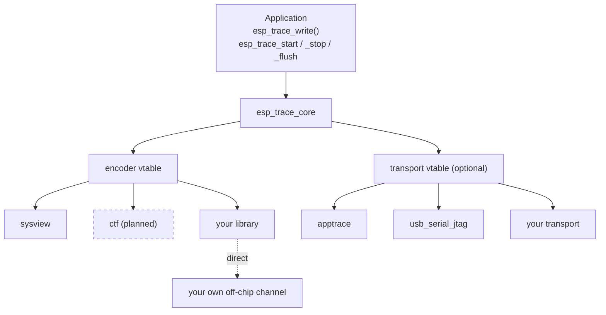
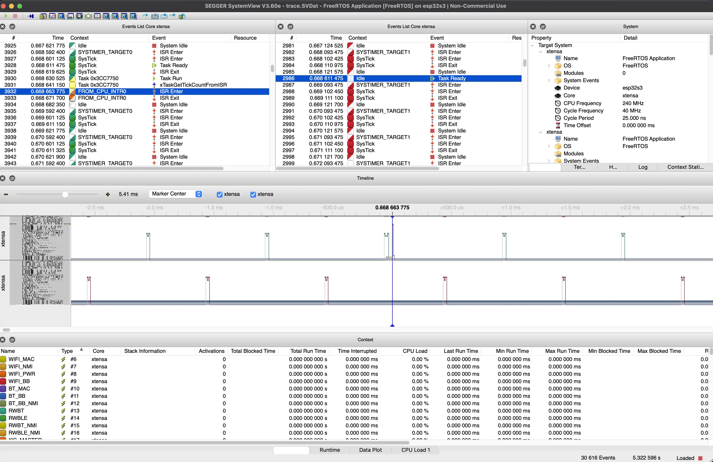
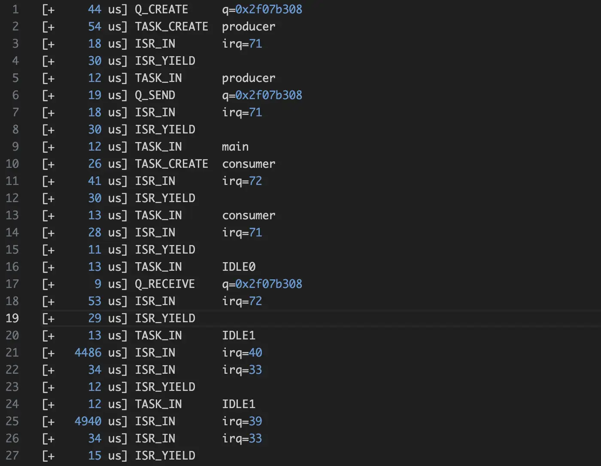

## Introduction

Tracing and logging are different tools. Logging stores discrete messages your code chooses to emit; you read them back when something goes wrong. Tracing records a continuous stream of events: task switches, interrupts, and queue activity from the kernel, plus any custom events the application emits. Typically a host tool turns that stream into a timeline you can browse, though simpler trace formats can be read directly in a serial monitor. You reach for tracing when something is slow or behaves unexpectedly and logs alone do not explain why.

ESP-IDF has a new component called `esp_trace`. It is a small core that owns the runtime trace state (start/stop, the active session, locking) and delegates the rest of the work to two pluggable parts: an **encoder** that defines the trace format, and a **transport** that moves those bytes off the chip. Both parts are resolved from a registry at startup by name, so you can combine them freely with no integration changes.

We built it for two reasons. First, every new trace library needed its own mechanism to hook FreeRTOS events, and without a generic extension point integrators were forced to modify `FreeRTOSConfig.h` directly. Second, the trace format used to be tightly coupled to a specific transport, so sending the same data over a different link (USB-Serial-JTAG instead of JTAG, for example) meant rewriting the integration. `esp_trace` addresses both: a well-defined extension point so third-party trace tools ship as normal ESP-IDF components without kernel patches, and a clean encoder/transport split so the same trace data can travel over any supported link.

This post is a high-level tour. The detailed documentation already lives in the [component README](https://github.com/espressif/esp-idf/tree/master/components/esp_trace) and the [example README](https://github.com/espressif/esp-idf/tree/master/examples/system/esp_trace), so I will keep this short and point you there for the details.

## Architecture

Application code interacts with a single public API. The core dispatches each call through an encoder vtable and a transport vtable. Encoders and transports register themselves at link time and the core resolves them by name:

The transport layer is optional. If your trace library already moves bytes off the chip through its own channel (for example, streaming over TCP or UDP, or writing to memory), you can skip the transport adapter and have the encoder write directly. Selecting `CONFIG_ESP_TRACE_TRANSPORT_NONE=y` in sdkconfig enables that path.

### FreeRTOS hooks

FreeRTOS exposes `trace*()` macros (`traceTASK_SWITCHED_IN`, `traceISR_ENTER`, `traceQUEUE_SEND`, and so on) that the kernel calls at instrumentation points. These are resolved at compile time, not at runtime, so they cannot go through the encoder vtable. `esp_trace` handles them on a separate path: its public header is included from `FreeRTOSConfig.h`, and when an external library is enabled it pulls in an `esp_trace_freertos_impl.h` from your component. That header is where you map the `trace*()` macros to your hook implementations.

## What you can plug in

Today the component ships with one production encoder and one example encoder:

- **SEGGER SystemView**, available as the `esp_sysview` managed component. This is the recommended path if you want a full-featured host-side viewer.

  

- **A small reference encoder** that ships with the example. It emits plain text, one line per FreeRTOS event, so you can read the trace live in any serial terminal.

The architecture is open. A CTF encoder is on the roadmap, and the same extension points let anyone publish their own encoder (or transport) as a managed component. From the application's point of view they all look the same; only the Kconfig selection changes.

## Walking through the integration example

[`examples/system/esp_trace`](https://github.com/espressif/esp-idf/tree/master/examples/system/esp_trace) is a minimal project that exercises every part of the encoder and FreeRTOS-hook contract. It registers an external encoder, runs a producer and a consumer task on different cores, and emits one human-readable line per FreeRTOS event over USB-Serial-JTAG:

The leading number is microseconds since the previous event. No host-side decoder or special tooling is required; open the USB-Serial-JTAG endpoint in any serial monitor.

The `app_main.c` of the example uses only the generic API. It calls `esp_trace_start()`, lets the tasks run briefly, then calls `esp_trace_stop()` and `esp_trace_flush()`. The application code never references the encoder or transport by name; those bindings are resolved from configuration. That separation is the purpose of the indirection.

The example is designed as a starting template for anyone integrating a new trace recorder into ESP-IDF. The full file-by-file walkthrough, the CMake setup, and a list of common pitfalls to watch for are in the example README. Rather than duplicating those details here, that is the canonical place to look.

## Conclusion

The takeaway: third-party trace tools no longer need to patch ESP-IDF. If you maintain a tracer, the integration is now a self-contained managed component built around two small contracts (encoder and transport). SystemView is the recommended out-of-the-box choice today, the example shows the smallest viable port, and a CTF encoder is on the roadmap.

## Where to go next

- [`components/esp_trace`](https://github.com/espressif/esp-idf/tree/master/components/esp_trace) — full architecture diagram and a reference for the encoder and transport vtables.
- [`examples/system/esp_trace`](https://github.com/espressif/esp-idf/tree/master/examples/system/esp_trace) — the minimal example. Start here if you want to write your own encoder.
- [`examples/system/sysview_tracing`](https://github.com/espressif/esp-idf/tree/master/examples/system/sysview_tracing) — shows SystemView tracing end-to-end using the `esp_sysview` encoder adapter.
- [Application Tracing API guide](https://docs.espressif.com/projects/esp-idf/en/latest/esp32/api-guides/app_trace.html) — the broader docs that put `esp_trace` in context with the rest of the tracing stack.

If you build something on top of `esp_trace`, we would love to see it.
