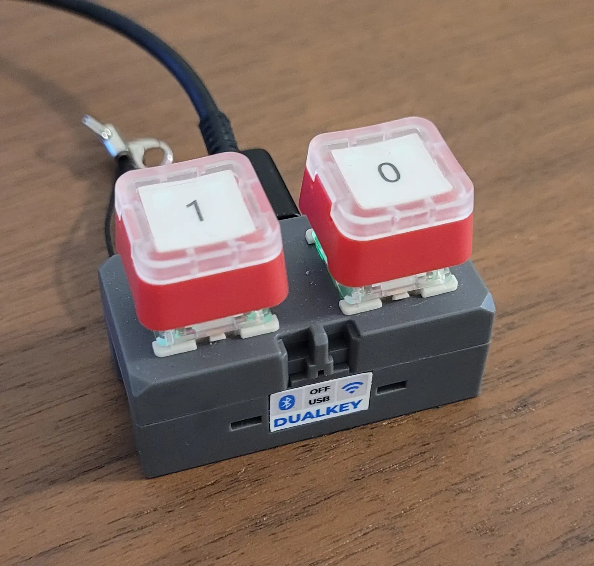
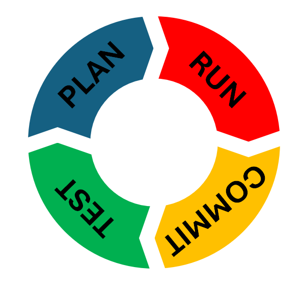

## Introduction

In [a previous article](https://developer.espressif.com/blog/2026/04/developing-a-rust-iot-app-with-ai/) I took the ESP DualKey from M5Stack through a journey of Rust firmware development. The goal? Porting the Espressif's Unified Provisioning over BLE and SoftAP from ESP-IDF and building a thing for the internet. Even though the project went as expected and I got the thing; the workflow mattered much more.

This post is about that workflow, now, applied to Zephyr. What I plan to elaborate here is not about becoming a Zephyr expert. Even though I do have some experience by being the Product Manager - and occasional tech support - of Zephyr inside Espressif, the goal is not Zephyr. It is how to work differently, with AI, beyond the fuss. The durable payoff is how to work with an agent - specs, boundaries, Git, evidence - and not which language or RTOS wins on paper. **Code is fast now** - maybe too fast - and the hard part becomes managing code and everything around it: architecture, organization, testing, and knowing when to stop the model from typing. Writing code goes away, but thinking in terms of "code" is still there.

This time, it will be the same bet on the same board: ESP DualKey still has to talk to the **Espressif ESP BLE Provisioning** app the same way as before. I just moved the implementation to Zephyr C and got strict about how we work with the agent - clearer specs, sharper boundaries, more discipline around Git and the bench. If you have not read the Rust article yet, [start there](https://developer.espressif.com/blog/2026/04/developing-a-rust-iot-app-with-ai/) and come back; the product story will make more sense.

Finally, and more importantly, applying the lessons learned. No dumping of journals this time.

## Tooling and goals: Cursor and the product definition

This experiment did not start from zero. On the agent side it was the same **Cursor** habit as before - Plan mode when the work was too big. Coding styles, adding project boundaries, structure, and so on.

We still had the **product spec** from the Rust work and the **Rust tree** as a behavioral reference - what the buttons should do, how provisioning should feel, what “done” meant on the bench. We re-used as much as we could from ESP-IDF and Rust.

What had to be **new** was the presence of a new OS: Zephyr. Conventional Zephyr project activities, tasks, methods, processes. All with AI. Thus, speaking about Zephyr...

### About Zephyr

**Zephyr** is an open-source real-time operating system from the [Zephyr Project](https://www.zephyrproject.org/), and managed by The Linux Foundation. It is much more than just a kernel. It is a large in-tree catalogue of drivers, protocol stacks, and services, configured with **Kconfig** and **devicetree** and built through a **west** metatool. It ties the RTOS, board support, libraries and your applications together. Boards and SoCs are integrated upstream; product firmware and reusable modules usually live in separate repositories rather than inside the OS tree.

**Zephyr on Espressif silicon:** Espressif offers and supports [Zephyr for ESP32-family SoCs](https://www.espressif.com/en/sdks/esp-zephyr). In Espressif, we consider Zephyr to be an OS Distribution that can run on Espressif computers. It is considered a solid solution and since 2020 we have been working on it. The current status of Zephyr can be found in the [Status Page](https://developer.espressif.com/software/zephyr-support-status/), on this portal.

### Why Zephyr this time

As stated, Espressif is already supporting Zephyr. Zephyr adoption among Espressif users has been growing steadily. More and more people are considering the Espressif-Zephyr duo for their projects. Naturally, at Espressif, we aim to give users a great experience and good resources. However, we have seen customers complain about the difficulties of starting a new project from scratch.

This felt like a good challenge for a new approach. We have references, we did it for another design, the phone app and reference C define what “correct” means; Zephyr code implements, it does not redefine, the protocol. Because of all this, we chose Zephyr to keep evolving the process; not our knowledge of firmware and not because Zephyr replaces Rust everywhere. They are great solutions. As ESP-IDF is.

In the case of Zephyr, I already had it previously installed and configured. Zephyr installation is not a big problem and it is fairly well documented. I believe AI could do it, but this is a test for later.

### Product definition as the goal

We carried [`docs/spec/product_spec.md`](https://github.com/rftafas/dualkey-provisioning/blob/main/docs/spec/product_spec.md) forward and adjusted it where Zephyr mattered - gestures, LEDs, provisioning entry and exit (including reboot policy), MQTT and HID, explicit out-of-scope lines. It was not a new product definition; it was the same contract on a new stack.

With AI, that document is the **goal**, as in the earlier article, made in the form of specs: SSID and BLE names, timeouts, cancel at product level, what “done” means on the bench. When spec and code disagree, you fix one or the other deliberately - never both drifting.

<figure>
  
  <figcaption>Fig.1 - The ESP DualKey kit. Now with Labels.</figcaption>
</figure>

And the same ESP DualKey kit. With stickers.

## The contracts (or design rules)

### Habits we already had

We were not blank when we started. Common sense got us some overall rules. Surprisingly, they were enough to start. They are added and reworded, below:

- A written **spec** beats ad-hoc prompts.
- **Reference code** (ESP-IDF examples, protocomm) beats prose alone for protocol work.
- **Git** is undo when experiments go wrong; milestones deserve commits.
- **Bounded tasks** beat “implement the subsystem” monoliths.
- **Tracing and bench evidence** beat arguing from source alone.
- The human owns **architecture** and **evaluation**; the agent owns typing.
- **All issues are mine** when something ships wrong.
- The agent should do the coding once direction is clear.
- When we are stuck, **both** of us debug.

But we had other lessons. Improvements.

### What the Rust article added (mostly naming and packaging)

Common sense created the list above; when writing the article, I gave it memorable wording. Then, we learned lessons, worth keeping verbatim in spirit from that piece:

- **Agent Mode** only after we agree what we are trying next.
- **Planning** when too many steps must run in sequence, not one endless “fix it” chat.
- **Commit at every plan** - granular checkpoints so bisect and rollback stay real when the partner types fast.
- **Pay attention to structure and organization** - or “clean your room” - entropy is not only bad code but duplicate docs, stray scripts, and files in the wrong tree.

What was genuinely new in the write-up, not just relabeled: **entropy** as a named failure mode; a **pitfalls table** (hallucinated APIs, protocol drift, **macaronic code**, over-refactoring, timing surprises); scaffolding habits (generators, **editor rules**, starter prompts, curated examples); simulation and CI when possible; and the cautionary tale of **deleting the debug journal** when “cleaning up,” because neither of us treated the lab notebook as worth keeping.

We started the Zephyr track **assuming that contract still holds**: evaluator and coder split, spec-first, entropy control, Git as safety net. But a process is starting to take form. And we will discuss it below in detail: the Plan-Code-Test-Commit cycle.

### Zephyr integration principles (what Zephyr added to the contract)

Since we are using Zephyr, it comes with its set of contracts as well. While in this design we are focusing on Zephyr, I believe this can - and will - be generalized for any OS. List follows:

1. **Use as much Zephyr as possible** - prefer the RTOS and its supported flows over parallel “mini-OS” layers in the app.
2. **Use as much of the OS services as possible** - networking, Wi‑Fi management, BLE host, settings/NVS patterns, logging, workqueues: wire through Zephyr subsystems instead of bespoke shims where a subsystem already exists.
3. **Use as much of the Zephyr distro as possible** - leverage in-tree modules and Kconfig-selected building blocks before private copies; contribute upstream when something is missing rather than forking silently.
4. **Integrate as seamlessly to Zephyr as possible** - west workspace, out-of-tree module layout, devicetree, `prj.conf`, samples, naming and docs that look like a normal Zephyr integration.

Those four lines are **excellent prompt constraints**: they tell the model what “good” looks like before it invents a foreign project shape. Later we show how they showed up in repositories and build artifacts without re-deriving the list.

**Three layers:** product behavior (`product_spec.md`), Zephyr integration principles (this list), then the new repos and build layout (later).

---

## New lessons for the contract (this experiment)

If the contract above is the constitution, things we brought from prior Firmware experience and teachings from the Rust experiment, what follows next are the amendments after Zephyr provisioning experiment. Many more aspects were revealed through this activity, things that were new or things that had their meaning modified. Experience, as they say.

Also, we had a journal this time. Everything here became **additive**; we could carry more knowledge.

### Fast code, slow magic

The model types faster than I do. That does not shrink my job; it **increases** the load on the evaluator seat. Speed is real; value is in critical thinking, architecture, testing, debugging, and organization - the “slow magic” humans still own.

| Fast (agent) | Slow (human) |
| --- | --- |
| Drafting modules, refactors, boilerplate | Whether the architecture should exist |
| Suggesting API shapes | Whether a public API is stable and minimal |
| Reading source quickly | What the trace proves happened on the chip |
| Large diffs | Whether a large diff is allowed this milestone |

This experiment drove that home: when provisioning misbehaved, the winning move was still “paste the log, state the expectation, ask what branch is wrong” - not “generate more code until it compiles.”

### Organization is the human’s job

Entropy from the Rust article is still true: throwaway scripts, duplicate docs, and “helpful” files in the wrong folder appear unless someone enforces structure. **You** own spec versus journal, module versus app, `.gitignore`, submodule pins, and what gets deleted versus committed.

**Dedupe** is part of that job: when a module manual exists, stop re-exporting the same prose in the product repo. We kept that discipline this time (contrast the lost journal from the Rust cleanup).

### Stop letting AI own the whole tree - extract a component

There was an “AI does everything in one tree” phase. This time we pivoted to a **reusable component**, a **proof application**, and a **thin product** - stack-agnostic, and explicit about reusability.

**Macaronic code (generic fix):** We had already named the pitfall in the Rust write-up - logic piled in one tree, weak boundaries, structures that the model will not invent unless you force them. Our answer this time is architectural, not syntactic: a **formal component** and a **formal app**, a normative component spec separate from a debug journal, and a public API reviewed like a library. The esp-provisioning module and ESP DualKey repos are the Zephyr-shaped instance; the lesson is not Zephyr-specific.

**Proof-before-product:** flash and exercise the **sample or harness** before wiring the full product application. That ties directly to the verify step in the plan loop. On Zephyr, the harness was `esp_provisioning_shell`.

### Strategies that worked with agents

These strategies are not Zephyr-exclusive:

- **Source code is a specification** - independent of language. Point the agent at the running tree, module API headers, and ESP-IDF reference implementations for precision; use markdown for intent and review.
- **Component + proof app first**, then product integration.
- **Upstream-first.** If you need to add and improve the upstream project, I suggest halting your work, doing what needs to be done, and coming back.
- **API boundaries:** shared modules must not absorb product policy. We trimmed the provisioning module over time, as it was continuously getting contaminated. Products are products, libraries are libraries, existing or not.
- **One milestone per plan execution:** one plan, one execution, then verify and commit before the next plan.

### Git and artifacts (what we saw this time)

**Commit often is mandatory.** Submodule bumps, API trims, and transport fixes all need granular commits if `git bisect` is to mean anything. That is not ceremony; it is how you survive a fast typing partner that has no restraint to change code.

**AI does not handle upstream Git.** The agent can prepare diffs and summaries; a human lands upstream pull requests. Sometimes, the trains and airplanes need human supervision. Things can go wildly wrong.

**Journals yes, a hard yes.** We **kept** `journal.md` as a localized "troubleshooting and regression avoider". I also found that it was preventing re-reasoning. AI is a statistical machine; after a while, it might try the same trick that didn't work before. The journal prevented it. It worked like a charm in far more ways than expected. They are in the module repo this time. First thing a plan needs to include is _to update the journal_.

Usually, that is exactly how I do it: during planning, I request: _todo: update the journal with all positive results from previous loop and the solutions that were tried and didn't solve the problem_. I like to add the problem and what we did to fix it, in other words, the problem and the fix go to the journal. Many times AI undoes work, goes to Journal, finds an entry - directly or similar - and in the same round, fixes it.

## Plan → execute → commit → test (master gear)

This rhythm is **generic** - it applies to Rust, Zephyr, or anything else. Zephyr shows up only as examples elsewhere.

<figure>
  
  <figcaption>Fig.2 - Proposed development cycle.</figcaption>
</figure>

The Rust article mentioned planning for long sequences but did not operationalize what happens **after** a plan runs. We elevated that to its own gear:

1. **Plan** before non-trivial agent work (Cursor Plan mode or an explicit plan document).
2. **Execute** the plan - agent, human, or both.
3. **Commit** a reversible checkpoint *before* the messy part of testing when the change is still easy to roll back - because on the bench the agent (or you) can go wild trying “one more fix.”
4. **Test** on the bench: build, flash, smoke scenario; for components, exercise the **sample harness** before the full product.
5. **Loop** after testing, **restart planning** with the results of the prior phase rather than stacking unbounded “fix it” prompts on a failed run. Seriously, go back to planning. Yes, the temptation to let AI start coding wildly and fix the bug is there. It should be resisted. This is when AI-produced code becomes difficult to support and maintain.

As far as process goes, this is PDCA - Plan, Do, Check, Act - wearing firmware clothes. That holds up. From first article, I commented that working with AI was incredibly similar to managing Junior Developers on a technical level, a feeling that reinforces this PDCA concept. By adding the whole development process in Git with frequent commits, it will be easy to review the solution, or to control it.

Git stays the safety net; commit granularity and artifact habits keep bisect honest; this loop is the **operating rhythm** that makes the contract stick—plan is not a chat luxury, and each execution ends in verify and commit. Before any comments that this will result in a polluted Git history, I recall that we can always squash commits and review the messages - the plans - of what really was kept between commits. It is a game changer in traceability and an increase in entropy, but a controlled one.

HOWEVER... I figured that I let go of all Cursor plans between commits and the plans could be revised by AI to create the commit message or even be committed themselves. Well, once again, the critical thinking entity of the duo (me) didn't do my job. To not repeat *to err is human*, it is all about learning, isn't it?

## Zephyr-specific teachings (this experiment on ESP32)

Again, we learned a few tricks as well. And again, we found some Zephyr related teachings that I believe can be made generic and applicable to any software we use as our base.

### Zephyr integration patterns we used

Here it goes:

- **Module layout:** follow best practices. Not new, but always worth mentioning.
- **Try the sample apps.** Life saving, time saving decision. Lots of energy is saved when trying every component individually.
- **Product app.** Have it organized. Business logic from basic component support.
- **Don't touch Upstream Code.** AI had the very bad habit to fix the issues or add tracing to the first piece of software it found convenient. This includes a lot of edits to main sources of Zephyr. It cannot differentiate code, code is code. I kept a hard rule here.
- **Except when you have to touch upstream content.** That is the beauty. It asked my permission to edit code because it was confident that new Zephyr code was necessary. This is when I went mostly old school and really reviewed the code. When you might interfere with a whole project, yes, you - at least I - become more careful.

### ESP DualKey / esp-provisioning outcome (brief)

Public repositories:

- [zephyr/modules/esp-provisioning](https://github.com/rftafas/esp-provisioning-zephyr) - out-of-tree module and shell sample.
- [zephyr/](https://github.com/rftafas/dualkey-provisioning/tree/main/zephyr) - product firmware consuming the module.

On the bench, the shell sample exercises BLE and SoftAP transports with the Espressif provisioning app; the integrated app follows the same product spec. The module API was trimmed over time to stay library-shaped.

## Conclusion

The pair-programming split from the Rust article still holds: the model codes; I evaluate - against spec, reference trees, build output, UART traces, and the bench. **Code is cheap, judgment is not.** What changed as we kept writing is that we are slowly **consolidating a process** around AI-driven development instead of treating each chat as a one-off. Specs, rules, journals, reusable modules, proof apps before products, commit granularity, and **plan → execute → commit → test** are not trendy extras - they are how you get a real **productivity boost** without paying for it in regressions nobody can bisect.

The lessons stack. The Rust pass gave us the duo contract, entropy control, and the warning about macaronic trees and lost notebooks. The Zephyr pass added platform-shaped components, sharper API boundaries, proof-before-product on the bench, and a human-owned path for upstream Git. None of that replaces the old discipline we already knew. **PDCA** is still there, just wearing Cursor and a faster typist. Git as undo, bounded tasks, UART as ground truth - still there too. The challenge is not to invent a new religion every time the stack changes. It is to **reuse what we already know**: carry the product spec forward, point the agent at prior source and reference code, write the rules down once, and keep the artifacts the next session can read. Start from scratch and you repeat the same errors - deleted journals, bloated trees, “it should work” without a trace.

So the work ahead is curation as much as coding: tighten the contract, train the agent with project standards, and let it accelerate the keyboard while you keep the evaluator seat, the strategist and the Captain Navigator, that points where the ship should go. That is where the speed actually lands.

## Links

- [Developing a Rust-based IoT device with AI](https://developer.espressif.com/blog/2026/04/developing-a-rust-iot-app-with-ai/) (April 2026)
- [dualkey-provisioning — rust/](https://github.com/rftafas/dualkey-provisioning/tree/main/rust) (Rust firmware)
- [zephyr/modules/esp-provisioning](https://github.com/rftafas/esp-provisioning-zephyr)
- [dualkey-provisioning — zephyr/](https://github.com/rftafas/dualkey-provisioning/tree/main/zephyr)
- [ESP-IDF unified provisioning API](https://docs.espressif.com/projects/esp-idf/en/latest/esp32/api-reference/provisioning/provisioning.html)
