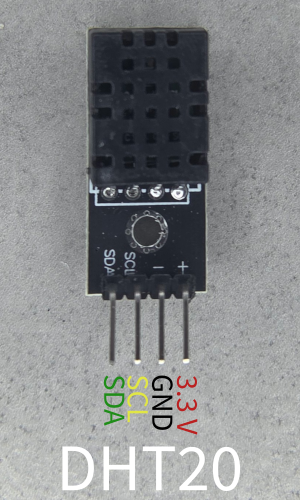
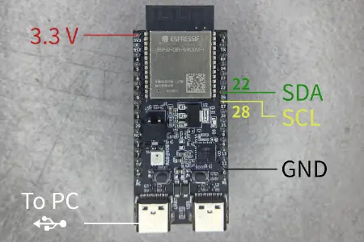
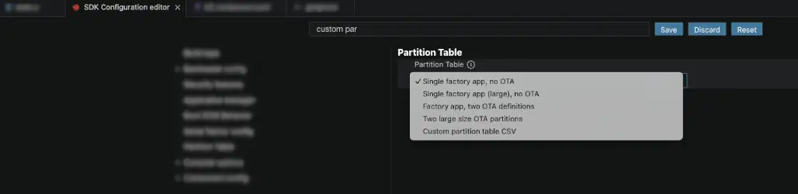

## Introduction

One typical IoT and industrial application is data logging. At its core, logging consists of measuring values (usually from sensors) and storing them in memory, making them accessible for external processing, visualization, and further analysis.

Data logging can take several forms, ranging from as simple as printing values to the serial port to more complex filesystem storage with cloud upload and visualization.

In this two-part tutorial series, we will create an environmental sensor logger with filesystem storage, provisioning, and cloud backup. The plan is as follows, along with the concepts we will explore:

1. Logger with offline filesystem storage
    * Filesystem (`littlefs`) and sensor connection (I2C)
2. Logger with provisioning and MQTT backup when internet is available
    * FreeRTOS tasks and semaphores

We will be using the [ESP32-C61-Devkit-C](https://docs.espressif.com/projects/esp-dev-kits/en/latest/esp32c61/esp32-c61-devkitc-1/user_guide.html) module with [ESP-IDF VS Code extension](https://github.com/espressif/vscode-esp-idf-extension#esp-idf-extension-for-vs-code), but you can easily adapt this tutorial to any ESP32* board and any IDE.

## Project overview

In this part, we will create a logger that reads data from a `DHT20`/`AHT20` temperature and humidity sensor via I2C and stores the data in a `littlefs` filesystem. For this example, we will use a simple incremental timestamp starting from 0 at boot time. In the next part, we will add a proper timestamp obtained from an NTP server.

The steps are as follows:

1. Connect the `DHT20` sensor
2. Read the `DHT20` sensor
3. Create the `littlefs` filesystem
4. Log the data in `.csv` files
5. Read the data partition


## Connect the DHT20 sensor


The [DHT20/AHT20](https://asairsensors.com/wp-content/uploads/2021/09/Data-Sheet-AHT20-Humidity-and-Temperature-Sensor-ASAIR-V1.0.03.pdf) IC is a temperature and humidity sensor with I2C digital output. Its pinout consists of the two I2C pins (SDA and SCL) plus the supply pins (3.3V and GND).



In this tutorial we will use the following connection to the ESP32-C61-Devkit-C.

| ESP32-C61-Devkit-C | DHT20 | Description |
| --- | --- | --- |
| GPIO 22 | SDA | I2C SDA pin |
| GPIO 28 | SCL | I2C SCL pin |
| G | - | Ground |
| 3.3V | + | Supply |

Espressif DevkitC boards usually provide a few 3.3V and GND pins (usually labeled `G`). You can find the connection in Fig. 2.



## Read the DHT20 sensor

To read the sensor, we will use the [AHT20 library on the ESP registry](https://components.espressif.com/components/espressif/aht20/versions/2.0.0/readme). As you can see on the component page, the command to add the dependency is `idf.py add-dependency "espressif/aht20^2.0.0"`. This tool makes use of the `i2c_bus` component, hence we need to add it too.

The final goal of this section is to print on the terminal the sensor data every second.

### Add dependencies

Let's start a new project and add the dependencies.

* Open VS Code
* Open the _command palette_ and type `> ESP-IDF: Create a New Empty Project`.
* Create a new empty project and call it `basic-logger`
* Open an ESP-IDF terminal: `> ESP-IDF: Open ESP-IDF Terminal`
* On the terminal, type: `idf.py add-dependency "espressif/aht20^2.0.0"`
* On the same terminal, type `idf.py add-dependency "espressif/i2c_bus=*"`


If you now open the `main/idf_components.yml` file, you'll see

```yaml
## IDF Component Manager Manifest File
dependencies:
  ## Required IDF version
  idf:
    version: '>=4.1.0'
  # # Put list of dependencies here
  # # For components maintained by Espressif:
  # component: "~1.0.0"
  # # For 3rd party components:
  # username/component: ">=1.0.0,<2.0.0"
  # username2/component2:
  #   version: "~1.0.0"
  #   # For transient dependencies `public` flag can be set.
  #   # `public` flag doesn't have an effect dependencies of the `main` component.
  #   # All dependencies of `main` are public by default.
  #   public: true
  espressif/aht20: ^2.0.0
  espressif/i2c_bus: =*
```

### Prepare the I2C bus

The I2C library is handled through the `i2c_bus.h` header file. To configure it, we need to choose the I2C port and its pins. Espressif modules have multiple I2C controllers we can use. In this case, we'll choose port 0 and the pins we mentioned in the previous section. We will also enable internal pull-ups because the sensor board we're using doesn't include them.

* In the `main.c`, add the header file and the following defines
    ```c
    #include <driver/gpio.h>  // For GPIO_PULLUP_ENABLE
    #include "i2c_bus.h"

    #define AMBIENT_SENSOR_I2C_PORT 0
    #define AMBIENT_SENSOR_SDA_IO GPIO_NUM_22
    #define AMBIENT_SENSOR_SCL_IO GPIO_NUM_28
    #define AMBIENT_SENSOR_I2C_FREQ_HZ 100000
    ```

* Now create the configuration `struct` for the I2C peripheral

    ```c
        // Configure I2C bus
        const i2c_config_t i2c_cfg = {
            .mode = I2C_MODE_MASTER,
            .sda_io_num = AMBIENT_SENSOR_SDA_IO,
            .sda_pullup_en = GPIO_PULLUP_ENABLE,
            .scl_io_num = AMBIENT_SENSOR_SCL_IO,
            .scl_pullup_en = GPIO_PULLUP_ENABLE,
            .master.clk_speed = AMBIENT_SENSOR_I2C_FREQ_HZ,
        };
    ````
* Create the `i2c` bus handle.

    ```c
        i2c_bus_handle_t i2c_bus_handle = NULL;
        *i2c_bus_handle = i2c_bus_create(AMBIENT_SENSOR_I2C_PORT, &i2c_cfg);
        if (*i2c_bus_handle == NULL) {
            ESP_LOGE(TAG, "Failed to create I2C bus");
            return ESP_ERR_INVALID_STATE;
        }
    ```

### Setup the DHT20 library

To configure the sensor, we have to check the [ESP registry component documentation](https://components.espressif.com/components/espressif/aht20/versions/2.0.0/readme).

* First, include the library
    ```c
    #include <esp_log.h>
    #include <esp_err.h> // for esp_err_t
    #include "aht20.h"
    ```
* Create the configuration `struct` for the sensor
    ```c
    // Configure AHT20 sensor
    aht20_i2c_config_t aht20_cfg = {
         .bus_inst = *i2c_bus_handle,
         .i2c_addr = AHT20_ADDRRES_0,
    };
    ```
* Initialize the sensor
```c
    aht20_dev_handle_t aht20_handle = NULL;
    esp_err_t ret = aht20_new_sensor(&aht20_cfg, &aht20_handle);
```

### Refactor sensor initialization

To keep the main function clean and maintainable, we'll encapsulate all this initialization logic in a dedicated `esp_err_t ambient_sensor_init(aht20_dev_handle_t *, i2c_bus_handle_t *)` function with debug logging.

<details>
<summary>Here you can find the ambient_sensor_init function code</summary>

```c
#include "esp_log.h" // For ESP_LOGI
#define TAG "ambient_sensor"

esp_err_t ambient_sensor_init(aht20_dev_handle_t *aht20_handle, i2c_bus_handle_t *i2c_bus_handle) {
    if (aht20_handle == NULL || i2c_bus_handle == NULL) {
        ESP_LOGE(TAG, "Invalid arguments: aht20_handle or i2c_bus_handle is NULL");
        return ESP_ERR_INVALID_ARG;
    }

    // Configure I2C bus
    const i2c_config_t i2c_cfg = {
        .mode = I2C_MODE_MASTER,
        .sda_io_num = AMBIENT_SENSOR_SDA_IO,
        .sda_pullup_en = GPIO_PULLUP_ENABLE,
        .scl_io_num = AMBIENT_SENSOR_SCL_IO,
        .scl_pullup_en = GPIO_PULLUP_ENABLE,
        .master.clk_speed = AMBIENT_SENSOR_I2C_FREQ_HZ,
    };

    *i2c_bus_handle = i2c_bus_create(AMBIENT_SENSOR_I2C_PORT, &i2c_cfg);
    if (*i2c_bus_handle == NULL) {
        ESP_LOGE(TAG, "Failed to create I2C bus");
        return ESP_ERR_INVALID_STATE;
    }

    // Configure AHT20 sensor
    aht20_i2c_config_t aht20_cfg = {
        .bus_inst = *i2c_bus_handle,
        .i2c_addr = AHT20_ADDRRES_0,
    };

    esp_err_t ret = aht20_new_sensor(&aht20_cfg, aht20_handle);
    if (ret != ESP_OK) {
        ESP_LOGE(TAG, "Failed to create AHT20 sensor: %s", esp_err_to_name(ret));
        i2c_bus_delete(*i2c_bus_handle);
        *i2c_bus_handle = NULL;  // Avoid dangling pointer
        return ret;
    }

    ESP_LOGI(TAG, "Ambient sensor created (I2C port=%d, SDA=%d, SCL=%d, freq=%d Hz)",
             AMBIENT_SENSOR_I2C_PORT,
             AMBIENT_SENSOR_SDA_IO,
             AMBIENT_SENSOR_SCL_IO,
             AMBIENT_SENSOR_I2C_FREQ_HZ);

    return ESP_OK;
}
```

</details>

From the `app_main`, we can call it

```c

void app_main(){
    aht20_dev_handle_t aht20_handle = NULL;  // aht20_new_sensor likely allocates this
    i2c_bus_handle_t i2c_bus_handle = NULL;

    ESP_ERROR_CHECK(ambient_sensor_init(&aht20_handle, &i2c_bus_handle));
}
```

### Read the sensor data

We're now ready to read the sensor data. We'll create an endless loop that prints the sensor data every second.

The function to read the data is
```c
aht20_read_temperature_humidity(aht20_dev_handle_t aht20_handle, uint32_t temperature_raw, float temperature, uint32_t humidity_raw, float humidity)
```

Since it returns two values, we need to pass the variable pointers, which the function will then fill with the sensor data.

* Update the `app_main` function as follows:

```c
#include <freertos/FreeRTOS.h>

void app_main(void) {
    ESP_LOGI(TAG,"Get started\n");

    aht20_dev_handle_t aht20_handle = NULL;
    i2c_bus_handle_t i2c_bus_handle = NULL;

    ESP_ERROR_CHECK(ambient_sensor_init(&aht20_handle, &i2c_bus_handle));

    uint32_t temperature_raw, humidity_raw;
    float temperature, humidity;

    while (1) {
        aht20_read_temperature_humidity(aht20_handle, &temperature_raw, &temperature, &humidity_raw, &humidity);
        ESP_LOGI(TAG, "%-20s: %2.2f %%", "humidity is", humidity);
        ESP_LOGI(TAG, "%-20s: %2.2f degC", "temperature is", temperature);
        vTaskDelay(pdMS_TO_TICKS(1000));
    }
}
```

> [!NOTE]
> We need to include `FreeRTOS.h` for the delay `vTaskDelay`.


## Create the `little_fs` filesystem

We will store the data in a `.csv` file in a `littlefs` filesystem.
ESP-IDF also supports the `spiffs` or `FAT` filesystem, but `little_fs` has better folder support. For a detailed comparison, see the  [performance and benchmarks for LittleFS, SPIFFS and FAT](https://docs.espressif.com/projects/esp-idf/en/stable/esp32/api-guides/file-system-considerations.html).

`little_fs` is available as a component in the component registry, like the `aht20` and `i2c_bus` modules we used in the previous sections.

To use the `little_fs` filesystem, we need to:
* Create the partition to host the filesystem
* Add the `little_fs` dependency and include it
* Initialize `little_fs`

### Create the partition to host the filesystem

* On the _command palette_, type: `> ESP-IDF: SDK Configuration Editor (sdkconfig)`
* Type `Partition table` in the `menuconfig` search bar<br>
    _Enable the Custom partition table CSV_
    

* Copy the partition from `partitions_demo_esp_littlefs.csv` in the [example](https://github.com/espressif/esp-idf/tree/master/examples/storage/littlefs)
    ```csv
    # Name,   Type, SubType, Offset,  Size, Flags
    # Note: if you have increased the bootloader size, make sure to update the offsets to avoid overlap
    nvs,      data, nvs,     0x9000,  0x6000,
    phy_init, data, phy,     0xf000,  0x1000,
    factory,  app,  factory, 0x10000, 1M,
    storage,  data, littlefs,      ,  0xF0000,
    ```
* On the _command palette_, type: `> ESP-IDF: Build, Flash and Start a Monitor on Your Device`
* On the terminal, you should now spot the following lines
    ```console
    Partition table binary generated. Contents:
    *******************************************************************************
    # ESP-IDF Partition Table
    # Name, Type, SubType, Offset, Size, Flags
    nvs,data,nvs,0x9000,24K,
    phy_init,data,phy,0xf000,4K,
    factory,app,factory,0x10000,1M,
    storage,data,littlefs,0x110000,960K,
    ```

### Add `little_fs` dependency and include it

* Add dependency `idf.py add-dependency "joltwallet/littlefs^1.22.1"`

* Add include `#include "esp_littlefs.h"`

<!-- * Create `flash_data` folder with `example.txt` -->

<!--
### Set up `CMakeLists`

`littlefs` partition generator is invoked from CMake build system. We use `littlefs_create_partition_image` in `main/CMakeLists.txt` to generate the partition image and flash it to the device at build time.
We will copy the files from `./flash_data` folder to the `littlefs` partition.  -->


<!-- * Create a `./flash_data` folder
* Add to `CMakeLists.txt` the following

    ```console
    littlefs_create_partition_image(storage ../flash_data FLASH_IN_PROJECT)
    ```
    -->


### Configure `little_fs`

To keep the code clean, we'll add all the `little_fs` logic into a `void little_fs_init()` function.

We will register it under the base path "/littlefs", so we'll be able to use the standard POSIX file APIs (like `fopen`) on paths starting with "/littlefs/".

To verify that everything is correct, we'll print some information about the partition.

* Add the following define with the partition name ("storage")
    ```c
    #define PARTITION_LABEL "storage"
    ```
* Before `app_main`, add the following function
    ```c
    void little_fs_init(){

        ESP_LOGI(TAG, "Initializing little_fs");

        esp_vfs_littlefs_conf_t conf = {
            .base_path = "/littlefs",
            .partition_label = PARTITION_LABEL,
            .format_if_mount_failed = true,
            .dont_mount = false,
        };
        esp_err_t ret = esp_vfs_littlefs_register(&conf);

        if (ret != ESP_OK) {
            if (ret == ESP_FAIL) {
                ESP_LOGE(TAG, "Failed to mount or format filesystem");
            } else if (ret == ESP_ERR_NOT_FOUND) {
                ESP_LOGE(TAG, "Failed to find LittleFS partition");
            } else {
                ESP_LOGE(TAG, "Failed to initialize LittleFS (%s)", esp_err_to_name(ret));
            }
            return;
        }

        size_t total = 0, used = 0;
        ret = esp_littlefs_info(conf.partition_label, &total, &used);
        if (ret != ESP_OK) {
            ESP_LOGE(TAG, "Failed to get little_fs partition information (%s)", esp_err_to_name(ret));
            esp_littlefs_format(conf.partition_label);
        } else {
            ESP_LOGI(TAG, "Partition size: total: %d, used: %d", total, used);
        }
    }
    ```


> [!NOTE]
> To manage the files, we can now use standard POSIX functions and C control flows like
> ```c
> FILE *f_temperature = fopen("/littlefs/temperature.csv", "w");
> fprintf(f_temperature,"Some text\n");
> ```


## Log the data in `.csv` files

To log the data we need to:
* Get a timestamp
* Check if the logging files exist
* Write the log in the file


### Get a timestamp

As mentioned at the beginning of the article, we will use an incremental timestamp starting from 0 at boot time. We will use the `time.h` standard library.

* At the beginning of `main.c`, add the include
    ```c
    #include <time.h>
    ```
* Before the `while` loop, declare a variable `now`
    ```c
    time_t now;
    ```
* Inside the while loop, add the following to store the current time in the `now` variable
    ```c
    time(&now);
    ```

### Check if the logging files exist

Since we don't want to overwrite the logging data every time the device boots, we need to check if the logging files for temperature and humidity already exist. If they don't, we'll create them, opening the file handler in write mode (`w`). Otherwise, we'll append (`a`) the data to the existing files.

To check if a file exists, we'll use the standard [`stat` structure](https://www.man7.org/linux/man-pages/man2/stat.2.html).

* Before the `while` loop, add
  ```c
  struct stat st; // status of files

    // If log files don't exist, create them and add header

    if (stat("/littlefs/temperature.csv", &st) != 0) {
        ESP_LOGI(TAG, "Log files not found, creating them...");
        FILE *f_temperature = fopen("/littlefs/temperature.csv", "w");
        FILE *f_humidity     = fopen("/littlefs/humidity.csv", "w");
        fprintf(f_temperature, "timestamp,temperature\n");
        fprintf(f_humidity, "timestamp,humidity\n");

        fclose(f_temperature);
        fclose(f_humidity);
    } else {
        ESP_LOGI(TAG, "Log files found, appending data...");
    }
  ```

### Write the log to file

* Inside the `while` loop, add
  ```c
        FILE *f_temperature = fopen("/littlefs/temperature.csv", "a");
        FILE *f_humidity = fopen("/littlefs/humidity.csv", "a");

        if (f_humidity == NULL || f_temperature == NULL) {
            ESP_LOGE(TAG, "Failed to open file for writing");
            return;
        }

        fprintf(f_temperature, "%lld,%f\n", now, temperature);
        fprintf(f_humidity, "%lld,%f %%\n", now, humidity);

        fclose(f_temperature);
        fclose(f_humidity);
  ```

Your code should now look like the following.
<details>
<summary>Show full code</summary>

```c
#include <stdio.h>
#include <stdlib.h>
#include <esp_log.h>
#include <esp_err.h>
#include <driver/gpio.h>  // For GPIO_PULLUP_ENABLE
#include "i2c_bus.h"
#include "aht20.h"
#include <freertos/FreeRTOS.h>
#include "esp_littlefs.h"
#include <sys/stat.h>   // for struct stat and stat()
#include <unistd.h>     // for unlink()


// Define TAG for logging
#define TAG "ambient_sensor"

// Define actual GPIO pins (REPLACE with your values!)
#define AMBIENT_SENSOR_I2C_PORT 0
#define AMBIENT_SENSOR_SDA_IO GPIO_NUM_22
#define AMBIENT_SENSOR_SCL_IO GPIO_NUM_28
#define AMBIENT_SENSOR_I2C_FREQ_HZ 100000

#define PARTITION_LABEL "storage"

esp_err_t ambient_sensor_init(aht20_dev_handle_t *aht20_handle, i2c_bus_handle_t *i2c_bus_handle) {
    if (aht20_handle == NULL || i2c_bus_handle == NULL) {
        ESP_LOGE(TAG, "Invalid arguments: aht20_handle or i2c_bus_handle is NULL");
        return ESP_ERR_INVALID_ARG;
    }

    // Configure I2C bus
    const i2c_config_t i2c_cfg = {
        .mode = I2C_MODE_MASTER,
        .sda_io_num = AMBIENT_SENSOR_SDA_IO,
        .sda_pullup_en = GPIO_PULLUP_ENABLE,
        .scl_io_num = AMBIENT_SENSOR_SCL_IO,
        .scl_pullup_en = GPIO_PULLUP_ENABLE,
        .master.clk_speed = AMBIENT_SENSOR_I2C_FREQ_HZ,
    };

    *i2c_bus_handle = i2c_bus_create(AMBIENT_SENSOR_I2C_PORT, &i2c_cfg);
    if (*i2c_bus_handle == NULL) {
        ESP_LOGE(TAG, "Failed to create I2C bus");
        return ESP_ERR_INVALID_STATE;
    }

    // Configure AHT20 sensor
    aht20_i2c_config_t aht20_cfg = {
        .bus_inst = *i2c_bus_handle,
        .i2c_addr = AHT20_ADDRRES_0,
    };

    esp_err_t ret = aht20_new_sensor(&aht20_cfg, aht20_handle);
    if (ret != ESP_OK) {
        ESP_LOGE(TAG, "Failed to create AHT20 sensor: %s", esp_err_to_name(ret));
        i2c_bus_delete(*i2c_bus_handle);
        *i2c_bus_handle = NULL;  // Avoid dangling pointer
        return ret;
    }

    ESP_LOGI(TAG, "Ambient sensor created (I2C port=%d, SDA=%d, SCL=%d, freq=%d Hz)",
             AMBIENT_SENSOR_I2C_PORT,
             AMBIENT_SENSOR_SDA_IO,
             AMBIENT_SENSOR_SCL_IO,
             AMBIENT_SENSOR_I2C_FREQ_HZ);

    return ESP_OK;
}


void little_fs_init(){

    ESP_LOGI(TAG, "Initializing LittleFS");

    esp_vfs_littlefs_conf_t conf = {
        .base_path = "/littlefs",
        .partition_label = PARTITION_LABEL,
        .format_if_mount_failed = true,
        .dont_mount = false,
    };
    esp_err_t ret = esp_vfs_littlefs_register(&conf);

    if (ret != ESP_OK) {
        if (ret == ESP_FAIL) {
            ESP_LOGE(TAG, "Failed to mount or format filesystem");
        } else if (ret == ESP_ERR_NOT_FOUND) {
            ESP_LOGE(TAG, "Failed to find LittleFS partition");
        } else {
            ESP_LOGE(TAG, "Failed to initialize LittleFS (%s)", esp_err_to_name(ret));
        }
        return;
    }

    size_t total = 0, used = 0;
    ret = esp_littlefs_info(conf.partition_label, &total, &used);
    if (ret != ESP_OK) {
        ESP_LOGE(TAG, "Failed to get LittleFS partition information (%s)", esp_err_to_name(ret));
        esp_littlefs_format(conf.partition_label);
    } else {
        ESP_LOGI(TAG, "Partition size: total: %d, used: %d", total, used);
    }
}


void app_main(void) {
    ESP_LOGI(TAG,"Get started\n");

    // Allocate handles (no need to malloc aht20_dev_handle_t directly)
    aht20_dev_handle_t aht20_handle = NULL;  // aht20_new_sensor likely allocates this
    i2c_bus_handle_t i2c_bus_handle = NULL;

    little_fs_init();

    ESP_ERROR_CHECK(ambient_sensor_init(&aht20_handle, &i2c_bus_handle));

    uint32_t temperature_raw, humidity_raw;
    float temperature, humidity;
    time_t now;
    struct stat st; // status of files

    // If log files don't exist, create them and add header

    if (stat("/littlefs/temperature.csv", &st) != 0) {
        ESP_LOGI(TAG, "Log files not found, creating them...");
        FILE *f_temperature = fopen("/littlefs/temperature.csv", "w");
        FILE *f_humidity     = fopen("/littlefs/humidity.csv", "w");
        fprintf(f_temperature, "timestamp,temperature\n");
        fprintf(f_humidity, "timestamp,humidity\n");

        fclose(f_temperature);
        fclose(f_humidity);
    } else {
        ESP_LOGI(TAG, "Log files found, appending data...");
    }

    int times = 4000;
    while (times>0) {
        time(&now);
        aht20_read_temperature_humidity(aht20_handle, &temperature_raw, &temperature, &humidity_raw, &humidity);
        ESP_LOGI(TAG, "%-20s: %2.2f %%", "humidity is", humidity);
        ESP_LOGI(TAG, "%-20s: %2.2f degC", "temperature is", temperature);

        FILE *f_temperature = fopen("/littlefs/temperature.csv", "a");
        FILE *f_humidity = fopen("/littlefs/humidity.csv", "a");

        if (f_humidity == NULL || f_temperature == NULL) {
            ESP_LOGE(TAG, "Failed to open file for writing");
            return;
        }

        fprintf(f_temperature, "%lld,%f\n", now, temperature);
        fprintf(f_humidity, "%lld,%f%%\n", now, humidity);

        fclose(f_temperature);
        fclose(f_humidity);

        vTaskDelay(pdMS_TO_TICKS(3000)); // every 3 seconds
        times--;
    }

    ESP_LOGI(TAG, "Finished, closing...\n");
    // All done, unmount partition and disable LittleFS
    esp_vfs_littlefs_unregister(PARTITION_LABEL);
    ESP_LOGI(TAG, "LittleFS unmounted");

}
```
</details>

## Read the data partition

To read the stored data, we will download the "storage" partition from the device using [`parttool.py`](https://docs.espressif.com/projects/esp-idf/en/latest/esp32c3/api-guides/partition-tables.html#partition-tool-parttool-py) and extract the `little_fs` filesystem using the `littlefs-python` module.

* Let the logger run a few seconds
* Download the filesystem
    ```console
    parttool.py --port "/dev/ttyUSB1" read_partition --partition-name=storage --output "littlefs_extracted.bin"
    ```
* Extract the `little_fs` filesystem
    ```console
    uvx --from littlefs-python littlefs-python extract littlefs_extracted.bin ./output_fs --block-size=4096
    ```
* Open the file `./output_fs/temperature.csv`, you should see something like
    ```csv
    timestamp,temperature
    0,27.984810
    3,28.015518
    6,28.026009
    9,28.024673
    12,28.031349
    15,28.042030
    19,28.062630
    ```

The same applies to the `humidity.csv` file.

## Conclusion

In this article, we built a simple environmental logger using the DHT20 sensor connected via I2C to an ESP32-C61 and stored the temperature and humidity readings as CSV files on a `little_fs` filesystem. We walked through the full process, from wiring the sensor and configuring the I2C bus to creating a custom partition, mounting the filesystem, and extracting the logged data from the device. In the next part of this series, we will extend this project with Wi-Fi provisioning and MQTT cloud backup to make the logger accessible remotely.
